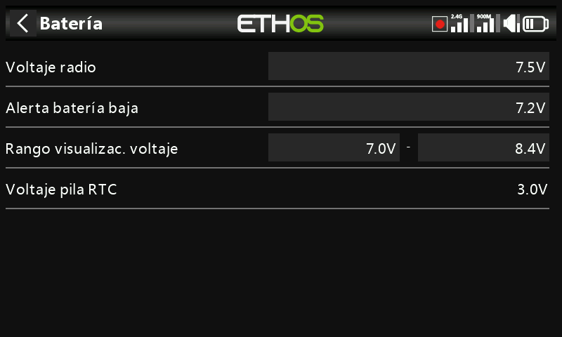

# Batería

Calibra la lectura de la batería interna de la emisora y establece los
umbrales de alarma — independientemente de los ajustes de la batería de
vuelo de un modelo (consulte [Guía práctica: Aviso de tensión baja de
batería](../how-to/low-battery-warning.md)).

- **Tensión principal** — muestra la lectura actual y sirve además como
  ajuste de calibración: introduzca la tensión real medida con un
  multímetro. El valor predeterminado es 8,4 V (un pack Li-ion 2S
  totalmente cargado).
- **Tensión baja** — el umbral de alarma, 7,2 V por defecto (7,4 V
  proporciona un margen adicional). Cuando la [alerta de tensión
  principal](alerts.md) está activada, descender por debajo de este valor
  activa un cuadro de diálogo de advertencia y un aviso hablado «Radio
  battery is low» cada minuto, esté el diálogo abierto o no.

  !!! warning
      Aterrice y cargue la batería de la emisora en cuanto suene esta
      alerta — se repite cada minuto independientemente de todo. A 6,0 V
      la emisora se apaga sin excepción para proteger las celdas Li-ion
      de 2×3,0 V.

- **Rango de tensión en pantalla** — los valores mín./máx. del indicador
  gráfico de batería en la esquina superior derecha: MIN es el punto en
  el que se apaga el primer segmento de barra y MAX el punto en el que se
  ilumina el cuarto. Los valores predeterminados son 6,4–8,4 V para el
  pack Li-ion integrado; muchos pilotos elevan el extremo inferior para
  obtener un aviso de tensión baja más temprano y evitar una descarga
  excesiva. Ajuste estos valores para que coincidan con el tipo de
  batería realmente instalado.
- **Tensión RTC** — la tensión de la pila de botón del reloj en tiempo
  real. 3,0 V cuando es nueva; sustitúyala por debajo de 2,7 V para
  mantener la precisión del reloj, y cuente con la [alerta de tensión
  RTC](alerts.md) por debajo de 2,5 V.
