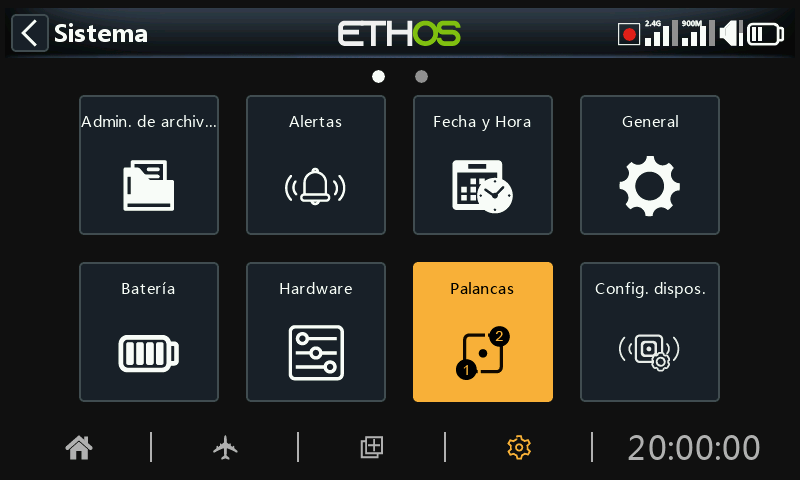
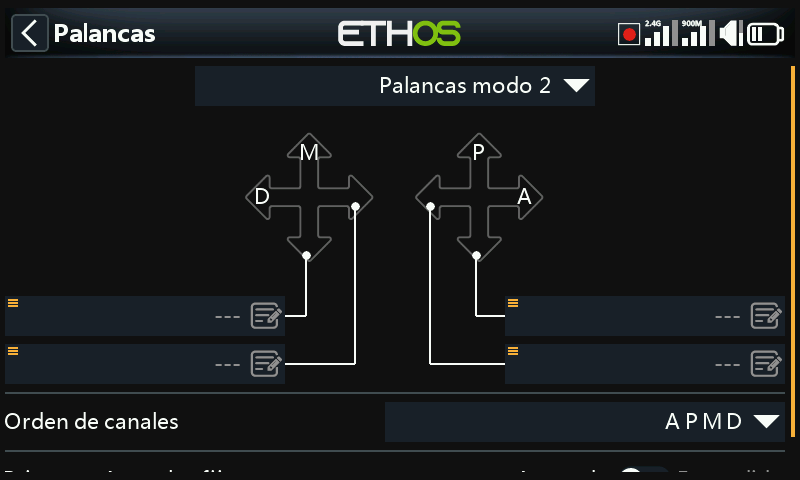
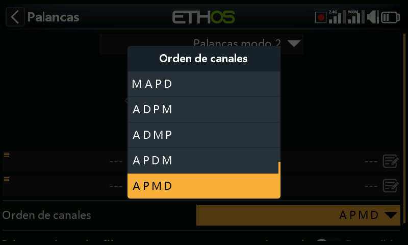
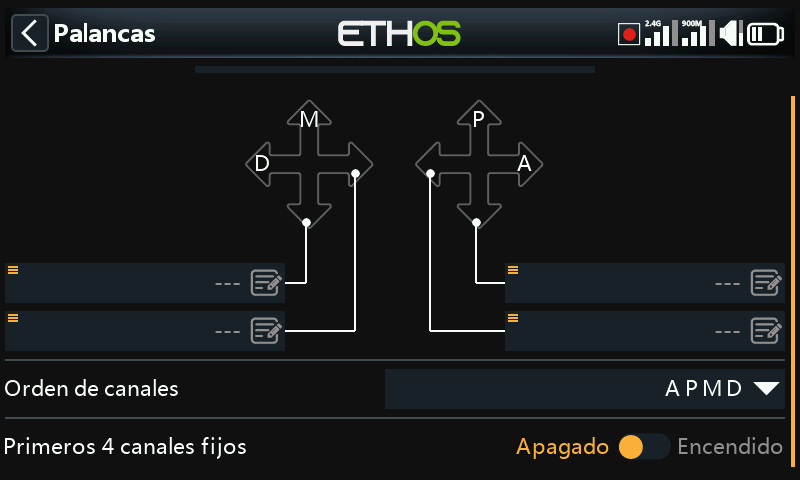

# Palancas

Selecciona el modo de las palancas que prefiera. El modo 1 tiene el acelerador y el alerón en el mando derecho, y el elevador y el timón en el izquierdo. El modo 2 tiene el acelerador y el timón en la palanca de la izquierda, y el alerón y el elevador en la derecha.

Por defecto, las palancas se denominan como se indica más arriba para los modos de palanca estándar de la industria. Se les puede cambiar el nombre según se desee.

## Orden de canales

El orden de canales define el orden en que las cuatro entradas de las palancas se asignan a los canales de las mezclas cuando se crea un nuevo modelo a través de los asistentes. El orden por defecto es AETR. Si hay más de un canal para cada tipo de superficie, se agruparán a menos que los cuatro primeros canales sean fijos, ver más abajo. Por ejemplo, para 2 alerones el orden de los canales será AAETR.

## Primeros 4 canales fijos

Cuando opción está activada, la agrupación de canales no se producirá en los cuatro primeros canales. Si el orden de los canales es AETR, entonces el asistente creará un modelo adecuado a los receptores estabilizados SRx. Por ejemplo, un modelo con 2 Alerones, 1 Elevador, 1 Motor, 1 Timón y 2 Flaps se creará con un orden de canales AETRAFF. Si esta opción no está activada, el orden de canales sería AAETRFF.
