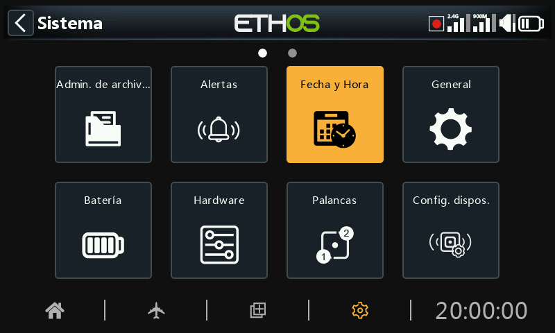

# Fecha y hora

Los ajustes de Fecha y Hora son:

## 24 horas

El reloj se muestra en formato de 24 horas cuando está activado.

## Mostrar segundos

El reloj mostrará los segundos cuando esté activado.

## Fecha

Haga click para abrir el cuadro de diálogo de ajuste de fecha. Debe establecerse en la fecha actual. Se utiliza en los registros de los vuelos.

## Hora

Haga click para abrir el cuadro de diálogo de ajuste de hora. Debe ajustarse a la hora actual. Se utiliza en los registros de los vuelos.

## Huso horario

Permite configurar la zona horaria en la que esté el usuario.

## Ajustar la velocidad del RTC

El Reloj en Tiempo Real puede calibrarse para compensar cualquier desviación del reloj, hasta 41 segundos por día.

Para la calibración, se debe intentar averiguar cuántos segundos gana o pierde el reloj de la radio en 24 horas.

Ajuste el valor de calibración a 12 veces este número de segundos, haciéndolo negativo si su reloj va rápido, y positivo si va lento. Para una mayor precisión, puede comprobar si su reloj es exacto y ajustar ligeramente el valor de calibración. El valor de calibración real puede ajustarse entre -500 y +500.

## Ajuste automático desde GPS

Cuando está activado, la hora y la fecha se ajustan automáticamente a partir de los datos de sensores GPS remotos.
