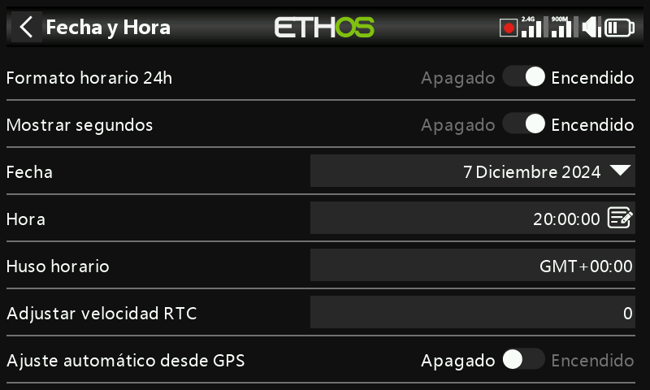

# Fecha y hora

- **Formato 24 horas** — alterna el reloj entre la visualización de 12 y 24 horas.
- **Mostrar segundos** — añade los segundos a la visualización del reloj.
- **Fecha** / **Hora** — establecen la fecha y la hora actuales; ambas se
  utilizan en el registro de datos.
- **Zona horaria** — su zona horaria local.
- **Ajustar velocidad del RTC** — compensa la desviación del reloj de tiempo
  real, hasta 41 segundos/día. Mida cuántos segundos adelanta o atrasa su reloj
  a lo largo de 24 horas y ajuste el valor de calibración a **12 veces ese
  número de segundos** — negativo si el reloj adelanta, positivo si atrasa
  (rango de −500 a +500). Vuelva a comprobarlo al cabo de uno o dos días y
  ajústelo con precisión.
- **Ajuste automático por GPS** — cuando está activado, establece la fecha y la
  hora automáticamente a partir de los datos de un sensor GPS remoto.
