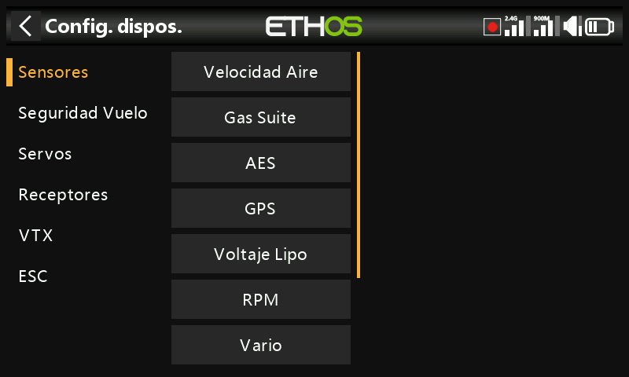
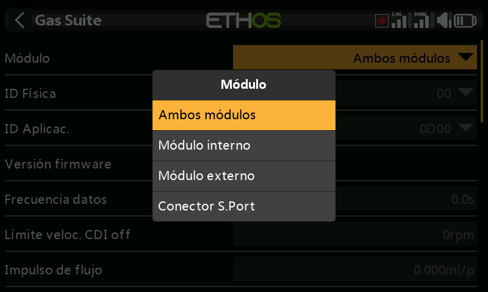
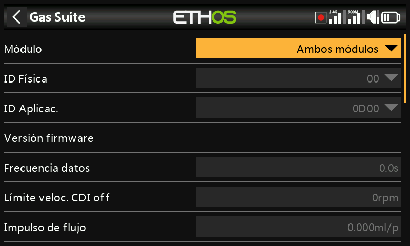

# Dispositivos

Llamado **Device config** en el menú: herramientas para configurar los
dispositivos periféricos conectados por S.Port/FBUS: sensores, receptores, el
«gas suite», servos, VTX y ESC. **DIY sensors** aparece automáticamente en
cuanto se detecta un sensor DIY. Consulte el manual propio de cada dispositivo
para obtener todos los detalles; esta página cubre lo que es común a todos
ellos.

!!! note
    Esto no tiene relación con la elección del módulo RF (interno o externo)
    con el que transmite un *modelo*: eso es un ajuste por modelo, tratado en
    [Sistema RF](../model-setup/rf-system.md).

Device Config es ampliable: tanto los usuarios como FrSky pueden añadir
páginas aquí mediante Lua.

## Reasignación de los ID de sensor

Las pantallas de Device config de Ethos permiten cambiar directamente el
**Physical ID** y el **Application ID** S.Port de un dispositivo. Si tiene más
de un dispositivo con la misma función, conéctelos **de uno en uno**:
descubra cada uno en
[Telemetría → Descubrir nuevos sensores](../model-setup/telemetry.md), cambie
aquí en Device config su Physical ID y su Application ID, y luego vuelva atrás
y descúbralo de nuevo con el nuevo ID.

## Ejemplo: receptores

Los receptores estabilizados de FrSky se pueden configurar aquí una vez
instalado su script Lua de configuración (con un clic, desde la Lua Library de
Ethos Suite). Existen dos vías de configuración según la generación del
receptor:

- **Stabilizer config**: receptores más recientes con «estabilización
  avanzada» (control de ganancia en el canal 13). Se exponen dos grupos de
  estabilización independientes: el grupo 1 abarca los canales 1–6 y el grupo 2
  los 7–11; desactive el grupo 2 si no utiliza los pines 7–11 para
  estabilización. Incluye una calibración de 6 ejes que debe ejecutarse una vez
  en un receptor nuevo, y de nuevo tras cualquier actualización al firmware
  v3.0.x (después de un reinicio de fábrica). En la calibración de cada grupo,
  el antiguo paso de «autocomprobación» se ha sustituido por la calibración
  independiente del nivel del modelo, del centro de canal y de los puntos
  extremos de canal, y cada canal puede activarse/desactivarse individualmente.
  Las configuraciones (no los datos de calibración) pueden guardarse en un PC y
  restaurarse desde él.
- **SxR**: receptores más antiguos, incluidas las unidades heredadas y
  Archer/Archer Pro, además de receptores como el SR10 Pro que (a pesar del
  nombre «SRx») tienen la ganancia en el canal 9 en lugar del 13.

  

!!! warning "Después de actualizar al firmware de receptor v3.0.x"
    Realice un reinicio de fábrica (se encuentra en las opciones del receptor
    en la configuración RF), luego vuelva a vincular y reconfigure por
    completo, especialmente las funciones Stab y la calibración de 6 ejes. Esto
    es necesario por la nueva función de guardado de datos de failsafe de
    v3.0.x; compruebe cuidadosamente la función de failsafe después.

FrSky North America publica una guía detallada de configuración de receptores
estabilizados, y existe un vídeo explicativo del piloto del equipo FrSky Juan
Sanchez Garcia que cubre lo mismo.

## Configuración mediante el conector S.Port de la emisora

Los dispositivos S.Port y FBUS también pueden configurarse directamente a
través del conector S.Port situado en la parte superior de la emisora, sin
pasar por un receptor vinculado.

1. Conecte el dispositivo al conector S.Port de la emisora (cable
   blanco/amarillo hacia el lado con la muesca).
2. Vaya a **System → Device config**, desplácese hasta el dispositivo (por
   ejemplo, un sensor de corriente FAS40 ADV) y pulse `ENT`.
3. En la página de configuración, ajuste **Module** a **S.Port connector**.
4. Realice los cambios (el Physical ID y el Application ID deben ser únicos
   cada uno) y, a continuación, desplácese hacia abajo y pulse **Save to
   flash**.

Esto se aplica tanto a los dispositivos FBUS (véase también [Guía práctica:
Configurar un sistema FBUS](../how-to/fbus-setup.md)) como a los dispositivos
S.Port sencillos, como un variómetro.
