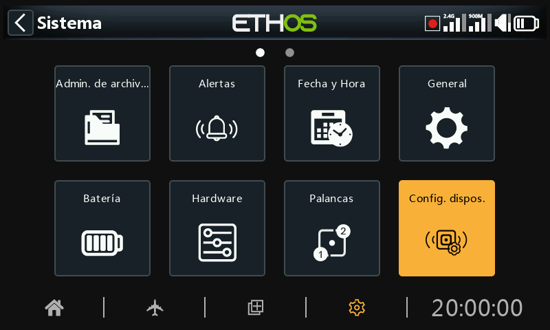
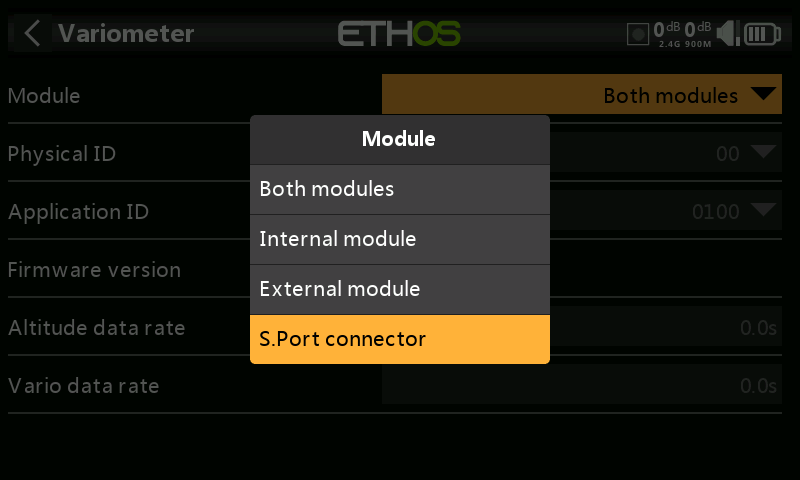

# Configurar dispositivos

‘Configurar dispositivos’ contiene herramientas para configuración sensores, receptores, la suite de gasolina, servos y transmisores de vídeo.

Actualmente, ya están incluidos los siguientes dispositivos:

- Sensores
- Seguridad de vuelo
- Servos
- Receptores
- VTX
- ESC
- Sensores DIY (Sólo aparecerá la opción DIY si uno de ellos se detecta).

Vaya al manual de cada dispositivo para detalles adicionales.

Tenga en cuenta que en ETHOS los menús de ‘Configurar dispositivos’ permiten cambiar la ID física y la ID de las aplicaciones. Si dispone de más de un sensor que haga la misma función, necesitará conectar uno cada vez, detectarlos en Telemetría / ‘Descubrir nuevos sensores’, y después cambiar su ID física y la ID de aplicación en ‘Configuración de dispositivos’, y luego volver a redescubrirlos con la nueva ID. Para más detalles, vaya a la sección de [Telemetria SmartPort](#Physical ID section).

La Configuración de dispositivos es ahora ampliable y el usuario (y Frsky) puede añadir nuevas páginas a través de Lua.

## Ejemplo con receptores

Los receptores estabilizados de FrSky se pueden configurar a través de ‘Configuración de dispositivos’ mediante la instalación de los Scripts Lua que sean necesarios. Son fácilmente instalables mediante un click, desde la biblioteca Lua en la Suite ETHOS. Para más detalles, vaya a la sección [Biblioteca Lua](../ethos-suite/operation.md).

### Descripción general

Existe la opción de elegir entre «Configuración de estabilizador» para los receptores más recientes y «SxR» para los receptores más antiguos.

#### Opción de configuración de la estabilizador

La opción «Configuración de estabilizador» se utiliza para los receptores más recientes, como el TD SR12, TD SR18, TD SR10, TD SR6, TW SR12, TW SR8, TW SR10, Archer+ SR10+, Archer+ SR8, Archer+ SR12+, SR6 Mini, SR6 Mini E, SR6BL15A y SR6Lite.

#### Opción SxR

La opción SxR se utiliza para los receptores más antiguos, como el ACCST D16 S6R,  
ACCST D16 S8R, Archer SR6, Archer SR8 Pro, Archer SR10 Pro, R9 Stab, R9 Stab OTA, así como el RB30S y el RB40S. Consulte la [Opción SxR](#SxR option) más abajo para obtener detalles adicionales.

### Opción de configuración del estabilizador

Esta opción se utiliza para los receptores más recientes, como los modelos mencionados anteriormente.

### Nota para la v3.0.x

Tenga en cuenta que, tras actualizar el firmware del receptor a la versión 3.0.x, deberá realizar un restablecimiento de fábrica. Posteriormente, se requerirá la reconfiguración y el reajuste de todas las funciones (especialmente las de estabilización, incluida la calibración de 6 ejes). Esto se debe a la incorporación de la nueva función de guardado de datos a prueba de fallos en el receptor. Recuerde que la función a prueba de fallos debe restablecerse y comprobarse cuidadosamente después de actualizar el receptor. La opción de restablecimiento de fábrica del receptor se encuentra en Opciones del receptor, dentro de la configuración de RF.

El proceso de configuración del estabilizador se ha simplificado, pero le resultará familiar de inmediato si ya ha utilizado Lua para SxR o Srx.

Se pueden guardar configuraciones completas en su PC, o se pueden restaurar backups. Esto no incluye los datos de calibración.

Los nuevos modelos de receptores tienen dos grupos de estabilización. El Grupo 1 cubre los canales 1-6, y el grupo 2 los canales 7-11. Si no se están usando los pines del 7 al 11 para la estabilización, debería desactivar el Grupo 2 de estabilización.

La función de calibración de los 6 ejes está ahora integrada. Sólo se tiene que efectuar una vez en los nuevos receptores y cuando se hayan actualizado a la versión v3.0.x (después de un reseteo de fábrica).

#### Calibración de los Grupos 1 y 2

En la función de calibración de los grupos 1 y 2, el paso de autocomprobación se ha sustituido por una calibración independiente mucho más precisa de la actitud deseada para el ‘modo de autonivelación’, centro del canal y sus extremos. Además, ahora es posible activar o desactivar cada canal individualmente.

#### Configuración de los Grupos 1 y 2

Los ajustes de estabilización se hacen ahora en esta sección.

Se pueden guardar en su PC las configuraciones realizadas, o restaurar los backups. Esta acción no incluye los datos de calibración.

FrSky en Norte America ha compilado [una guía comprehensiva](https://docs.google.com/document/d/1...it?usp=sharing) para ajustar los receptores estabilizados, que cubre todo esto en detalle.

También se puede ver un [video del proceso de ajuste](https://youtu.be/0pKSzxyJrB8?si=PFuby_4TNiMnONvM) realizado por el piloto del equipo FrSky Juan Sanchez Garcia. Hace un trabajo excelente explicando con todo detalle el proceso de ajuste.

### Opción SxR

Los receptores más antiguos (como el ACCST D16 S6R y el ACCST D16 S8R), los receptores Archer y Archer Pro (como el Archer SR6, el Archer SR8 Pro y el Archer SR10 Pro) el R9 Stab, el R9 Stab OTA, así como los RB30S y RB40S, utilizan la opción SxR.

Aunque los receptores Archer se denominan SRx en lugar de SxR y tienen la ganancia asignada al canal 9, siguen utilizando la opción SxR.

Los receptores más recientes con "Estabilización avanzada" y el control de ganancia en el canal 13 utilizan la opción  ‘[Configuracion del estabilizador](devices.md)’.

Los viejos receptores SxR pueden calibrarse y configurarse a través de la opción ‘SxR’.

## Configuración a través del conector S.Port de la emisora

La configuración de dispositivos S.Port y FBUS directamente desde el transmisor está disponible a través del conector S.Port del transmisor.

### Configuración de dispositivos FBUS

Conecte el dispositivo FBUS en la conexión S.Port que se encuentra encima de la radio. El cable blanco o amarillo va en el lado de la hendidura.

Vaya a Sistema / Configuración de dispositivos y encuentre su dispositivo FBUS, por ejemplo un FAS40 ADV sensor de consumo. Presione Enter.

Una vez abierta la página de configuración, haga click en Módulo y seleccione ‘S.Port connector’.

Haga los cambios que desee en la configuración, recordando que la ID Física y la ID de Aplicación deben ser únicas.

Después, vaya más hacia abajo y seleccione el botón ‘Save to flash’.

Para más ejemplos, vaya a la sección ‘Cómo hacer’ y mire “[Cómo configurar un sistema FBUS](#How to configure an FBUS system)”.

### Configurar dispositivos S.Port

Conecte el dispositivo S.Port en la conexión S.Port de encima de la radio. El cable blanco o amarillo va en el lado de la hendidura.

Vaya a Sistema / Configuración de dispositivos y encuentre su dispositivo S.Port, por ejemplo un Variómetro. Presione Enter.

Una vez abierta la página de configuración, haga click en Módulo y seleccione ‘S.Port connector’.

Haga los cambios que desee en la configuración, recordando que la ID Física y la ID de Aplicación deben ser únicas.

Después, vaya más hacia abajo y seleccione el botón ‘Save to flash’.
