# Administrador de archivos

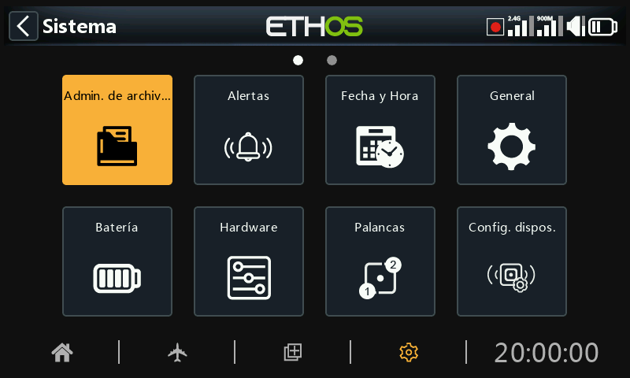

El ‘Administrador de Archivos’ sirve para gestionar carpetas y archivos y para acceder a los archivos de actualización del firmware del módulo de radiofrecuencia, el S.Port externo, dispositivos OTA (Over The Air) y a los módulos externos.

Tenga en cuenta que al actualizar el firmware del sistema es posible que también haya que actualizar los archivos de la tarjeta SD o eMMC.

Desde Ethos 26.1.0 en adelante, la radio ya no usa la memoria interna Flash para almacenar los gráficos del sistema ni los tipos de letras. Esos archivos forman parte ahora del firmware de Ethos, acortando el tiempo de arrnaque e incrementando la velocidad del UI (no hay carga dinámica de los  bitmaps).

ETHOS dispone de un sistema para intercambiar archivos entre radios vía Bluetooth. Para más detalles de esta característica, vaya al ejemplo en la sección [Transferencia de archivos via Bluetooth](#Sharing files via Bluetooth) más abajo.

Nota: Tanto el Bootloader como el firmware del sistema se almacenan en la memoria flash interna en todas las radios FrSky desde la X9D original.

Para abrir el administrador de archivos, toque el icono “Administrador de archivos”.

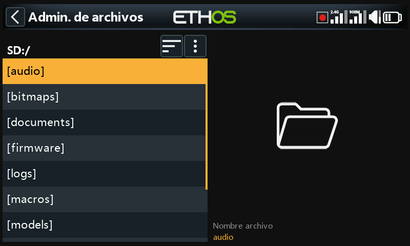

Las radios de la serie X29/S/HD requieren una tarjeta SD que tenga 32Gb o menos, formateada con fat32. La tarjeta Sandisk Ultra Micro SDHC Calse 10 de 16Gb son una buena opción. Los archivos estarán en la página web de Frsky.

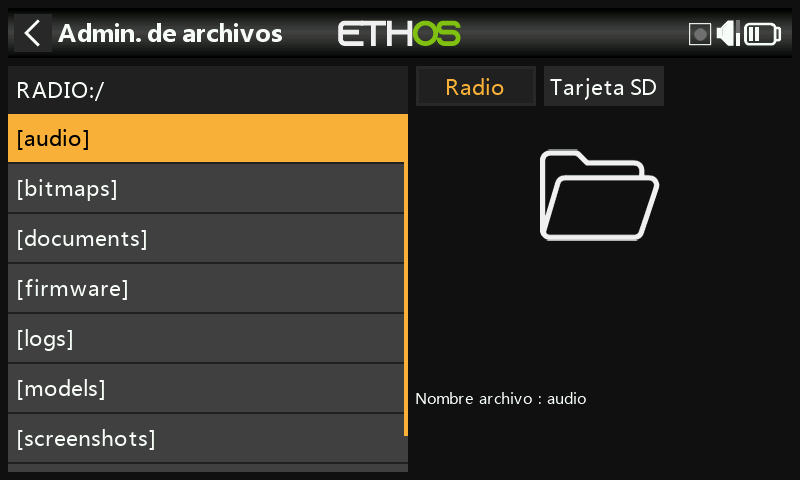

La radios X18 y X20 Pro/R/RS usan por defecto una tarjeta interna eMMC para almacenar archivos, pero se puede añadir una tarjeta SD externa. Pulse en la opción ‘Radio’ para explorar la memoria de la tarjeta eMMC. La tecla \[Page\] se puede usar también para cambiar entre dispositivos.

El sistema creará algunas carpetas si el usuario no las crea antes, como es la de registros, Modelos y fotos de pantalla. El directorio Firmware se debe crear manualmente para poder actualizar el firmware de los distintos dispositivos como receptores, módulos, etc.

Cuando se conecta la radio a un PC, aparecerán las siguientes carpetas:

Tarjeta SD (letra del drive)/ o

RADIO (letra del drive)/ {radios con tarjeta interna eMMC}

## Menú Administrador de archivos

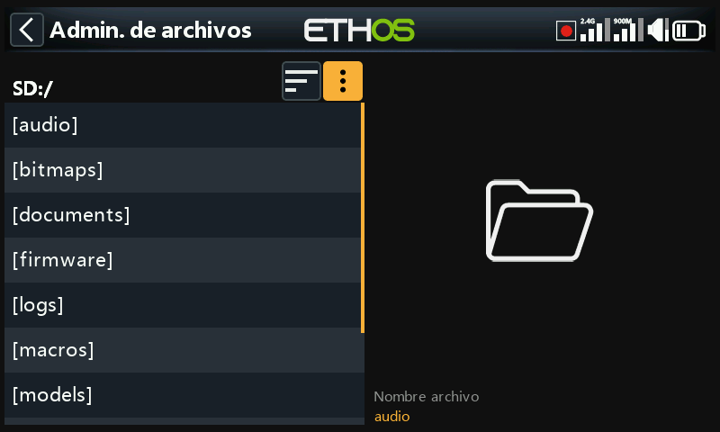

El Administrador de archivos tiene un menú de opciones. Toque en los 3 puntos verticales de la barra del menú (o deslice hacia atrás).

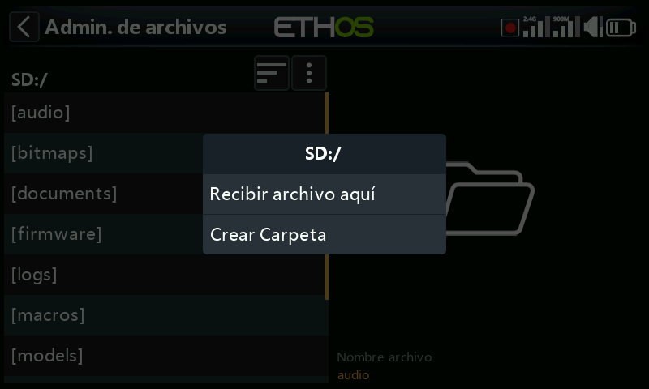

El menú del Administrador de archivos tiene dos opciones:

- Recibir un modelo via Bluetooth. Vaya más abajo a la carpeta ‘modelos’ para más detalles.
- Crear una carpeta nueva en la que está abierta cuando se abre este menú.

## Opciones para ordenar los archivos

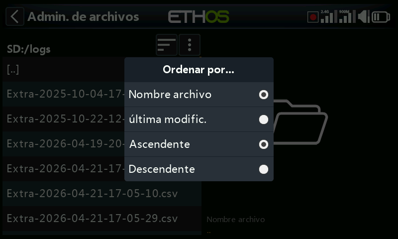

Toque en el icono ‘Ordenar por’ próximo al icono del menú del administrador de arriba, para abrir el dialogo para ordenar archivos:

- Puede ordenarlos por nombre de archivo o por fecha de última modificación.
- Puede ordenarlos de forma ascendente o descendente.

Esta opción es extremádamente útil para encontrar el archivo de registro más reciente de la carpeta ‘logs’.

## Carpetas del nivel superior

Las carpetas que están en el nivel superior son:

### audio/

Esta carpeta se reserve para archivos de audio.

**audio/en/gb**	Voces británicas  
**audio/en/us**	Voces norteamericanas

**audio/en/default** Voces en inglés, por defecto

**audio/es** Voces en español

Estas carpetas son para archivos de sonido de usuario, que pueden ser reproducidos por la Función Especial 'Reproducir audio'. Consulte la sección Modelo /  [Funciones Especiales](#Special Functions section) , así como la sección de [Elección de Voces](#Choice of Voices).

El formato debe ser 16kHz o 32kHz PCM lineal 16 bits o “alaw” (EU) 8 bits o “mulaw” (US) 8bits. Los nombres de los archivos wav pueden tener hasta 31 caracteres, más la extensión.

#### audio/en/gb/system  
audio/en/us/system  
a*udio/en/**default**/system*

#### *a**udio/es/system*

Estas carpetas son para los archivos de sonido del sistema, por ejemplo:

| hello.wav | Es el saludo ‘Bienvenido a Ethos’ |
| --- | --- |
| bye.wav | Ethos aún no lo proporciona, pero puedes añadir tu propio archivo WAV de despedida. |

Pulse sobre la carpeta \[audio\] para ver el contenido de la carpeta.

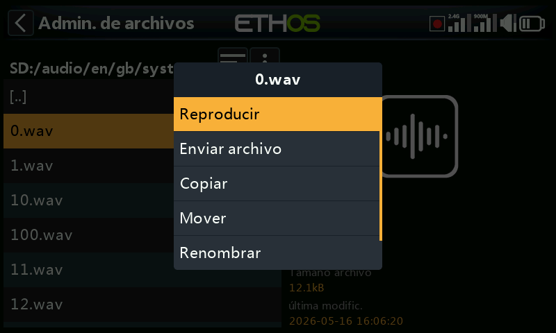

Pulse sobre un archivo WAV y seleccione la opción Reproducir para escucharlo.

Los archivos también se pueden copiar, mover, renombrar o borrar. También hay opciones para enviar y recibir archivos vía Bluetooth. Vaya a la sección de [Compartir archivos via Bluetooth](#Sharing files via Bluetooth) más abajo.

Nota: Los tres directorios serán actualizados por Ethos Suite sin tener en cuenta cuál de ellos se ha seleccionado en las opciones de voz.

### bitmaps/

Esta carpeta contiene los archivos bitmaps.

#### bitmaps/***models***/

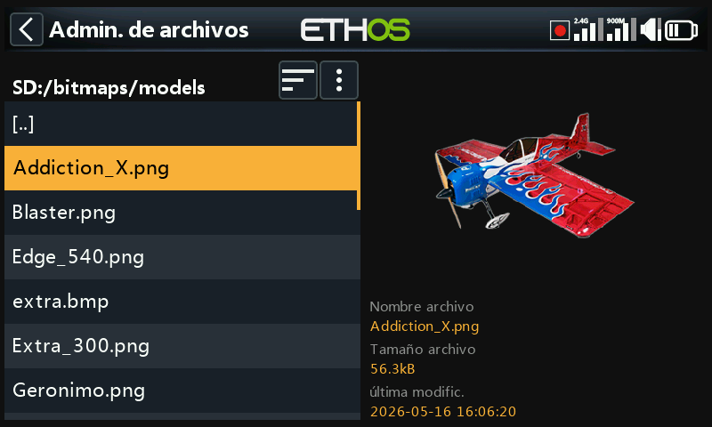

Esta carpeta es para imágenes de modelos de usuario que se guardan en ‘model/edit model’ o en el asistente de creación de nuevos modelos.

Note que el Administrador de archivos muestra los detalles del archivo en el panel de la derecha, como puede ser su nombre, tamaño y la fecha de su última modificación.

#### bitmaps/***user***/

Esta carpeta es para imágenes distintas a las de modelos que se encuentran en ‘Model / Edit model’.

El formato de imagen recomendado es el siguiente formato BMP:

Formato BMP de 32 bits

8 bits por color

Canal alfa (utilizado para la transparencia de la imagen)

Tamaño: 300x280px

Este formato reduce la carga computacional del microcontrolador integrado en la radio. Adicionalmente, Ethos puede redimensionar sobre la marcha el tamaño de las imágenes con extensión BMP, pero no las de PNG o JPG.

Reglas para nombrar los archivos de imagen:

Regla 1: utilice sólo los siguientes caracteres: A-Z, a-z, 0-9, ()!-\_@#;\[\]+= y Espacio.

Regla 2: el nombre no debe contener más de 11 caracteres, más 4 para la extensión. Si el nombre tiene más de 11 caracteres, se muestra en el Administrador de archivos, pero no aparece en la interfaz de selección de imágenes del modelo.

#### Herramientas de conversión de imágenes

Existen algunas herramientas útiles para conversión de imágenes. Vaya a la sección de [Administrador de imágenes](#Image manager) de la Suite Ethos.

### ***documents***/

Esta carpeta es para documentos.

***documents***/***user***/

Esta carpeta se destina a archivos de texto definidos por el usuario. Pueden leerse a través del widget ‘Texto’.

### ***Firmware***/

Aquí se almacenan las actualizaciones de firmware para el módulo RF interno, los módulos externos y otros dispositivos, tales como receptores, etc. Se pueden actualizar desde aquí a través del S.Port externo de la radio o a través de OTA (Over The Air). El nuevo firmware debe copiarse en la carpeta Firmware después de poner la radio en modo bootloader y conectarlo a un PC vía USB.

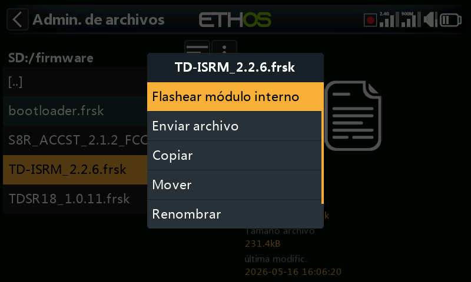

Pulse sobre la carpeta Firmware para ver los archivos de firmware que se han copiado en esta carpeta, seleccione el archivo adecuado para su dispositivo y a continuación pulse sobre la opción Flash en el cuadro de diálogo emergente. El ejemplo de arriba se muestra que se va a actualizar el módulo interno de RF.

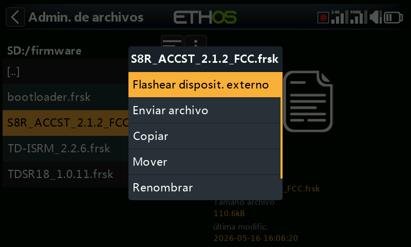

El ejemplo de arriba muestra un receptor S8R a punto de ser actualizado a través de la conexión S.Port de la radio.

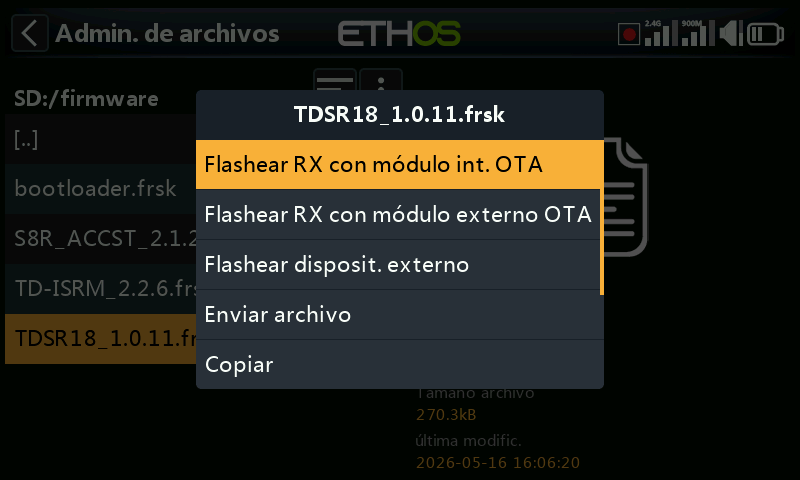

El ejemplo de arriba muestra un receptor TDSR18 a punto de ser actualizado por OTA a través del enlace inalámbrico con el receptor vinculado.

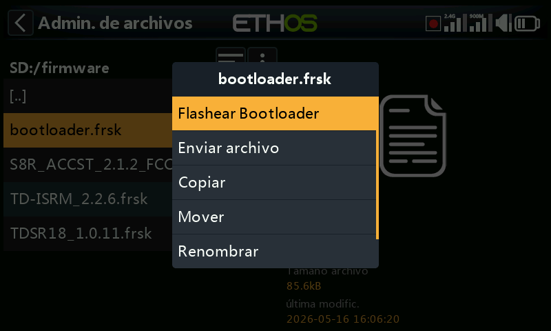

Este ejemplo muestra la actualización del gestor de arranque.

Los archivos también se pueden copiar, mover o borrar.

### I18n

Esta carpeta contiene los archivos de traducción para los distintos idiomas.

### Registros/ (Logs/)

Aquí se almacenan los registros de datos.

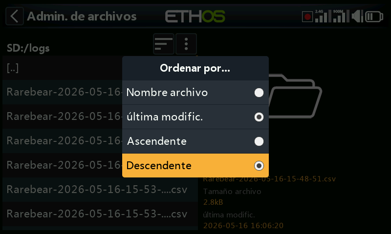

Para ver los registros, es más fácil cambiar las opciones del listado del Administrador de archivos para que muestre la ‘última modificación’ y ‘Descendente’ para hacer que los registros más recientes estén en la parte de arriba.

Navegue hasta la carpeta de los registros, y toque en el icono de ‘Ordenar por’ que está junto al icono de arriba del menú del Administrador de archivos, para abrir el cuadro de diálogo de las opciones de ordenación. Toque en ‘Ultima Modificación y en orden ‘Descendente’.

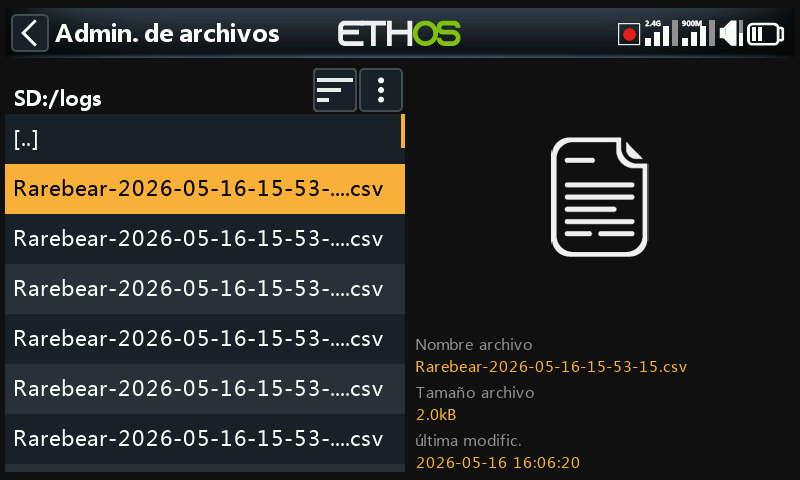

Seleccione rl archivo de registro deseado más reciente. Tenga en cuenta que el Administrador de archivos muestra los detalles del archivo en el panel del lado derecho, incluyendo su nombre completo, que es muy útil para ver los sellos temporales y saber si se ha cortado en algún momento en la vista de la izquierda.

Toque en el archivo de registro y seleccione ‘Abrir’ para verlo. Vaya a la sección  ‘[Visor de registros](#Log viewer)’ para más detalles.

### Modelos/ (Models/)

La radio almacena aquí los archivos de cada modelo. Estos archivos no pueden ser editados por el usuario, pero pueden ser copiados o compartidos desde aquí. Inicialmente los modelos se nombraban simplemente a partir de model01.bin hacia adelante, pero a partir de Ethos v1.2.11 se usa el nombre del modelo. Por ejemplo, un modelo llamado 'Extra' tendrá un nombre de archivo de 'Extra.bin'. Si hay más de un "Extra", los modelos adicionales se llamarán "Extra01.bin", etc.

Al editar los nombres de los modelos en la pantalla Editar modelo, también se modificará el nombre del archivo del modelo (.bin). El nombre del archivo del modelo estará en minúsculas (el nombre real del modelo con mayúsculas y minúsculas se guarda dentro del bin). No se admiten cualquier caracter para el nombre del archivo bin, por lo que es posible que no coincida exactamente con el nombre del modelo.

Hay subcarpetas para cada carpeta de las categorías de modelos creadas por el usuario.

### Capturas de pantalla (screenshots/)

Las capturas de pantalla creadas por la función especial ‘Captura de Pantalla’ se almacenan en formato .png. Consulte la sección Modelo / [Funciones especiales](#Special Functions section).

### scripts/

Esta carpeta se utiliza para almacenar scripts Lua. Los scripts pueden organizarse en carpetas individuales y tienen archivos de soporte incluidos en una estructura de carpetas.

**Precaución:** Tenga en cuenta que los scripts Lua aumentan el tiempo de arranque de la radio. Si se implementan correctamente el retraso no debería ser perceptible, pero si no es el caso, entonces el retraso puede ser casi indefinido.

Los distintos tipos de scripts Lua incluyen widgets, tareas, fuentes y herramientas. También se usan para controlar módulos externos.

#### Widgets

Los widgets se usan en las pantallas principales para mostrar la información deseada, como puede ser la telemetría y el estado de la radio, etc. Vaya a la sección de [Configurar pantallas](../displays/index.md) para más detalles.

#### Tareas y fuentes

Cuando se usan scripts Lua, es posible crear fuentes personalizadas, como por ejemplo sensores personalizados, o para crear tareas que realicen acciones personalizadas, como por ejemplo copiar el registro de datos en un archivo una vez que el vuelo se ha terminado. Una vez instalados en la carpeta scripts/ la página de Lua aparecerá en la sección del Modelo para administrar la tarea o la fuente específica de ese modelo. Para más detalles, vaya al menú [Lua](#Lua).

#### Herramientas

Un buen ejemplo puede ser las herramientas de configuración de un receptor estabilizado que aparecen en los menús de Sistema.

#### scripts para módulos externos

Cada módulo externo de terceros tiene su propio archivo Lua individual, y debe almacenarse en su carpeta específica:

scripts/multi

scripts/elrs

scripts/ghost scripts/crossfire

Para más información, consulte los enlaces en lo hilos de X20 y de Ethos en rcgroups: [Modulos externos de otros fabricantes](https://www.rcgroups.com/forums/showpost.php?p=49550649&postcount=18844).

### radio.bin

Este archivo se crea en el directorio raiz por el sistema de la radio cuando se inicializa y almacena los ajustes del sistema. Debe guardarse junto con la carpeta de modelos antes de actualizar el firmware, para poder volver a la versión anterior en caso necesario.

El archivo de actualización del firmware firmware.bin debe guardarse aquí, en la carpeta raíz de la tarjeta SD o eMMC, cuando se realice una actualización del firmware de la radio. Después de guardar el nuevo archivo firmware.bin, la actualización se instalará automáticamente en la radio cuando se desconecte el cable USB del PC. (Tenga en cuenta que también puede ser necesario actualizar el contenido de la tarjeta SD o eMMC al mismo tiempo).

### sdcard.version

Este archivo contiene información de la versión de la tarjeta SD y se usa y mantiene a través de la Ethos Suite.

## Compartir archivos vía Bluetooth

ETHOS dispone de una característica para compartir archivos entre distintas radios usando Bluetooth.

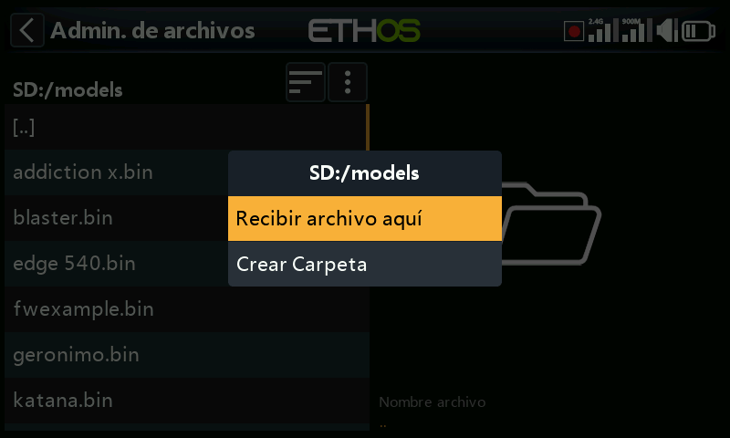

En la radio receptora, use el administrador de archivos para navegar hasta la carpeta donde quiere recibir el archivo o la información del modelo. Toque en el icono del menu del Administrador de archivos de la línea de arriba (o vaya hacia atrás y seleccione \[ENT\] en el icono) y seleccione ‘Recibir archivo aquí’.

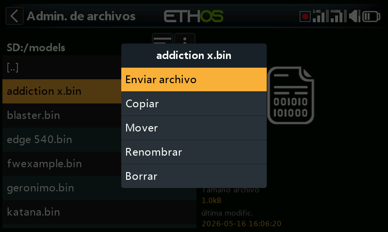

En la radio desde la que se quiere enviar el archivo, navegue hasta él y seleccionelo. Seleccione ‘Enviar archivo’ y siga las instrucciones en ambas radios.

Si la radio ya está conectada a otro dispositivo Bluetooth en Telemetría / Bluetooth o Trainer / modo Link, Bluetooth; o General / Audio / Bluetooth (sólo las X20S/Pro), se le dará la opción de desconectarse de ese dispositivo en cuestión.
