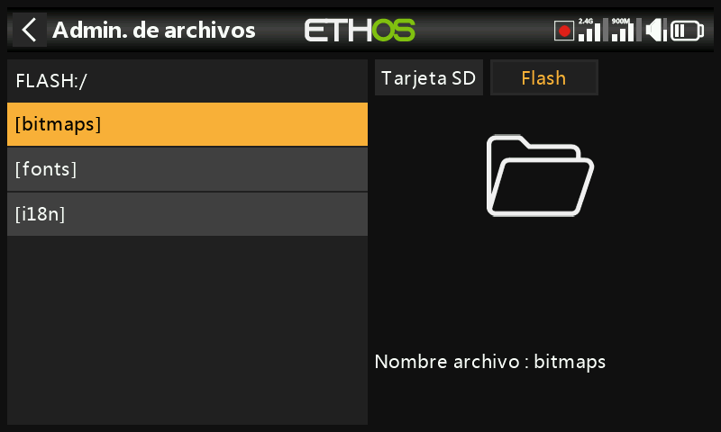

# Administrador de archivos

El Administrador de archivos permite explorar el almacenamiento de la emisora y actualizar el firmware del módulo de RF interno, de los dispositivos conectados por S.Port, de los dispositivos OTA (Over-The-Air) y de los módulos externos.

## Distribución del almacenamiento

Pulse **Flash** (o presione `PAGE` para cambiar de unidad) para explorar la unidad flash USB virtual interna de la emisora, utilizada para los mapas de bits y las fuentes del sistema:

- `bitmaps/system` — los mapas de bits utilizados para las pantallas y los iconos
- `fonts/` — fuentes para los distintos idiomas seleccionables

Tanto el bootloader como el propio firmware del sistema residen en esta memoria flash interna, en todas las emisoras FrSky desde la X9D original.

La serie **X20/X20S/X20HD** utiliza una SD card formateada en FAT32, de 32 GB o menos (una tarjeta SanDisk Ultra Micro SDHC Clase 10 de 16 GB es una buena elección). Las **X18** y **X20 Pro/R/RS** emplean por defecto una eMMC interna (se puede añadir una SD card externa junto a ella) — pulse **Radio** para explorarla. Ethos crea automáticamente `Logs/`, `models/` y `screenshots/` si no existen; `Firmware/` es una convención manual para los archivos de firmware de dispositivos, como los receptores.

## Carpetas de primer nivel {: #top-level-folders }

- **`audio/`** — archivos de sonido del usuario y del sistema, separados por voz (`audio/en/gb`, `audio/en/us`, `audio/en/default`). Los archivos del usuario se reproducen mediante la [función especial Play Audio](../model-setup/special-functions.md); los archivos del sistema incluyen `hello.wav` (el saludo «Welcome to Ethos» — se puede añadir un `bye.wav`, aunque no se suministra). Formato: PCM de 16 kHz o 32 kHz, lineal de 16 bits, o A-law (UE)/µ-law (EE. UU.) de 8 bits; nombres de archivo de hasta 31 caracteres más la extensión. Ethos Suite mantiene sincronizadas las tres carpetas de voz, independientemente de cuál esté seleccionada realmente.

  

- **`bitmaps/`** — `bitmaps/models/` contiene las imágenes de modelo del usuario (definidas en [Model Edit](../model-setup/model-edit.md) o en los asistentes de modelo nuevo); `bitmaps/user/` contiene todo lo demás. Formato recomendado: BMP de 32 bits, 8 bits por color, con canal alfa, 300×280 px — así la decodificación en la emisora resulta poco costosa. Ethos redimensiona los BMP al momento, pero no los PNG/JPEG. Los nombres de archivo solo pueden usar `A-Z a-z 0-9 ()!-_@#;[]+=` y espacios, y deben tener 11 caracteres o menos (más una extensión de 4 caracteres) para aparecer en el selector de imagen de modelo — los nombres más largos siguen apareciendo en el Administrador de archivos, pero no podrán seleccionarse allí. Las herramientas de conversión de imágenes de Ethos Suite se encargan de la conversión de formato por usted.

  

- **`documents/user/`** — documentos de texto del usuario, recuperados desde el widget de pantalla **Text**.

- **`Firmware/`** — archivos de firmware para el módulo de RF interno, los módulos externos y otros dispositivos (receptores, etc.), que se actualizan desde aquí mediante S.Port u OTA. Copie el nuevo firmware aquí mientras la emisora esté en [modo bootloader](../getting-started/usb-connection-modes.md) y conectada por USB; al pulsar un archivo de firmware y elegir **Flash** se inicia la actualización:

  
  
  
  

- **`I18n/`** — archivos de traducción de idiomas.

- **`Logs/`** — registros de datos.

- **`models/`** — los propios archivos de modelo. Aquí no se pueden editar directamente, solo respaldar o compartir. Desde Ethos v1.2.11, un modelo se nombra a partir de su nombre de modelo en lugar de `model01.bin` y siguientes (p. ej., un modelo llamado «Extra» pasa a ser `Extra.bin`; un segundo «Extra» pasa a ser `Extra01.bin`). Cambiar el nombre de un modelo en [Model Edit](../model-setup/model-edit.md) también cambia el nombre de su archivo — siempre en minúsculas (el nombre mostrado con mayúsculas y minúsculas se almacena dentro del archivo), y no todos los caracteres del nombre de un modelo se conservan en el nombre de archivo. Desde la v1.1.0 Alpha 17, cada categoría de modelo creada por el usuario tiene su propia subcarpeta.

- **`screenshots/`** — salida de la [función especial Screenshot](../model-setup/special-functions.md).

- **`scripts/`** — Scripts Lua, opcionalmente organizados en sus propias subcarpetas con archivos de apoyo. Los tipos de script son **widgets** (véase [Pantallas](../displays/index.md)), **tareas y fuentes** (sensores personalizados o acciones posteriores al vuelo — instalados aquí, aparecen en el menú [Lua](../model-setup/lua-scripts.md) del modelo) y **herramientas** (p. ej., las herramientas de configuración de receptores estabilizados de los menús del sistema). Cada módulo externo de terceros dispone de su propio script y carpeta, p. ej. `scripts/multi`, `scripts/elrs`, `scripts/ghost`, `scripts/crossfire`.

  !!! warning
      Los scripts Lua incrementan el tiempo de arranque de la emisora. El retardo de un script bien escrito es imperceptible — uno mal escrito puede retrasar el arranque casi indefinidamente.

- **`radio.bin`** (carpeta raíz) — el archivo de ajustes del sistema, escrito por la propia emisora durante la inicialización. Respáldelo junto con `models/` antes de una actualización de firmware, para poder volver a una versión anterior si fuera necesario.

- **`firmware.bin`** (carpeta raíz) — coloque aquí un nuevo archivo de firmware de la emisora para que se instale automáticamente la próxima vez que la emisora se desconecte del PC. Puede ser necesario actualizar en la misma pasada el contenido de la SD card/eMMC y de la unidad flash interna.

- **`sdcard.version`** (carpeta raíz) — la versión del contenido de la SD card, mantenida por Ethos Suite.

## Compartir archivos por Bluetooth

Ethos puede transferir archivos de emisora a emisora por Bluetooth. En la emisora **receptora**, navegue hasta la carpeta de destino en el Administrador de archivos, mantenga pulsado `ENT` y elija **Receive file here**:

En la emisora **emisora**, pulse el archivo, elija **Send file** y siga las indicaciones en ambas emisoras:

Si alguna de las dos emisoras ya tiene una conexión Bluetooth activa (telemetría, enlace de instructor o — en X20S/Pro — audio), se preguntará si se desea desconectar primero ese dispositivo.
