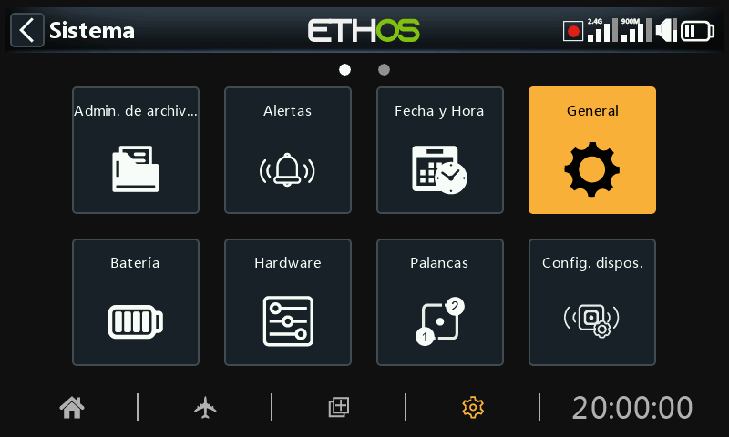
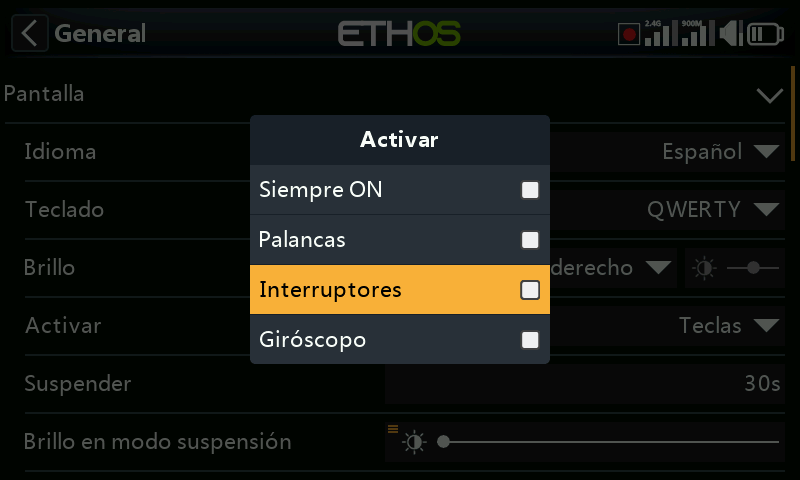
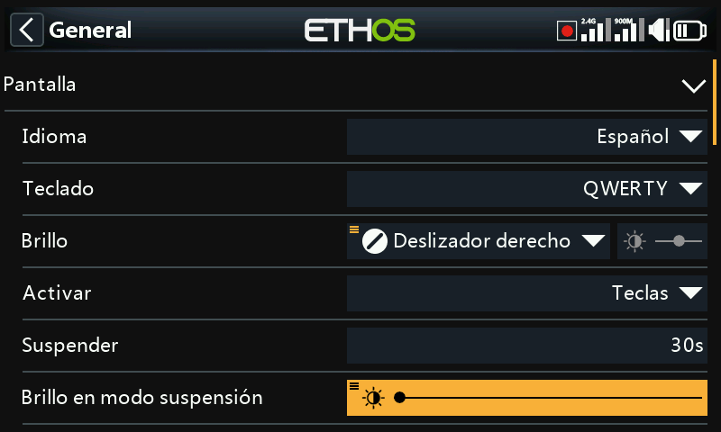
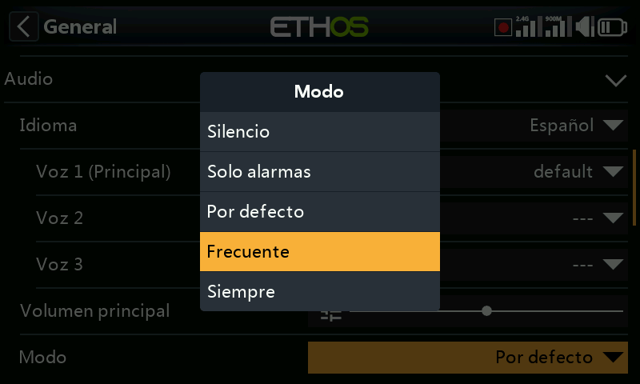
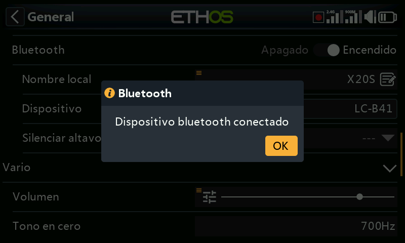
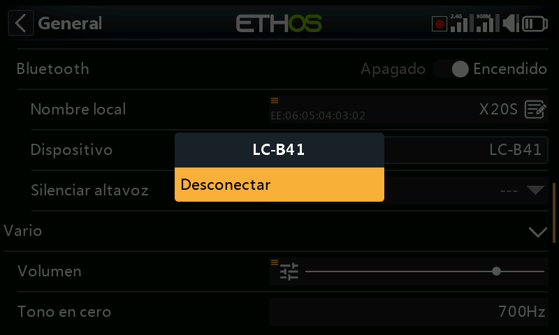
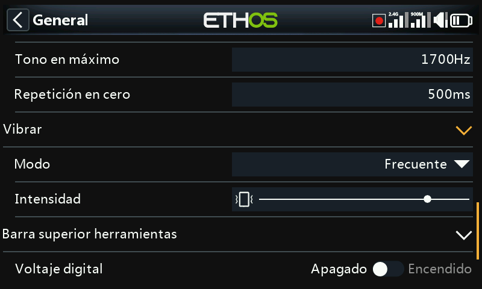
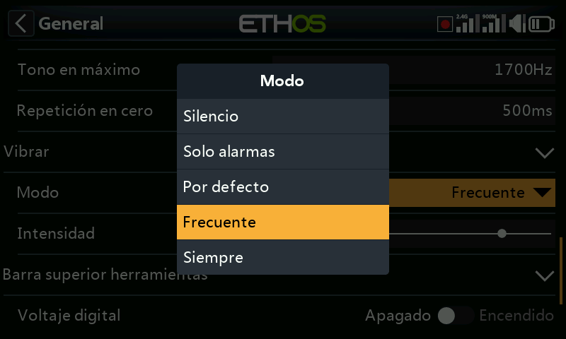

# General

Aquí se puede configurar lo siguiente:

- Atributos de la pantalla LCD
- Los ajustes del audio de la radio
- Los ajustes del vario
- Los ajustes de vibración del modo háptico
- El contenido de la barra superior

## Atributos de la pantalla

Los atributos de la pantalla LCD se pueden configurar aquí:

### Idioma

Se admiten los siguientes idiomas para los menús de pantalla:

English

中文

Česky

Deutsch

Español

Français

עִברִית

Italiano

Nederlands

Norsk

Português Brasileiro

Polish

Português

### Teclado

Permite seleccionar entre las distribuciones de teclado virtual QWERTY, QWERTZ y AZERTY.

### Luminosidad

Utilice el control deslizante para controlar el brillo de la pantalla, de izquierda a derecha para ajustar el brillo de oscuro a brillante. Manteniendo pulsada la tecla ENT aparecen opciones para utilizar una fuente, o ajustarla al mínimo o al máximo.

Tenga en cuenta que si la luminosidad (con la luz de fondo encendida) es igual que la del ‘Brillo en modo de suspensión’ (con la luz de fondo apagada) la pantalla táctil permanece activa.

#### Opción pot/slider

Pulse sobre "Utilizar una fuente" y seleccione un potenciómetro para utilizarlo como control de luminosidad.

El ejemplo de arriba muestra el brillo controlado a través del deslizador derecho.

### Activar

La retroiluminación de la pantalla puede despertarse del estado de reposo de acuerdo con una o más de las siguientes opciones:

#### Siempre encendido

La retroiluminación permanece encendida permanentemente.

#### Palancas

La retroiluminación se enciende al accionar las palancas o las teclas.

#### Interruptores

La retroiluminación se enciende al accionar interruptores o teclas.

#### Giróscopo

La retroiluminación se enciende al inclinar la radio o al accionar las teclas.

Tenga en cuenta que se puede activar más de una opción.

### Suspender

El tiempo de inactividad antes de que se apague la retroiluminación. Cuando se selecciona Siempre encendido, la opción Sleep no se podrá seleccionar (se pone en gris)

### Brillo en modo suspensión

Utilice el control deslizante para ajustar el brillo de la pantalla durante el modo de reposo, de izquierda a derecha para ajustar el brillo de oscuro a brillante.

Tenga en cuenta que si la luminosidad (con la luz de fondo encendida) es igual que la del ‘brillo en modo suspensión’ (con la luz de fondo apagada) la pantalla táctil permanece activa aunque la iluminación parezca apagada.

### Tema

Permite la selección entre temas para la pantalla. El tema por defecto es Oscuro, con Claro como alternativa. Además, se pueden instalar otros temas Lua. Por favor, consulte la sección 'Temas de pantalla Lua alternativos' para más detalles.

### Color de realce

Permite seleccionar el color de realce que se utilizará en la pantalla. Por defecto es amarillo (#F8B038).

## Ajustes de audio

### Idioma de audio

Permite la selección del idioma en el que se hacen los anuncios por voz.

#### Elección de voces

El Sistema de selección de voces, proporciona la capacidad de seleccionar varias voces distintas en un determinado idioma.

##### Voz 1 (principal)

La voz principal se usa para todos los anuncios del sistema que son parte del sistema operativo Ethos. Por defecto, para idioma inglés se puede elegir entre voces americanas (us) e Inglesas (gb). Estos paquetes de sonido solo cubren los anuncios por voz del sistema

En el ejemplo anterior, se ha seleccionado como ‘Voz 1’ (principal) la opción ‘Español’ por defecto

Los archivos están almacenados en las siguientes carpetas:

a*udio/en/us/system*

audio/en/gb/system

*audio/es/system*

##### Archivos de sonido de usuario

Los archivos de usuario pueden instalarse para su uso con la función especial ‘Reproducir audio’ (anteriomente se llamaban ‘Play track’ y ‘Play sequence’). Su localización debe ser:

*audio/en/us/*     o

audio/en/gb/

audio/es

##### Voces 2 y 3

Se pueden almacenar paquetes alternativos de voces para usarse como Voz 2 o 3.

Para asegurarse de que se reproduzcan adecuadamente las voces 2 y 3, necesitará añadir los archivos adecuados con una estructura de carpetas similar a la estándar mostrada para la voz principal. Como ejemplo, si vas a usar una voz designada Susana, la estructura de las carpetas debería ser:

audio/es/Susana	Para archivos de usuario

*audio/es/Susana/system	Para* cambiar archivos de sonido del sistema

Tenga en Cuenta que cada voz debe tener una carpeta /system que contenga los archivos audio que necesitará para ‘Reproducir valor’ y para los cronómetros. La lista de los archivos de voz del Sistema se encuentra en un archivo .csv que se suministra con cada paquete de audio.

De esa manera, puede elegir la voz que quiera usar para cada cronómetro y ‘Reproducir Audio’ para las funciones especiales. Opcionalmente, puedes asignar un paquete de voces personalizados como Voz 1 (principal) si quiere reemplazar los anuncios del sistema por los suyos.

##### Voz por defecto (default)

*Para evitar problemas de* conversión de los sonidos, desde la versión 1.4.X, se ha instalado un paquete de voz ‘por defecto’. Durante la instalación/actualización, si los sonidos de sistema por defecto de la Voz 1 (voz principal) no se ha determinado todavía, la ‘Voz 1 (principal)’ se ajustará como voz ‘por defecto’, siempre que exista la carpeta.

Los archivos están en la siguiente carpeta:

a*udio/en/default/system*

audio/es/default/system

##### Archivos de sonido del usuario

Algunos sonidos más frecuentemente solicitados se proporcionan durante la instalación para usarse con la función ‘Reproducir audio’ de las funciones especiales (previamente llamadas ‘Play track’ y ‘Play sequence’). Su localización es:

audio/en/default/

audio/es/default

*En esta carpeta se pueden añadir archivos* *de sonido* *adicionales, si el usuario desea seguir usando esta voz por defecto.*

### Volumen principal

Utilice el control deslizante para controlar el volumen de audio. Una pulsación larga de la tecla ENT permite utilizar un pot o slider. Los pitidos durante el ajuste ayudan a valorar el volumen.

### Modos audio

#### Silencio

Sin audio. Tenga en cuenta que se emitirá una alerta al encender la radio si la opción Modo Silencio está activada en Sistema / Alertas.

#### Sólo alarmas

Sólo las alarmas se reproducirán por el audio.

#### Por defecto

Los sonidos están activados.

#### Frecuente

Además, se oirán pitidos de error cuando se intente superar el valor máximo o mínimo de los valores editables.

#### Siempre

Además de los sonidos de "Frecuente", también se oirán pitidos cuando se navegue por el menú.

### Bluetooth (sólo radios X20S/HD/Pro/R/RS)

Los modelos X20S, HD y X20 Pro/R/RS disponen de un modo audio adicional para enviar el audio a algún dispositivo Bluetooth, como pueden ser unos auriculares.

Toque en ‘Buscar dispositivos’.

Aparece el anuncio ‘Esperando dispositivos’. Encienda el dispositivo Bluetooth y póngalo en modo emparejamiento.

Cuando se encuentre el dispositivo Bluetooth, se mostrará su nombre. Púlselo para seleccionarlo.

Se mostrará el anuncio ‘Esperando dispositivo’

Cuando la radio y el dispositivo se han emparejado, aparece el anuncio ‘Dispositivo Bluetooth conectado’. Pulse OK.

Aparecerá de nuevo la pantalla de Bluetooth mostrando la conexión. El dispositivo audio debería estar ya operativo.

#### Disconnect

#### Toque en el dispositivo para que aparezca la opción de desconectarlo.

#### Altavoz desactivado

Para desactivar el altavoz del sistema (por ejemplo, cuando se usa un auricular Bluetooth) se puede seleccionar como ‘siempre encendido’, cuando la telemetría esté funcionando, o controlarlo por una fuente (por ejemplo, un interruptor) o cualquier otra condición.

El Sistema recordará el dispositivo Bluetooth. Para que funcione automáticamente, primero encienda la radio y luego el dispositivo. El dispositivo Bluetooth se conectará, pudiendo ocurrir que pasen unos segundos para que un altavoz silenciado se active otra vez.

## Vario

Aquí se pueden configurar las características de audio de los tonos del Vario.

### Volumen

El volumen relativo del tono vario.

### Tono en cero

El tono cuando la velocidad de ascenso es cero.

### Tono en máximo

El tono a máxima velocidad de ascenso.

### Repetición en cero

El retardo entre pitidos en el tono cero.

Consulte el sensor [VSpeed](#VSpeed sensor) en Telemetría y la función especial [Play vario](#Play vario) para usar otros parámetros del Vario.

## Vibrar

### Intensidad

Utiliza el control deslizante para controlar la intensidad de la vibración.

### Modo

Similar al Modo Audio anterior.

## Location de datos (X18 y X20 Pro/R/RS)

Las radios X18 y X20 Pro/R/RS disponen de un eMMC de 8Gb (embedded MultiMediaCard) que es un dispositivo de almacenamiento formado por una memoria flash tipo NAND y un controlador simple de almacenamiento. ETHOS selecciona por defecto el almacenamiento en la eMMC, pero se puede también optar por usar una tarjeta SD. El usuario puede seleccionar eMMC, SD, o una combinación de ambas.

Observe las opciones disponibles en la figura de arriba. Si la información del Sistema o de los modelos se quiere mover a la tarjeta SD, será necesario copiar las carpetas y los archivos a la tarjeta SD antes de hacer la selección. Lo mismo ocurre con los archivos de audio y los bitmaps.

## Barra superior

### Voltaje digital

El estado de la batería en la barra de herramientas superior se puede cambiar desde la presentación en barra predeterminada, a mostrar en su lugar el voltaje de la batería de la radio en formato digitales.

### RSSI digital

Del mismo modo, el estado del RSSI se puede cambiar desde una visualización por barras a un valor digital, tanto para 2.4G como para 900M.

## Seleccionar modelo al arranque

Cuando se habilita esta opción, al encender la radio aparecerá la opción de seleccionar un modelo cuando se enciende la radio. De esta manera, se puede seleccionar un modelo antes de que se activen las alertas de la lista de chequeo de modelos anteriores. Así evitará tener que esperar a que se cancelen las alertas de la lista de chequeo antes de poder seleccionar un modelo diferente.

Por defecto, estará remarcado el último modelo utilizado en sesiones previas.

## Preselección modo USB

Cuando se conecta la radio a un PC a través de un cable USB, estarán disponibles las siguientes opciones:

### Sin definir

Aparece la opción ‘Sin definir’ por defecto inmediatamente después de conectar la radio, para permitir seleccionar la opción elegida.

### Joystick

Con esta opción, la radio automáticamente entrará en el modo joystick para poder usarse con los simuladores RC.

### Ethos Suite

Con esta opción, la radio entrará automáticamente en el ‘Modo Ethos’ para poderse comunicar con la Suite Ethos. Vaya a la sección [Modo Ethos](#Ethos Mode) para más detalles.

### Serie

Con esta opción, la radio entrará automáticamente en el modo Serie. En este modo, las trazas de depuración de los scripts Lua se envían al puerto USB-Serie, siempre que haya alguno presente. Se transmitirán a 115200bps. Un Puerto COM virtual puede encontrarse [aqui](https://www.st.com/en/development-tools/stsw-stm32102.html).
