# General

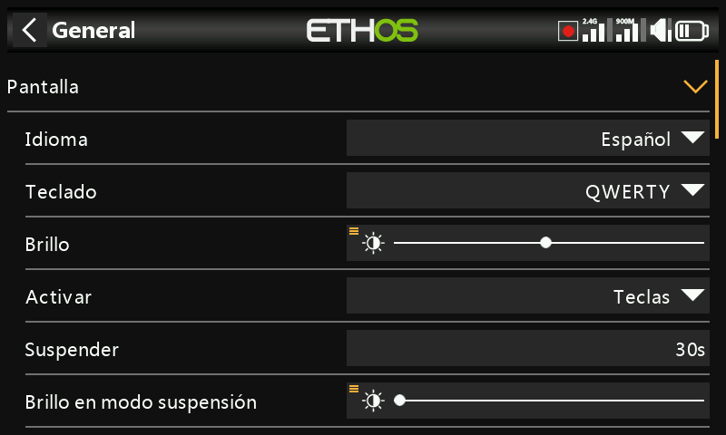

Abarca los atributos de pantalla, el audio, el vario, la vibración y la barra de herramientas superior.

## Atributos de pantalla

- **Language** — el idioma de los menús de la pantalla (English, 中文, Česky, Deutsch,
  Español, Français, עברית, Italiano, Nederlands, Norsk, Português
  Brasileiro, Polish, Português y otros).
- **Keyboard** — disposición del teclado virtual: QWERTY, QWERTZ o AZERTY.
- **Brightness** — un deslizador para el brillo de la retroiluminación; mantenga pulsado `ENT`
  para controlarlo desde una fuente en su lugar (por ejemplo, un deslizador, como en el ejemplo siguiente),
  o para forzarlo al mínimo/máximo.

  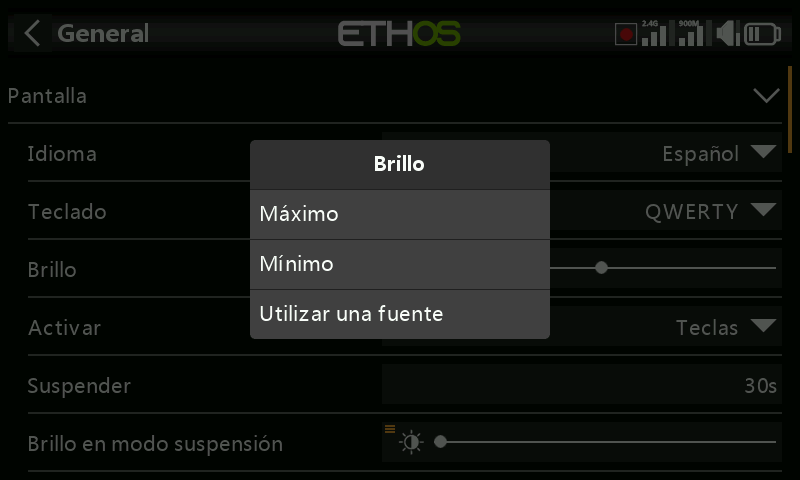
  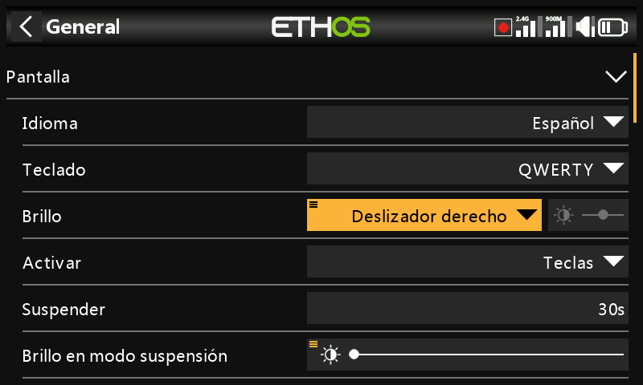

  !!! note
      Si **Brightness** es igual a **Sleep mode brightness**, la pantalla táctil
      permanece activa incluso mientras está «dormida».

- **Wake up** — cuáles de estos elementos despiertan la retroiluminación del reposo (puede
  habilitarse más de uno): **Always on** (nunca se duerme), **Sticks**,
  **Switches**, **Gyro** (inclinar la emisora). Las teclas siempre la despiertan,
  independientemente de estos ajustes.
- **Sleep** — tiempo de inactividad antes de que la retroiluminación se apague (aparece atenuado
  si Wake up está configurado como Always on).
- **Sleep mode brightness** — brillo de la retroiluminación durante el reposo.
- **Dark mode** — tema de pantalla claro u oscuro.
- **Highlight Color** — color de acento de la interfaz (por defecto `#F8B038`).

## Ajustes de audio {: #audio-settings }

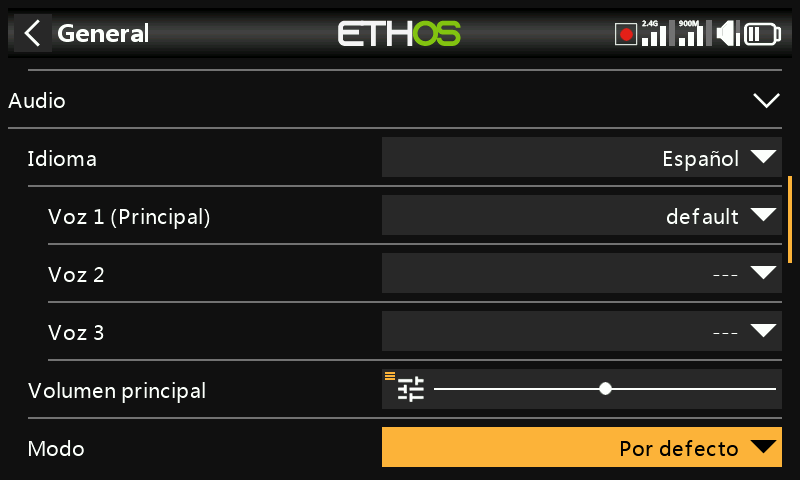

- **Audio language** — idioma de los anuncios de voz.
- **Elección de voces** — Ethos admite varios paquetes de voz simultáneos:

  - **Voice 1 (main)** — se utiliza para todos los anuncios integrados del sistema. Para
    el inglés, la elección predeterminada es entre los paquetes americano (`us`) y británico
    (`gb`), leídos desde `audio/en/us/system` y `audio/en/gb/system`.
    Los archivos de sonido del usuario para la [función especial Play Audio](../model-setup/special-functions.md)
    se colocan en `audio/en/us/` o `audio/en/gb/`, respectivamente.
  - **Voice 2 / Voice 3** — paquetes adicionales, por ejemplo una voz
    TTS personalizada. Cada uno necesita la misma estructura de carpetas que Voice 1 — por ejemplo, una voz
    llamada «Susan» necesita `audio/en/Susan/` para los sonidos del usuario y
    `audio/en/Susan/system` para sus sonidos del sistema (toda voz necesita una
    carpeta `/system`, ya que es de donde leen **Play Value** y los anuncios
    de los temporizadores; con cada versión de audio se distribuye una lista `.csv` de los
    archivos de sonido estándar del sistema). Una vez instalada, una voz puede
    asignarse por temporizador y por función Play Audio — o incluso establecerse como Voice
    1 para reemplazar por completo los anuncios del sistema.
  - **Voice "default"** — se instala automáticamente como alternativa segura (y
    se utiliza para evitar problemas de conversión desde instalaciones 1.4.x): si Voice 1 no
    está ya configurada durante una instalación/actualización, se establece en `default`, leyendo
    desde `audio/en/default/system`. Los archivos de sonido personalizados más solicitados
    para Play Audio se encuentran en `audio/en/default/`.

- **Main volume** — un deslizador para el volumen general del audio (mantenga pulsado `ENT` para
  controlarlo desde un potenciómetro); durante el ajuste suenan pitidos para que pueda juzgar el
  nivel de oído.
- **Audio mode**:
  - **Silent** — sin audio (aún así activa la [alerta de modo silencioso](alerts.md)
    al arrancar, si está habilitada).
  - **Alarms only** — solo se oyen las alarmas.
  - **Default** — sonidos normales.
  - **Often** — añade pitidos de error cuando un valor se lleva más allá de su
    mínimo/máximo.
  - **Always** — añade pitidos para la navegación normal por los menús, además de lo de Often.
  - **Bluetooth** (solo X20S/HD/Pro/R/RS) — retransmite el audio a un dispositivo
    Bluetooth emparejado (auriculares, etc.). Elija **Search Devices**, ponga el
    dispositivo de destino en modo de emparejamiento y selecciónelo cuando aparezca:

    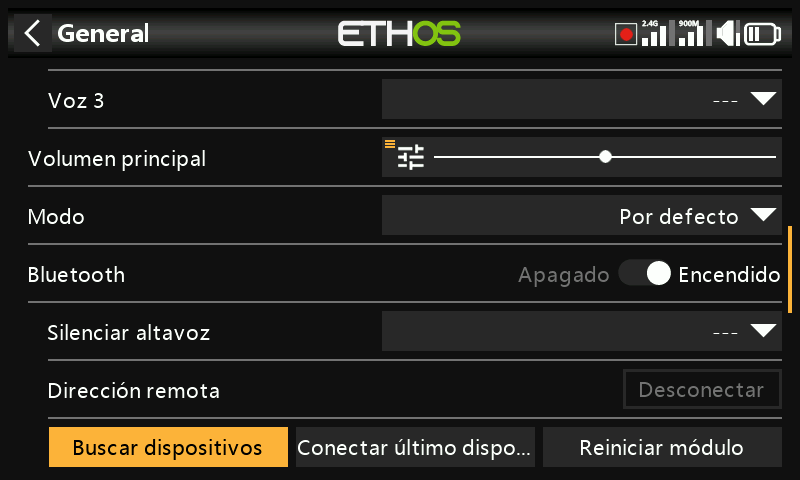
    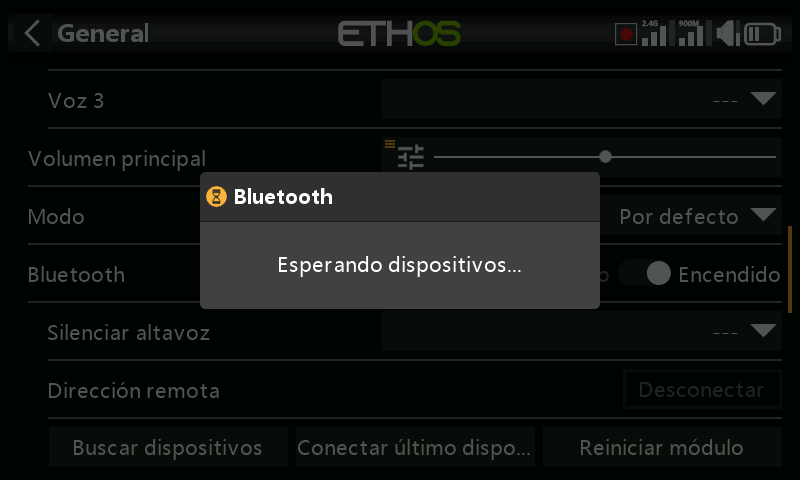
    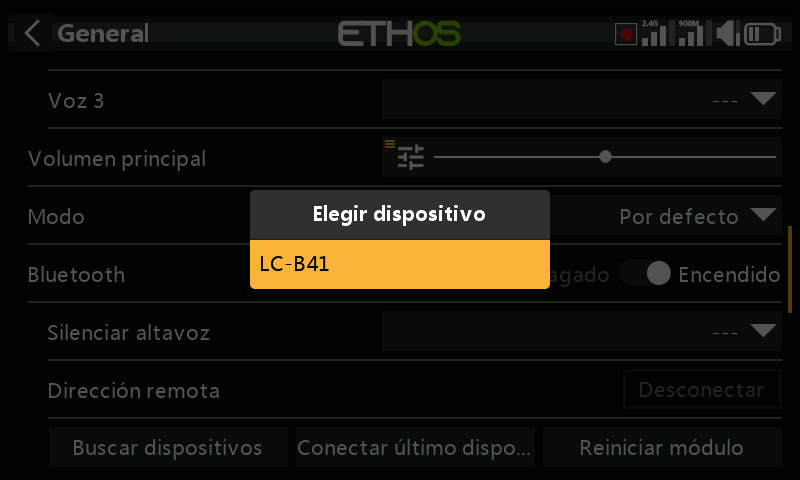
    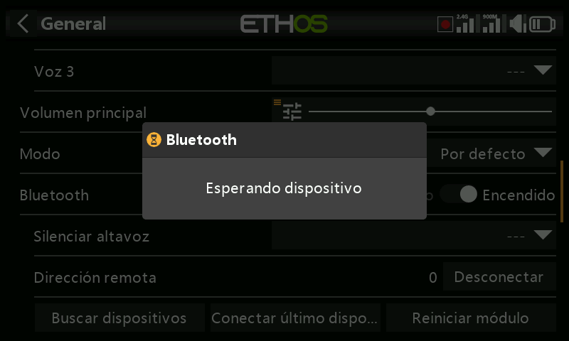
    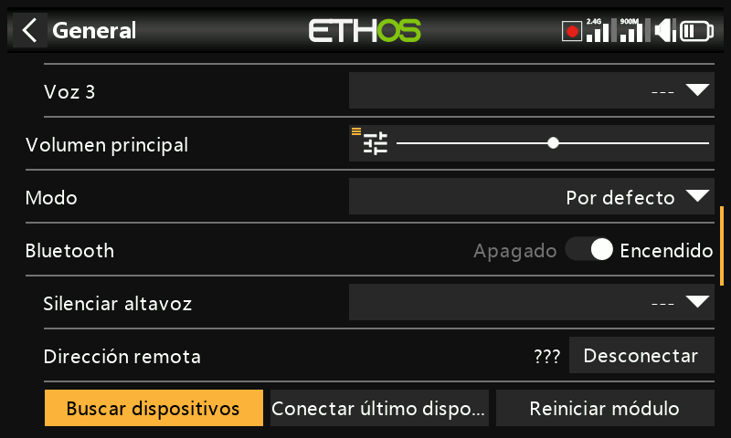

    **Speaker mute** controla entonces el altavoz integrado — siempre activo,
    solo mientras la telemetría esté activa, o controlado por una fuente (por ejemplo, un
    interruptor). La emisora recuerda el dispositivo emparejado; encienda la emisora
    antes que el dispositivo Bluetooth para un funcionamiento normal, y espere unos
    segundos después de que se conecte para que el silenciado del altavoz vuelva a activarse.

## Vario

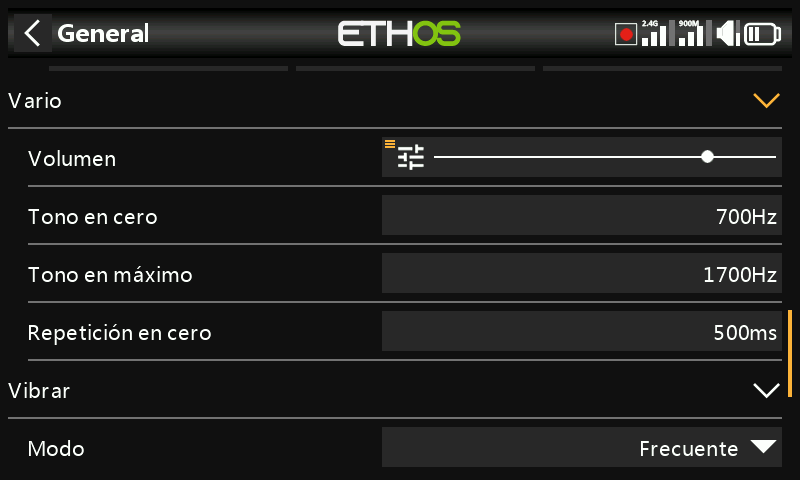

- **Volume** — volumen relativo del tono del vario.
- **Pitch zero** — tono a velocidad de ascenso cero.
- **Pitch max** — tono a la velocidad de ascenso máxima.
- **Repeat** — retardo entre pitidos con el tono a cero.

Consulte también el sensor VSpeed en [Telemetría](../model-setup/telemetry.md)
y la [función especial Play Vario](../model-setup/special-functions.md)
para conocer más comportamientos del vario.

## Vibración

- **Strength** — un deslizador para la intensidad de la vibración.
- **Mode** — el mismo conjunto de opciones que Audio mode, más arriba.

## Ubicación de almacenamiento (X18 y X20 Pro/R/RS) {: #storage-location-x18-and-x20-prorrs }

Estas emisoras disponen de una eMMC interna de 8 GB. Por defecto, Ethos la utiliza, con lo que
la SD card es opcional — pero puede seleccionar la eMMC, una SD card o una
combinación de ambas. Si traslada el sistema y los modelos a una SD card, copie
las carpetas/archivos correspondientes (incluidos audio y mapas de bits) **antes**
de cambiar la ubicación de almacenamiento.

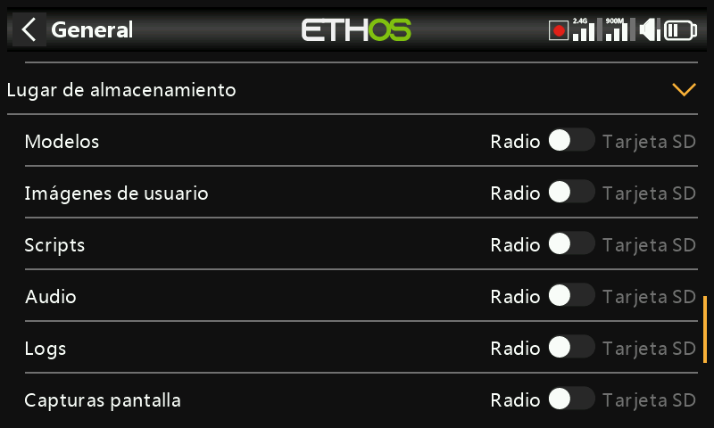

## Barra de herramientas superior

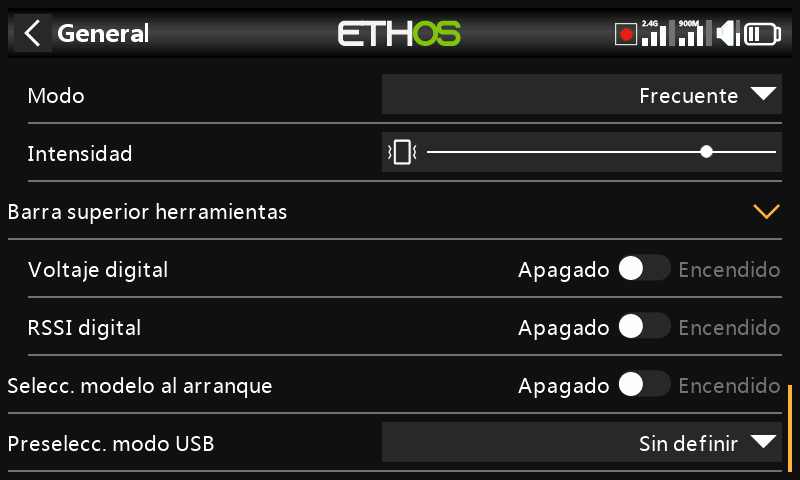

- **Digital voltage** — muestra el voltaje de la batería de la emisora como un número en lugar de
  una barra en la barra de herramientas superior.
- **Digital RSSI** — lo mismo, para el RSSI de 2,4 GHz y 900 MHz.
- **Select model at power on** — muestra la pantalla de selección de modelo al
  arrancar, antes de que aparezcan las alertas de la lista de verificación del modelo anterior, de modo que pueda
  cambiar de modelo sin tener que descartarlas primero. El último modelo utilizado
  aparece resaltado por defecto.

  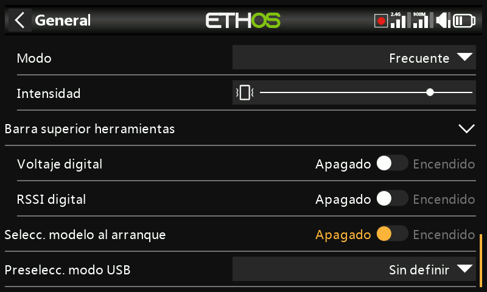

## Preselección del modo USB

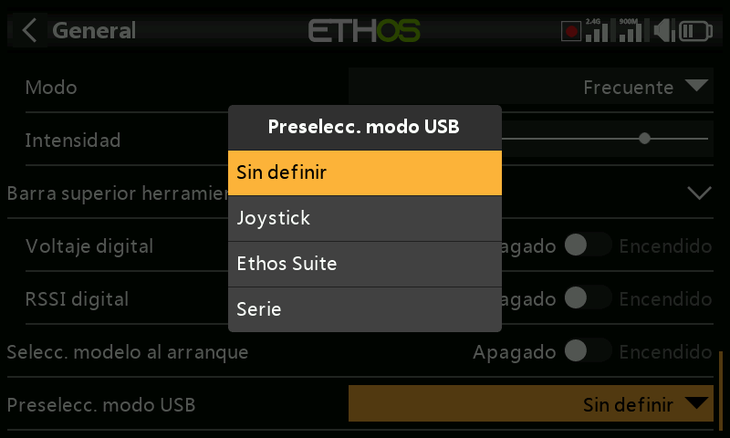

Lo que ocurre automáticamente cuando la emisora se conecta a un PC por USB:

- **Not set** — solicita una elección en el momento de la conexión.
- **Joystick** — entra inmediatamente en modo joystick para un simulador de RC.
- **Ethos Suite** — entra inmediatamente en modo Ethos para [Ethos
  Suite](../ethos-suite/index.md).
- **Serial** — entra inmediatamente en modo Serial, enviando las trazas de depuración de Lua
  por USB-Serial a 115200 bps (puede ser necesario un controlador de puerto COM virtual
  para Windows).
