# Hardware

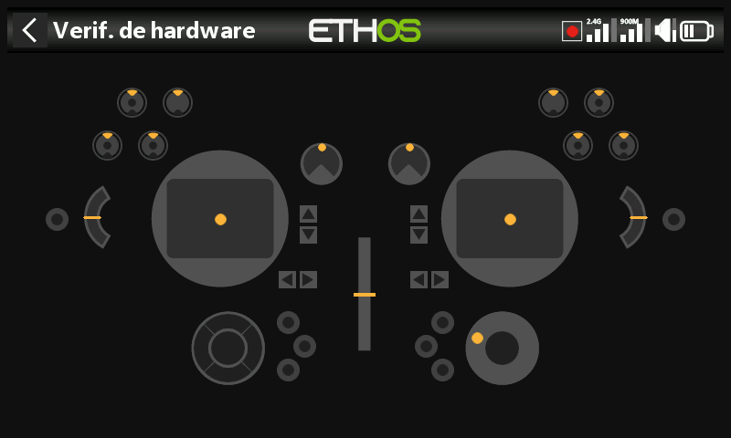

Prueba y calibración de los controles físicos de la emisora, definición del
tipo de interruptores y asignación de las teclas de inicio.

## Comprobación del hardware {: #hardware-check }

Ejercita cada entrada física para que puedas confirmar que todas se
registran correctamente.

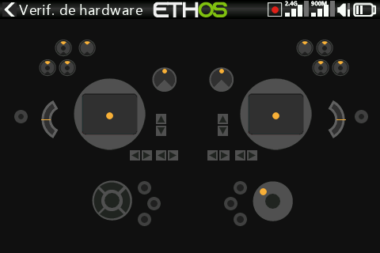

- **X20 Pro/R/RS** — comprueba también los dos pulsadores con enclavamiento
  **K** y **L** situados en los hombros traseros, además de los trims
  adicionales **T5**/**T6**.
- **X18** — comprueba también los trims adicionales **T5**/**T6**.

## Calibración de los analógicos {: #analogs-calibration }

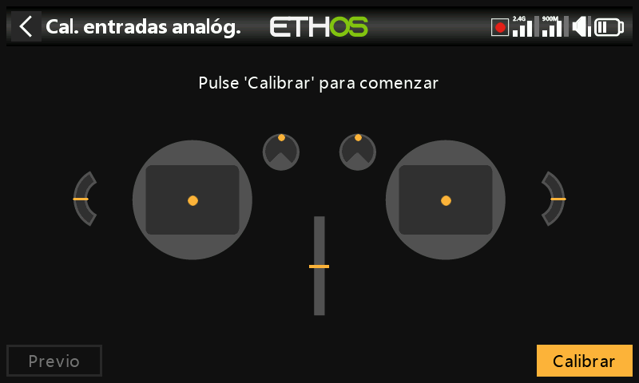

Enseña a la emisora exactamente dónde están el centro y los límites de cada
gimbal, potenciómetro y deslizador. Se ejecuta automáticamente en el primer
arranque; repítela tras sustituir un gimbal, un potenciómetro o un
deslizador.

## Calibración del giróscopo

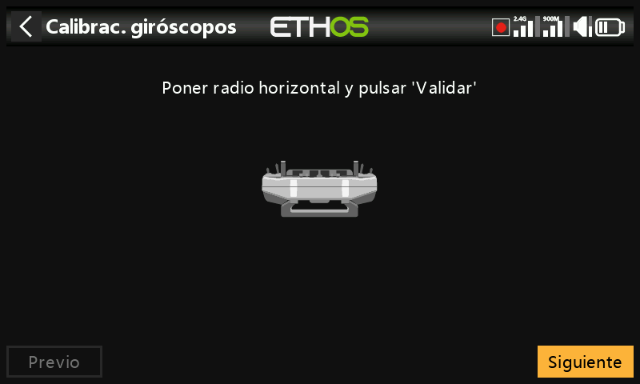

Calibra el giróscopo integrado para que las entradas basadas en la
inclinación respondan correctamente al inclinar la emisora: la posición
«nivelada» pasa a ser la forma en que normalmente la sujetas. También se
ejecuta automáticamente en el primer arranque.

## Filtro de analógicos

Filtro ADC de activación/desactivación para los sticks, activado por
defecto: reduce las oscilaciones alrededor del centro del stick. Este es el
ajuste **global**; existe además una anulación **por modelo** del filtro de
analógicos en [Edición del modelo](../model-setup/model-edit.md).

## Ajustes de potenciómetros/deslizadores {: #potssliders-settings }

Permite renombrar los potenciómetros y los deslizadores. El **X20 Pro/R/RS**
admite además dos potenciómetros extra, **Ext1**/**Ext2**, empleados
habitualmente para gimbals de 3 ejes.

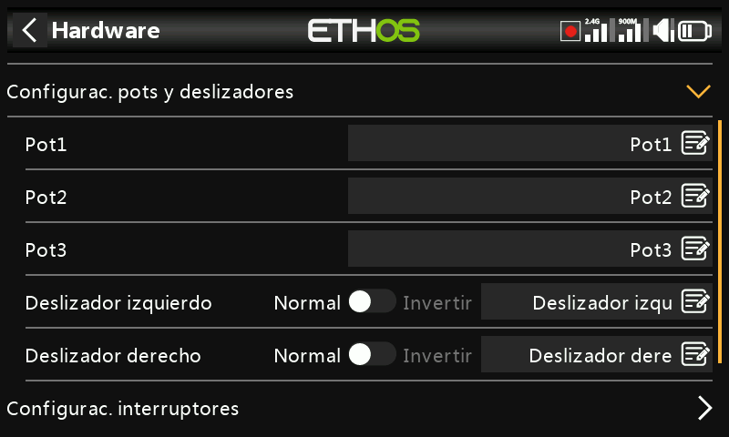
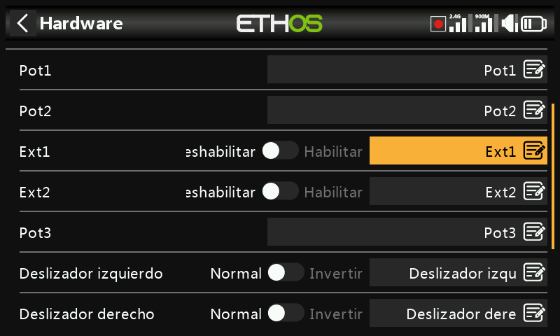

## Ajustes de los interruptores {: #switches-settings }

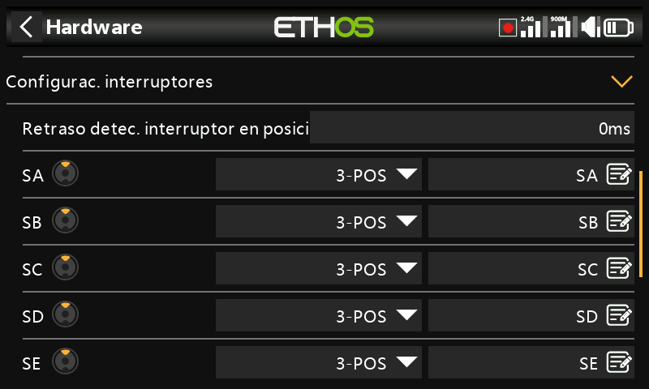

- **Retardo de detección de la posición central** — evita que un cambio
  rápido arriba→abajo (o abajo→arriba) de un interruptor de 3 posiciones
  registre momentáneamente la posición central; la posición central solo
  debería registrarse cuando el interruptor se detiene realmente en ella. El
  valor por defecto es 0 ms, elegido para adaptarse a la detección de
  «autocomprobación» de los receptores estabilizados de FrSky en el CH12.
- **Tipo de interruptor** — cada interruptor SA–SJ puede definirse como
  **None**, **Momentary**, **2 POS** o **3 POS**, lo que permite
  intercambiar funcionalidades entre interruptores físicos (por ejemplo,
  asignar al interruptor momentáneo SH la función que normalmente
  desempeña el SF de 2 posiciones), siempre dentro de lo que el cableado de
  la emisora admita realmente (por lo general no puede asignarse una
  función de 3 posiciones a un hardware que no está cableado para ello).

  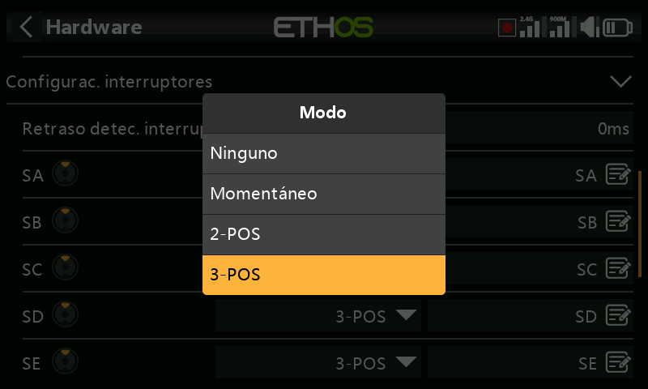
  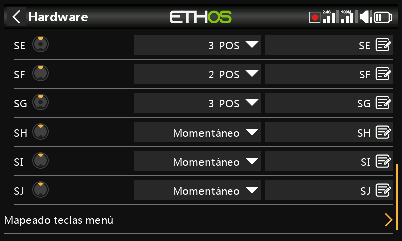

- **Renombrado** — los interruptores pueden renombrarse de SA–SJ a nombres
  personalizados; los nombres son globales para todos los modelos.
- **X20 Pro** — añade los pulsadores **K**/**L** en los hombros traseros,
  además de las posiciones **M**/**N** si están cableadas (normalmente para
  interruptores en el extremo de los sticks).

## Asignación de teclas de inicio

Reasigna el destino al que saltan las teclas de inicio `SYS`, `MDL` y
`DISP` (`TELE` en emisoras más antiguas).

- **`DISP`** — tanto la pulsación corta como la larga pueden reasignarse a
  cualquier página de Modelo, página de Sistema, Configurar pantallas,
  Inicio o el Registro de datos de vuelo. Por coherencia con la serie X10,
  la pulsación larga de `DISP` se ajusta convencionalmente a Configurar
  pantallas.
- **`SYS`/`MDL`** — solo la pulsación larga es reasignable (al mismo
  conjunto de destinos); una pulsación corta abre siempre la sección de
  Sistema o de Modelo, respectivamente.

## Opciones de hardware específicas de cada emisora {: #radio-specific-hardware-options }

- **Activación de mejoras de gimbal háptico** (X20 Pro, X20R) — el X20 Pro AW
  y el X20RS se suministran con gimbals MC20R que incorporan motores de
  vibración («stick-shaker») hápticos; si se han retroadaptado gimbals MC20R
  a un X20 Pro o X20R, actívalos aquí (consulta
  [Funciones especiales](../model-setup/special-functions.md) para
  configurar los propios patrones hápticos).

  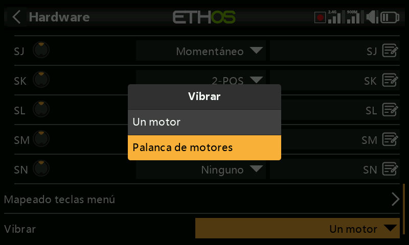
  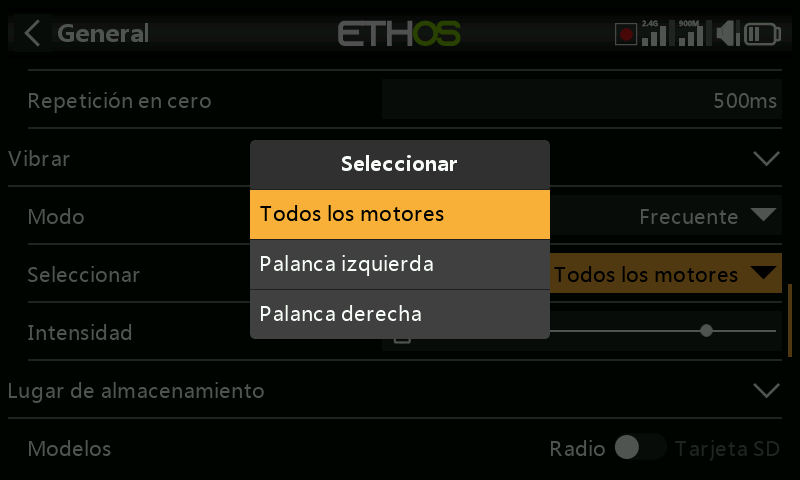

- **Opción del encoder** (X20 Pro AW, X20R/RS) — estas emisoras disponen de
  un encoder rotativo más sensible; activa los **medios pasos** para
  atenuarlo.

  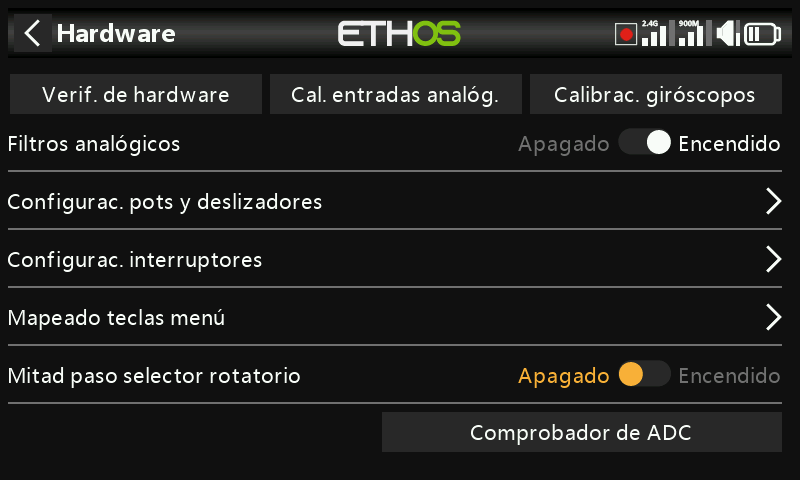

## Inspector de valores ADC {: #adc-value-inspector }

Muestra los valores brutos de la conversión analógico-digital que la CPU lee
para cada entrada analógica:

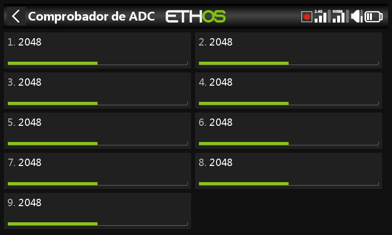
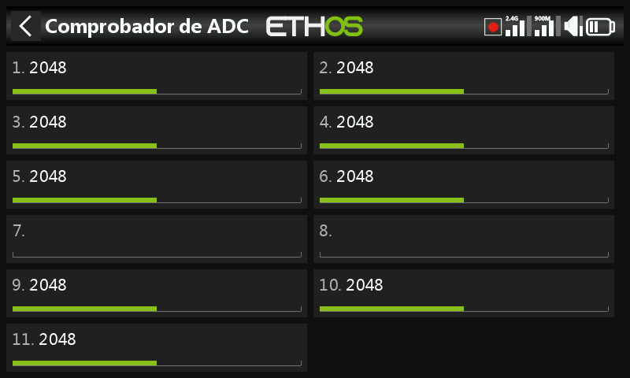

**X20S**: 1 stick izquierdo horizontal, 2 stick izquierdo vertical, 3 stick
derecho vertical, 4 stick derecho horizontal, 5 Pot 1, 6 Pot 2, 7 deslizador
central, 8 deslizador izquierdo, 9 deslizador derecho.

**X20 Pro**: igual que lo anterior, pero con dos canales adicionales de
potenciómetros externos (7 Ext1, 8 Ext2 — por ejemplo, potenciómetros
montados en los sticks) insertados antes de los deslizadores, que pasan a
ser 9 deslizador central, 10 deslizador izquierdo, 11 deslizador derecho.
