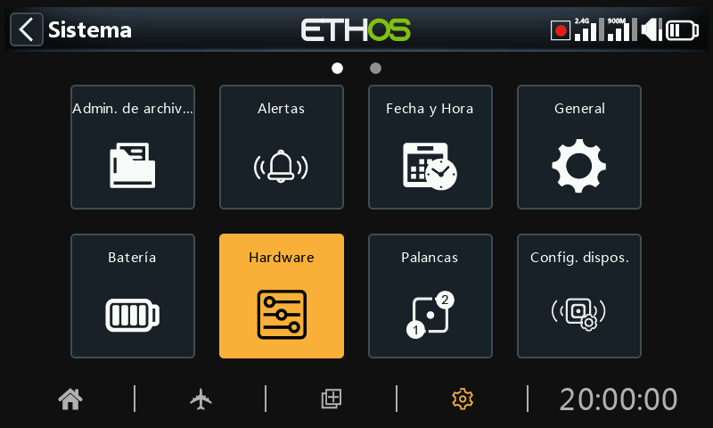
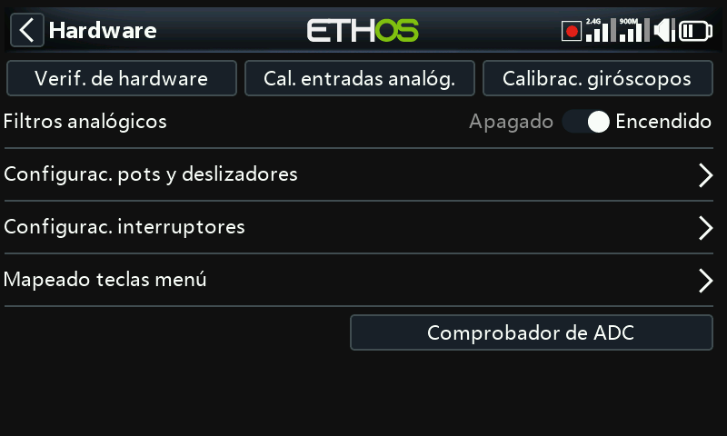
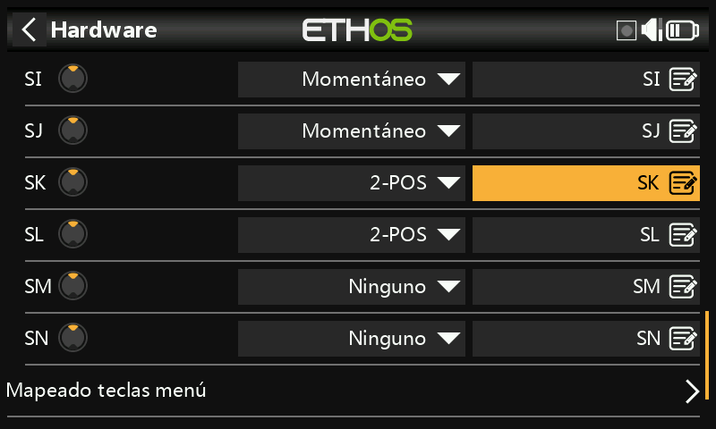
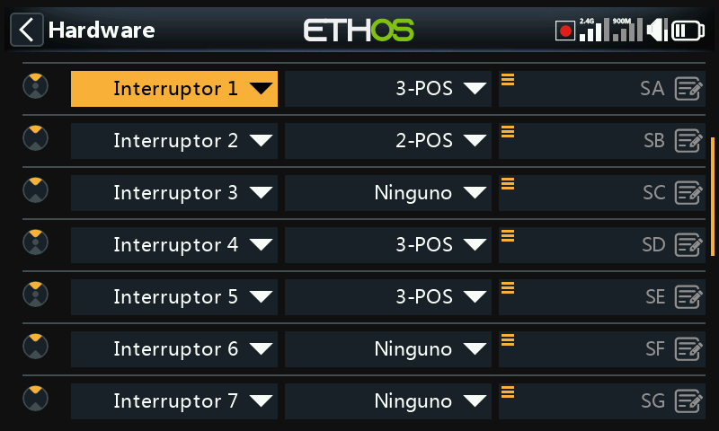
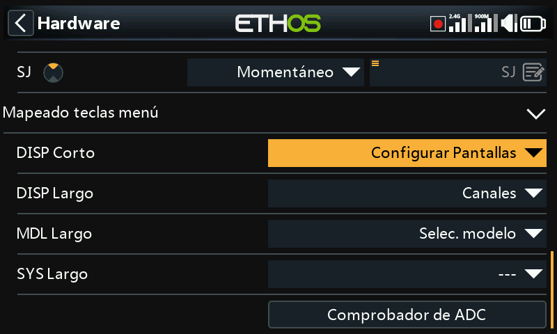
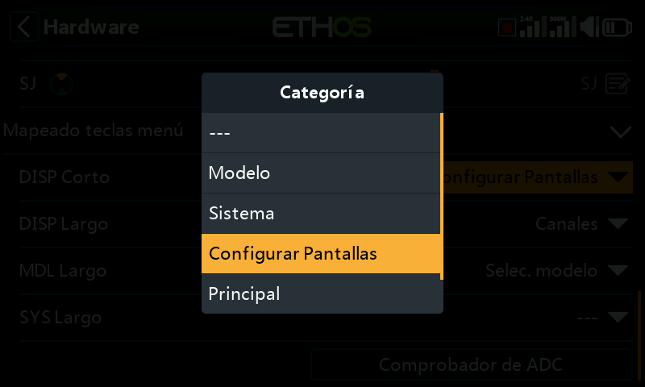
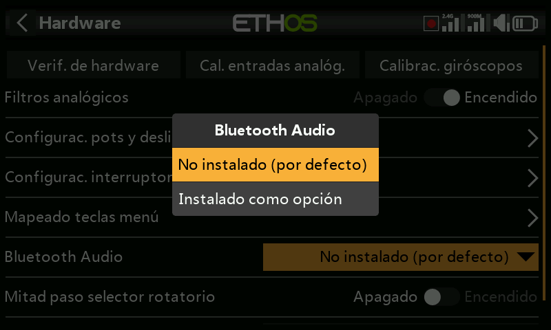

# Hardware

La sección Hardware se utiliza para probar todas las entradas, realizar la calibración analógica y del giróscopo, configurar los tipos de interruptor y definir el comportamiento de la tecla ‘Home’.

## Verificación de hardware

La verificación de hardware permite comprobar el funcionamiento de todas las entradas.

### X20 Pro/R/RS

La verificación del Hardware en las X20 Pro/R/RS incluye los dos botones instantáneos K y L situados en la parte trasera de los laterales, además de los dos compensadores adicionales T5 and T6.

### X18

Las radios X18 también tienen los dos compensadores adicionales T5 y T6.

## Calibración de analógicos

La calibración de analógicos se realiza para que la radio sepa exactamente dónde están los centros y límites de cada palanca, pot y deslizador. Se ejecuta automáticamente en el arranque inicial de la radio. Debe repetirse después de reemplazar un cardan, pot o un slider.

## Calibración de giróscopos

La calibración de los giróscopos puede realizarse de forma que las salidas del sensor giroscópico respondan correctamente a la inclinación de la radio. Por ejemplo, la posición "nivelada" de la radio sería el ángulo en el que normalmente el piloto sujeta la radio.

## Filtro analógico

El filtro del conversión analógico-digital puede activarse/desactivarse con este ajuste. El valor por defecto es ON, ya que suele mejorar el jitter alrededor del centro de la palanca. Cuando se hace en esta sección, es un ajuste global que afecta a todos los modelos. Además, hay opción de realizar esta calibración para cada modelo individualmente, dentro de la sección ‘Editar modelo’ en el punto [Filtro analógico](../model-setup/model-edit.md).

## Configuración de Pots/Sliders

Aquí se pueden dar nombres personalizados a los pots y a los sliders.

### X20 Pro/R/RS

Las X20 Pro/R/RS tienen la posibilidad de instalar dos pots adicionales: Ext1 and Ext2. Se suele utilizar esta opción cuando se instalan gimbals de tres ejes.

## Configuración de interruptores

### Retardo de detección del centro de un interruptor

Este ajuste garantiza que no se detecte la posición intermedia del interruptor en los interruptores de tres posiciones cuando el interruptor pasa de la posición superior a la inferior en un solo movimiento, y viceversa. Sólo se detectará cuando el interruptor se detenga en la posición central. El valor por defecto se ha cambiado a 0ms para adaptarse a los receptores estabilizados FrSky cuando son detectados automáticamente ('Self Check') en el canal CH12.

Los interruptores SA a SJ pueden definirse como:

- Ninguno
- Momentáneo
- 2 POS
- 3 POS

Esto permite el intercambio de los interruptores, por ejemplo, el interruptor momentáneo SH podría intercambiarse con el interruptor de 2 posiciones SF. Tenga en cuenta que puede que no sea posible sustituir un interruptor momentáneo o de 2 posiciones por un interruptor de 3 posiciones si el cableado de la radio no lo permite.

Los interruptores también pueden renombrarse desde los nombres predeterminados (desde SA hasta SJ) a nombres personalizados. Tenga en cuenta que estos nombres serán comunes en todos los modelos.

### X20 Pro

La X20 Pro dispone de dos interruptores momentáneos SK and SL en la parte trasera superior. Además, los interruptores de las posiciones M y N se pueden conectar a la placa principal. Se suelen usar como interruptores de fin de recorrido de las palancas.

### Sólo para la serie XE

En las radios serie XE, los interruptores están marcados de S1 a S14, los cuales por defecto se asignan de SA a SN en Ethos. Si se desea, las etiquetas de Ethos pueden cambiarse a S1 a S14 para reflejar las marcas en la radio, o cualquier otro nombre que se prefiera.  
  
Tenga en cuenta que debido a su capa adicional de abstracción, en Ethos cualquier interruptor puede asignarse a cualquier posición de interruptor.

## Mapeado teclas menú

Las teclas de inicio \[SYS\], \[MDL\] y \[DISP\] (TELE en los modelos antiguos) pueden reasignarse para adaptarlas a las necesidades del usuario.

### Tecla \[DISP\]

Para la tecla \[DISP\] las opciones de pulsación larga y corta se pueden reasignar a cualquier página de Modelo, de Sistema, en la página Configurar Pantallas, la tecla de Inicio o en la de registros de datos de vuelo. Por coherencia con la serie X10, la tecla \[DISP\_mantenida\] puede asignarse convencionalmente en la página Configurar Pantallas.

### Teclas \[SYS\] y \[MDL\]

Para las teclas \[SYS\] y \[MDL\] sólo se pueden reasignar las opciones de pulsación larga para reasignarse a cualquier página de Modelo, de Sistema, de la página Configurar Pantallas, la página de Inicio o a la de registros de datos de vuelo. Una pulsación corta le lleva a la sección Sistema o Modelo respectivamente.

## Opción audio Bluetooth (X20, X20R, X20RS)

Se puede añadir un módulo audio Bluetooth a las X20, X20R or X20RS para poder usar auriculares Bluetooth (por ejemplo). Esta opción se podrá habilitar sólo si el módulo está instalado.

Tenga en cuenta que este módulo no es plug and play, sino que se deben hacer soldaduras.

## Habilitar actualizaciones de vibración de gimbals  (X20 Pro y X20R)

Las X20 Pro AW y X20RS disponen de gimbals MC20R con pequeños motores de vibración para las palancas. Si los gimbals MC20R se han actualizado opcionalmente en las X20 Pro o X20R, puede seleccionarse aquí las opciones de vibración para los motores de cada una de las palancas. Vaya a la sección ‘[Seleccionar motores de vibración](#Select haptic motors)’ para más detalles sobre cómo configurarlos.

## Opción Mitad de paso del selector rotatorio (X20 Pro AW y X20R/RS)

Las radios X20 Pro AW y X20R/RS disponen de un selector rotatorio mejorado que es más sensible. Para reducir esa sensibilidad, se puede activar la opción de ‘half steps’para reducir esa sensibilidad.

## Comprobador de ADC

Muestra los valores de conversión analógico-digital (ADC) de las entradas analógicas leídas por la CPU.

1. Palanca izquierda horizontal
2. Palanca izquierda vertical
3. Palanca derecha vertical
4. Palanca derecha horizontal
5. Pot 1
6. Pot 2
7. Slider central
8. Slider izquierdo
9. Slider derecho

### X20 Pro

Para la X20 Pro, los valores (ADC) son:

1. Palanca izquierda horizontal
2. Palanca izquierda vertical
3. Palanca derecha vertical
4. Palanca derecha horizontal
5. Pot 1
6. Pot 2
7. Ext1 (pot externo, por ejemplo, montado en una palanca)
8. Ext1 (pot externo, por ejemplo, montado en una palanca)
9. Slider central
10. Slider izquierdo
11. Slider derecho
