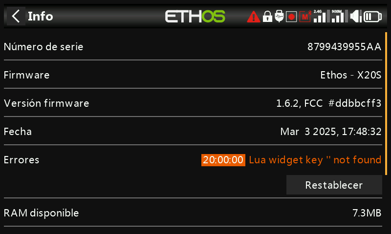

# Información

Detalles del firmware del sistema, tipo de gimbal, información de los módulos de RF interno/externo, información del receptor vinculado, tiempo de uso de la emisora, registros de errores y restablecimiento de fábrica.

## Información de la emisora

- **Número de serie** — el número de serie de la emisora.
- **Firmware** — versión de Ethos y tipo de emisora (p. ej. X20).
- **Versión de firmware** — variante de compilación, p. ej. FCC, LBT o Flex.
- **Fecha** — fecha/hora de compilación del firmware.
- **RAM disponible** — RAM libre del sistema, útil para detectar un
  script Lua que se comporta mal; también está disponible como [fuente](../getting-started/user-interface-and-navigation.md#choosing-a-source) del sistema,
  de modo que puede mostrarse en un widget.
- **Sticks** — versión de los sensores Hall del gimbal instalado (o «ADC» para gimbals
  analógicos).
- **Módulo interno** — versiones de hardware y firmware del módulo de RF
  interno.
- **Receptor** — datos del receptor vinculado actualmente, mostrados a continuación del
  módulo interno. Si un receptor redundante comparte la misma ranura que el
  principal, ambos se alternan en la pantalla (p. ej. un Archer SR10 Pro
  mostrado junto a su R9MM-OTA redundante bajo «Receiver1»).
- **Módulo externo** — datos de hardware/firmware de un módulo de RF externo
  FrSky instalado que utilice el protocolo ACCESS. Los módulos Multi-protocol
  no se muestran aquí.

## Tiempo de uso de la emisora

Registra el tiempo total de uso de la emisora; **Restablecer** lo pone a cero.

## Errores

Un triángulo rojo en la barra superior de la vista principal indica que Ethos ha registrado un error,
que se detalla aquí. Entre las causas se incluyen:

- **Errores de scripts Lua** — un problema en un script Lua en ejecución.
- **Error de copia de seguridad en RAM** — un modelo demasiado grande para la RAM de copia de seguridad de modelos. Ethos
  la amplió de 4K a 32K, por lo que ahora es poco probable que ocurra, pero si sucede,
  se trata de un error significativo: el modelo se carga más lentamente desde la tarjeta
  SD en lugar de desde la RAM de copia de seguridad si se activa el [Modo de
  emergencia](../getting-started/emergency-mode.md).
- **Uso de una compilación nightly del firmware** — un recordatorio de que las compilaciones nightly
  no están destinadas a volar.

**Restablecer** borra los errores registrados — práctico en plena sesión de depuración de Lua.

## Restablecimiento de fábrica

Devuelve la emisora a los ajustes de fábrica íntegramente desde el propio dispositivo — sin necesidad
de conexión a un PC.

!!! danger
    Al confirmar se borran **todos** los modelos, registros, capturas de pantalla, documentos,
    scripts, mapas de bits y ajustes de la emisora. Una barra de progreso muestra el avance del borrado,
    tras el cual se desmontan todas las unidades y la emisora se reinicia.

La página de información del X20 Pro/R/RS muestra la información equivalente para esa
familia de emisoras.
