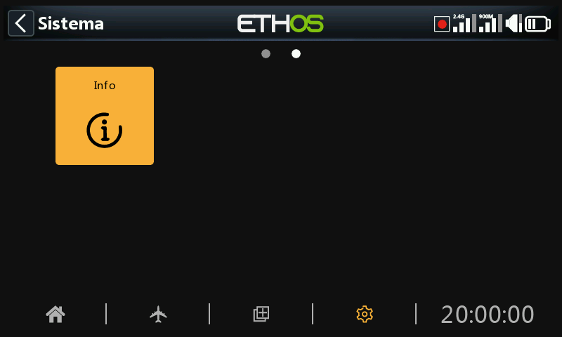
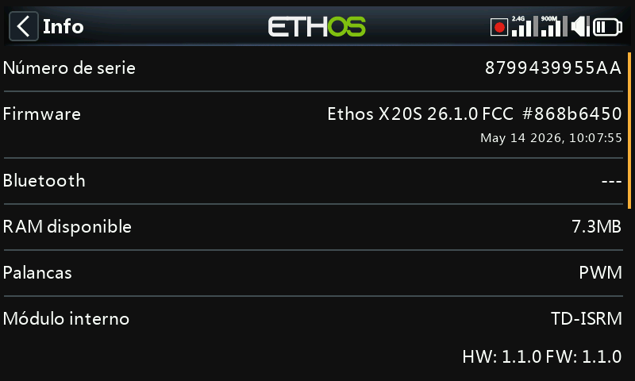
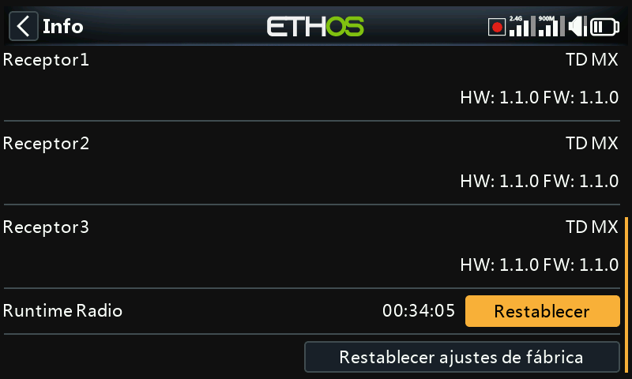
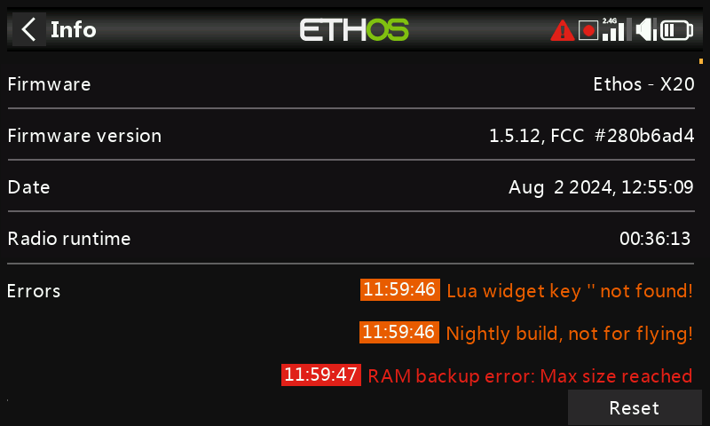
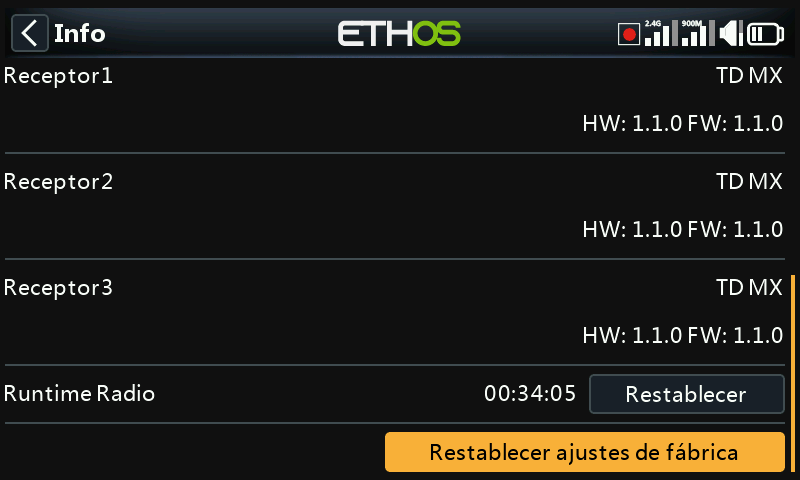
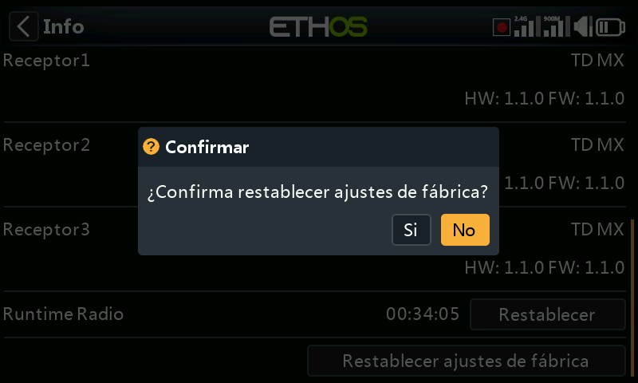
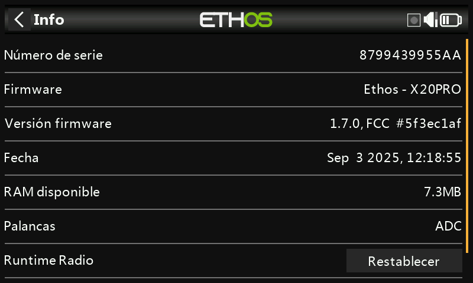

# Info

Esta página muestra la información del firmware del sistema, del tipo de gimbals, la versión de firmware del módulo interno, ACCESS, el firmware de los receptores TD o TW y la información de los módulos externos conectados.

## X18 y X20

### Número de serie

Número de serie de la radio.

### Firmware

Nombre del firmware (Ethos), y tipo de radio (por ejemplo, X20S).

### Versión del firmware

Versión actual del firmware y tipo (FCC, LBT, o Flex).

### Fecha

La fecha y hora del firmware.

### RAM disponible

Muestra la memoria RAM disponible. Esta información es muy útil para comprobar malos comportamientos de los Scrpts Lua. También está disponible como un Valor del Sistema, por lo que también se puede mostrar como un widget, por ejemplo.

### Palancas

La versión del gimbal Hall sensor instalada. ADC es para analógicos.

### Módulo interno

Detalla el módulo de RF interno de la radio, incluyendo las versiones de hardware y firmware.

### Receptor

Los detalles de los receptores vinculados se muestran a continuación del módulo RF interno. Si un receptor redundante se vincula al mismo hueco que el receptor principal, los detalles de ambos receptores de mostrarán alternativamente en la pantalla. En el ejemplo de arriba, se muestra en los detalles del Receptor 1 un Archer SR10 Pro que tiene redundante un R9MM-OTA.

### Radio runtime

Este cronómetro mide el tiempo total de uso del transmisor. Existe un botón de reseteo que le permite ajustar el tiempo a cero.

### Errores

Cuando ETHOS detecta un error, en la barra de arriba de la página principal aparecerá un icono rojo triangular. El panel de errores muestra cada uno de ellos.

Los errores pueden deberse a:

#### Errores de los scripts Lua

Cualquier problema relacionado con los Lua script puede resultar en mensajes de error.

#### Error en el backup de la RAM

Un modelo puede tener un tamaño tan grande que puede exceder su tamaño en la RAM. En ETHOS se ha ampliado la memoria para los modelos desde 4k a 32k, con lo que es improbable que ocurra. Este es un error grave que puede hacer que el modelo se cargue muy despacio cuando se entras en el modo de emergencia desde la SD en lugar que desde la copia en la RAM.

#### Errores de escritura de registros

Se genera una alerta de error al escribir los registros si la función especial "Escribir registros" encuentra problemas, probablemente debido a errores en la tarjeta SD.

#### Se está usando un firmware ‘nightly’

Si se está usando un firmware de tipo ‘nightly’, el icono de alerta sirve para recordarle al usuario que no debería volar ningún modelo con él.

Existe un botón de reseteo que borra todos los errores. Por ejemplo, durante las sesiones de depuración de los scripts Lua.

### Módulo Externo

Cuando la emisora tiene un módulo FRSKY externo de RF conectado, sus detalles se muestran aquí, incluyendo las versiones de hardware y firmware si siguen el protocolo ACCESS.

Los Multi módulos que estén conectados no aparecerán en esta pantalla.

### Restablecer ajustes de fábrica

Permite devolver la radio a sus ajustes de fábrica. No se necesita ninguna conexión de USB ni de PC. Todo se hace en la radio.

Cuando confirme que quiere volver a los valores de fábrica, la radio borrará todos los modelos, archivos logs, fotos de pantalla, documentos, scripts, bitmaps y los ajustes de la radio.

Durante el borrado de datos, aparecerá una barra de progreso. Cuando acabe, desmontará las dos particiones (Flash y SD) y reiniciará la emisora.

## X20 Pro/R/RS

Información similar aparecerá en la X20 Pro/R/RS.
