# Ejemplo básico de ala fija

Un recorrido completo para un avión con motor + 2 alerones + 2 flaps +
profundidad + timón, con un servo por superficie, construido de principio a fin
con el asistente. Complete primero la [Configuración inicial de la radio](initial-radio-setup.md).

## Paso 1. Confirme la configuración del sistema

Este ejemplo utiliza el orden de canales **AETR** por defecto.

## Paso 2. Identificar los servos/canales necesarios

La función [Mezclas](../model-setup/mixes.md) constituye el corazón de la radio:
hasta 100 canales de mezcla, normalmente con los números más bajos asignados a
los servos (ya que los números de canal se corresponden directamente con los
canales del receptor; el módulo de RF interno del X20 admite hasta 24 canales de
salida). Los canales superiores quedan libres para canales virtuales o canales
reales adicionales mediante varios módulos de RF y SBUS. Nuestro modelo:

| Función | Canales |
|---|---|
| Motor | 1 |
| Alerones | 2 |
| Flaps | 2 |
| Profundidad | 1 |
| Timón | 1 |

(El tren retráctil se añade más adelante, en el [Paso 10](#step-10-add-a-mix-for-retracts).)

## Paso 3. Crear un nuevo modelo

Desde [Seleccionar modelo](../model-setup/model-select.md), elija una categoría,
pulse sobre **+** e inicie el asistente **Avión**. Seleccione **Receptor no
estabilizado** para este ejemplo.

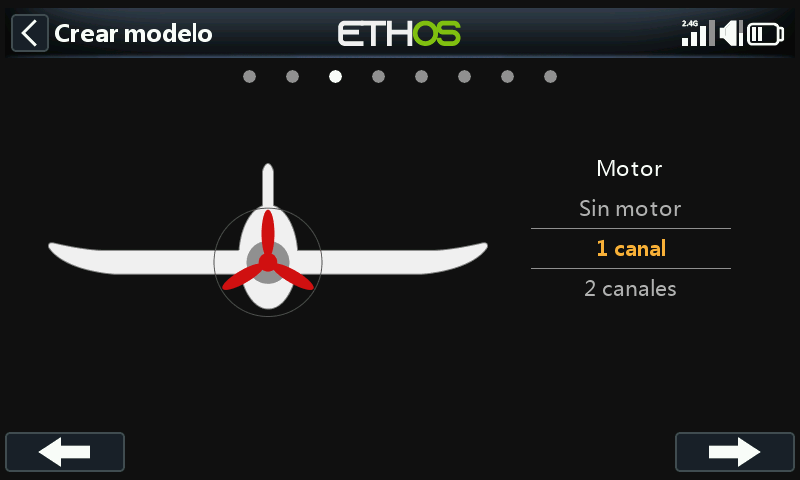
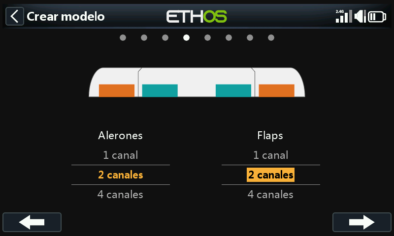

Acepte 1 canal de motor, después 2 canales de alerones y seleccione 2 canales de
flaps.

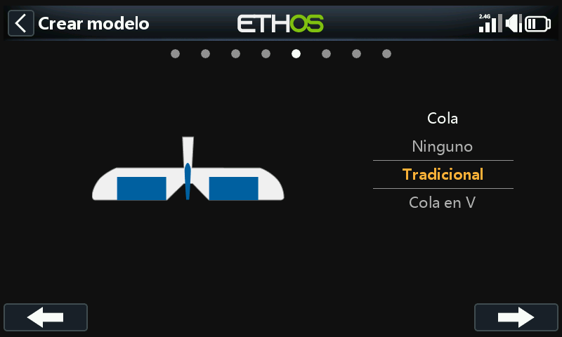
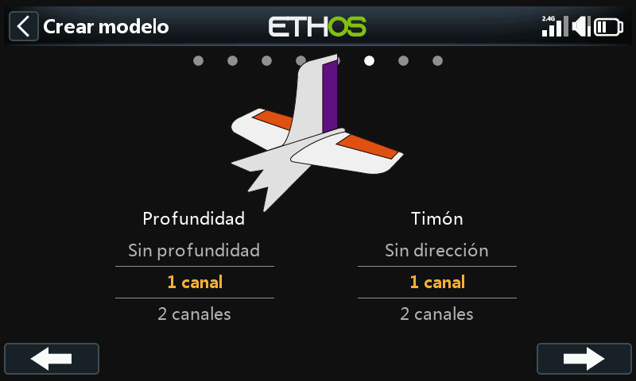

Acepte la opción por defecto **Cola tradicional**, con 1 canal de profundidad y
1 de timón.

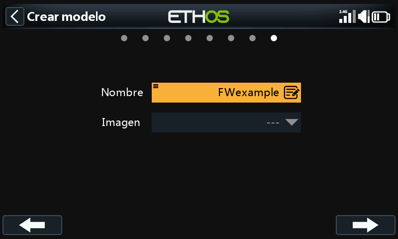
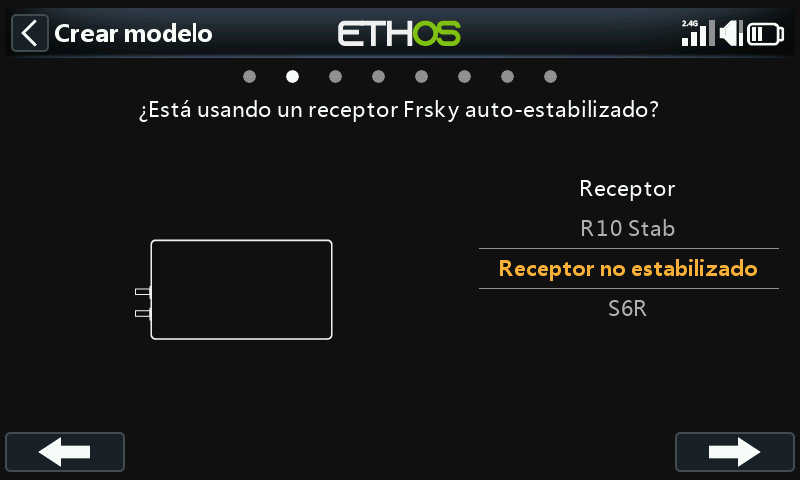

Defina un nombre (por ejemplo, "FWexample", hasta 15 caracteres), finalice el
asistente y pasará a ser el modelo activo, creado en la categoría Avión.

## Paso 4. Revisar y configurar las mezclas

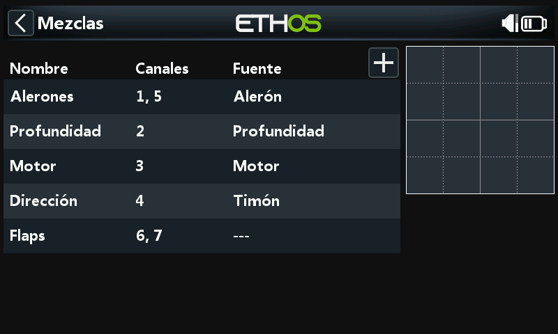

El asistente ya ha creado las mezclas de alerones (canales 1 y 5), profundidad,
acelerador, timón y flaps (los flaps muestran `---`: aún no tienen fuente
asignada).

### Alerones {: #ailerons }

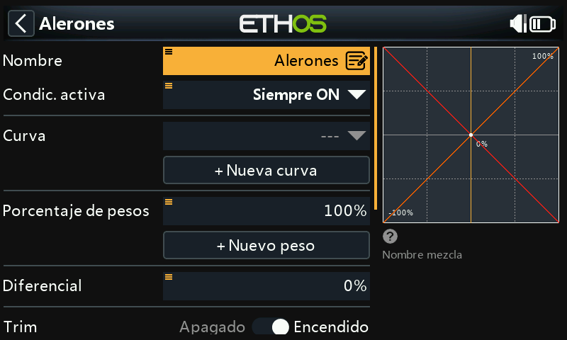
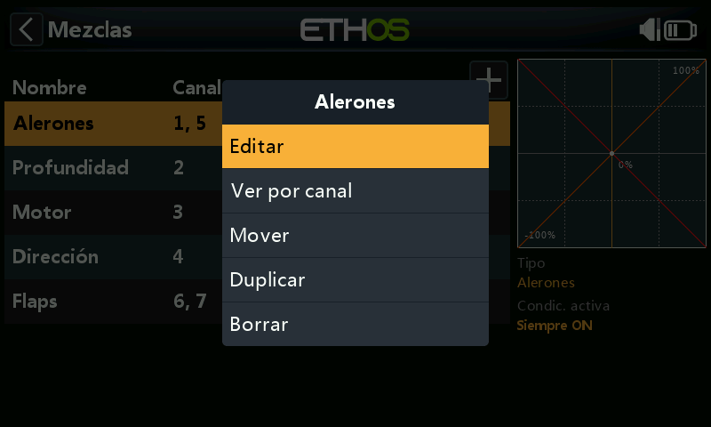

**Peso / Régimen de giro**: configure los regímenes de giro antes de volar algo
nuevo; un recorrido moderado (por ejemplo, 30%) es adecuado para vuelo
deportivo, y el 100% completo para 3D. Añada un régimen del 60% para el
interruptor SB en posición central y otro del 30% para SB abajo; el valor por
defecto (SB arriba) se mantiene al 100%:

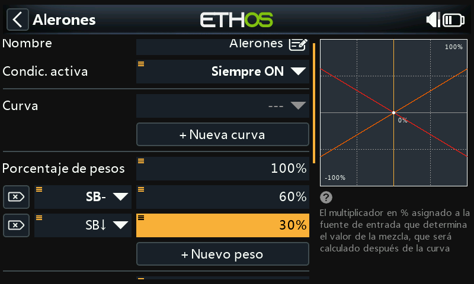

**Expo**: una respuesta lineal puede resultar demasiado brusca con las palancas
centradas; añada valores de Expo (por ejemplo, 60%/40%/20% en las mismas
posiciones de SB) para aplanar la respuesta en el centro del recorrido de las
palancas sin reducir la deflexión máxima:

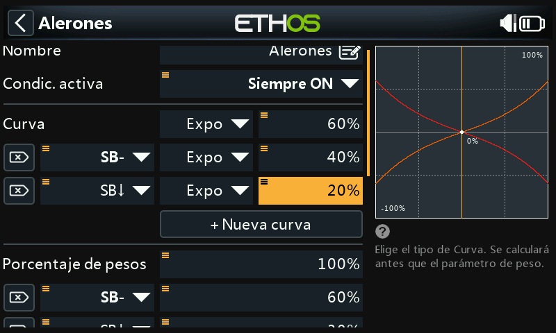

**Diferencial**: si los alerones se mueven hacia arriba y hacia abajo en la
misma cantidad, el alerón que se mueve hacia abajo causará más resistencia que
el que se mueve hacia arriba, haciendo que el modelo guiñe en la dirección
opuesta al giro ("guiñada adversa"). Un valor positivo en el ajuste del
diferencial (el 50% es habitual) provoca un menor movimiento descendente de los
alerones respecto al ascendente, contrarrestando este efecto:

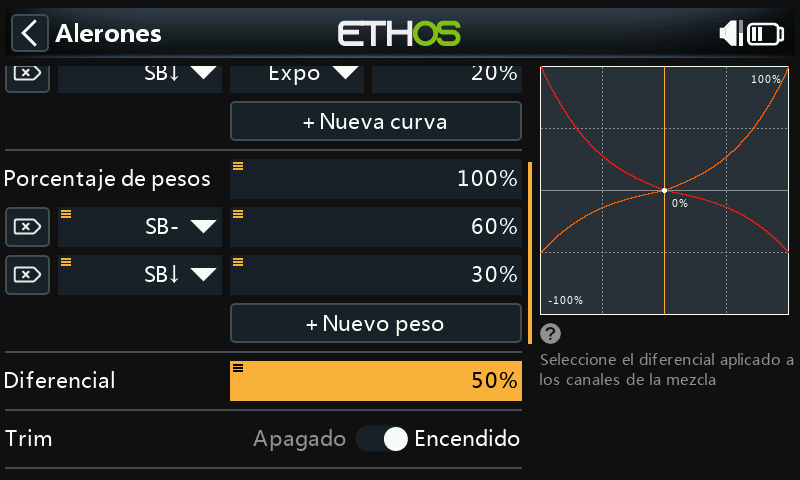

Para ajustar el diferencial en vuelo, mantenga pulsado `ENT` sobre el valor,
elija **Usar una fuente** y seleccione Pot1:

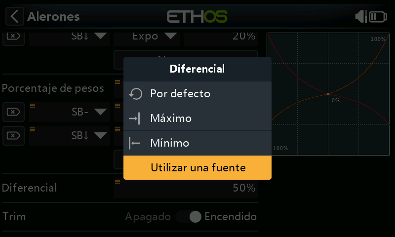
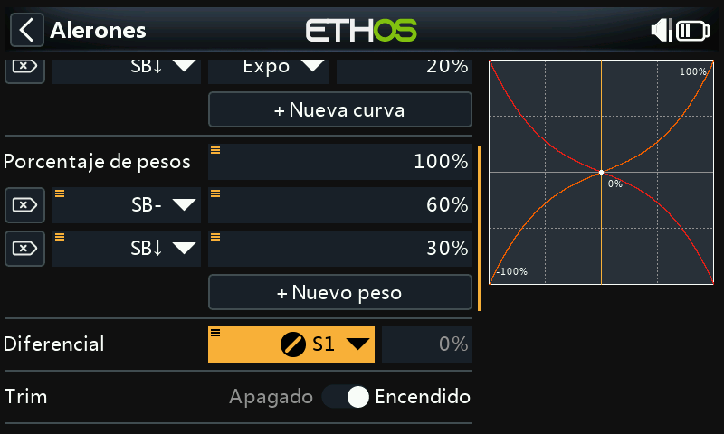

Cuando el valor obtenido en vuelo sea satisfactorio, mantenga pulsado de nuevo y
elija **Convertir a valor** para fijarlo de forma permanente:

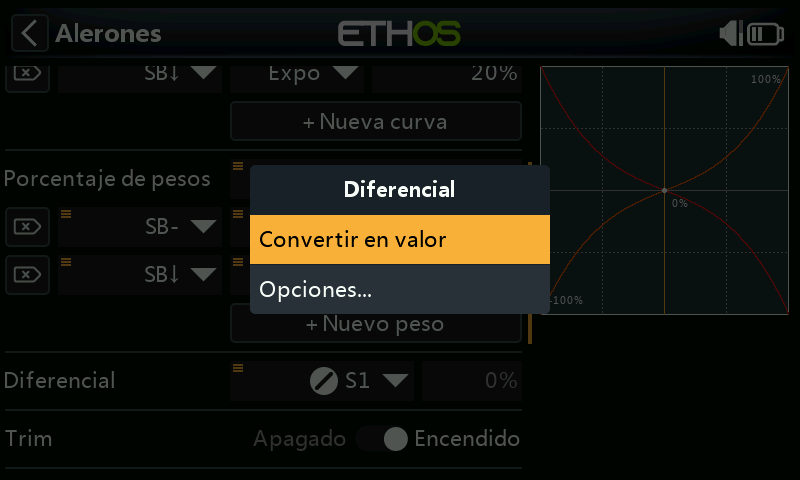

**Trim**: permite desvincular esta mezcla de su trim asociado sin desactivar el
propio trim, dejándolo libre para otro uso:

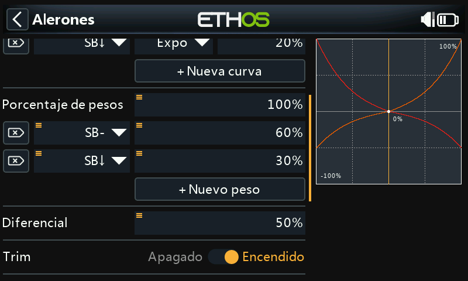

### Profundidad y timón

El mismo esquema de triple régimen de giro + Expo, en este caso sobre el
interruptor SC:

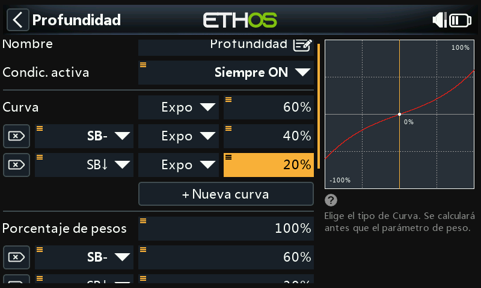

### Acelerador

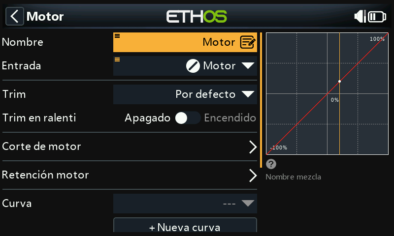

Deje la entrada en la palanca del acelerador (no se necesitan regímenes de giro
ni Expo), pero es imprescindible un interruptor de seguridad; un motor de
explosión o eléctrico que arranque de forma inesperada puede causar lesiones
graves.

**Trim en posición baja** (motores glow/gasolina): ajusta el ralentí de forma
independiente del acelerador a fondo:

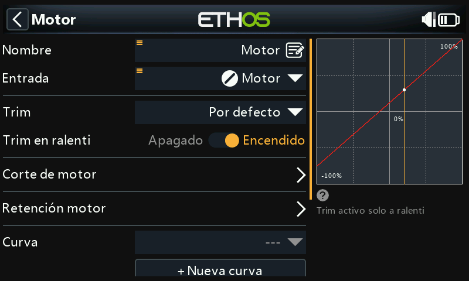

Con esta opción activada, el canal del acelerador se sitúa en −75% con la
palanca en ralentí; la palanca de trim del acelerador ajusta entonces el ralentí
entre −100% y −50%.

**Corte de motor (Throttle Cut)**: un enclavamiento de seguridad. Con el
interruptor SA abajo como condición activa (se muestra en negrita cuando está
activa), la salida del acelerador se mantiene en −100% en cuanto la palanca baja
de −85%:

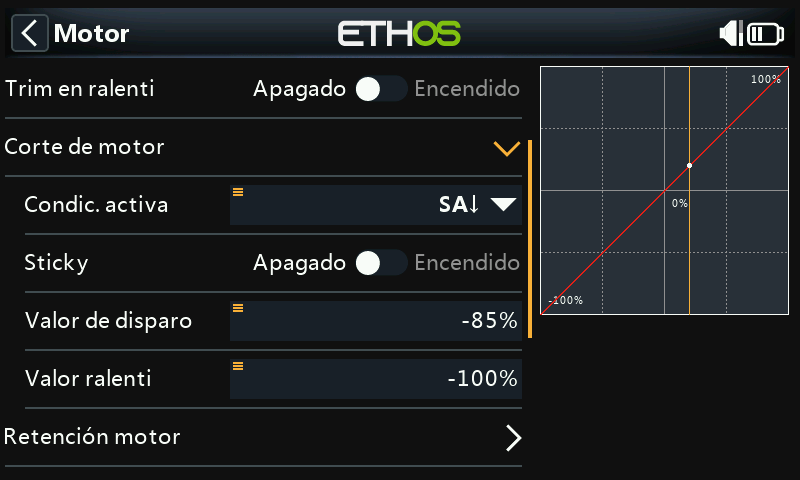

Con **Sticky** activado, en cambio, el acelerador se corta en el **instante** en
que SA se pone abajo, independientemente de la posición de la palanca:

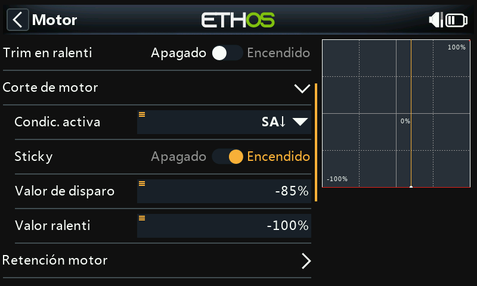

En cualquier caso, una vez que la condición activa desaparece, la palanca debe
volver por debajo de −85% antes de que el acelerador pueda aumentar de nuevo, lo
que evita que el motor salte a una posición de gas alto en el momento en que se
suelta el interruptor de corte.

**Throttle hold**: un corte de emergencia desde *cualquier* posición de la
palanca, que lleva la salida directamente a −100% (o a un valor configurado) en
el instante en que se cumple su condición:

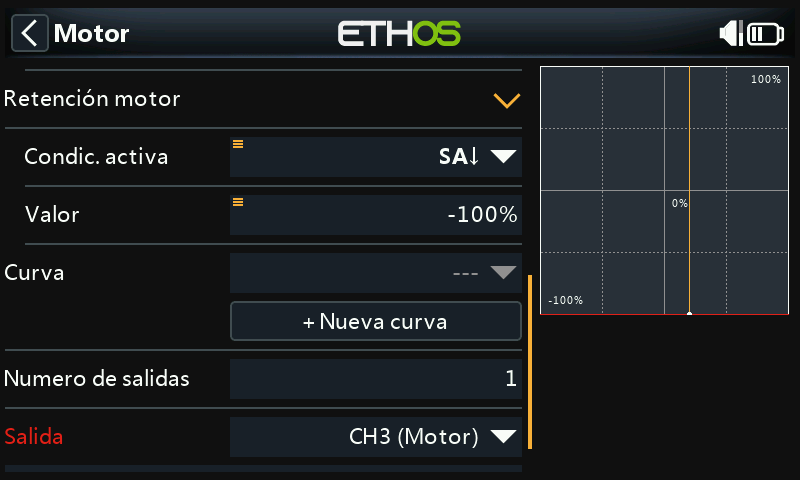

### Flaps

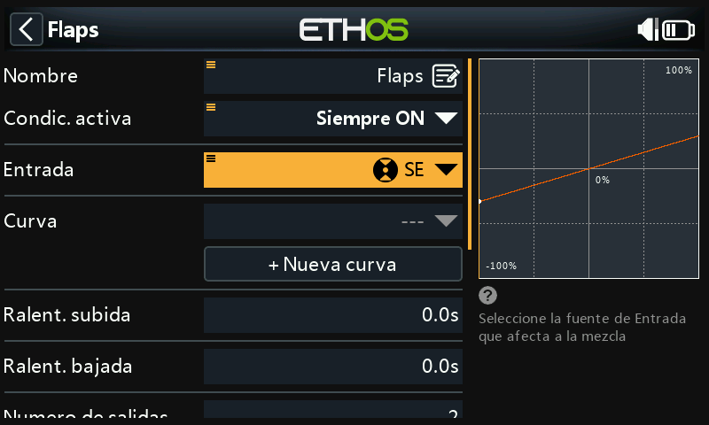

Asigne los flaps al interruptor SE y ajuste el peso de ambos canales de salida
al 100%:

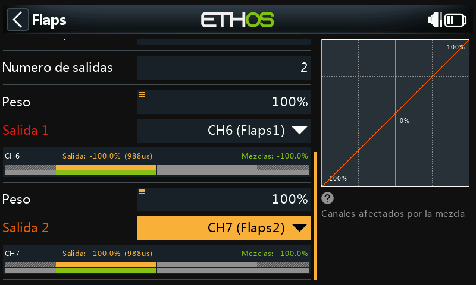

## Paso 5. Vincular el receptor

Use la función [Sistema RF](../model-setup/rf-system.md) para registrar (si su
receptor es ACCESS) y vincular su receptor. Antes de continuar con las Salidas,
para evitar daños inadvertidos a sus servos por exceso de movimiento, sería
inteligente desconectar los reenvíos o reducir temporalmente los movimientos de
los servos mientras ajusta los límites Min/Max.

## Paso 6. Configurar las salidas

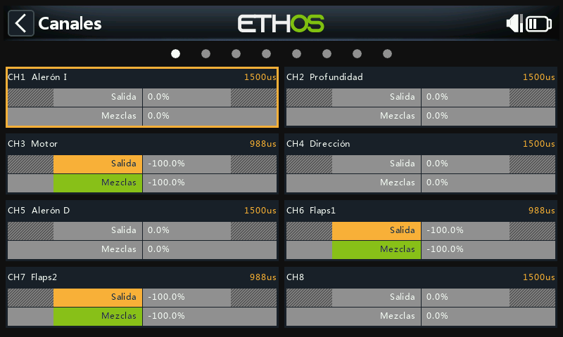

La función [Salidas](../model-setup/outputs.md) adapta la lógica del mezclador a
la mecánica real del modelo.

**Alerón 1**: centre el servo con el ajuste **Centro PWM** después de optimizar
el reenvío mecánico y, a continuación, ajuste **Min**/**Max**. Asignar
temporalmente un potenciómetro a Min (y después a Max, del mismo modo que en el
ejemplo del diferencial anterior) hace que el ajuste sea más rápido:

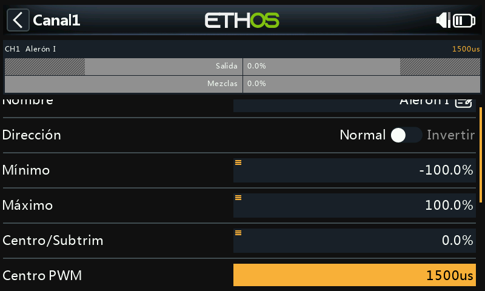

**Flaps**: los flaps suelen necesitar una gran deflexión hacia abajo para frenar
de forma efectiva; se sacrifica parte del recorrido hacia arriba en el reenvío
para conseguirlo, de modo que el flap quede a media bajada con el servo
centrado, y después se usan Min/Max para fijar las posiciones reales de arriba y
de bajada total. Una curva de 5 puntos es una forma habitual de corregir
cualquier desajuste resultante entre el recorrido de flaps y alerones. Termine
con **[Balancear canales](../model-setup/outputs.md#balance-channels)** para
sincronizar los alerones y flaps izquierdo y derecho.

## Paso 7. Introducción a los modos de vuelo

Los [modos de vuelo](../model-setup/flight-modes.md) permiten que un modelo
disponga de ajustes específicos para cada tarea, como si se cambiara de marcha.
De los 20 disponibles, este ejemplo utiliza tres: **Default**, **Flaps Half**
(interruptor SE en posición central) y **Flaps Full** (SE arriba). Está activo
el primer modo de vuelo cuya condición sea verdadera; el modo **Default** no
tiene ninguna condición y actúa siempre que ningún otro sea aplicable, razón por
la cual no dispone de opción de selección de interruptor. Un fundido de
entrada/salida de 1 segundo suaviza la transición al desplegar los flaps.

## Paso 8. Configurar los trims

Hay dos formas de gestionar la variación del trim de profundidad según la
posición de los flaps:

**Trims independientes por modo de vuelo**: la opción más sencilla; el trim de
profundidad pasa a ser totalmente independiente en cada modo de vuelo, y cambia
automáticamente al mover SE. Como cada modo se trima desde cero, el [Trim
instantáneo](../model-setup/trims.md#instant-trim) resulta útil: trime primero
para el vuelo normal, aterrice y utilice ese valor como punto de partida para
los modos con flaps.

**Trim base con offset**: se trima una vez en Default, y la compensación de
profundidad de cada modo con flaps se superpone como un offset:

1. Ajuste el **Paso** del trim a Medio (para un trimado inicial más rápido;
   redúzcalo después para el ajuste fino), el **Modo** a Personalizado y añada un
   nuevo comportamiento.
2. **Condición activa**: `FM1(Flaps Half)`, modo **Offset + Default**: el trim
   de Flaps Half pasa a ser el trim base más el offset que se introduzca
   mientras ese modo está activo:

   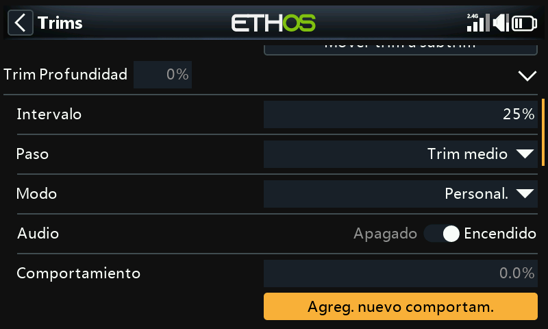
   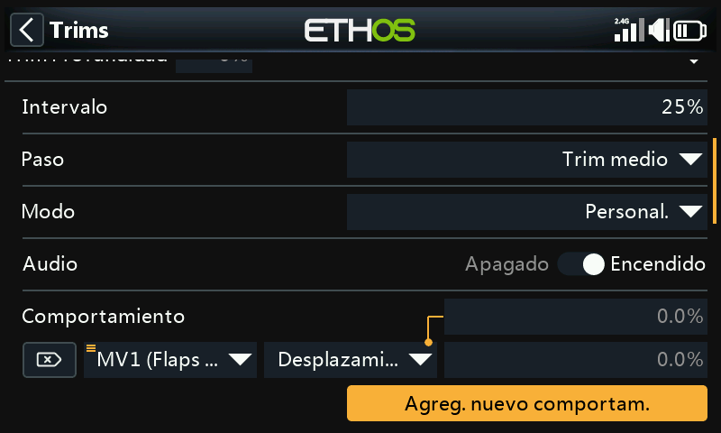

3. Repita el proceso para `FM2(Flaps Full)`:

   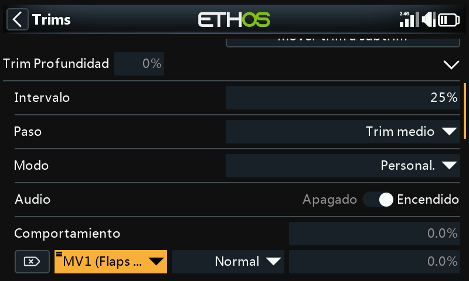
   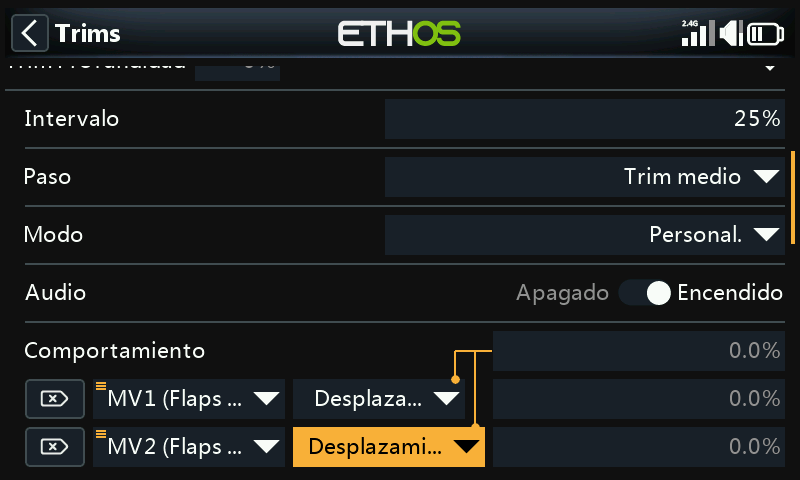

Ahora cada modo con flaps puede trimarse de forma independiente, pero si más
adelante se ajusta el trim base de Default (por ejemplo, para corregir la deriva
térmica de un servo), los trims de ambos modos con flaps se desplazan
automáticamente en la misma medida.

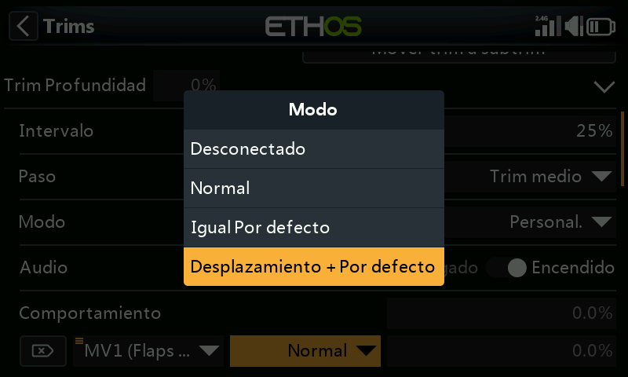

## Paso 9. Configurar un temporizador de batería de vuelo

En [Temporizadores](../model-setup/timers.md), edite el Temporizador 1: modo
**Descendente**, valor inicial de 5 minutos, en marcha siempre que **Acelerador
activo** sea verdadero (y no esté retenido en reinicio). Opcionalmente, asigne
una fuente de temporización proporcional (por ejemplo, la palanca del
acelerador) para que el temporizador avance a velocidad real con el acelerador a
fondo y se ralentice al reducir gas.

## Paso 10. Añadir una mezcla para el tren retráctil {: #step-10-add-a-mix-for-retracts }

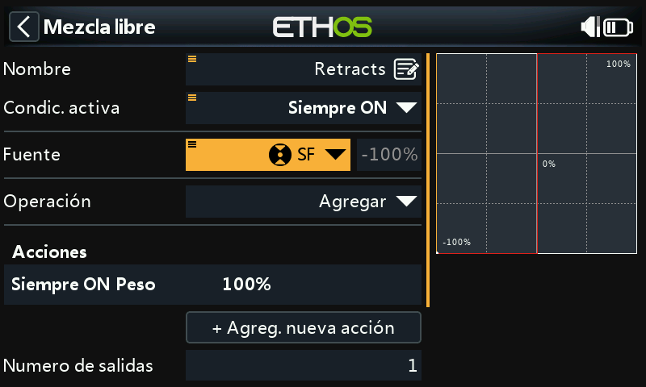

Pulse sobre una línea de mezcla, seleccione **Añadir Mezcla** → **Mezcla libre**,
asígnele el nombre "Retracts", establezca la condición en Siempre y la fuente en
el interruptor SF. La acción por defecto con Peso = 100% es adecuada; esto
asigna, por ejemplo, el canal 8 al tren retráctil:

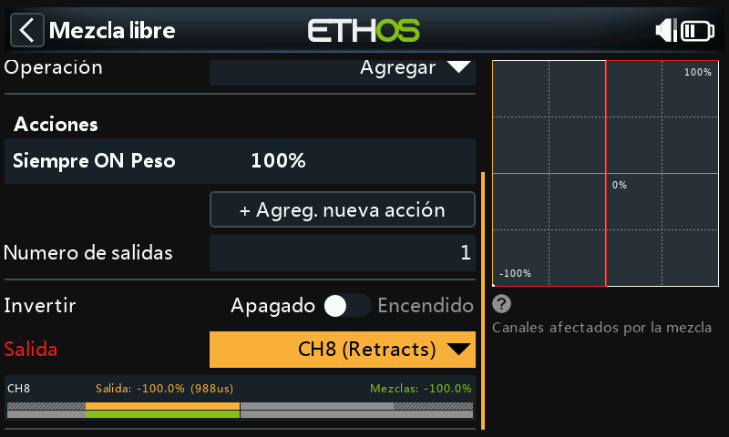
