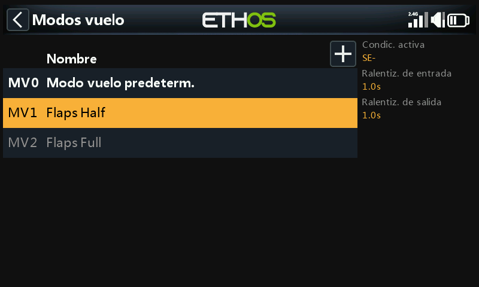
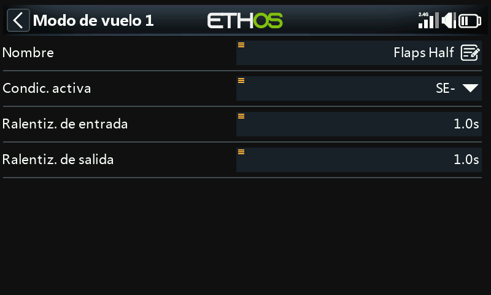
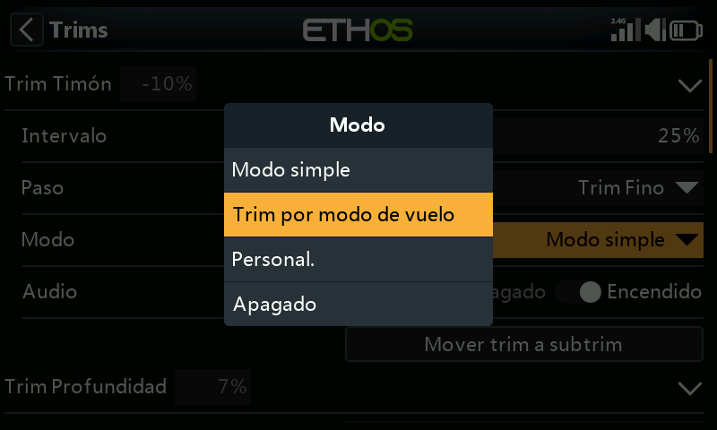
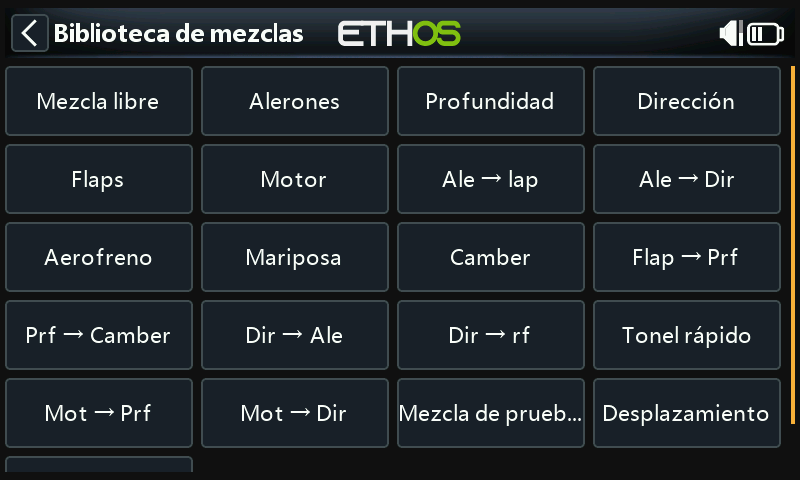

# Ejemplo básico para avión de ala fija

This simple fixed wing airplane example covers the configuration of a model having a motor, 2 ailerons (and optionally retracts and 2 flaps) and has a servo for each surface.

## Paso 1. Confirme la configuración del sistema

Comience por seguir el 'Ejemplo de configuración inicial de radio' anterior, que se utiliza para configurar las partes del hardware del sistema de radio que son comunes a todos los modelos. Para este ejemplo vamos a utilizar el orden de canales por defecto AETR (Alerón, Elevador, Acelerador, Timón).

## Paso 2. Identificar los servos/canales necesarios

La función Mezclas constituye el corazón de la radio. Permite combinar cualquiera de las muchas fuentes de entrada como se desee y asignarlas a cualquiera de los canales de salida. Ethos tiene 100 canales disponibles para programar su modelo. Normalmente los canales más bajos se asignarán a los servos, porque los números de canal se asignan directamente a los canales en el receptor. El módulo RF (Radio Frecuencia) interno de la X20 tiene hasta 24 canales de salida disponibles.

Los canales superiores de las mezclas pueden utilizarse como "canales virtuales" en una programación más avanzada, o como canales reales utilizando varios módulos RF (Interno + Externo) y SBus. El orden de los canales es una cuestión de preferencia personal, por normalización, o puede venir dictado por el receptor. Utilizaremos AETR para nuestro ejemplo.

Nuestro avión de ejemplo tiene los siguientes servos/canales:

- 1 motor
- 2 alerones

2 flaps

1 Elevador

1 imón

También añadiremos el tren retráctil más adelante.

## Paso 3. Crear un nuevo modelo.

Consulte la sección Configuración del modelo / [Seleción de modelo](../model-setup/model-select.md) para crear su nuevo modelo. Consulte también la sección Navegación por los menús para familiarizarse con la interfaz de usuario de la radio, de modo que pueda encontrar fácilmente las funciones que necesita.

Para este ejemplo, asumiremos que está usando un receptor estabilizado FrSky. Por favor, consulte la sección System / [Palancas](../system-setup/controls.md) y active el ajuste 'Primeros cuatro canales fijos' después de confirmar el Orden de Canales como AETR, para asegurarse de que el orden de canales creado por el asistente se adapta al receptor.

Pulse sobre la pestaña Modelo (icono de avión) y seleccione la función Seleccionar modelo. Para crear un nuevo modelo, seleccione la categoría del modelo que desea crear. A continuación, pulse sobre el icono '+', para empezar el asistente. (puede necesitar primero crear categorías de modelos. Vaya a la sección [Añadir un Nuevo Modelo](../model-setup/model-select.md) para más detalles).

Para nuestro ejemplo, pulse sobre el icono Avión para iniciar el asistente de creación del modelo.

El asistente incluye ajustes opcionales para incluir mezclas preestablecidas para los receptores Frsky estabilizados. En este ejemplo, elegiremos la opción ‘Non stabilized receiver’.

Acepta el valor por defecto de 1 canal para el motor.

Acepte los 2 canales por defecto para Alerones, y seleccione 2 canales para los Flaps.

Acepte los 2 canales por defecto para Alerones, y seleccione 2 canales para los Flaps.

Acepte por defecto 1 canal para profundidad y 1 canal para el Timón de dirección.

Llamaremos al modelo 'FWexample' y seguiremos el asistente hasta el final, lo que resulta en que el modelo 'FWexample' se crea en el grupo Avión. Tenga en cuenta que los nombres de los modelos pueden tener hasta 15 caracteres. También se convertirá en el modelo activo, por lo que podremos seguir configurando sus características.

## Paso 4. Revisar y configurar las ***m******ezcla******s***

Pulse sobre el icono de Mezclas para revisar las mezclas creadas por el asistente de Avión.

El asistente ha creado dos Alerones en los canales 1 y 5, seguidos de los canales profundidad, Acelerador, Timón y Flaps. Tenga en cuenta que en los flaps ‘---‘ significa que todavía no se les ha asignado ninguna superficie.

### Alerones

Para revisar la mezcla de Alerones, pulse sobre la línea Alerones y seleccione Editar en el menú emergente.

#### Peso/Régimen de giro

Es una buena idea configurar el porcentaje de giros en su modelo, especialmente si no lo ha volado antes. El régimen de giro establece la relación entre el movimiento de la palanca y el movimiento del servo asignado al canal. Por ejemplo, para el vuelo deportivo normalmente se quieren recorridos bastante modestos en las superficies de control, por lo que es posible que se desee reducir el recorrido a digamos 30%. Por otro lado, para el vuelo en 3D se quiere todo el recorrido que se pueda conseguir, es decir, el 100%.

Haga clic en "Añadir un nuevo peso", y establezca una tasa del 60% para el interruptor SB en la posición media. Añada un nuevo peso y ajústelo al 30% con el interruptor SB en la posición de abajo. ‘SB-’ aparecerá en negrita, lo que significa la posición que está activada. El eje vertical en el gráfico de la derecha muestra ahora que sólo el 60% del recorrido está disponible con el interruptor en la posición media. Tenag en cuenta que el recorrido será del 10% cuando el interruptor esté en la posición ‘arriba’.

#### Expo

En los ejemplos de regímenes de giro anteriores se puede ver que la respuesta de salida es lineal. Para evitar que la respuesta sea demasiado brusca en los centros de las palancas, puede utilizar una curva Expo para reducir el movimiento de la superficie de control en el centro del movimiento de las palancas y aumentarlo a medida que la palanca se va alejando del centro. Para este ejemplo hemos ajustado tres tasas Expo a 60%, 40% y 25% en las correspondientes posiciones del interruptor SB, y el gráfico muestra ahora una respuesta curva que es más plana con la palanca centrada.

#### Diferencial

Para los Alerones hay otro ajuste especial llamado Diferencial. Si los alerones izquierdo y derecho se mueven hacia arriba o hacia abajo en la misma cantidad, el alerón que se mueve hacia abajo causará más resistencia al avance que el alerón que se mueve hacia arriba, haciendo que el ala guiñe en la dirección opuesta al giro. Esto se conoce como guiñada adversa. Para reducirlo, un valor positivo en el ajuste Diferencial dará como resultado un menor movimiento descendente de los alerones, como puede verse en el gráfico. Esto reducirá la guiñada adversa y mejorará las características de giro y manejo. Un ajuste común del diferencial de los alerones es del 50%.

Sin embargo, puede asignarse el diferencial a un potenciómetro, lo que le permitirá optimizar el valor en vuelo. Mantenga pulsado \[Intro\] para abrir el cuadro de diálogo Opciones y selecciona "Usar una fuente".

Elija Pot S1 de la lista de fuentes. Puedes ver el efecto de Pot S1 en la curva de la derecha.

Después de optimizar el diferencial de los alerones en vuelo, puede convertir fácilmente el valor del potenciómetro en un ajuste permanente. Mantenga pulsada la tecla \[Enter\] para abrir el cuadro de diálogo Opciones y seleccione "Convertir a valor".

#### Compensador

Proporciona la capacidad de desconectar el compensador asociado a una mezcla sin inhabilitarlo, para que se pueda usar en otra parte.

### Profundidad y Timón de dirección

De forma similar a los Alerones, podemos configurar tres regímenes de giro y 3 exponenciales distintos para la Profundidad y el Timón de dirección con el interruptor SC.

### Acelerador

Para el acelerador dejaremos la Entrada en la palanca del acelerador. No necesitamos pesos ni exponencial, pero sí un interruptor de seguridad para que el motor no arranque inesperadamente. Esto es extremadamente importante, porque los motores de combustión y los eléctricos pueden causar lesiones graves o la muerte.

#### Compensación en posición baja

En el caso de los motores glow y gasolina, utilizamos el "ajuste de posición baja" para ajustar la velocidad de ralentí. La velocidad de ralentí puede variar dependiendo del clima, humedad, etc., por lo que tener una manera de ajustar la velocidad de ralentí sin afectar a la posición del acelerador a fondo es importante.

Si activamos la opción "trim en posición baja", el canal del acelerador pasa a una posición de ralentí del -75% cuando la palanca del acelerador está en la posición baja, como se muestra en el ejemplo de arriba. El compensador de la palanca del acelerador se puede utilizar para ajustar la velocidad de ralentí entre -100% y -50%. El corte del acelerador puede entonces configurarse para cortar el motor con un interruptor.

#### Corte de motor (Throttle cut)

El corte del acelerador proporciona un mecanismo de bloqueo de seguridad del acelerador. Una vez que la Condición Activa ha sido satisfecha en nuestro ejemplo, con el interruptor SA en la posición hacia abajo, la salida del acelerador se mantendrá en -100% una vez que el valor del acelerador caiga por debajo de -85%. (Compare el primer gráfico anterior con el segundo).

Sin embargo, si 'Sticky' está activado, entonces el acelerador se cortará en el instante en que el interruptor SA baje, como se muestra en el ejemplo de arriba.

Una vez que se ha eliminado la Condición Activa (es decir, el interruptor SA no está en la posición hacia abajo), la palanca o el mando del acelerador debe bajarse por debajo del -85% antes de que pueda aumentarse. Esto evita que el motor arranque inesperadamente en una posición alta del acelerador cuando se libera el corte del acelerador en el interruptor SA.

#### Retención del acelerador (Throttle hold)

La retención del acelerador se utiliza para cortar el motor en caso de emergencia desde cualquier posición del acelerador. Cuando se cumple la condición de Mantener Acelerador Activo, la salida del acelerador se reduce instantáneamente a -100% (o el valor introducido). Como puede verse en el gráfico anterior, la salida del acelerador se ha cortado al -100% aunque la palanca del acelerador esté por encima de la marca de la mitad).

### Flaps

En este ejemplo asignamos los flaps al interruptor SE,

También aumentamos los pesos de ambos canales de salida al 100%.

## Paso 5. ***Vincular el receptor***

Use la función [RF System](../model-setup/rf-system.md) para registrar (si su receptor es ACCESS) y vincular su receptor antes de configurar las salidas

Lea detenidamente la siguiente sección para configurar las salidas, antes de seguir adelante. Para evitar daños al hacer que sus servos giren demasiado, sería inteligente desconectar los reenvíos o reducir el recorrido de los servos, hasta que esté listo para configurar los límites máx./min de los servos.

## Paso 6. Configurar las salidas

La sección Salidas es la interfaz entre la "lógica" de la configuración y el mundo real con servos, conexiones con las superficies de control y los motores. Hasta ahora hemos configurado la lógica de lo que queremos que haga cada control. Ahora, podemos adaptarlo a las características mecánicas del modelo. Los distintos canales son salidas. Por ejemplo, CH1 corresponde al conector de servo #1 de tu receptor.

Pulse sobre el icono Salidas para configurar las Salidas.

Pulse sobre un canal de salida para configurarlo.

### Ejemplo 1: Alerón1

Comience ajustando los puntos centrales del servo utilizando el ajuste Centro PPM, después de optimizar las conexiones mecánicas.

Los límites del servo o canal pueden configurarse con los ajustes Mín y Máx, pero una forma fácil es usar una curva. En este ejemplo hemos definido una curva 'Ail1Lim' y la hemos asignado al canal Aileron1 (alerón izquierdo).

### Flaps

Tenga en cuenta que los Flaps normalmente requieren una gran cantidad de deflexión hacia abajo para un frenado efectivo. Para lograr esta gran deflexión hacia abajo, puede sacrificar parte de la deflexión hacia arriba al hacer los enlaces. Esto significa que los Flaps estarán en una posición medio bajada en el centro del servo. Los tres puntos de la curva se ajustan para conseguir las posiciones deseadas de flaps arriba, flaps a la mitad y flaps a tope.

Las curvas también pueden servir para corregir cualquier problema de respuesta en el mundo real, por ejemplo, para garantizar que los alerones y los flaps se ajusten entre sí correctamente. Normalmente se usa una curva de 5 puntos en uno de los lados, para conseguir que el recorrido se ajuste al menos en esos 5 puntos.

### Equilibrado de Canales

Finalmente, puede usarse la opción de equilibrado de canales en Salidas, para sincronizar los movimientos de las superficies izquierdas y derechas, como son los alerones y los flaps. Para ello vaya a la sección [Equilibrado de canales](#Balance channels).

## Paso 7. Introducción a los modos de vuelo

Los modos de vuelo son una buena manera de configurar un modelo para diferentes tareas. Por ejemplo, un planeador puede tener modos de vuelo distintos para crucero, velocidad, térmico, despegue y aterrizaje. Cada modo de vuelo puede recordar sus propios ajustes de compensación, así que una vez que hayas ajustado el planeador para volar bien en cada modo, ya no tendrás que estar cambiando el compensado durante el vuelo al cambiar de tarea. El interruptor de modo de vuelo se convierte en algo parecido al cambio de marchas en un coche. Los modos de vuelo a veces se llaman "Condiciones" en otros firmwares.

Para simplificar, este ejemplo sólo muestra la configuración de los modos de vuelo Normal, Flaps Half y Flaps Full.

Hay 20 modos de vuelo disponibles para su uso incluyendo el modo por defecto. El primer modo de vuelo que tiene su Condición Activa ON es el activo. Cuando ninguno tiene su Condición Activa ON, el modo por defecto está activo. Esto explica por qué el modo por defecto no tiene una opción de selección de interruptor.

Para nuestro ejemplo hemos configurado el modo de vuelo por defecto como Normal, y hemos añadido dos modos de vuelo adicionales llamados Flaps Half (interruptor SE-med) y Flaps Full (interruptor SE-Arriba).

En el caso de los flaps, es posible que desee ralentizar la transición entre los modos de vuelo. El ejemplo de arriba muestra tiempos de ralentización de entrada y salida de 1 segundo.

## Paso 8. Configurar los compensadores

### Opción – Compensadores independientes

A continuación, vamos a la sección Compensadores, y la primera opción es cambiar la palanca de profundidad para tener ‘Trims independientes por Modo de Vuelo’. Esto le permite tener una compensación independiente del elevador para los dos ajustes de flaps. El botón de compensado en profundidad cambiará automáticamente entre los ajustes a medida que operas los flaps en el interruptor SE.

Ya que los compensadores son ahora totalmente independientes, deberá compensar en profundidad para cada modo de vuelo como si fuera ‘desde cero’. Puede necesitar usar la característica de ‘Trim instantáneo’ para que le ayude en su primera compensación de vuelo normal, y después compensar para cada una de las posiciones de flaps. Podría también aterrizar después de compensar en un vuelo normal para transferir los valores de compensado a los del flap como valor inicial para esos modos.

### Opción – Compensado base con desplazamiento

Otra opción consiste en configurar los modos de flaps para que usen un compensado base con un desplazamiento para cada una de las posiciones de los flaps. De esta manera, puede compensar para vuelo normal en el modo de vuelo por defecto ‘MV0 por defecto’, y cuando active las posiciones de los flaps este compensado base se usará de nuevo, pero ahora añadiendo ajustes en elevación con un desplazamientodel compensado base.

Empezaremos ajustando el valor de los pasos de compensado a Trim Medio Medium, para que sea más fácil y rápido alcanzar el valor deseado de compensación. Después, podemos modificar el tamaño de los pasos para ajustes más finos.

A continuación, ajuste al modo personalizado y seleccione ‘Agreg, nuevo comportam.’.

Como ‘Condición activa’ seleccione modo de vuielo ‘MV1 Flaps medios’.

A continuación, seleccione modo ‘Desplazamiento + Por defecto’.

Hemos configurado el primer comportamiento. En Modo de vuelo 1 ‘MV1 Flaps Medios’ el valor de compensado se sumará al compensado base o al por defecto, sumándole el desplazamiento resultante de los ajustes hechos mientras se volaba en ‘MV1 Flaps Medios’.

Repita estas acciones para Modo de vuelo 2 ‘MV2 Flaps Abajo’.

La compensación en profundidad puede ahora ajustarse independientemente, tanto en la posición de Modos de vuelo de ‘Flaps Medios’ y de ‘Flaps Abajo’. Sin embargo, si el valor de compensado base o por defecto que se usa en ‘MV0 Por defecto’ se ajusta, se alterará en la misma cantidad el compensado de las posiciones de flaps. Esto puede ser útil si, por ejemplo, el compensado por defecto debe ajustarse debido a derivas térmicas.

## Paso 9. Configurar un cronómetro para la batería del avión

Pulse sobre Cronómetro 1 en la sección Modelo / Cronómetros, y seleccione Editar. En este ejemplo estamos configurando un cronómetro de cuenta atrás, con un Valor de Inicio de 5 minutos. La cuenta atrás funcionará cuando el evento de sistema ‘Throttle Active’ sea ‘Verdadero’, siempre y cuando no se esté manteniendo pulsado el restablecimiento.

Si se asigna una fuente proporcional de medida de tiempo, la velocidad del crono dependerá de la posición de la palanca de motor (por ejemplo). Con el motor al máximo, el crono contará en tiempo real, pero se ralentizará a medida que se reduzca la potencia del motor.

Vaya a la sección [Cronómetro cuenta-atrás](#Countdown timer) para detalles de cómo configurar los parámetros restantes del cronómetro.

Paso 10. Añadir una mezcla para tren retráctil

En la pantalla de mezclas (ver arriba) se pueden añadir nuevas mezclas tocando en el símbolo ‘+’ a la derecha del encabezado de las columnas.

Se abrirá la biblioteca de mezclas. Seleccione 'Mezcla libre'.

Para este ejemplo nombre la Mezcla Libre como 'Retracts'. La mezcla puede estar siempre encendida, y la Fuente que se ha elegido es el interruptor SF.

La acción por defecto de la mezcla = 100% está bien.

En la mitad inferior de los ajustes de la Mezcla Libre se muestra que el canal 8 ha sido asignado al tren retráctil.
