# Ejemplo básico de helicóptero Flybarless

Este ejemplo básico de helicóptero flybarless cubre la configuración de un helicóptero básico usando un controlador FBL como puede ser el Spirit.

A diferencia de las aeronaves de ala fija con diedro, los helicópteros son intrínsecamente inestables y dependen de un controlador de vuelo que utiliza giróscopos y acelerómetros para producir un vuelo estable.

Los giróscopos, que miden la velocidad de rotación alrededor de un eje, y los acelerómetros, que detectan el movimiento y la velocidad para mantener un registro del movimiento y la orientación, son los principales contribuyentes a la determinación de la guiñada, el cabeceo y el balanceo para los cálculos de vuelo necesarios para un vuelo estable. La estabilidad se consigue mediante el uso de un algoritmo de software llamado ciclo de control Proporcional Integral Derivativo (PID). El ciclo del PID requiere un ajuste fino para conseguir un vuelo estable manteniendo la capacidad de respuesta y minimizando el sobre impulso. Los parámetros de ajuste dependen de las características físicas y eléctricas del helicóptero.

En este ejemplo sólo cubriremos el lado de programación de radio de la configuración del helicóptero. Debe consultar la documentación de la aplicación de configuración del FBL para el resto de la configuración. Se supone que el lector tiene un buen conocimiento de la tecnología y el funcionamiento del helicóptero.

**Atención.** Antes de comenzar, para evitar lesiones, asegúrese de que se han retirado las palas del rotor para poder realizar la configuración de forma segura.

## Paso 1. Confirme la configuración del sistema

Comience por seguir el "Ejemplo de configuración inicial de la radio" de más arriba, que se utiliza para configurar las partes del hardware del sistema de radio que son comunes a todos los modelos. Para este ejemplo estamos usando el orden de canales AETR (Alerón, Elevador, Acelerador, Timón), y el ajuste 'Primeros cuatro canales fijos' debe estar en 'OFF'.

Utilice la función [Sistema RF](../model-setup/rf-system.md) para registrar (si su receptor es ACCESS) y vincular su receptor como preparación para configurar el modelo.

## Paso 2. Identificar los servos/canales necesarios

La función Mezclas constituye el corazón de la radio. Permite combinar cualquiera de las muchas fuentes de entrada como se desee y asignarlas a cualquiera de los canales de salida.

Nuestro ejemplo de helicóptero tiene los siguientes servos/canales:

1 x roll (alerón)

1 x paso (elevador)

1 x acelerador

1 x guiñada (timón)

1 x ganancia giroscópica

1 x paso del colectivo

1 x banco de ajustes

1 x rescate

## Paso 3. Crear un nuevo modelo.

Consulte la sección Configuración del modelo / [Seleccionar modelo](../model-setup/model-select.md) para crear su nuevo modelo. Consulte también la sección Navegación por los menús para familiarizarse con la interfaz de usuario de la radio, de modo que pueda encontrar fácilmente las funciones que necesita.

Consulte la sección Sistema / [Sticks](../system-setup/controls.md) y confirme que el orden de los canales es AETR, y establezca el ajuste "Primeros cuatro canales fijos" en "OFF" para asegurarse de que el orden de los canales creado por el asistente se adapta a la unidad FBL. Las unidades FBL de Spirit esperan que los canales SBUS estén en este orden, a pesar de utilizar TAER en su configuración.

Pulse sobre la pestaña Modelo (Icono Avión), y seleccione la función Seleccionar Modelo. Cree una categoría Heli si no está ya presente y selecciónela. Pulse sobre el símbolo '+', que le presentará una selección de asistentes de creación de modelos: Avión, Planeador, Heli, Multirotor u Otro. El asistente toma su selección y crea las líneas del Mezcla necesarias para implementar la funcionalidad requerida.

En nuestro ejemplo, pulse sobre el icono Heli para iniciar el asistente de creación de modelos.

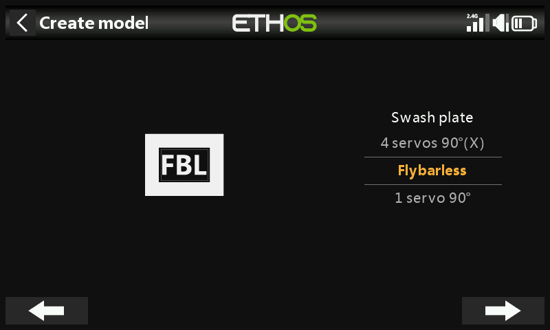

Seleccione Flybarless.

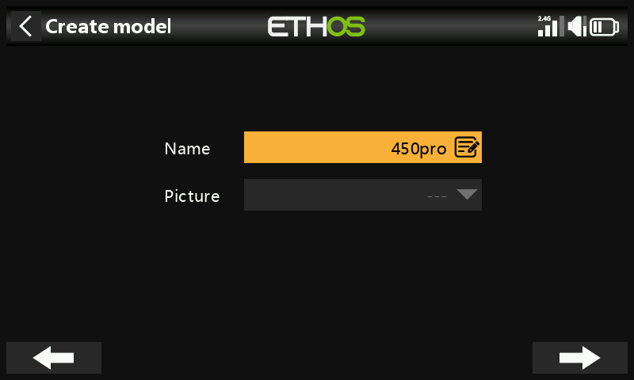

Defina un nombre y una imagen para su modelo.

## Paso 4. Revisar y configurar las mezclas

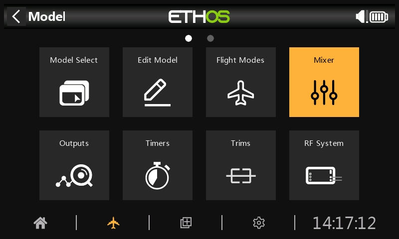

Pulse sobre el icono Mezclas para revisar las mezclas creadas por el asistente Heli.

El asistente ha creado Alerones, profundidad, Acelerador y Timón en la secuencia AETR como se esperaba, y ha creado Paso en el canal 6 y Bank en el canal 7.

El Paso del colectivo está normalmente en el canal 6. Confirme que está en el canal 6:

| ch6 | Paso del colectivo |
| --- | --- |
| ch7 | FBL Bank |

También necesitamos añadir mezclas adicionales para Ganacia Gyro, y Rescate/Estabi. Toque en el simbolo '+' en el encabezado para añadir los canales adicionales necesarios para Mezclas Libres:

| ch5 | Gyro Gain |
| --- | --- |

| ch8 | Rescue / Stabi |
| --- | --- |

### Revise Alerón / Profundidad / Timón

No es necesario añadir nada en estos canales. Tenga en cuenta que los ajustes tales como regímenes de giro y expo son manejados por la unidad FBL, por lo que la radio sólo pasa las entradas de control lineal a la unidad FBL.

### Configurar la ganancia del giróscopo

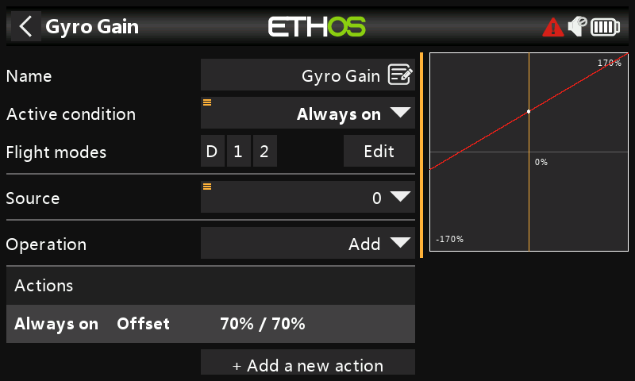

La Ganancia del Giróscopo es típicamente un valor fijo, por lo que establecemos la Fuente a Valor Especial - 0, y luego marcamos el valor de ganancia requerido usando Offset. El valor final de ganancia puede necesitar ser determinado en vuelo. Asigne el canal de Salida a 5.

### Configurar el paso del Colectivo

El Paso del Colectivo es simplemente una curva lineal en línea recta, por lo que sólo es necesario asignar el canal de Salida a 6. Tenga en cuenta que la unidad FBL se encarga de cosas como las tasas y la expo, por lo que el transmisor sólo envía entradas "limpias".

### Configurar los modos de vuelo

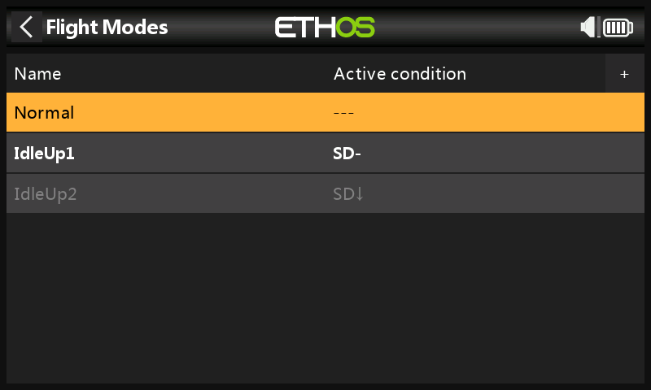

Usaremos Modos de Vuelo para configurar los tres modos de vuelo necesarios para vuelo Normal, Ralentí 1 y Ralentí 2. Para nuestro ejemplo hemos renombrado el Modo de Vuelo por Defecto a 'Normal', y hemos añadido dos modos de vuelo adicionales para Ralentí 1 y 2 en el interruptor SD.

### Configurar las mezclas del acelerador

El canal de aceleración será controlado por tres curvas de aceleración para los tres modos de vuelo, es decir, Normal, Ralentí 1 y Ralentí 2.

#### Curva en modo normal

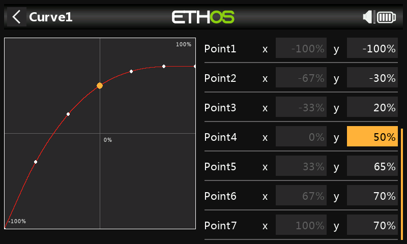

El modo normal se utiliza para el acelerado de la hélice (spool up) y el despegue, por lo que la curva comienza en -100% (motor apagado) y luego aumenta suavemente para el despegue. Los valores finales de la curva pueden necesitar ser determinados en vuelo.

#### Curva de ralentí 1

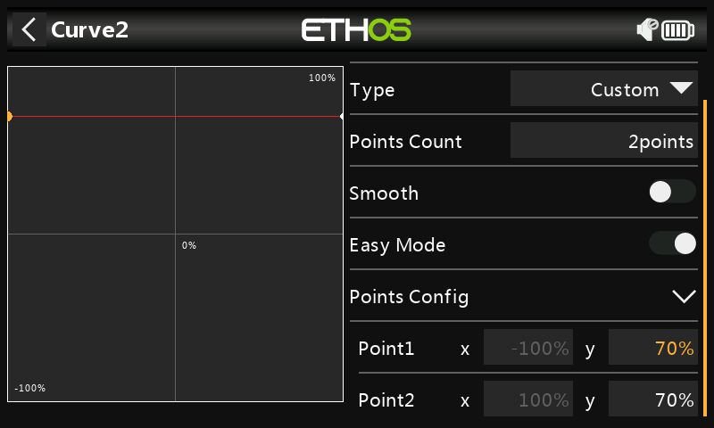

El ralentí 1 se utiliza para la mayoría de los vuelos. La curva en línea recta significa que tendremos un ajuste constante del acelerador para mantener los rotores girando a un ritmo constante. El valor final del acelerador puede necesitar ser determinado en vuelo. El movimiento del helicóptero será controlado por los mandos de Paso Colectivo, Alerón (roll) y Profundidad (pitch).

Tenga en cuenta que no debe haber un gran salto entre Normal y Ralentí 1, para que la transición se produzca suavemente.

También debe tener en cuenta que la mayoría de las unidades FBL ofrecen una función de regulación que garantiza que la velocidad del rotor se mantenga constante incluso durante maniobras de vuelo agresivas. Consulte el manual del FBL del Spirit para obtener más información.

#### Curva de ralentí 2

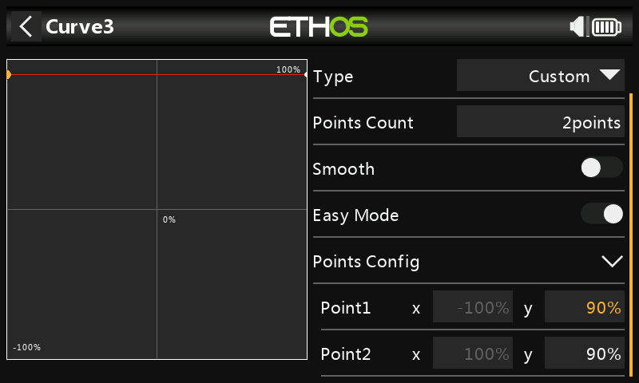

El ralentí 2 se utiliza para vuelos más agresivos. Por ejemplo, para acrobacias aéreas y 3D. Puede ser necesario determinar el valor final del acelerador en vuelo.

#### Configuración de las mezclar del motor

##### Curvas del acelerador

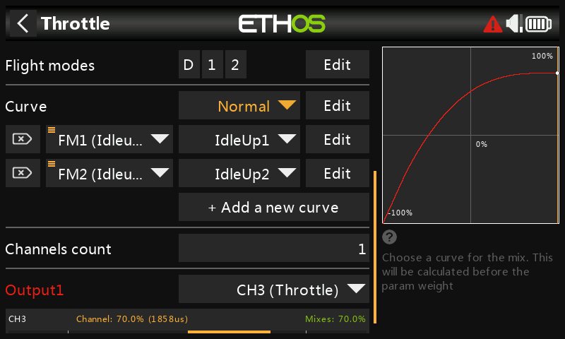

Ahora podemos configurar la mezcla del acelerador para las tres curvas de aceleración, controladas por los modos de vuelo.

##### Corte de motor (Throttle Cut)

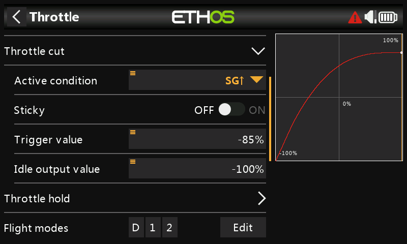

Si asignamos el interruptor SG-up a la función de Corte de Motor y su Sticky en 'ON', entonces el motor se cortará tan pronto como pongas el interruptor en la posición 'Arriba'. Sin embargo, debido a la configuración Sticky el acelerador sólo puede ser armado con la palanca del acelerador en la posición baja (off).

### Configurar la mezcla de los bancos FBL

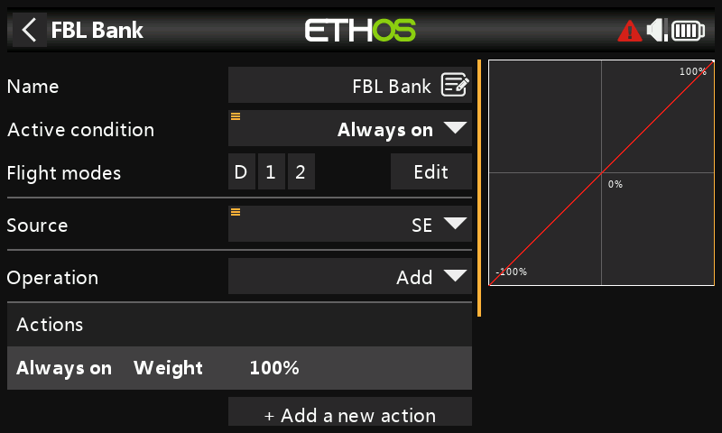

La unidad FBL del Spirit dispone de tres bancos de ajustes que se pueden utilizar para establecer diferentes configuraciones. El cambio de banco es ideal para cambiar entre estilos de vuelo, diferentes ganancias del sensor para bajas o altas RPM, o para Principiante, Acro o 3D. Alternativamente, se puede utilizar sólo para afinar la configuración.

Asignaremos la mezcla al interruptor de 3 posiciones SE.

### Configurar la mezcla Rescate / Estabi

De forma similar, la mezcla de Rescate se puede asignar, por ejemplo, al conmutador SA.

## Step 5. Configuración del FBL

### Instalar la herramienta de configuración del ***FBL***

Comience por instalar el software Spirit Settings en su PC.

### Conecte su receptor a la unidad ***FBL***

Conecte el receptor a la unidad FBL de acuerdo con la sección de cableado del manual de FBL. La salida ‘SBUS Out’ del receptor debe conectarse al puerto ‘RUD’ de la unidad FBL (tenga en cuenta que algunos modelos Spirit requieren un adaptador SBUS). Alternativamente, puede conectarse utilizando el puerto F.Port 1 (se espera que el puerto F.Port 2/FBUS sea compatible en breve). Alternativamente, puede conectarse usando F.Port 1 o FBUS.

### Conecte el ***FBL*** ***con su*** ***PC***

Conecte su PC a la unidad FBL de acuerdo con la sección Configuración del manual de Spirit FBL, ya sea mediante el cable suministrado o a través de Bluetooth.

Establezca una conexión válida con su unidad FBL. Ahora está listo para configurar la programación de radio de su helicóptero. Como ya se ha indicado, debe consultar la documentación de configuración del FNL del Spirit en el manual para completar la configuración restante.

**¡Atención!** ¡No conecte ningún servo todavía!

### Compruebe la versión del firmware del FBL

Si es necesario, actualice el firmware del FBL a la última versión (consulte la pestaña Actualizar de la herramienta Configuración de Spirit).

### Configuración general

Consulte la pestaña General del software de configuración de Spirit.

- Ajuste el tipo de receptor a 'Futaba SBUS' o 'FrSky F.Port' (según corresponda) y reinicie el sistema.
- Haga clic en el botón 'Canales' para ir al diálogo de asignación de canales del receptor. Si utilizó el orden de canales AETR en el asistente Heli podrá asignar los canales de la siguiente manera:

| Acelerador | ch1 |
| --- | --- |
| Alerón | ch2 |
| Elevador | ch3 |
| Timón | ch4 |
| Giróscopo | ch5 |
| Paso | ch6 |
| Banco | ch7 |
| Rescue/Stabi | ch8 |

El orden anterior de los canales se debe a que la unidad Spirit hace suposiciones sobre la posición de los canales en el flujo de datos SBUS.

### Límites de los canales

Consulte la pestaña Diagnóstico del software Configuración de Spirit.

Para que la unidad FBL funcione correctamente, es necesario calibrar los límites de los canales de radio y comprobar los centros.

En la radio, asegúrese de que todos los subtrims y trims están a cero. Ajuste su paso colectivo a la posición central de la palanca para dar una salida de 1500uS en la pantalla de salida. Ahora encienda la unidad FBL y compruebe que los canales de alerón, profundidad, cabeceo y timón están centrados al 0% en la pestaña de Diagnóstico. La unidad FBL detecta automáticamente la posición neutral durante cada inicialización.

Mueva los controles hasta sus límites y ajuste los valores de recorridos Mínimo y Máximo correspondientes en la página Salidas de cada canal para conseguir una lectura de +100% y 100% en la pestaña Diagnóstico. La dirección del movimiento de las barras también debe coincidir con la de las palancas. No utilice las funciones subtrim o trim de su emisora para estos canales, ya que la unidad Spirit FBL las considerará como un comando de entrada.

Ajuste el valor Offset en la mezcla Gyro Gain para asegurar que se consigue el Heading Lock.

Después de estos ajustes, todo debería estar configurado con respecto a la emisora. Ahora puede continuar con el resto de la configuración del FBL según el manual del Spirit FBL.
