# Ejemplo básico de helicóptero flybarless

Una configuración básica de helicóptero flybarless (FBL), tomando como
ejemplo una controladora como la Spirit. A diferencia de un modelo de ala
fija, un helicóptero es intrínsecamente inestable: la controladora FBL
utiliza giróscopos (velocidad de rotación) y acelerómetros
(movimiento/orientación) para calcular las correcciones de
guiñada/cabeceo/alabeo mediante un lazo de control PID
(Proporcional-Integral-Derivativo) ajustado, equilibrando estabilidad,
respuesta y sobreoscilación según las características físicas y eléctricas
del helicóptero concreto.

Este tutorial cubre únicamente la parte de **programación de la emisora**:
consulte la documentación propia de su unidad FBL para el resto, y aborde
este proceso disponiendo ya de buenos conocimientos generales sobre
helicópteros.

!!! danger
    Retire las palas del rotor antes de empezar, por seguridad.

## Paso 1. Comprobar los ajustes del sistema

Orden de canales **AETR**, **[Primeros cuatro canales
fijos](../system-setup/controls.md#first-four-channels-fixed)** en **OFF**:
las unidades FBL Spirit esperan los canales SBUS específicamente en este
orden (aunque internamente utilicen TAER en su propia configuración).
Registre (si es ACCESS) y vincule el receptor mediante [RF
System](../model-setup/rf-system.md).

## Paso 2. Identificar los servos/canales necesarios

| Función | Canal |
|---|---|
| Alabeo (alerones) | — |
| Cabeceo (profundidad) | — |
| Acelerador | — |
| Guiñada (dirección) | — |
| Ganancia del giróscopo | 5 |
| Paso colectivo | 6 |
| Banco de ajustes | 7 |
| Rescate | 8 |

## Paso 3. Crear un nuevo modelo

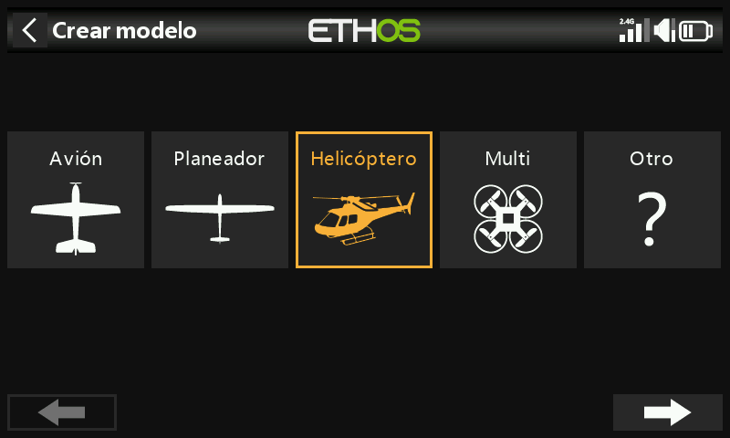

Desde [Selección de modelo](../model-setup/model-select.md), cree/seleccione
una categoría Heli, inicie el asistente y elija **Flybarless**:

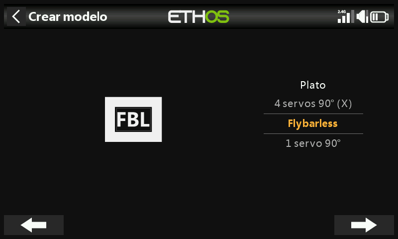
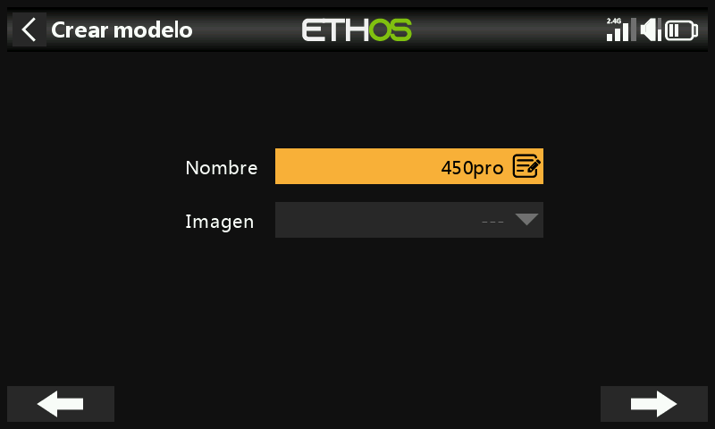

Asígnele un nombre y elija una imagen.

## Paso 4. Revisar y configurar las mezclas

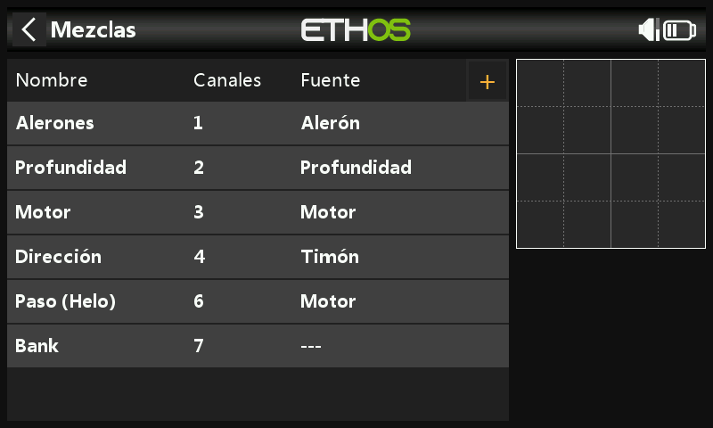

El asistente crea Alerones/Profundidad/Acelerador/Dirección en orden AETR,
Paso en el canal 6 y Banco FBL en el canal 7:

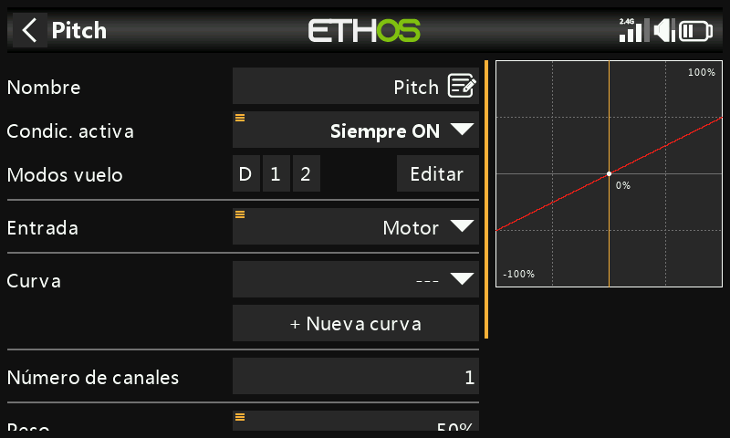

Compruebe que el canal 6 es el Paso colectivo. Es necesario añadir
manualmente dos canales más como [mezclas
libres](../model-setup/mixes.md#mix-libraries): **Ganancia del giróscopo**
(canal 5) y **Rescate/Stabi** (canal 8).

**Alerones/Profundidad/Dirección**: no hay nada que añadir; las tasas y el
Expo son tarea de la unidad FBL, así que la emisora simplemente transmite
una entrada lineal limpia.

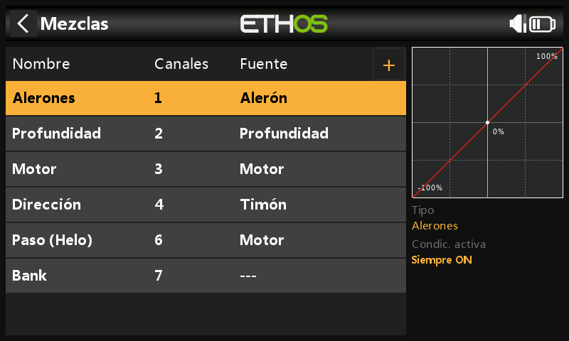

**Paso colectivo**: una curva lineal recta; solo hay que confirmar el canal
de salida (normalmente el 6). Como arriba, las tasas y el Expo los gestiona
la unidad FBL, no la emisora.

**Banco FBL**: los tres bancos de ajustes de la Spirit (distintos estilos
de vuelo, ganancias de sensor a distintas RPM, o Principiante/Acro/3D, o
simplemente preajustes de tuning) asignados a un interruptor de 3
posiciones, por ejemplo SE:

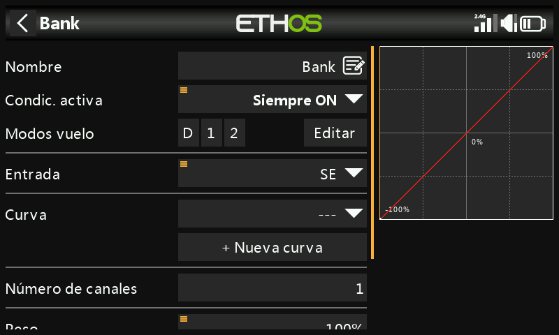

**Ganancia del giróscopo**: añádala como mezcla libre después del último
canal. La ganancia suele ser un valor fijo: ajuste la **Fuente** a Valor
especial 0, introduzca la ganancia mediante el **Offset** (afinándola más
tarde en vuelo) y envíe la salida al canal 5:

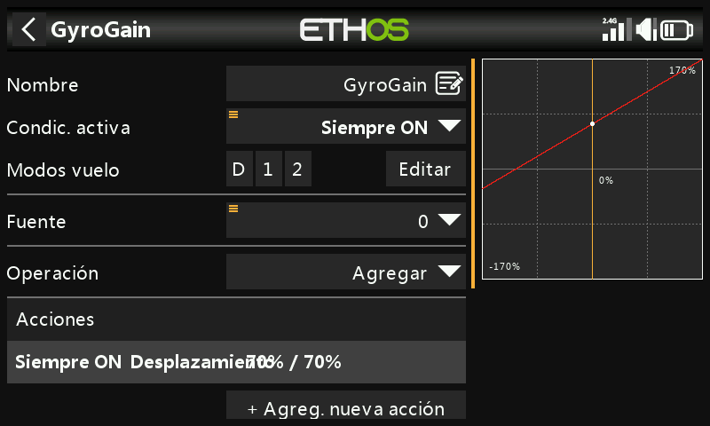

### Configurar las fases de vuelo

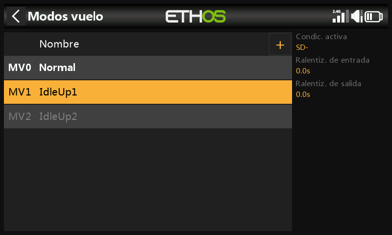

Tres [fases de vuelo](../model-setup/flight-modes.md): renombre la
predeterminada como **Normal** y añada **Idle Up 1**/**Idle Up 2** en el
interruptor SD.

### Configurar la mezcla del acelerador

Tres curvas de acelerador, una por fase de vuelo, cada una como [curva
personalizada](../model-setup/curves.md):

- **Normal**: arranque/despegue: comienza en −100 % (motor parado) y sube
  suavemente. Una curva de 7 puntos con **Smooth** activado funciona bien;
  los valores exactos requieren ajuste en vuelo.

  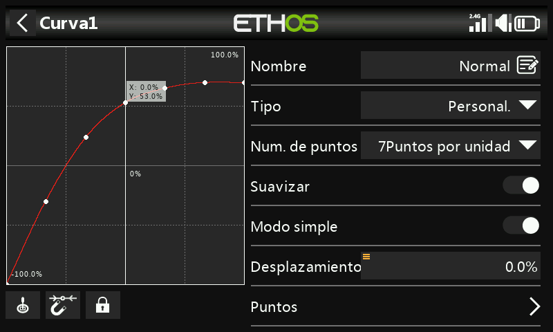

- **Idle Up 1**: vuelo general: una curva en línea recta que mantiene un
  ajuste de acelerador constante para conservar una velocidad de rotor
  estable, obteniendo el movimiento mediante el Paso colectivo, los
  Alerones (alabeo) y la Profundidad (cabeceo). Mantenga suave la
  transición desde Normal, sin grandes saltos. (La mayoría de unidades FBL
  ofrecen además una función **Governor** para mantener constante la
  velocidad del rotor durante maniobras agresivas; consulte el manual
  propio de la unidad FBL.)

  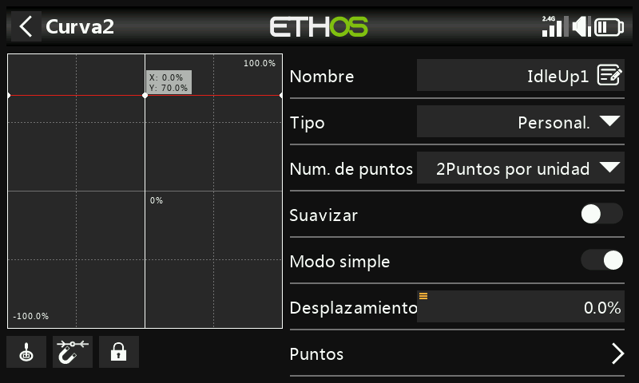

- **Idle Up 2**: vuelo agresivo (acrobacia, 3D); de nuevo, se ajusta en
  vuelo.

  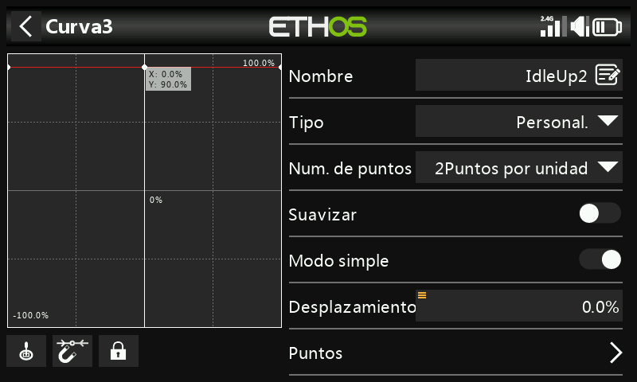

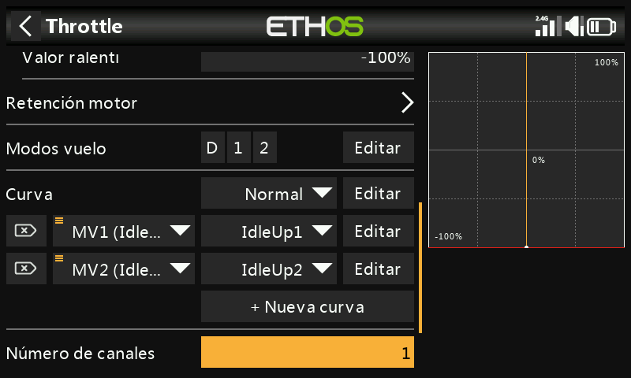

**Corte de gas**: asigne, por ejemplo, el interruptor SG-arriba con
**Sticky** activado: al subir SG se corta el acelerador de forma
instantánea y (debido a Sticky) solo puede rearmarse tras devolver antes el
stick de acelerador a mínimo/apagado.

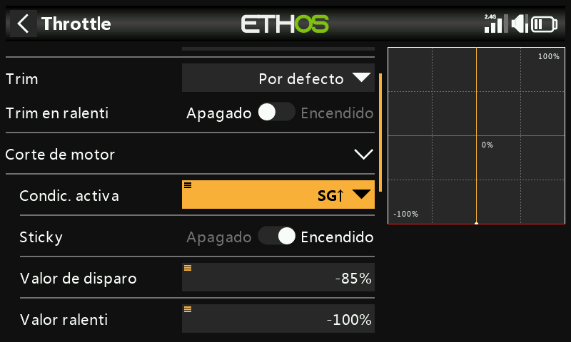

**Rescate/Stabi**: asígnelo de forma similar, por ejemplo al interruptor SA
en el canal 8.

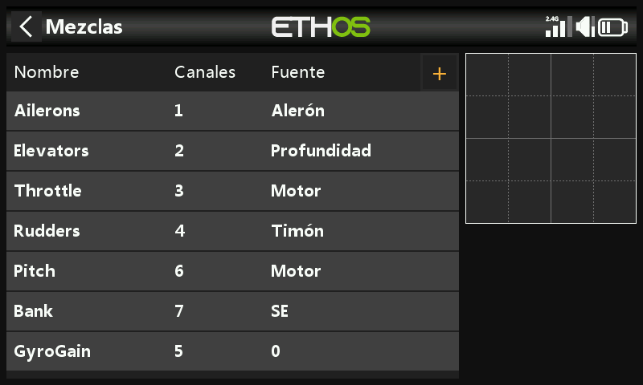

## Paso 5. Configuración de la unidad FBL

1. **Instale la herramienta de configuración del FBL**: por ejemplo Spirit
   Settings, en un PC.
2. **Conecte el receptor a la unidad FBL** según su esquema de conexionado:
   normalmente la salida SBUS Out del receptor al puerto RUD de la unidad
   FBL (algunos modelos Spirit requieren un adaptador SBUS), o bien
   mediante F.Port1/FBUS.
3. **Conecte la unidad FBL al PC**: por cable o Bluetooth, según su manual.

   !!! danger
       No conecte todavía ningún servo.

4. **Actualice el firmware del FBL** si es necesario, desde la pestaña
   Update de la herramienta.
5. **Configuración general** (pestaña General de Spirit Settings):
   - Tipo de receptor: **Futaba SBUS** o **FrSky F.Port**, según
     corresponda, y luego reinicie.
   - Asignación de canales (con AETR del asistente):

     | Función | Canal |
     |---|---|
     | Acelerador | 1 |
     | Alerones | 2 |
     | Profundidad | 3 |
     | Dirección | 4 |
     | Giróscopo | 5 |
     | Paso | 6 |
     | Banco | 7 |
     | Rescate/Stabi | 8 |

     (Esta asignación se deriva de cómo interpreta la unidad Spirit las
     posiciones del flujo de datos SBUS.)

6. **Límites de canal** (pestaña Diagnostic): la unidad FBL necesita
   límites de canal de la emisora calibrados y centros verificados:

   - Ponga primero a cero todos los subtrims y trims de la emisora.
   - Centre el stick de Paso colectivo para que marque exactamente 1500 µs
     en [Salidas](../model-setup/outputs.md).
   - Encienda la unidad FBL y compruebe que
     alerones/profundidad/paso/dirección marcan todos 0 % en la pestaña
     Diagnostic (la unidad FBL detecta automáticamente el neutro en cada
     inicialización).
   - Mueva cada mando a sus extremos y ajuste los valores **Min**/**Max**
     correspondientes en Salidas hasta que la pestaña Diagnostic marque
     exactamente +100 %/−100 %, confirmando también que la dirección de la
     barra coincide con la del stick.

   !!! warning
       Nunca utilice subtrim ni trim en estos canales: la unidad FBL Spirit
       los interpreta como órdenes de entrada, no como calibración.

7. Ajuste el **Offset** de la mezcla de Ganancia del giróscopo para lograr
   el Heading Lock.

Con esto, la parte de la emisora queda completamente configurada; continúe
con el resto de la configuración según el manual propio de la unidad FBL.
