# Ejemplo de Ala volante básica (Elevones)

Este sencillo ejemplo de ala volante cubre la configuración de un modelo con 2 servos para la Profundidad. Usaremos las Regímenes de giro, exponenciales y relaciones de mezcla recomendadas para una Dreamflight Weasel.

## Paso 1. Confirme la configuración del Sistema

Comience por seguir el 'Ejemplo de configuración inicial de radio' de más arriba, que se utiliza para configurar las partes del hardware del sistema de radio que son comunes a todos los modelos. Para este ejemplo usaremos el orden de canales por defecto AETR (Alerón, Elevador, Acelerador, Timón). Asegúrese de que el ajuste 'Primeros cuatro canales fijos' está en OFF.

Utilice la función [Sistema RF](../model-setup/rf-system.md) para registrar su receptor (si su receptor es ACCESS) y vincularlo como preparación para configurar el modelo.

## Paso 2. Identificar los servos/canales necesarios

La función Mezclas forma el corazón de la radio. Para un modelo con elevones, las mezclas se preparan para combinar los controles de alerón y profundidad para que ambos actúen sobre las superficies de los elevones.

Nuestro ejemplo tiene los siguientes servos/canales:

2 canales que combinan las entradas de alerón y elevador

## Paso 3. Crear un nuevo modelo.

Consulte la sección Configuración del modelo [Seleccion de modelo](../model-setup/model-select.md) para crear su nuevo modelo. Consulte también los menús de la sección Navegación para familiarizarse con la interfaz de usuario de la radio, de modo que pueda encontrar fácilmente las funciones que necesita.

Pulse sobre la pestaña Modelo (icono del avión) y seleccione la función Seleccionar modelo. A continuación, pulse sobre el símbolo "+", que le presentará una selección de asistentes de creación de modelos.

Para nuestro ejemplo, pulse sobre el icono Avión para iniciar el asistente de creación del modelo.

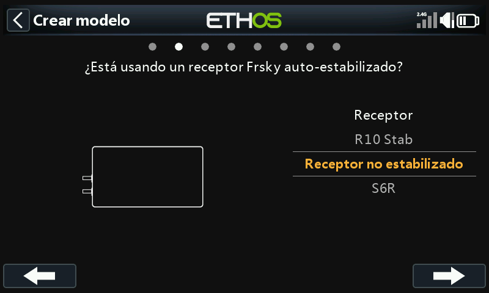

El asistente incluye ajustes opcionales para establecer mezclas predefinidas para receptores Frsky estabilizados. Para este ejemplo, elegiremos las opción ‘Receptor no estabilizado’.

Seleccione "Sin motor" para el motor.

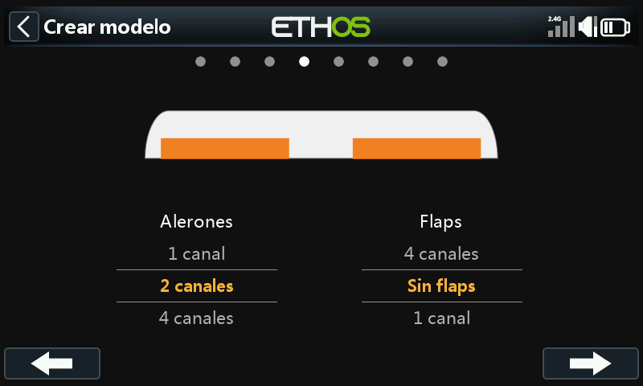

Acepte los 2 canales por defecto para Alerones, y seleccione 'No flaps'.

Seleccione 'Ninguno' para la cola. Esto creará una mezcla de elevones usando las entradas de Alerón y Profundidad.

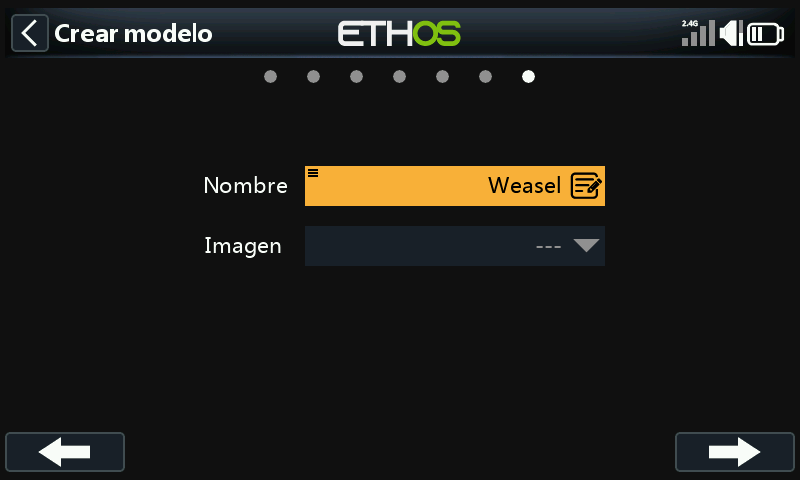

Llamaremos al modelo "Weasel", seleccionaremos una fotografía para él, y seguiremos el asistente hasta el final, lo que dará como resultado la creación del modelo "Weasel" en el grupo Avión. También se convertirá en el modelo activo, por lo que podremos seguir configurando sus características.

## Paso 4. Revisar y configurar las mezclas

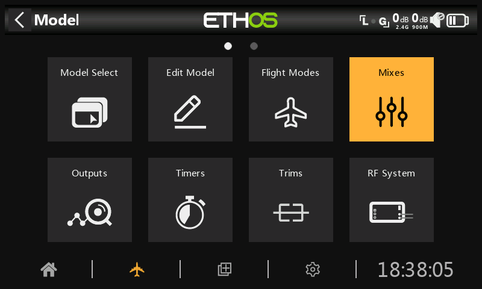

Pulse sobre el icono Mezclas para revisar las mezclas creadas por el asistente de Avión.

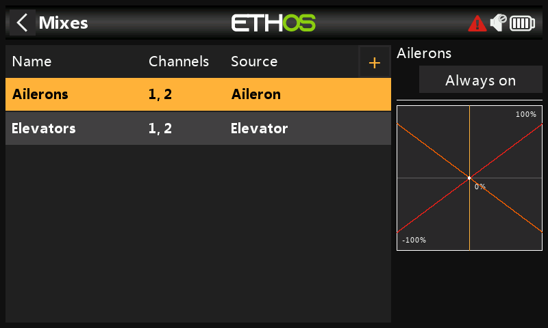

El asistente ha creado una mezcla de Alerones en los canales 1 y 2, seguida de una mezcla de Profundidad también en los canales 1 y 2. Esto significa que ambos controles de entrada actuarán en los dos canales de los elevones.

### Alerones

Para revisar la mezcla de Alerones, pulse sobre la línea Alerones y seleccione Editar en el menú emergente.

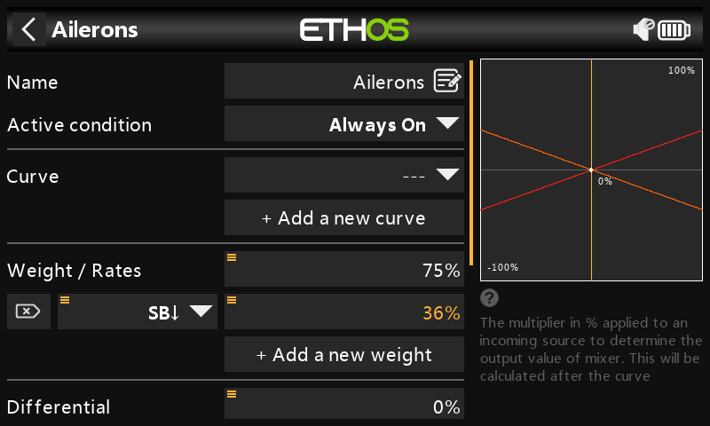

#### Peso/Régimen de giro

Consultando el manual del Weasel, las deflexiones recomendadas para el alerón son aproximadamente 3 veces mayores que para la Profundidad. Queremos pesos combinados del 100%, por lo que el peso del alerón debe ser del 75% y el de Profundidad del 25%.

También según el manual, el porcentaje bajo de giro deben ser aproximadamente el 50% del porcentaje alto de giro. Por lo tanto, utilizaremos un 36% para las tasas bajas del alerón y un 12% para las tasas bajas de elevador.

#### Expo

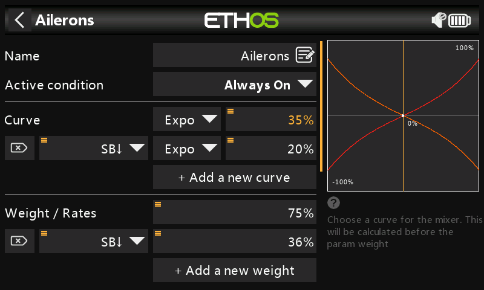

En los ejemplos anteriores de Régimen de giro se puede ver que la respuesta de salida es lineal. Para evitar que la respuesta sea demasiado brusca con las palancas centradas, puede utilizar una curva Expo para reducir el movimiento de la superficie de control en el centro del movimiento de la palanca y aumentarlo a medida que se va alejando del centro. Los valores de Expo recomendados para el Weasel son 35% para alto y 20% para bajo, así que añadiremos una curva que estará activa en la posición baja del interruptor SB. El gráfico muestra ahora una respuesta curva que es más plana en el centro del recorrido de las palancas.

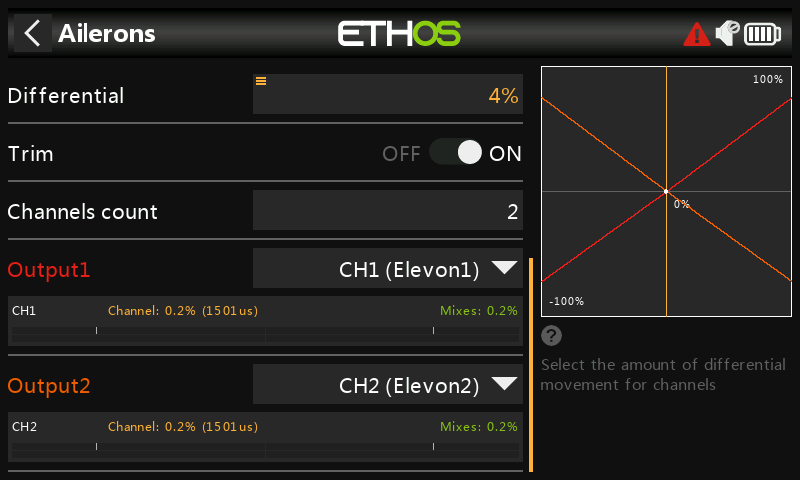

Para los Alerones hay otro ajuste especial llamado Diferencial. Si los alerones izquierdo y derecho se mueven hacia arriba o hacia abajo en la misma cantidad, el alerón que se mueve hacia abajo causará más resistencia que el alerón que se mueve hacia arriba, haciendo que el ala guiñe en la dirección opuesta al giro. Esto se conoce como guiñada adversa. Para reducirlo, un valor positivo en el ajuste del diferencial provocará un menor movimiento descendente de los alerones, reduciendo la guiñada adversa y mejorando las características de giro y manejo. El diferencial recomendado para el Weasel es bastante pequeño y equivale aproximadamente al 4%.

### Profundidad

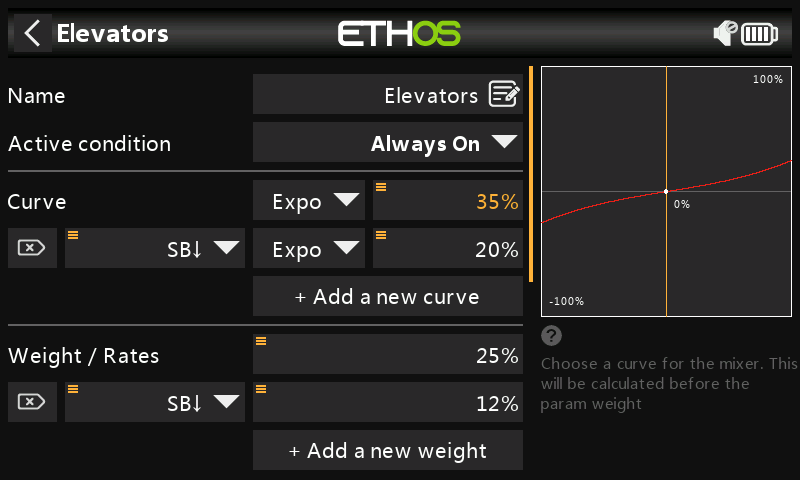

De manera similar a los Alerones, podemos configurar el régimen de giro y el expo para la Profundidad. Usaremos tasas/pesos de elevador de 25% y 12%. Usaremos los mismos valores de Expo que para los alerones.

### Timón

El Weasel no tiene timón, ya que realmente no lo necesita. Otros modelos pueden requerir un timón, en cuyo caso se debe utilizar una mezcla libre para añadir un timón en el canal 3.

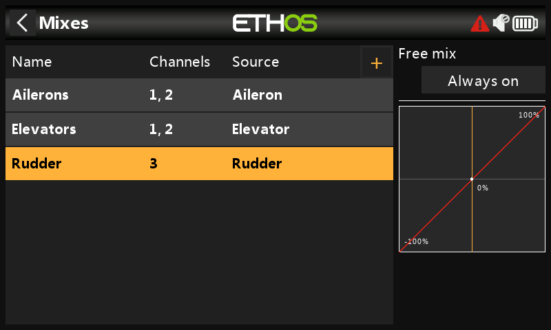

## Paso 5. Vincular el receptor

Use la función  [Systema RF](../model-setup/rf-system.md) para registrar (si su receptor es ACCESS) y vincular su receptor antes de configurar las Salidas.

Vea en detalle las dos secciones siguientes para revisar sus mezclas y configurar las Salidas antes de continuar. Para evitar daños inadvertidos a sus servos por exceso de movimiento, sería inteligente desconectar los reenvíos o reducir los movimientos de los servos hasta que esté listo y haya ajustado los límites máximo y mínimo de los servos.

## Paso 6. Revisar las mezclas

Puede utilizar la pantalla Salidas para revisar las mezclas. Los canales de salida 1 y 2 pueden renombrarse a Elevon1 y Elevon2.

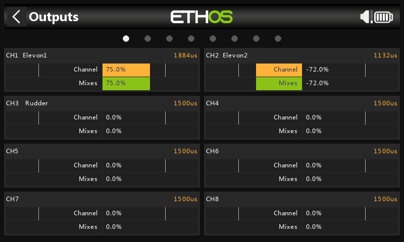

El ejemplo anterior muestra que se ha aplicado todo el alerón derecho, por lo que el canal 1 está al 75%, mientras que el alerón izquierdo desciende al 72% debido al diferencial de alerón.

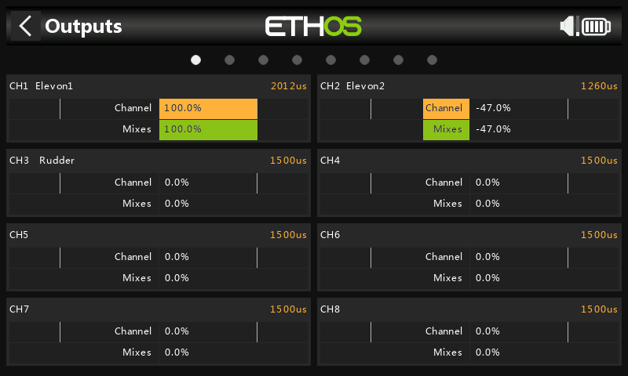

Este ejemplo muestra que se ha aplicado todo el alerón derecho, así como todo el elevador hacia abajo, por lo que el canal 1 está a 75+25 = 100%, mientras que el alerón izquierdo hacia abajo está a 72-25 = 47% debido al diferencial de alerón.

## Paso 7. Configure los recorridos máximos de los servos

Comience ajustando los puntos centrales del servo utilizando el ajuste Centro PPM.

Por último, los recorridos máximos reales del servo deben configurarse para establecer las deflexiones recomendadas y evitar exceder los límites mecánicos del servo. Los recorridos máximos recomendados para el Weasel son 25mm (alerón) + 10mm (elevador) = 35mm. Mueva las palancas de alerones y profundidad a tope a un lado y a otro, entonces configure sus deflexiones máximas de superficie asegurándose de que no se exceden los límites de los servos.

#### Min/Max

Los ajustes mínimo y máximo del canal son límites "duros", es decir, nunca se anularán. Deben ajustarse para evitar atascos mecánicos. Tenga en cuenta que sirven como ajustes de ganancia o "punto final", por lo que la reducción de estos límites reducirá la fuerza en lugar de inducir un recorte de recorrido. Tenga en cuenta que los límites por defecto son +/- 100,0%, pero pueden aumentarse hasta +/- 150,0% si fuera necesario.

#### Curva

Las curvas son una forma más rápida y flexible de configurar el centro y los límites mín./máx. de las salidas, y se obtiene además un bonito gráfico. Utilice una curva de 3 puntos para la mayoría de las salidas, pero utilice una curva de 5 puntos para cosas como el segundo mando de profundidad, para que pueda sincronizar el recorrido en 5 puntos. Cuando se utiliza una curva es una buena práctica dejar Min, Max y Subtrim en sus valores 'pass-thru' de -100, 100 y 0 respectivamente (ó -150, 150 y 0 si se utilizan límites extendidos).
