# Ejemplo básico de ala volante (elevones)

Un ala volante con elevones de 2 servos, utilizando las relaciones de
rates/Expo/mezclas recomendadas para el Dreamflight Weasel como ejemplo
práctico concreto. Complete primero la [Configuración inicial de la
emisora](initial-radio-setup.md).

## Paso 1. Comprobar los ajustes del sistema {: #step-1-confirm-system-settings }

Orden **AETR** por defecto, con **[Primeros cuatro canales
fijos](../system-setup/controls.md#first-four-channels-fixed)** en
**OFF**. Registre (si utiliza ACCESS) y vincule el receptor mediante
[Sistema RF](../model-setup/rf-system.md) antes de continuar.

## Paso 2. Identificar los servos/canales necesarios

En una célula con elevones, las [mezclas](../model-setup/mixes.md)
combinan las entradas de alerones y profundidad en ambas superficies
físicas: solo 2 canales en total, cada uno de ellos una combinación de
ambas entradas.

## Paso 3. Crear un modelo nuevo

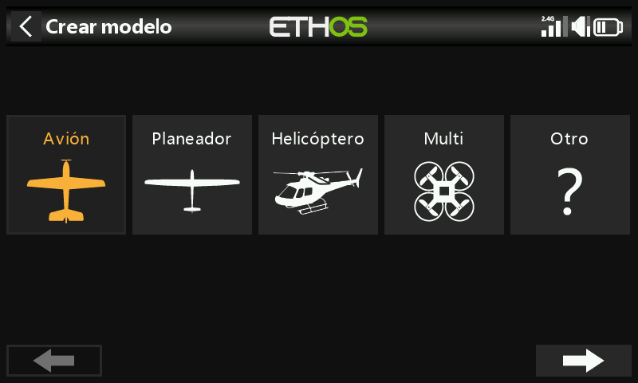

Desde [Selección de modelo](../model-setup/model-select.md), inicie el
asistente **Avión** y elija **Receptor no estabilizado**.

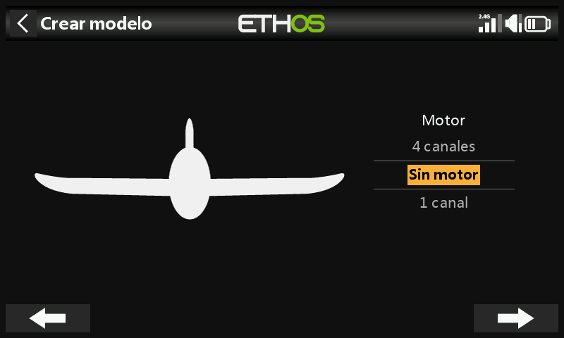

Seleccione **Sin motor**, acepte los 2 canales de alerones por defecto y
seleccione **Sin flaps**.

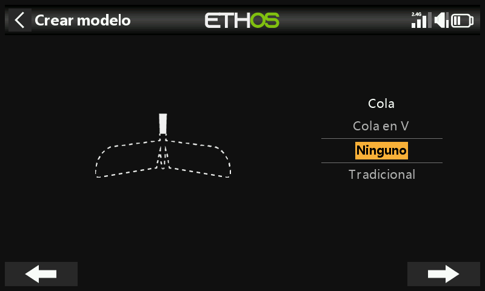

Seleccione **Ninguna** como tipo de cola: esto es lo que hace que Ethos
construya automáticamente la mezcla de elevones (entradas de alerones +
profundidad, ambas sobre los mismos dos canales). Asigne un nombre al
modelo (p. ej. "Weasel"), elija un bitmap y finalice: pasará a ser el
modelo activo en la categoría Avión.

## Paso 4. Revisar y configurar las mezclas

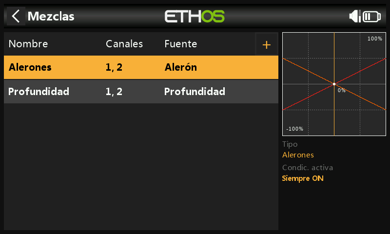

El asistente crea una mezcla de Alerones en los canales 1+2, seguida de
una mezcla de Profundidad *también* en los canales 1+2: ambas entradas
actúan sobre los dos canales de elevones, que es precisamente en lo que
consiste la mezcla de elevones.

### Alerones

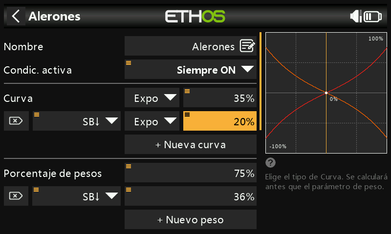

**Peso/Rates**: según el manual del Weasel, la deflexión de alerones debe
ser aproximadamente 3 veces la de profundidad, y ambas deben sumar 100 %:
**75 %** de alerones y **25 %** de profundidad. Los rates bajos son
aproximadamente la mitad de los altos: **36 %** de alerones en rate bajo
y **12 %** de profundidad en rate bajo.

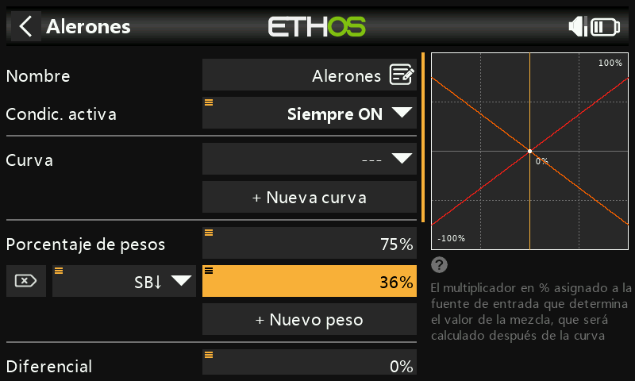

**Expo**: el valor recomendado para el Weasel es 35 % en rate alto y 20 %
en rate bajo, activado con el interruptor SB abajo, suavizando la
respuesta en torno al centro del stick.

**Diferencial**: pequeño en esta célula, alrededor del **4 %**:

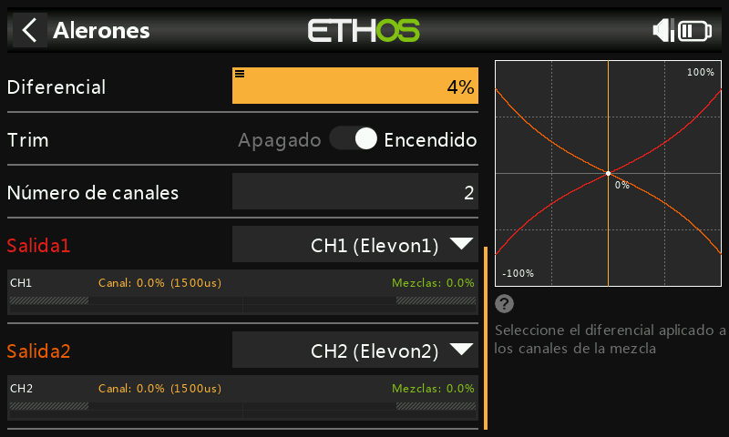

(Consulte el [Ejemplo básico de ala
fija](basic-fixed-wing.md#ailerons) para saber por qué es importante el
diferencial: aquí se aplica el mismo razonamiento sobre la guiñada
adversa.)

### Profundidad

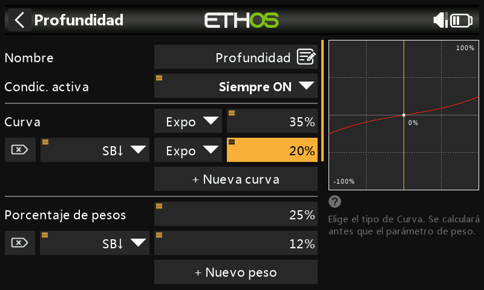

El mismo patrón: rates alto/bajo de **25 %**/**12 %** y los mismos
valores de Expo que en los alerones.

### Dirección

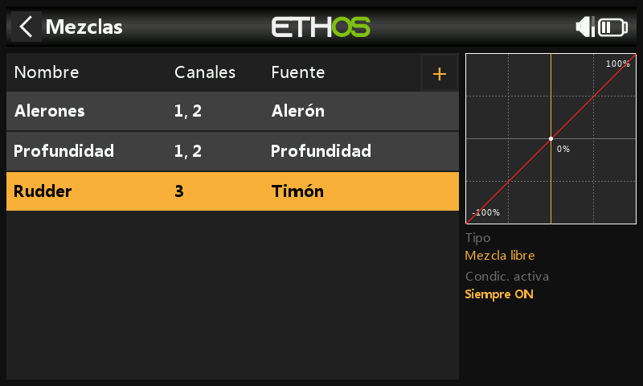

El Weasel no tiene: las alas volantes generalmente no la necesitan. Si
*sí* se necesita dirección en un modelo con elevones, añádala como una
[Mezcla libre](../model-setup/mixes.md#mix-libraries) en el canal 3.

## Paso 5. Vincular el receptor

Igual que en el [Paso 1](#step-1-confirm-system-settings): registre y
vincule antes de continuar, y considere desconectar los varillajes de los
servos o reducir el recorrido hasta que se hayan fijado los límites
Mín./Máx., para evitar forzar algún elemento.

## Paso 6. Revisar las mezclas

Los canales de salida 1/2 pueden renombrarse como
**Elevon1**/**Elevon2**. Con alerón a la derecha a fondo, el canal 1
(derecho, hacia arriba) indica 75 %, mientras que el canal 2 (izquierdo,
hacia abajo) indica 72 %: la diferencia del 3 % *es* el diferencial en
acción. Si además se aplica profundidad abajo a fondo, el canal 1 pasa a
75+25 = 100 % y el canal 2 pasa a 72−25 = 47 %.

## Paso 7. Configurar los recorridos máximos de los servos

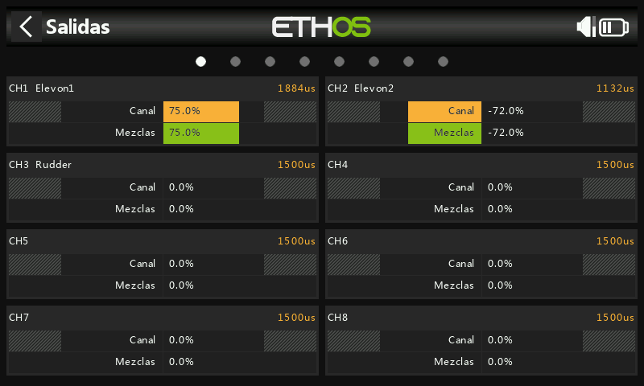
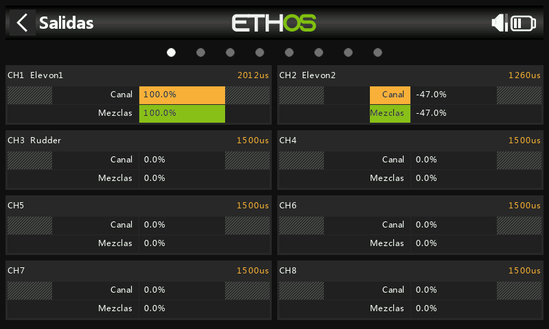

Centre primero cada servo con **PWM center**. El recorrido máximo
recomendado para el Weasel es de 25 mm de alerones + 10 mm de profundidad
= 35 mm combinados: aplique entradas de alerones/profundidad tanto
sumándose *como* oponiéndose a fondo y compruebe que ninguna supere los
límites mecánicos ni los del servo antes de fijar las deflexiones
definitivas.

- **Mín./Máx.**: límites absolutos, nunca se sobrepasan; reducirlos
  reduce el recorrido en lugar de recortarlo. Por defecto ±100 %,
  ampliable a ±150 % si es necesario.
- **Curva**: a menudo más rápida y flexible que ajustar directamente
  Mín./Máx./Subtrim, con la ventaja de un gráfico en vivo. Una curva de 3
  puntos es adecuada para la mayoría de las salidas; una curva de 5
  puntos en el segundo elevón facilita sincronizar el recorrido en 5
  puntos con el del primero. Al utilizar una curva para esto, deje
  Mín./Máx./Subtrim en sus valores de paso directo (−100/100/0, o
  −150/150/0 con límites ampliados) y deje que la curva se encargue del
  modelado.
