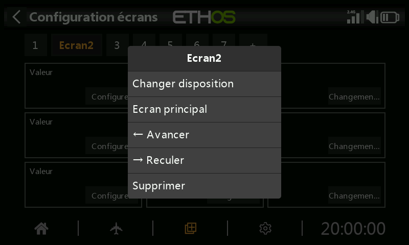
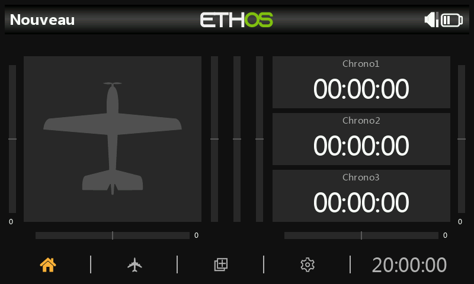

---
translated_from: 827e532e2b0324591f0fdbb61a39e61180642b24
---

# Écrans supplémentaires

Le modèle par défaut comporte un seul écran (une image du modèle et trois
widgets de chronomètre), mais jusqu'à **huit** écrans au total sont pris en
charge. Appuyez sur le bouton **+** à côté de « Écran1 » pour ajouter un écran
supplémentaire :

- Vous pouvez choisir parmi **15** mises en page différentes, dont deux mises
  en page dédiées à l'écran d'accueil et une option plein écran, avec jusqu'à
  9 widgets — configurés exactement comme pour le premier écran.
- Les écrans peuvent être réorganisés ou même supprimés depuis leur propre
  boîte de dialogue d'édition, appelée en appuyant sur Écran1, ou Écran2, etc.

## Exemple concret

Une mise en page typique : l'image du modèle (configurée dans [Édition du
modèle → Image](../model-setup/model-edit.md)) à gauche, avec la tension de
la batterie du récepteur, le RSSI et un widget d'état « Throttle ACTIVE »
(un widget Lua développé par la communauté, issu du fil rcgroups *FrSky -
ETHOS Lua Script Programming*) empilés à droite. Appuyer sur n'importe quel
widget ouvre sa configuration, ou renvoie à la fonction principale
Configurer les écrans.

## Options au niveau de l'écran

Au-delà des widgets individuels, chaque écran possède ses propres réglages —
taille de la grille de la mise en page, arrière-plan, et choix des écrans
inclus dans le cycle `PAGE`.

Voir [Écrans](index.md) pour les widgets eux-mêmes, et [Widgets
personnalisés](custom-widgets.md) pour ajouter des widgets scriptés en Lua
au-delà de l'ensemble intégré.
