---
translated_from: 827e532e2b0324591f0fdbb61a39e61180642b24
---

# Écrans

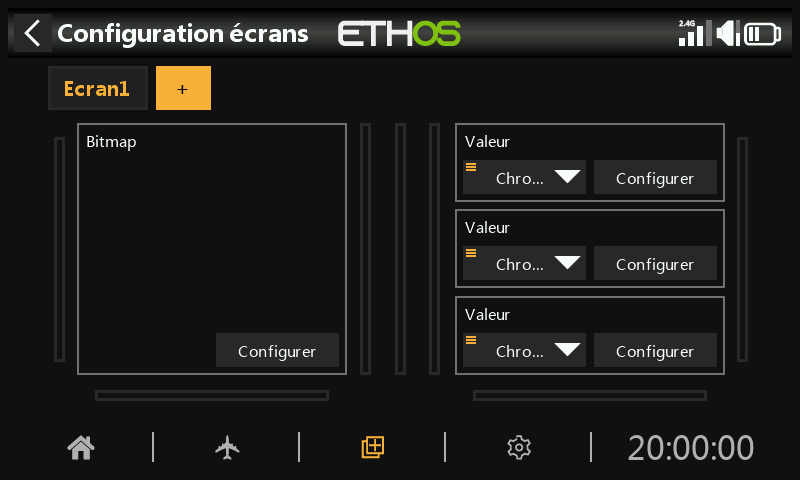

La vue principale est constituée d'un ou plusieurs **écrans d'affichage**,
chacun construit à partir de **widgets** que vous placez et configurez
vous-même. Une pression sur `DISP` ouvre l'éditeur d'affichage de l'écran
courant.

Il peut y avoir jusqu'à **huit** écrans définis par l'utilisateur, chacun
basé sur l'une des **treize** configurations de widgets d'écran (avec
jusqu'à **neuf** cellules pour l'affichage des widgets). Les widgets
peuvent afficher des valeurs de télémétrie, mais aussi des informations
provenant de dix-sept autres catégories différentes — état du modèle et de
la radio, chronos, voies, et bien plus. Une fois configurés, les écrans
sont accessibles à l'aide d'un geste de balayage tactile ou des commandes
de navigation `PAGE` précédente/suivante ; les barres supérieure et
inférieure restent affichées sur tous les écrans, sauf en disposition plein
écran.

## Ajouter un widget

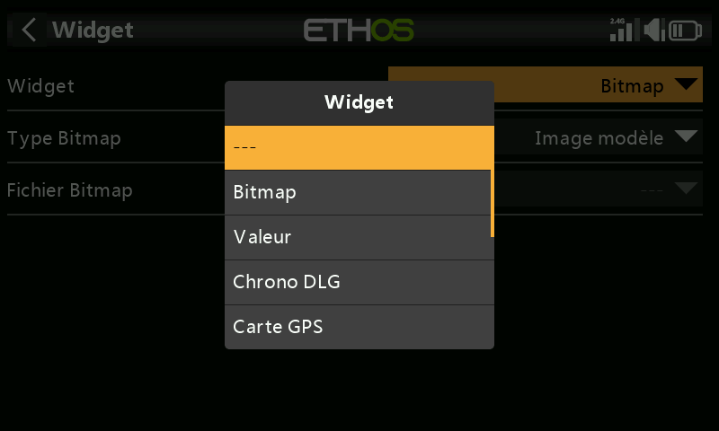

Chaque écran est une grille ; appuyer sur une cellule vide ouvre le
sélecteur de widgets. Les widgets vont du simple texte et des affichages
numériques aux jauges, graphiques et journaux de télémétrie complets. Une
fois placé, appuyer à nouveau sur un widget ouvre le même menu d'options,
qui permet de le redimensionner, de le déplacer ou de le supprimer :

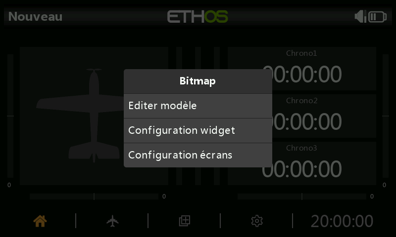

Sélectionner les réglages propres à un widget ouvre un formulaire de
configuration spécifique à celui-ci. Le champ **source** — la valeur
affichée par le widget — utilise le même
[sélecteur de source](../getting-started/user-interface-and-navigation.md#choosing-a-source)
que partout ailleurs dans Ethos :

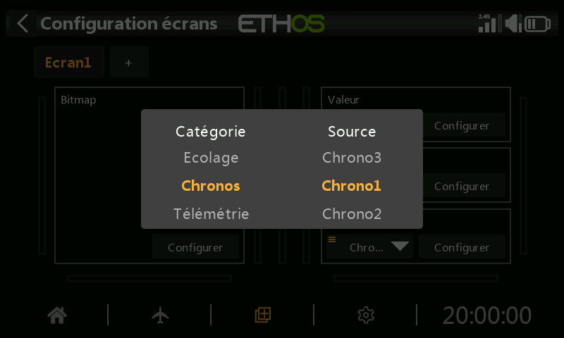

## Types de widgets {: #widget-types }

**Valeur** — affiche simplement la valeur de la source sélectionnée,
numérique ou de télémétrie, sous forme de texte :

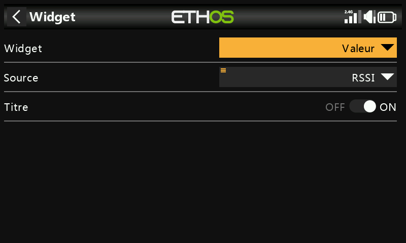

La plupart des sources permettent également de n'afficher que la valeur
**min** ou **max** en temps réel — après avoir sélectionné la source, un
appui long dessus vous permet de choisir Min ou Max — pratique par exemple
pour connaître le RSSI le plus faible relevé pendant un vol :

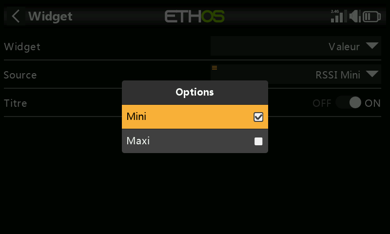

Une fois placé, il s'affiche à l'écran comme une simple valeur :

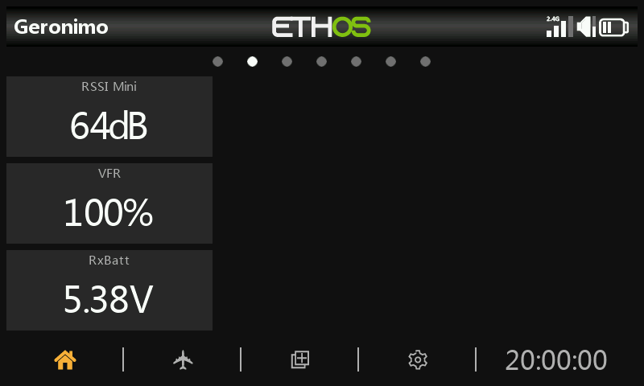

**Bitmap** — permet d'afficher un bitmap statique (par exemple la photo du
modèle), ou un jeu de bitmaps alternés en fonction de la valeur d'une
source (par exemple une icône de batterie qui change avec la tension) :

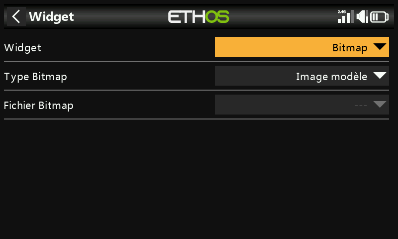
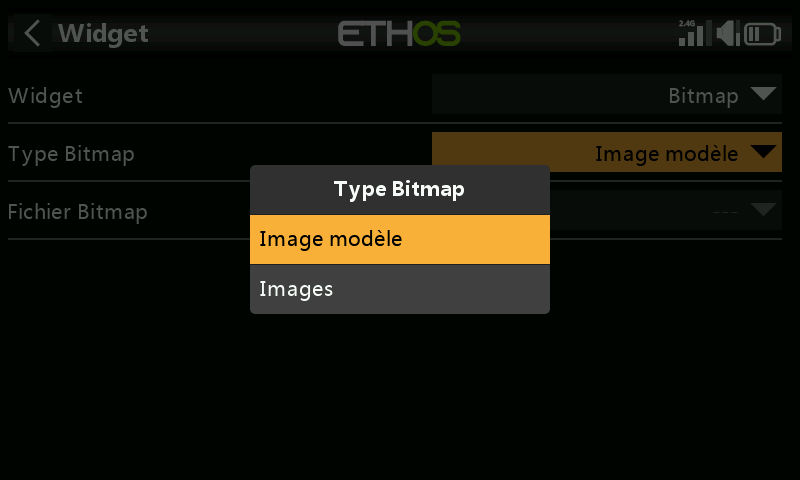

**LiPo** — une jauge de batterie dédiée, qui affiche les informations de
tension LiPo provenant de capteurs tels que le FLVSS : tension totale du
pack, nombre d'éléments et tension de chaque élément. Si la tension
descend sous le seuil **Basse tension** configuré, les tensions sont
affichées en rouge — dans l'exemple ci-dessous, un seuil de 3,3 V se
déclenche sur l'élément le plus bas :

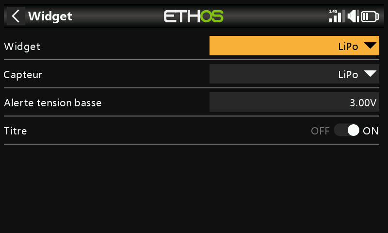
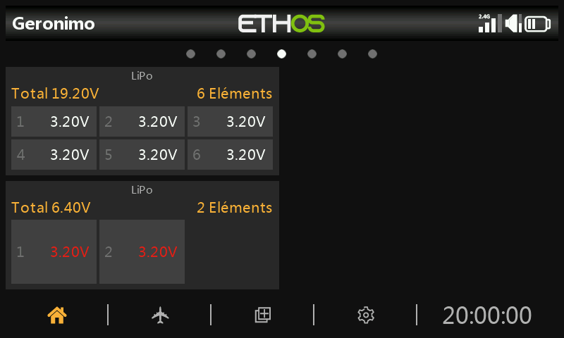

**Voies** — permet d'afficher jusqu'à 8 voies de sortie sous forme de
graphique à barres, avec des barres horizontales ou verticales :

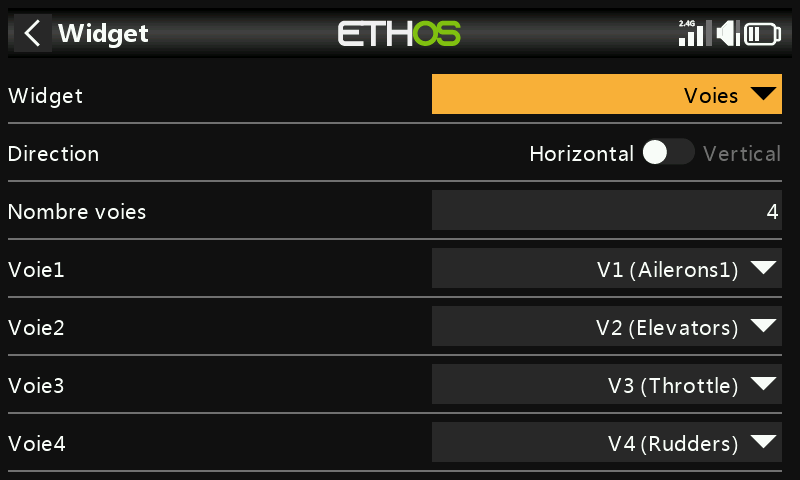
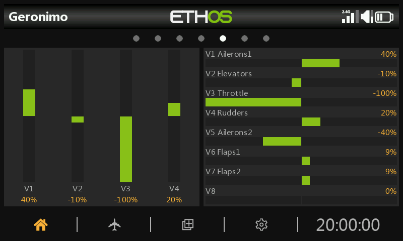

**Tracé ligne** — permet de représenter graphiquement la valeur d'une
source dans le temps ; le widget réinitialise ses données lors d'une
« réinitialisation de vol » :

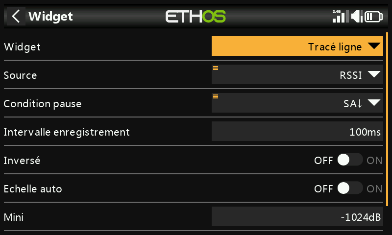
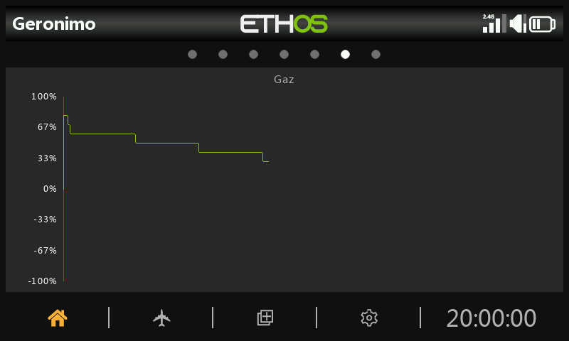

- **Source** — la source à représenter graphiquement.
- **Condition de pause** — la source à utiliser comme contrôle de pause
  (ou appuyez simplement sur le widget pendant qu'il est en cours
  d'exécution, si vous n'avez pas de source disponible pour cela).
- **Période de journalisation** — intervalle d'échantillonnage ; avec une
  période de 500 ms, le graphique couvrira environ 6 minutes avant de
  commencer à défiler, tandis que 1 s couvrira environ 12 minutes.
- **Inversé** — inverse le graphique verticalement.
- **Plage automatique** — l'axe vertical est mis à l'échelle
  automatiquement en fonction de l'entrée ; désactivée, l'axe vertical est
  mis à l'échelle selon les valeurs **Min** et **Max** fixes (par exemple
  une plage constante de −100 % à +100 %).

Appuyez sur le graphique pendant qu'il est en cours d'exécution pour
afficher une boîte de dialogue permettant de **Suspendre ou reprendre** la
journalisation, de **Réinitialiser** le graphique et recommencer, de
**Configurer le widget**, ou d'accéder au menu **Configurer les écrans** :

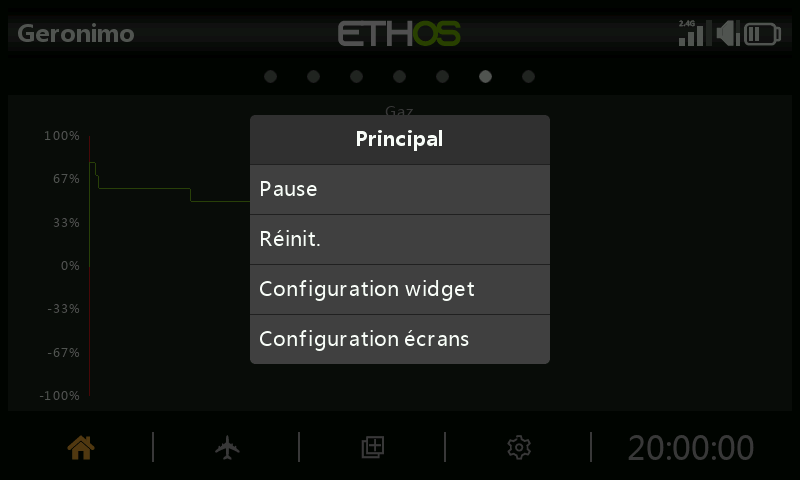

**Texte** — affiche le contenu d'un fichier texte au format Markdown (lu
depuis le dossier `documents/user/` — voir le [Gestionnaire de
fichiers](../system-setup/file-manager.md#top-level-folders)) :

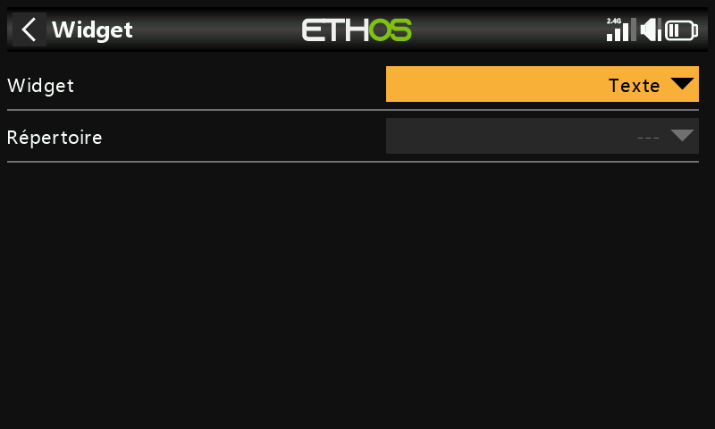
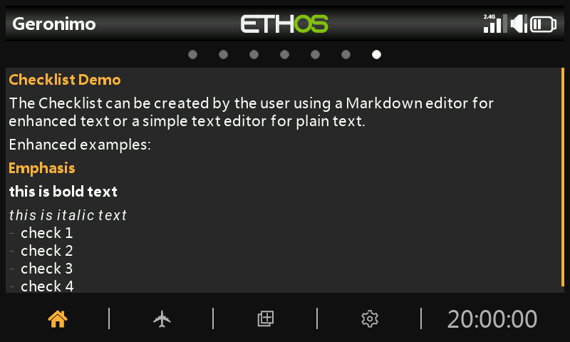

**Journaux de chrono** — un journal défilant des valeurs passées d'un
chrono choisi, écrites à chaque fois que ce chrono est réinitialisé (utile
pour suivre l'utilisation des packs de vol au cours d'une session) ;
**Inverser** place l'entrée la plus récente en haut :

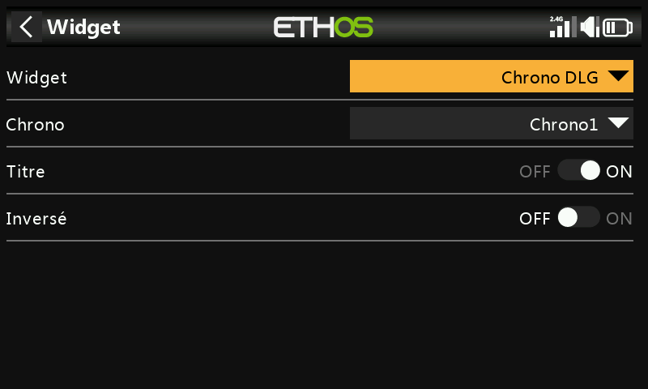
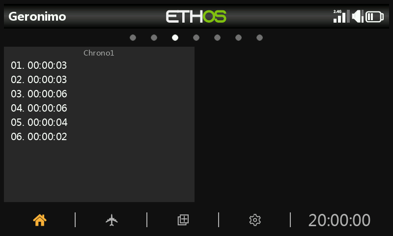

Faites un appui long sur une entrée (ou sur le widget) pour accéder à
**Effacer les journaux**, modifier ou réinitialiser le chrono associé, ou
accéder à la configuration du widget ou des écrans :

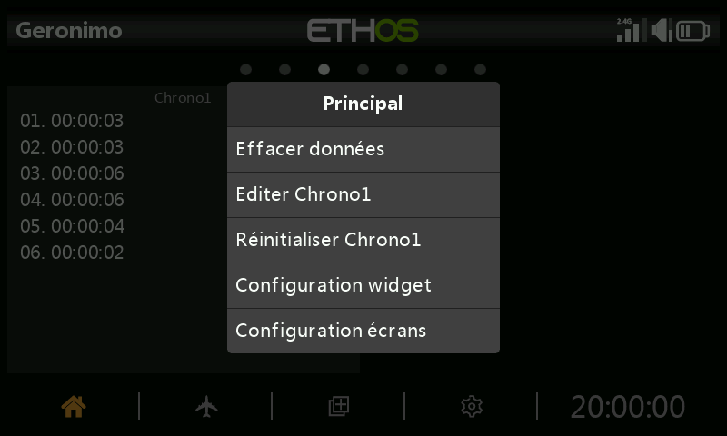

**Carte GPS** — trace la position GPS en direct sous forme de trajectoire,
pour les modèles équipés d'un capteur GPS (veuillez vous référer au fil de
discussion *FrSky - ETHOS Lua Script Programming* sur rcgroups, en
particulier le post #8854, pour plus de détails sur ce widget en
particulier) :

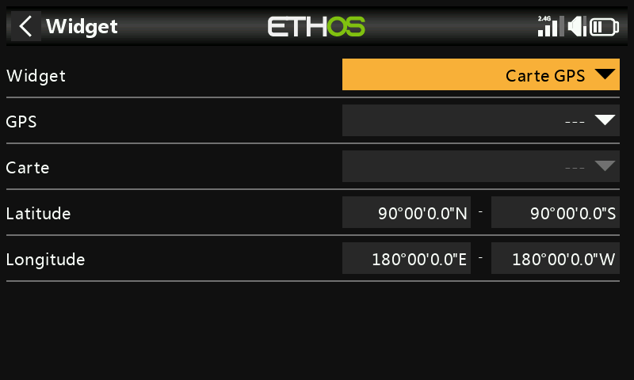

## Options au niveau de l'écran

Au-delà des widgets individuels, chaque écran possède ses propres réglages
— taille de la grille de disposition, arrière-plan, et écrans inclus dans
le cycle de la touche `PAGE` :

Un écran d'accueil entièrement configuré combine plusieurs widgets en une
disposition lisible d'un seul coup d'œil :

Voir [Écrans supplémentaires](additional-displays.md) pour ajouter d'autres
écrans au-delà de celui par défaut, et [Widgets
personnalisés](custom-widgets.md) pour les widgets programmés en Lua, au-delà
de l'ensemble intégré.
