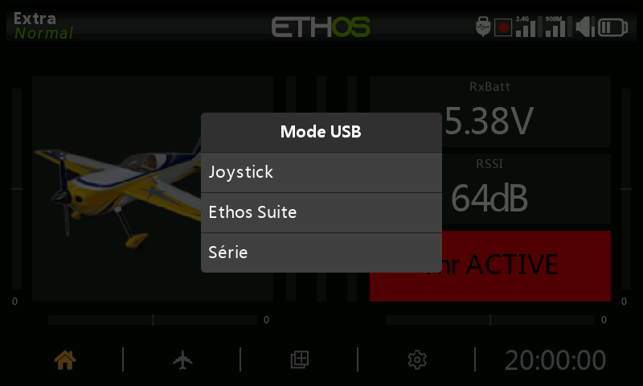

# Modes de connexion USB

Le comportement d'une connexion USB vers un PC dépend de la manière dont la radio était alimentée au moment du branchement.

## Mode hors tension

Connecter la radio à un PC via USB **alors qu'elle est éteinte** la place en mode DFU, utilisé pour flasher le bootloader lui-même.

## Mode bootloader {: #bootloader-mode }

Allumez la radio **en maintenant `ENT` enfoncé** pour démarrer en mode bootloader (l'écran affiche « Bootloader »). Le branchement de l'USB fait alors passer l'état à « USB Plugged » et le PC monte **deux** volumes : la mémoire flash interne de la radio et le contenu de la SD card/eMMC. C'est le mode à utiliser pour lire et écrire directement des fichiers dans l'une ou l'autre de ces zones de stockage, et c'est également ainsi qu'[Ethos Suite](../ethos-suite/index.md) met à jour le firmware de la radio — voir la section Mode bootloader propre à Ethos Suite.

## Mode sous tension

Le branchement de l'USB alors que la radio est **allumée normalement** affiche un sélecteur de mode :

- **Joystick** — présente la radio comme un joystick USB HID, pour piloter des simulateurs de vol sur PC.
- **FrSky Suite** — place la radio en « mode Ethos » pour communiquer avec [Ethos Suite](../ethos-suite/index.md).
- **Serial** — redirige les traces de débogage Lua sur la liaison USB-série (115200 bps). L'onglet Lua Development Tools d'Ethos Suite intègre un terminal permettant de les afficher ; un pilote Virtual COM Port pour Windows peut être nécessaire.
