---
translated_from: 4cf1808aa5b70d3f39900c1a7aff575ca60ee89e
---

# Interface utilisateur et navigation

Ethos peut être piloté entièrement à l'aide du **sélecteur rotatif** de
droite (tournez-le pour déplacer la surbrillance, appuyez pour `ENT`) et de
la touche `RTN` pour sortir d'un menu — l'écran tactile, lorsqu'il est
présent, n'est qu'un raccourci vers les mêmes actions, et non une façon de
travailler distincte. `MDL`, `DISP` et `SYS` conduisent directement à la
Configuration du modèle, à Configurer les écrans et à la Configuration du
système respectivement (les trois mêmes tuiles que celles de la barre
inférieure) ; un appui long sur `RTN` vous ramène directement à l'écran
d'accueil à partir de n'importe quel sous-menu.

## Menu de réinitialisation

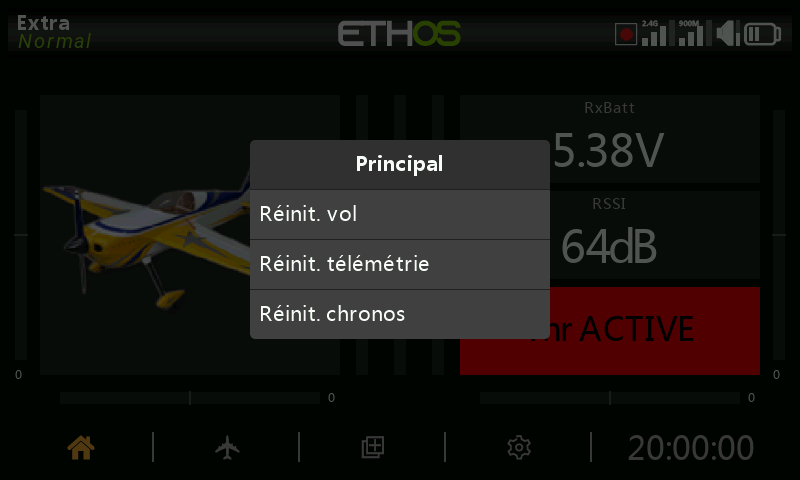

Un appui long sur la touche `ENT` depuis l'écran d'accueil fait apparaître
un menu de réinitialisation :

- **Réinitialiser le vol** — réinitialise les données de télémétrie, les
  chronos et les inters de fonction, et relance la [checklist](../model-setup/checklist.md)
  avant vol.
- **Réinitialiser la télémétrie** — réinitialise uniquement les données de
  télémétrie.
- **Réinitialiser les chronos** — réinitialise uniquement les chronos.
- **Verrouiller l'écran tactile** — également accessible en appuyant
  simultanément sur `ENT` + `PAGE` pendant une seconde à partir de l'écran
  d'accueil, ou comme déclencheur d'une [fonction
  spéciale](../model-setup/special-functions.md).

## Commandes d'édition

**Ajout d'éléments fonctionnels** — un chrono, un inter logique, une
fonction spéciale, une courbe ou une variable se crée en appuyant sur le
**+** situé à côté des en-têtes de colonnes du menu concerné. Sur une radio
sans écran tactile, mettez en surbrillance un élément existant, appuyez sur
`ENT` et choisissez **Ajouter** dans le menu — cette option est également
disponible sur les radios tactiles.

### Clavier virtuel

Il suffit d'appuyer sur n'importe quel champ de texte (ou d'appuyer sur
`ENT` lorsqu'il est sélectionné) pour faire apparaître le clavier virtuel.
La touche retour arrière efface à gauche du curseur ; `PAGE` supprime à
droite et, une fois le curseur arrivé à la fin du texte, poursuit la
suppression à partir de la gauche. Appuyer sur le champ lui-même déplace le
curseur à cette position — ou utilisez `SYS`/`DISP` pour le déplacer vers la
gauche ou vers la droite sans le tactile. Appuyez sur la touche
**?123**/**abc** pour basculer sur le clavier numérique (qui contient
également les caractères spéciaux) :

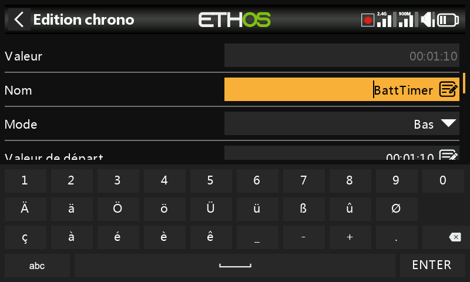

Sur une **radio sans écran tactile**, un appui sur `ENT` dans un champ de
texte active directement le mode édition : tournez le sélecteur rotatif pour
faire défiler les minuscules, les majuscules, les chiffres, puis les
caractères spéciaux, en appuyant sur `ENT` pour insérer chacun d'eux. `MDL`
bascule la casse du caractère situé immédiatement à droite du curseur (et
tous les caractères saisis ensuite conservent cette casse jusqu'à une
nouvelle bascule). `PAGE` supprime à droite du curseur ; `SYS`/`DISP` le
déplacent vers la gauche ou vers la droite.

## Commandes de saisie des valeurs numériques

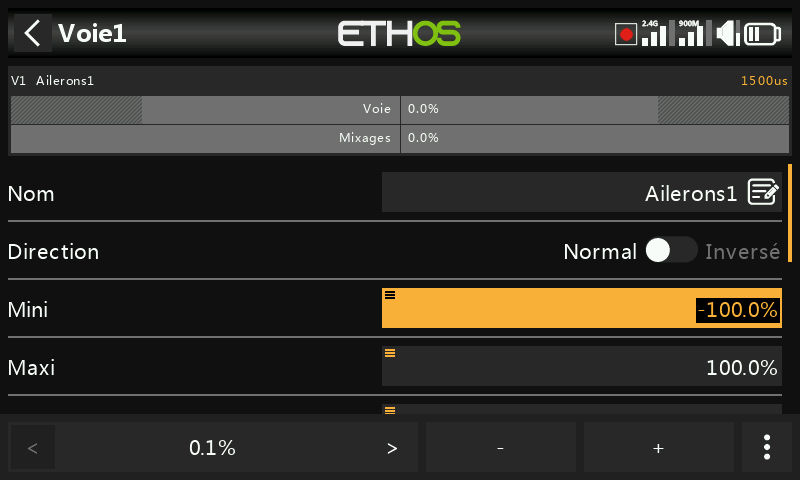

Lorsque vous touchez une valeur numérique, une boîte de dialogue apparaît en
bas de l'écran avec les commandes de valeur numérique : les touches
**`<`**/**`>`** modifient la valeur du pas (par incrément de facteur 10 —
par exemple 0,01/0,1/1,0/10,0), les touches **`-`**/**`+`** (ou le
sélecteur rotatif) incrémentent ou décrémentent la valeur de ce pas, et le
bouton **Plus** offre des options supplémentaires :

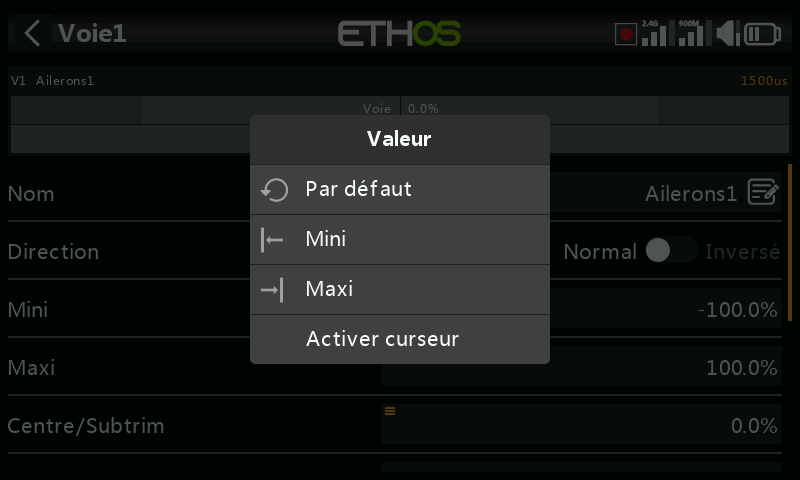

- Revenir à la valeur par défaut du champ
- Régler au minimum / régler au maximum
- Afficher un **curseur** de réglage à la place des touches d'incrément

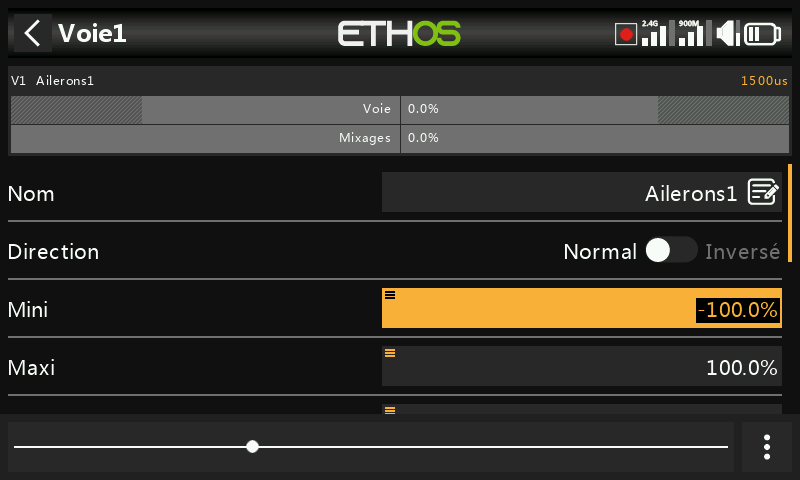

Le curseur (également réglable avec le sélecteur rotatif) permet d'ajuster
rapidement la valeur ; sélectionnez « Désactiver curseur » pour revenir aux
saisies par valeurs. Les valeurs de plage de télémétrie peuvent être saisies
de la même manière :

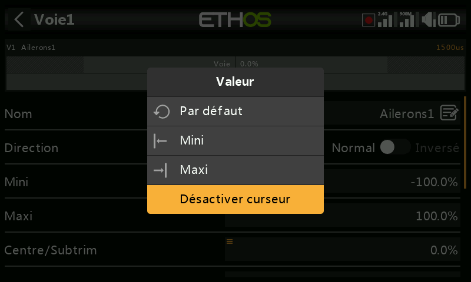

## La fonction Options {: #the-options-feature }

Presque partout où une valeur ou une [source](#choosing-a-source) est
attendue, un appui long sur la touche `ENT` fait apparaître une boîte de
dialogue **Options** — les champs dotés de cette fonctionnalité peuvent être
identifiés par une icône de menu (symbole hamburger) dans le coin supérieur
gauche du champ.

### Options des valeurs

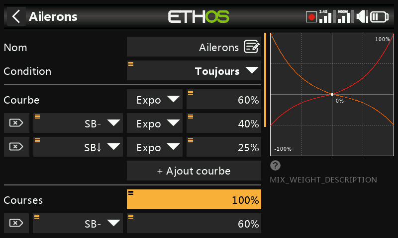

La boîte de dialogue des options de valeur indique le paramètre en cours
d'édition et propose un choix entre un minimum/maximum fixe ou son pilotage
par une **source** (un potentiomètre par exemple, ce qui permet d'ajuster la
valeur en vol). Si le champ utilise déjà une source, le même appui long vous
permet à la place de convertir la valeur actuelle de la source en une valeur
fixe :

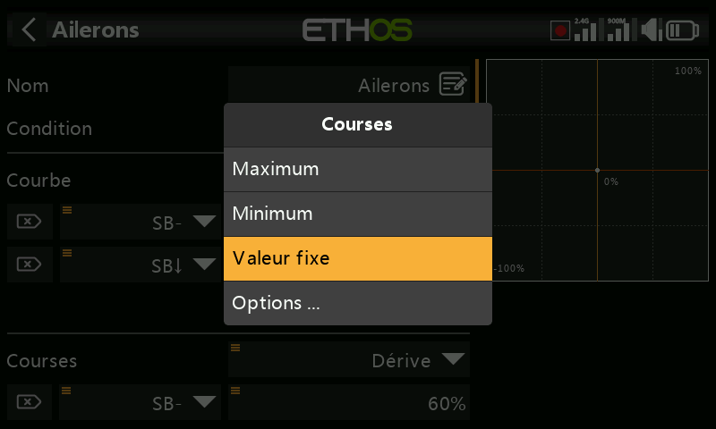

### Choix d'une source {: #choosing-a-source }

Sélectionner **Choisir une source** ouvre un sélecteur à deux colonnes —
d'abord une **catégorie** (analogiques, inters, inters logiques, trims,
voies, un axe gyroscopique, une voie d'écolage, un chrono, un capteur de
télémétrie ou quelques valeurs spéciales), puis l'élément précis de
celle-ci :

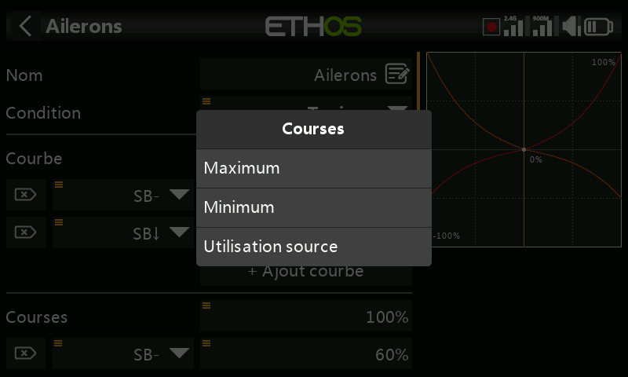

Une fois la source définie, le même appui long ouvre les options
disponibles en fonction du type de source :

**Toute source** —

- **Inverser** — permet d'annuler ou d'inverser la source (par exemple,
  active lorsque l'inter n'est *pas* en haut, au lieu de l'être lorsqu'il
  l'est).
- **Front** — se déclenche une seule fois lors d'un changement d'état
  (FAUX→VRAI ou VRAI→FAUX) plutôt que de rester actif pendant tout l'état ;
  signalé par un préfixe `†` sur la source. Disponible sur les inters en
  général, et plus particulièrement sur la condition de déclenchement de
  l'[inter logique Sticky](../model-setup/logical-switches.md).

**Sources de type manche** — options de type calibration/subtrim :

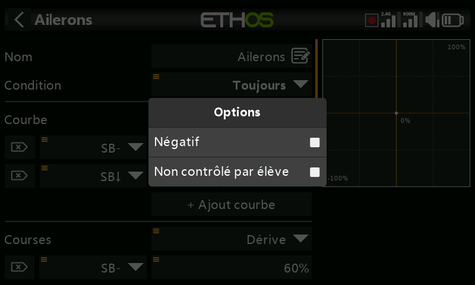

**Sources de type inter** —

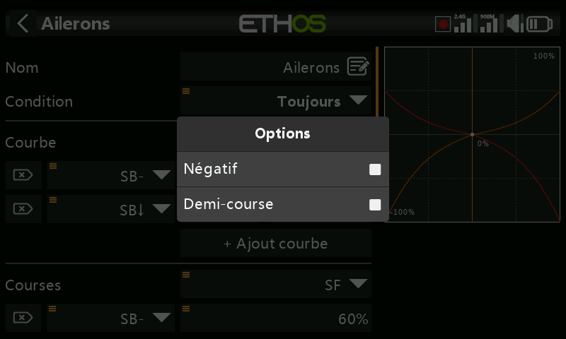
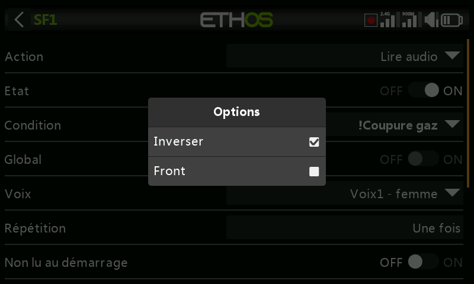

- **Négatif** — inverse l'action de l'inter.
- **Demi-course** — pour un inter à 2 positions ou un inter logique, la
  plage de sortie devient [0-100 %] au lieu de [-100 %-100 %].

**Sources de type trim** —

- **Négatif** — inverse l'action du trim (utile dans les Actions d'un
  mixage libre).
- **Course complète** — par défaut, les trims ont une plage de +/- 25 % de
  la course ; lorsqu'ils sont utilisés comme source, celle-ci peut être
  élargie à +/- 100 %.
- **Non contrôlé par l'élève** — sur un [inter
  logique](../model-setup/logical-switches.md), cette option permet
  d'ignorer la valeur provenant de l'entrée de l'élève. Une application
  typique est celle où l'on détecte le mouvement des manches du côté
  *instructeur* (par exemple pour permettre une intervention instantanée en
  cas de problème) sans que les commandes de l'élève déclenchent également
  l'inter.

**Sources de type variable** —

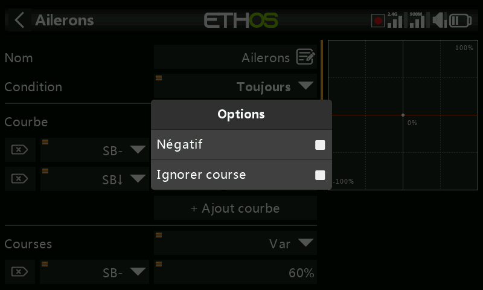

- **Négatif** — rend négative la valeur de la variable pour cet usage.
- **Ignorer la plage** — certains paramètres ont des plages asymétriques,
  comme les paramètres Min/Max dans Sorties, qui ont des plages de
  (−150 % à 0 %) et (0 % à +150 %) respectivement. Lorsque vous utilisez une
  [variable](../model-setup/variables.md) comme source d'un tel paramètre, à
  moins que celle-ci n'ait une plage identique, il sera nécessaire d'activer
  cette option pour contourner la conversion automatique de plage d'Ethos et
  éviter les valeurs inattendues.

**Sources de type capteur de télémétrie** — **Mini** et **Maxi** prennent en
compte la valeur minimale ou maximale du capteur à la place de la valeur en
temps réel (certains capteurs proposent en outre des options qui leur sont
propres) :

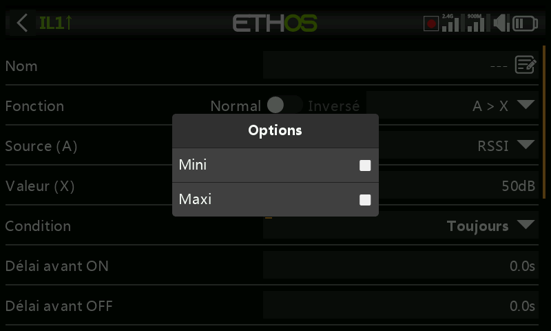
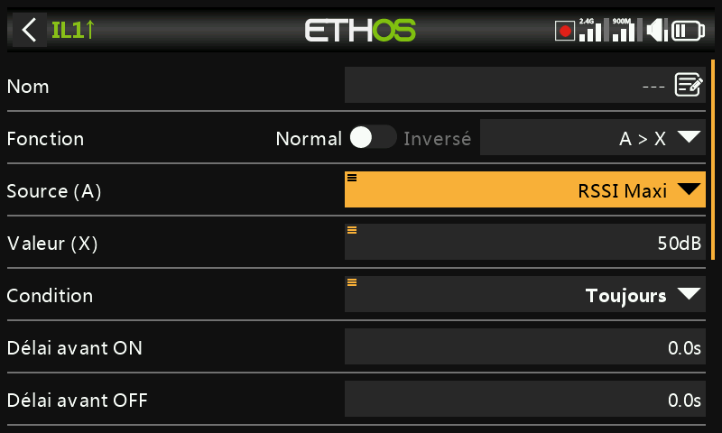
