# Alerte de capacité de batterie

Alerte basée sur la **capacité consommée** (mAh) plutôt que sur la tension — une mesure plus directe de la part de la batterie réellement utilisée. Deux méthodes sont possibles, selon le matériel installé.

## Option A : un ESC de la série Neuron

Les ESC Neuron de FrSky transmettent directement la consommation — aucun capteur calculé n'est nécessaire. Dans [Options du récepteur → Port de télémétrie](../system-setup/devices.md), définissez le port de télémétrie sur l'option S.Port, connectez le câble de télémétrie du Neuron, puis [découvrez les capteurs](../model-setup/telemetry.md#discovering-sensors) — le capteur d'intérêt est **ESC Consumption**.

1. Ajoutez un [inter logique](../model-setup/logical-switches.md) pour surveiller `ESC Consumption`, qui devient Vrai au-dessus de (par exemple) 900 mAh — soit environ 60 % d'une batterie dimensionnée pour atterrir avec encore ~30 % de réserve.
2. Ajoutez une [fonction spéciale Play audio](../model-setup/special-functions.md), avec le nouvel inter logique comme condition d'activation, et une étape **Play value** pour `ESC Consumption`.

Comme mesure de sécurité supplémentaire, les ESC Neuron transmettent également **ESC Voltage** — configurez un second inter logique de la même manière que dans [Alerte de tension de batterie basse](low-battery-warning.md) (en dessous de 3,4 V par cellule pendant 4 secondes — soit 13,6 V pour un LiPo 4S), avec sa propre fonction Play audio répétée toutes les 5 secondes.

## Option B : un capteur de courant + un capteur calculé

Si l'ESC ne transmet pas la consommation, un capteur de courant (par exemple de la série FrSky FASxxx) associé à un [capteur de consommation calculé **Consumption**](../model-setup/telemetry.md#calculated-sensors) remplit la même fonction.

### 1. Connecter et découvrir

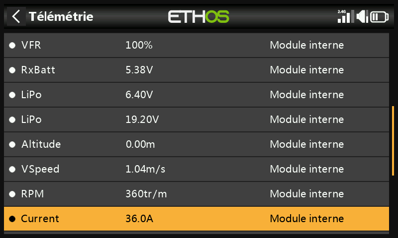

Connectez le câble S.Port du capteur de courant et lancez la découverte — il apparaît sous le nom **Current**. Réglez sa **Plage** en fonction du capteur (par exemple 0–100 A pour un FAS100) :

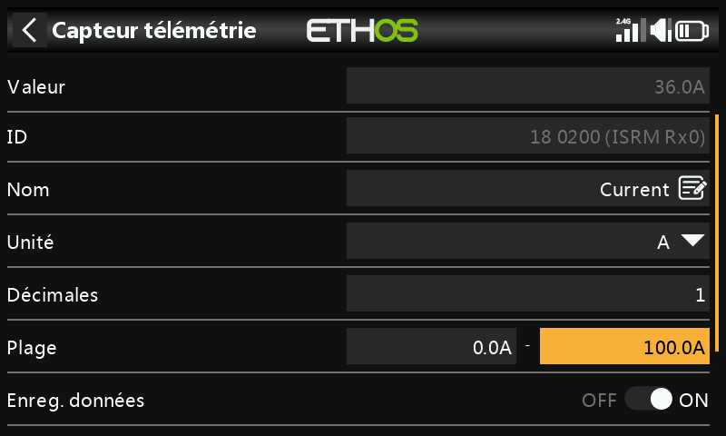

### 2. Créer le capteur calculé Consumption

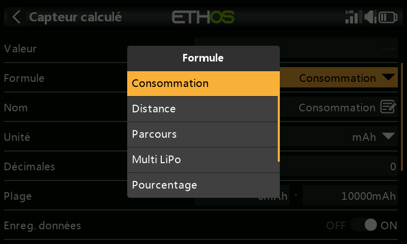
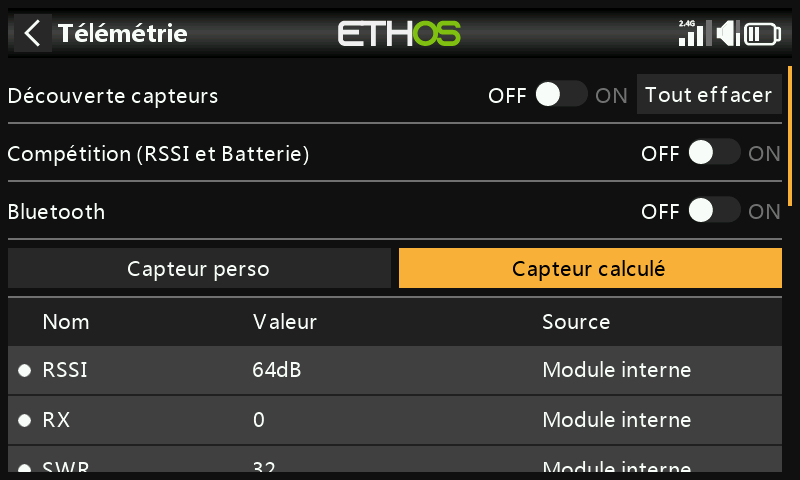

Dans Télémétrie, cliquez sur **Créer un capteur calculé** → **Consumption**. Réglez les unités sur `mAh` et la **Plage** en fonction de la capacité de la batterie (par exemple 2800 mAh) ; la **Source** sur `Current`.

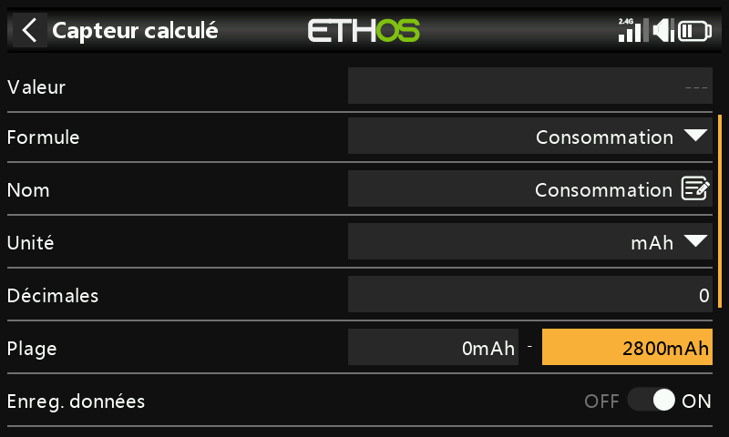
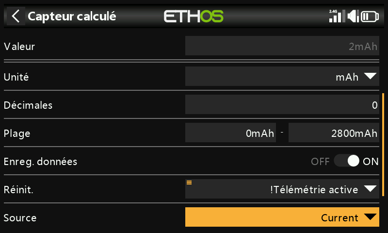

Réglez **Reset** sur l'événement système `!Telemetry Active` — sélectionnez d'abord **Telemetry Active**, puis appuyez longuement sur `ENT` et choisissez **Inverser** — ainsi le total cumulé est réinitialisé automatiquement dès que la télémétrie est perdue (c'est-à-dire lorsque le modèle est éteint).

### 3. Annonces par palier

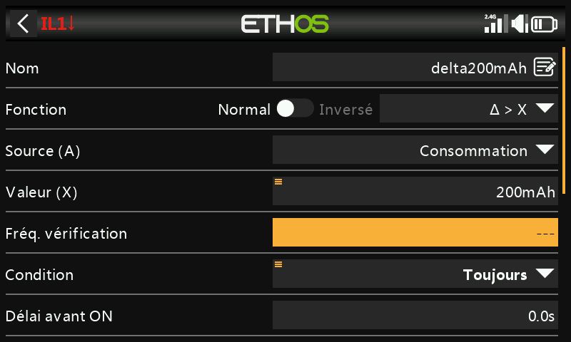

Ajoutez un inter logique utilisant la fonction Delta **Δ > X** pour surveiller `Consumption`, qui se déclenche chaque fois que la valeur augmente d'un pas fixe — par exemple tous les 200 mAh, une fraction pratique d'une batterie de 2800 mAh.

!!! tip
    Réglez l'**Intervalle de vérification** sur `---` (Infini) afin que la fonction continue à cumuler indéfiniment jusqu'au seuil suivant plutôt que d'être réinitialisée après une fenêtre fixe. Donnez à la **Durée minimale** une petite valeur supérieure à 0 pendant le débogage — à 0.0, cela se produit trop vite pour le voir à l'écran.

Ajoutez une fonction spéciale Play audio, avec cet inter logique comme condition d'activation, et une étape Play value pour `Consumption` :

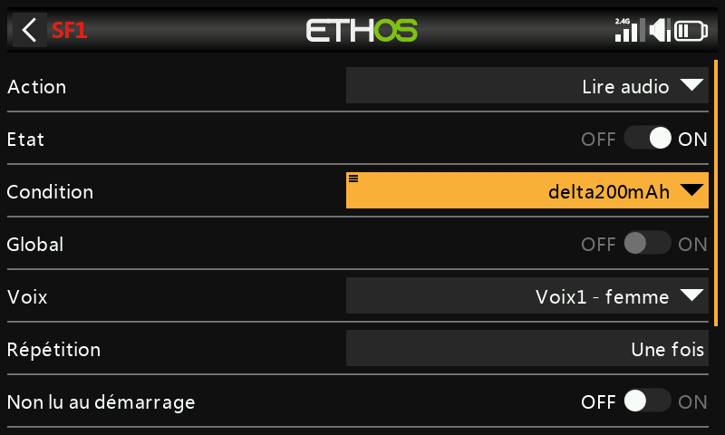
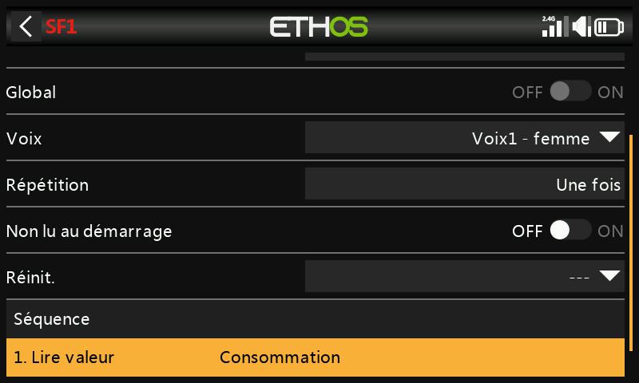

### 4. Alerte de capacité basse

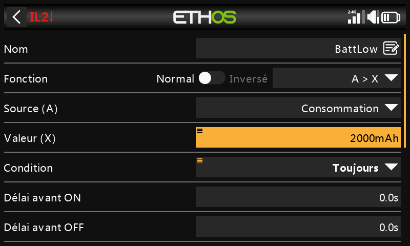

Un second inter logique se déclenche une seule fois, au-delà d'un seuil bas strict de capacité — par exemple 2000 mAh sur une batterie de 2800 mAh — associé à une fonction Play audio répétée toutes les 10 secondes jusqu'à la réinitialisation du modèle :

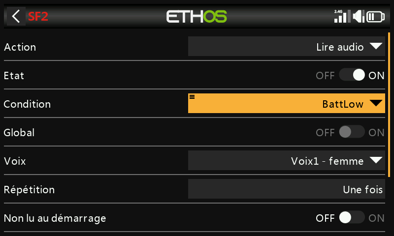
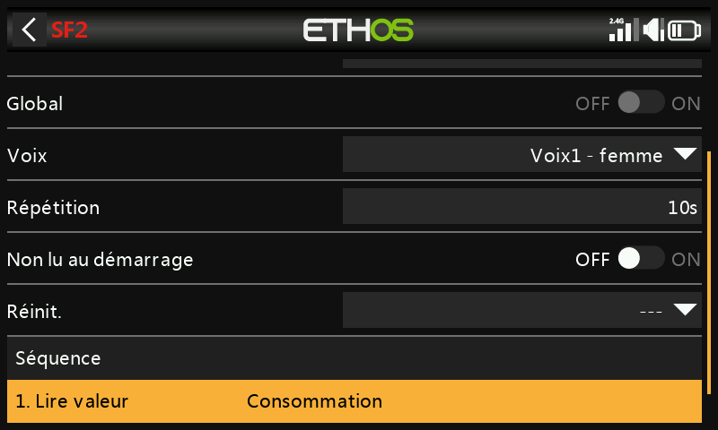
