# Mixage Butterfly (Crocodile)

Le freinage butterfly (aussi appelé « crow ») contrôle le taux de descente,
principalement sur les planeurs : les ailerons se relèvent modérément
tandis que les volets s'abaissent fortement, créant une traînée
importante — idéal pour maîtriser une approche à l'atterrissage. Ce
tutoriel part d'un planeur dont les voies de volets existent déjà (créées
par l'assistant [Choix du modèle](../model-setup/model-select.md)), en
utilisant le manche des gaz comme entrée de frein : aucun butterfly
manche en haut, de plus en plus à mesure qu'il descend, avec une
compensation à la profondeur pour éviter que le planeur ne remonte
lorsque le crow est appliqué.

## 1. Désactiver le mixage Volets par défaut

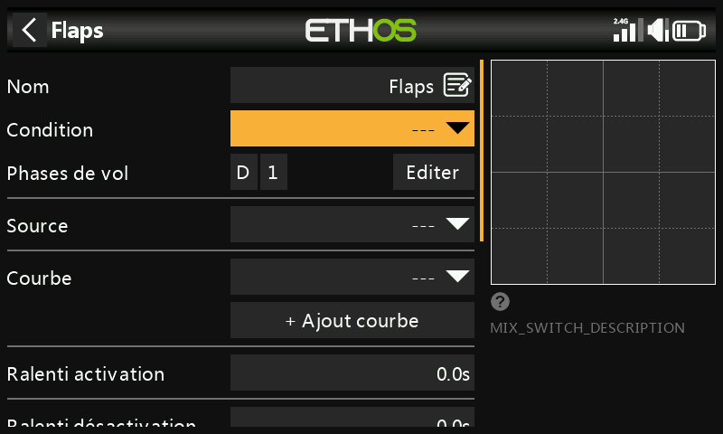

Réglez la **Condition d'activation** du mixage Volets créé par
l'assistant sur `---` — il ne sera pas utilisé.

## 2. Créer le mixage Butterfly

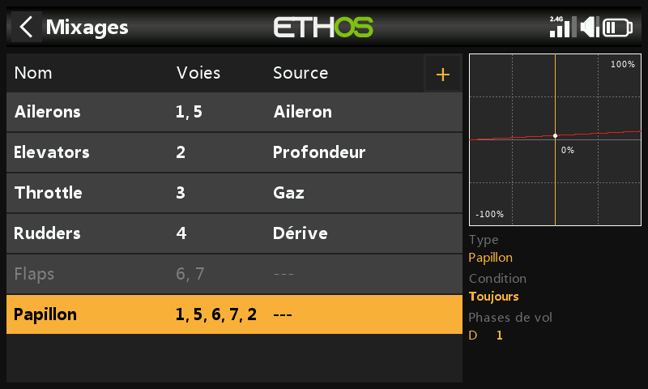

Appuyez sur n'importe quel mixage, **Ajouter un mixage** → **Butterfly**
depuis la [bibliothèque de
mixages](../model-setup/mixes.md#mix-libraries), placé après le mixage
Volets (désormais désactivé).

## 3. Configurer l'entrée

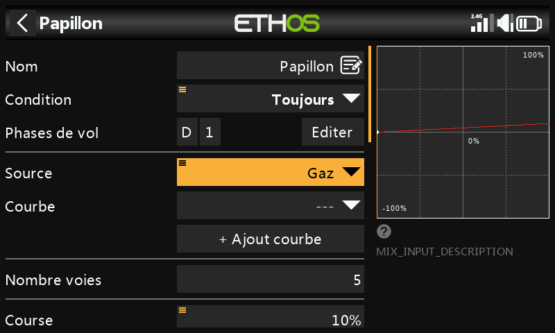

Réglez **Entrée** sur **Gaz**. Comme les gaz indiquent normalement le
maximum manche en haut, alors que le butterfly doit être à 0 manche en
haut, faites un appui long sur `ENT` sur Gaz et sélectionnez
**Inverser** :

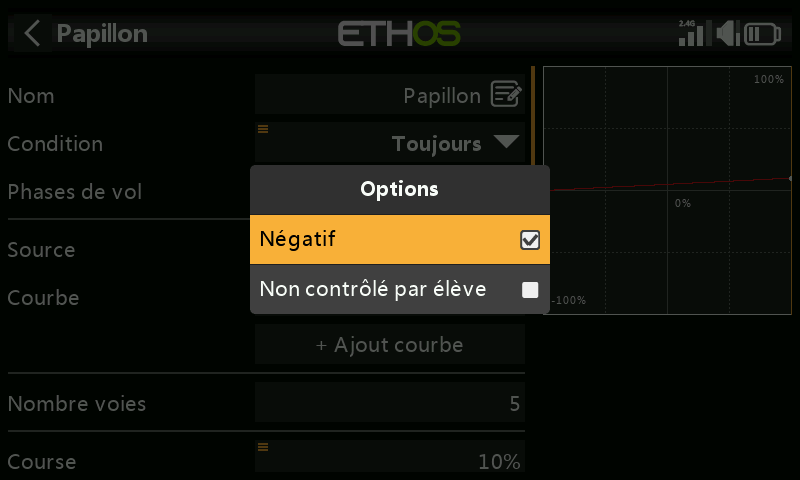
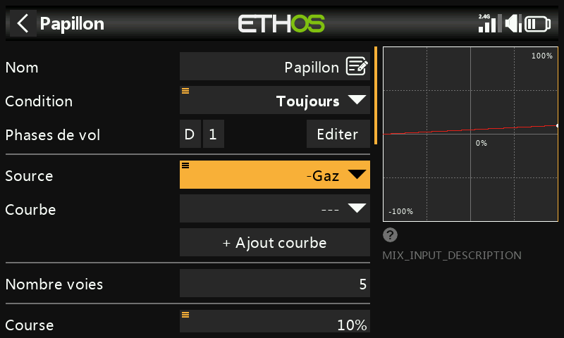

L'entrée indique maintenant 0 lorsque le manche est complètement en
haut, et le champ affiche `-Throttle` pour confirmer l'inversion. Réglez
la **Condition d'activation** sur une phase de vol d'atterrissage (ou un
autre interrupteur) si le butterfly ne doit pas être disponible en
permanence.

## 4. Ajouter une courbe avec zone neutre

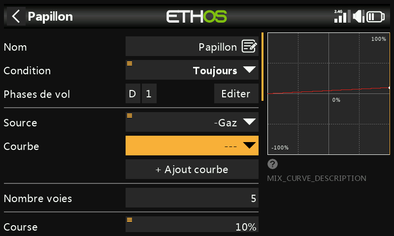

Une petite zone neutre à l'extrémité zéro du manche évite un
déploiement accidentel dû à de faibles variations près de la butée.
Ajoutez une courbe personnalisée à 3 points (nommée par exemple
« Crowdb ») avec le **Mode simple** désactivé, afin de pouvoir déplacer
les points X :

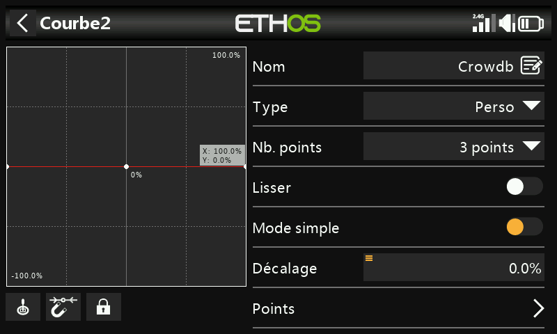
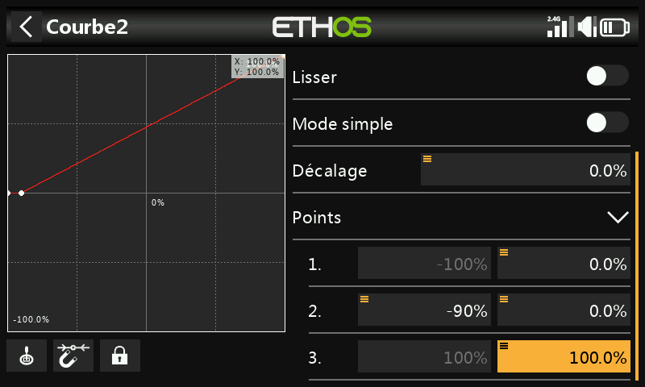

!!! note
    L'ajout d'une courbe personnalisée au mixage Butterfly supprime son
    décalage interne 0–100 (normalement appliqué automatiquement) — la
    courbe elle-même doit désormais reproduire cette transformation
    0–100. Dans cet exemple, la sortie reste à 0 % jusqu'à ce que le
    manche des gaz atteigne −90 %, puis augmente linéairement jusqu'à
    100 % :

    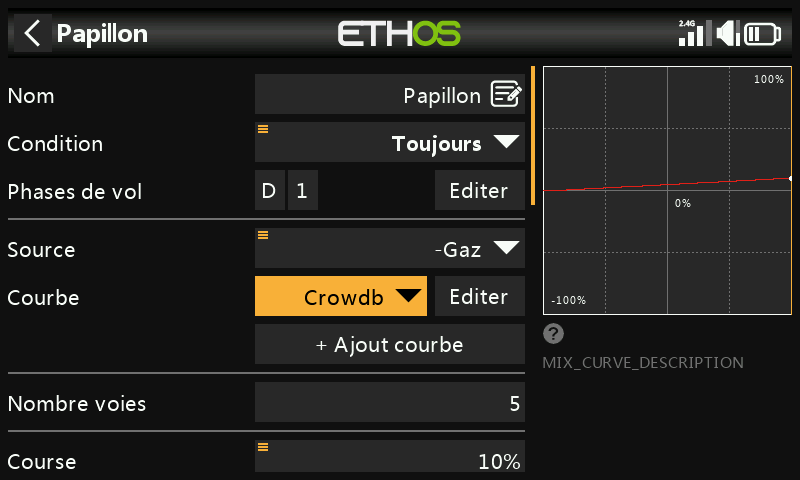

## 5. Configurer les ailerons et les volets

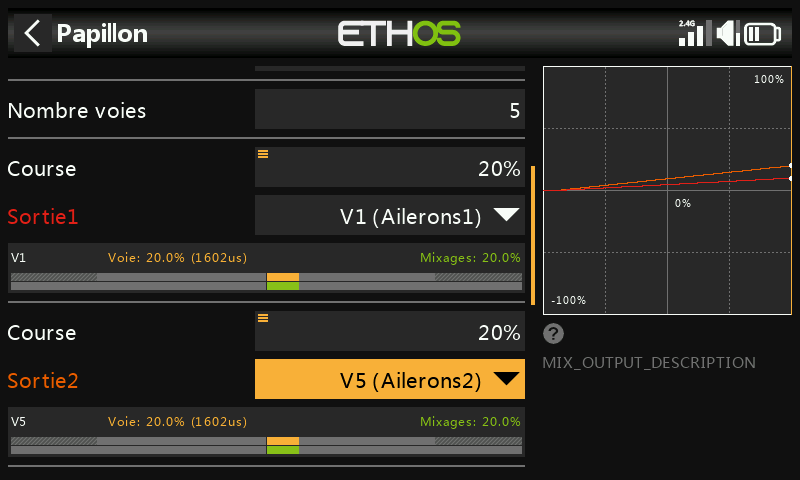

Une remontée modérée des ailerons (par exemple 20 %) associée à un fort
débattement des volets constitue la répartition habituelle. Les volets
nécessitent généralement beaucoup plus de course vers le bas que vers le
haut — ce qui est couramment obtenu en décalant les palonniers des
servos de volets de 20 à 30° par rapport au neutre dans la timonerie
elle-même, ce qui laisse les volets à peu près à mi-course vers le bas
au neutre du servo :

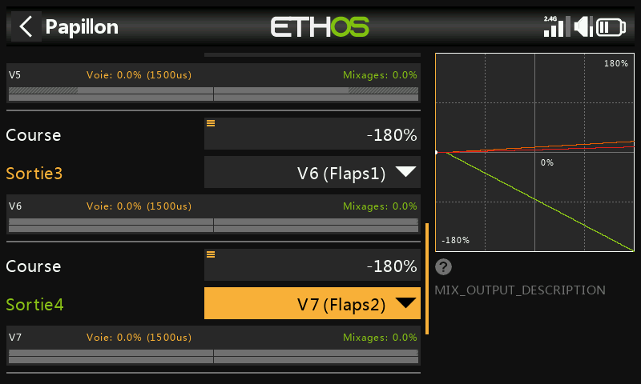
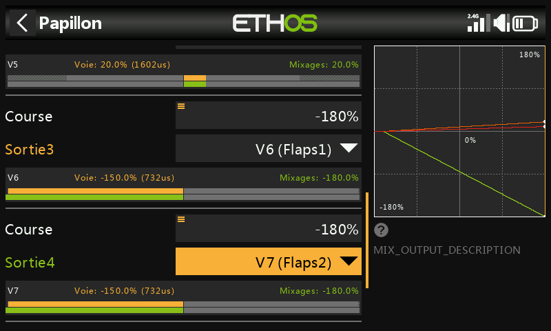

Réglez le poids du mixage des volets à une valeur élevée (par exemple
−180 %) pour un débattement maximal ; la course physique réelle est
déterminée par les valeurs Min/Max des
[Sorties](../model-setup/outputs.md).

!!! tip
    Pour éviter de forcer sur les servos, commencez avec des valeurs
    Min/Max de Sorties prudentes (par exemple ±30 %) et élargissez-les
    avec précaution lors du réglage final, en surveillant les points de
    blocage.

## 6. Ajouter un mixage de décalage « Volets neutres »

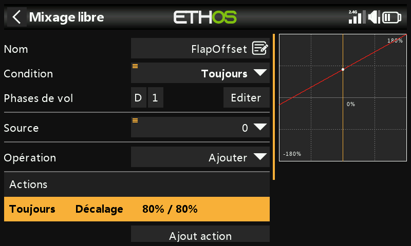

Comme le décalage des palonniers laisse les volets déviés d'environ 20 à
30 % au neutre du servo, un **mixage Offset** les ramène à la véritable
position neutre de l'aile pour le vol normal. Commencez avec un décalage
de 80 % (à affiner), avec 2 voies de sortie affectées aux deux voies de
volets :

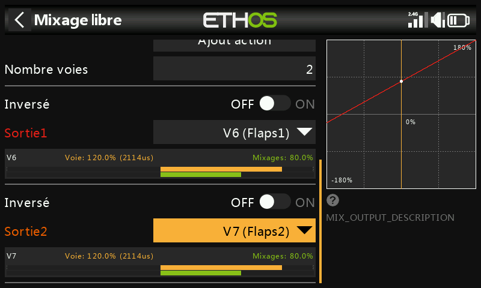
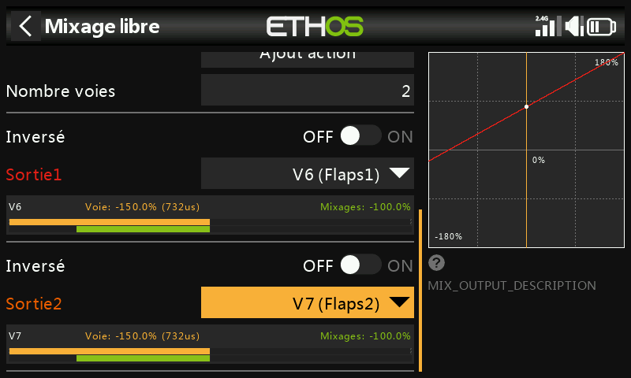

Avec le manche des gaz complètement en haut (mixage Butterfly inactif),
vérifiez que les valeurs du mixage des volets se situent au niveau du
décalage (80 %) ; en amenant le manche des volets en position
complètement déployée, la sortie du mixage doit se déplacer de la
totalité du poids (par exemple de 80 % à −100 %, soit une amplitude de
180 %). Affinez les limites de course réelles dans les Sorties à l'aide
des valeurs Min/Max ou d'une courbe.

## 7. Ajouter la courbe et le mixage de compensation de profondeur

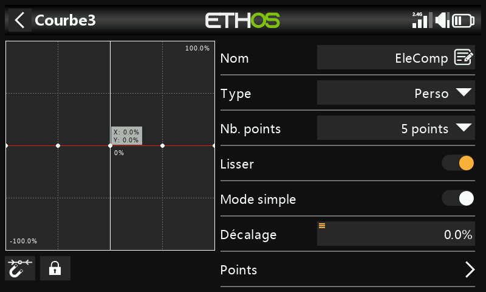
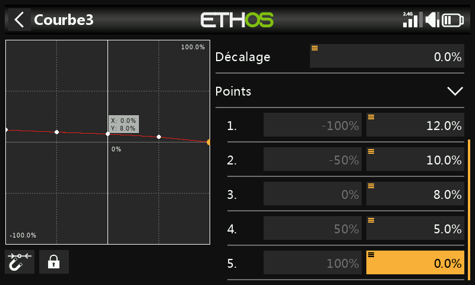

Comme la compensation nécessaire n'est pas linéaire, utilisez une courbe
plutôt qu'un poids fixe. Définissez une courbe personnalisée à 5 points
(par exemple « EleComp ») — cet exemple part de 12 %/10 %/8 %/5 %/0 % sur
ses différents points ; en l'absence de valeurs de départ connues pour
votre cellule, celles-ci doivent être déterminées empiriquement.

Ensuite, convertissez cette courbe en une valeur utilisable comme
**Poids** de mixage : ajoutez un [Mixage
libre](../model-setup/mixes.md#mix-libraries) (« EleCompx ») avec Gaz
comme source et la courbe EleComp associée, avec une sortie sur une voie
élevée non utilisée (par exemple CH20) :

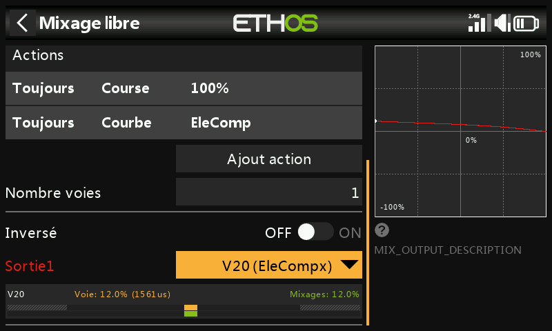

De retour dans le mixage Butterfly, faites un appui long sur `ENT` sur le
**Poids** de la sortie Profondeur, **Utiliser une source**, puis
sélectionnez CH20 (EleCompx) dans la catégorie Voies :

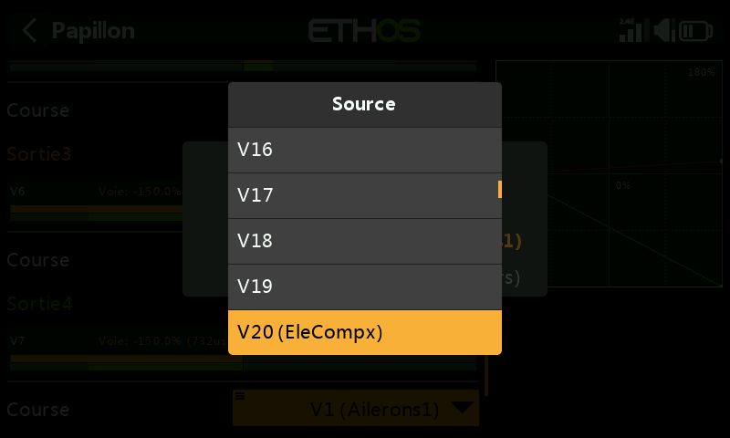
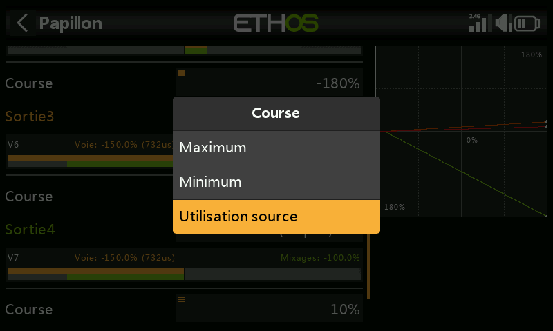

Le mixage Butterfly est maintenant entièrement configuré :

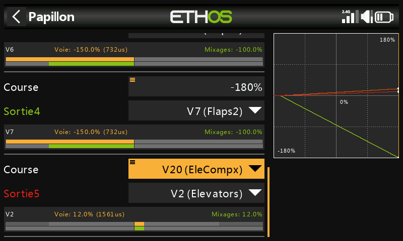

## 8. Vérifier avec la vue par voie

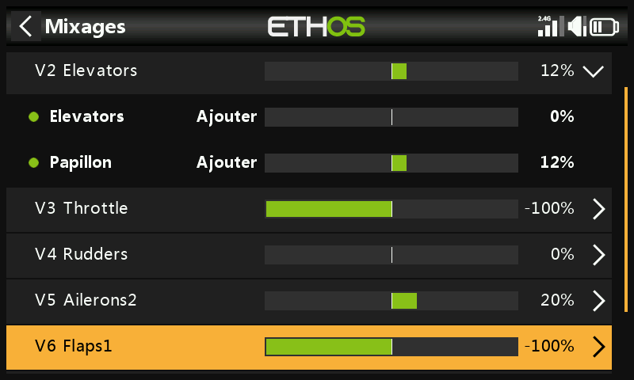

Passez en [vue par voie](../model-setup/mixes.md#per-channel-view) sur la
Profondeur pour observer la mise à jour simultanée de tous les mixages
contributeurs (entrée manche + compensation Butterfly) lorsque le manche
des gaz/frein se déplace — bien plus facile à déboguer que la vue en
tableau classique.

!!! tip
    Il est utile de disposer de données sur la course de profondeur
    nécessaire en fonction du débattement des volets (fournies par le
    fabricant de la cellule ou issues de sources communautaires) avant
    de définir les valeurs de départ de la courbe de compensation. À
    défaut, commencez par quelques millimètres de course de profondeur
    pour un déploiement complet des volets, puis affinez à partir de là.
