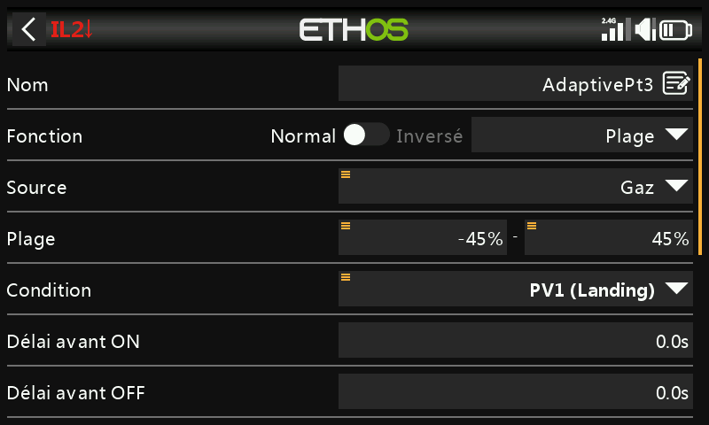
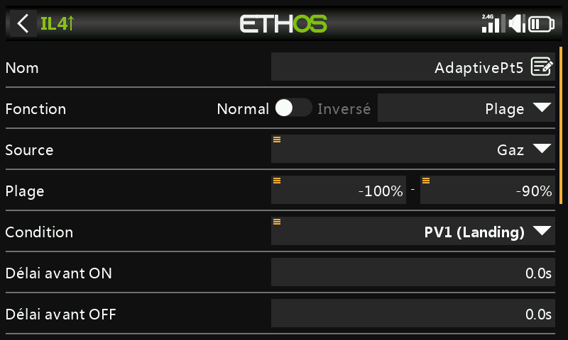
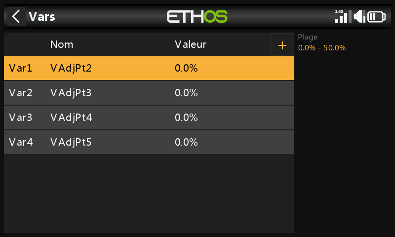
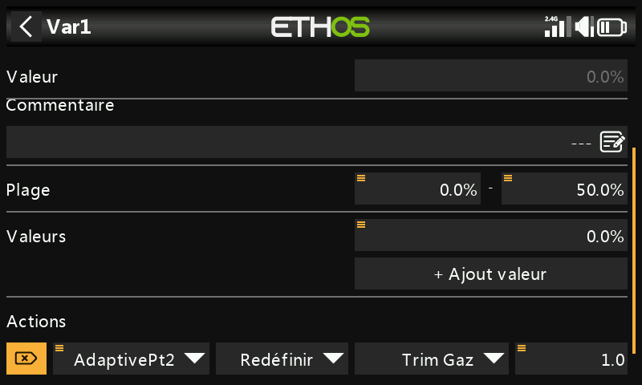
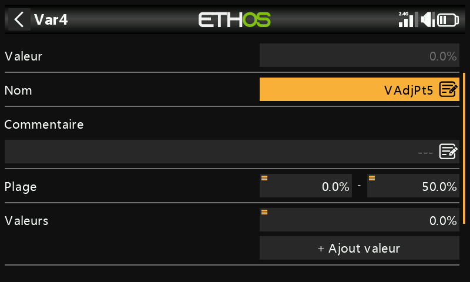
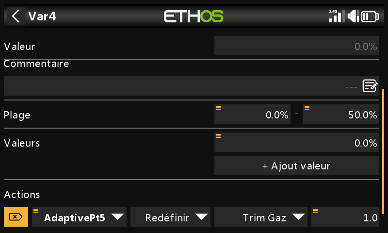
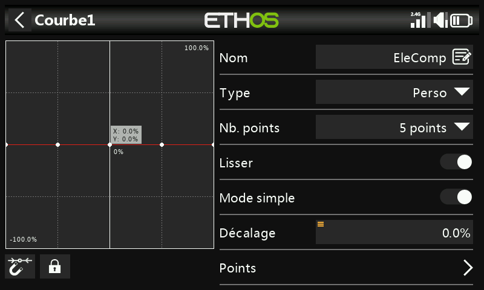
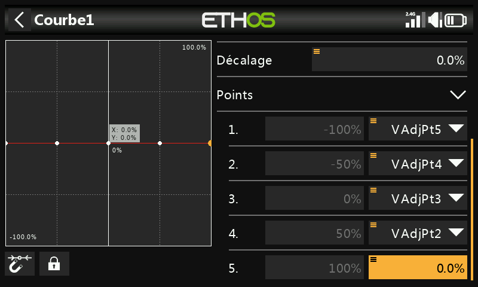

# Courbe de compensation ajustable en vol

## Pourquoi

Le déploiement des volets modifie la courbure de l'aile — les modèles à
aile haute ont tendance à « cabrer », les modèles à aile basse à
s'enfoncer — ce qui nécessite une correction de profondeur non linéaire
par rapport au débattement des volets, donc une courbe plutôt qu'un
décalage fixe. Ce guide utilise les [Vars](../model-setup/variables.md)
pour rendre les points d'une courbe de compensation ajustables **en vol**,
au moyen d'un trim de gaz détourné de son usage, conditionné par le point
de courbe dont le manche de volets est actuellement le plus proche — en
s'appuyant sur l'étape de compensation de profondeur du [Guide pratique :
mixeur papillon](butterfly-mixer.md).

## 1. Choisir le type de courbe

Une [courbe personnalisée](../model-setup/curves.md) à 5 points suffit
pour obtenir une compensation progressive sans complexité excessive. Le
point 5 (le plus à droite, manche de volets entièrement en haut / aucun
volet) reste toujours fixé à zéro — aucune compensation n'est nécessaire
lorsque les volets ne sont pas déployés. Les 4 autres points sont rendus
ajustables au moyen de Vars. Comme le manche de volets se trouvera
souvent entre deux points définis, les deux points situés de part et
d'autre doivent pouvoir être ajustés conjointement dans cette zone de
recouvrement.

## 2. Calculer les plages de recouvrement

Plages point à point (adaptées, avec autorisation, du « Crow-aware
adaptive elevator trim » de Mike Shellim pour OpenTX sur rc-soar.com —
légèrement étendues afin que la plage du Pt2 atteigne +100 %, pour la
raison expliquée à l'[Étape 6](#6-apply-the-curve)) :

| Plage du manche de volets | Point(s) actif(s) |
|---|---|
| +100 % à +45 % | Pt2 uniquement |
| +45 % à +20 % | Pt2 et Pt3 |
| +20 % à −20 % | Pt3 uniquement |
| −20 % à −45 % | Pt3 et Pt4 |
| −45 % à −90 % | Pt4 uniquement |
| −90 % à −100 % | Pt5 uniquement |

## 3. Configurer les interrupteurs logiques

Quatre [interrupteurs logiques](../model-setup/logical-switches.md),
chacun utilisant **Range** sur le manche de volets (gaz), actif lorsque
le manche se trouve dans la zone du point concerné :

- `AdaptivePt2` — plage de 20 % à 100 % (étendue jusqu'à 100 %
  spécifiquement pour que le Pt2 puisse être ajusté même sans volets
  déployés — voir l'Étape 6).

  

- `AdaptivePt3` — plage de −45 % à 45 %.

  

- `AdaptivePt4` — plage de −90 % à −20 %.

  

- `AdaptivePt5` — plage de −100 % à −90 %.

  

## 4. Définir les Vars d'ajustement

Quatre [Vars](../model-setup/variables.md), `VAdjPt2`–`VAdjPt5`, chacune
avec une plage de 0 à 50 % (à élargir si nécessaire) et une action de
**trim de gaz détourné** — pas de 1,0 %, condition d'activation
correspondant à l'interrupteur logique associé :

Comme un seul interrupteur logique (deux au maximum, dans les zones de
recouvrement) est actif à la fois, le même trim physique ajuste sans
risque différentes Vars selon la position des volets.

## 5. Définir la courbe de compensation

Créez une nouvelle courbe personnalisée à 5 points (par ex. « EleComp »)
avec **Smooth** activé. Faites un appui long sur `ENT` sur les points 1 à
4 et choisissez **Use a source** pour affecter respectivement
`VAdjPt5`…`VAdjPt2` (le point 5 reste fixé à 0, conformément à l'Étape 1).

## 6. Appliquer la courbe

Utilisez cette courbe exactement à l'endroit où le [Guide pratique :
mixeur papillon](butterfly-mixer.md#7-add-the-elevator-compensation-curve-and-mix)
rattache sa courbe EleComp au mixage de compensation de profondeur.

Dans la mesure du possible, partez de données réelles (recommandations du
fabricant, publications de la communauté) sur le débattement de
profondeur nécessaire pour un débattement de volets donné ; sinon,
quelques millimètres de compensation à volets pleins constituent un point
de départ raisonnable.

!!! tip "Approche du réglage"
    Commencez par de faibles débattements de volets et de petits
    ajustements de trim. `AdaptivePt2` peut être réglé **sans aucun volet
    déployé** — sortez un peu les volets, rentrez-les, et affinez la
    compensation petit à petit, plutôt que de lutter contre un modèle qui
    cabre ou s'enfonce tout en essayant de trimmer sous pression.
    Ressortez un peu les volets pour vérifier, puis ajustez de nouveau si
    nécessaire. Une fois le Pt2 satisfaisant, passez au point suivant
    autour du milieu de course du manche — si le Pt2 a nécessité une
    correction de trim importante, il vaut la peine d'atterrir et de
    régler les points restants pour que chacun soit légèrement plus
    important que le précédent, plutôt que de deviner à l'aveugle.
