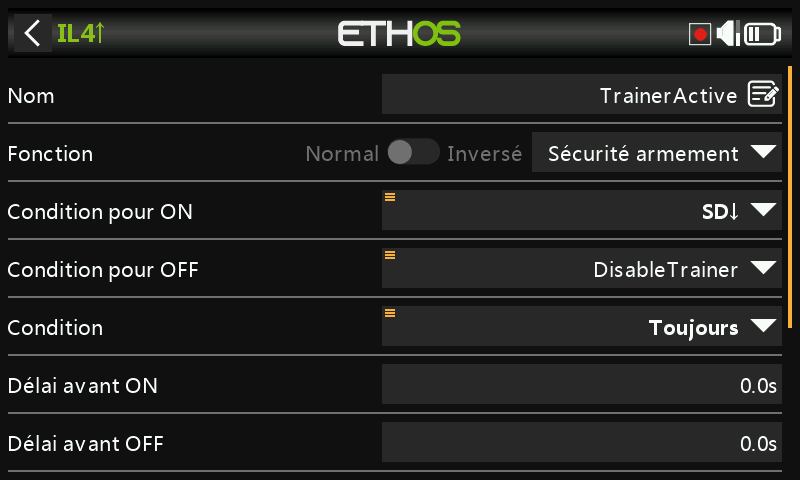
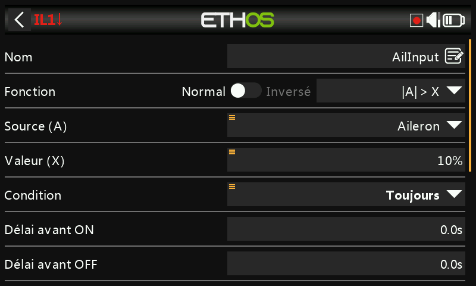
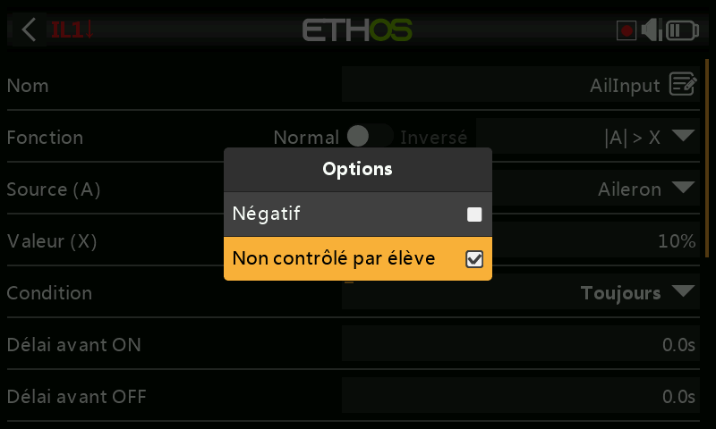
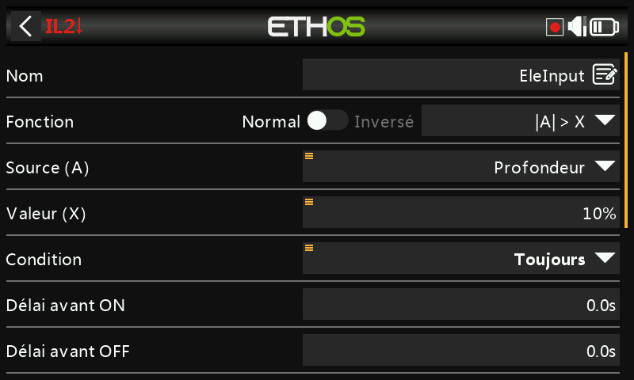
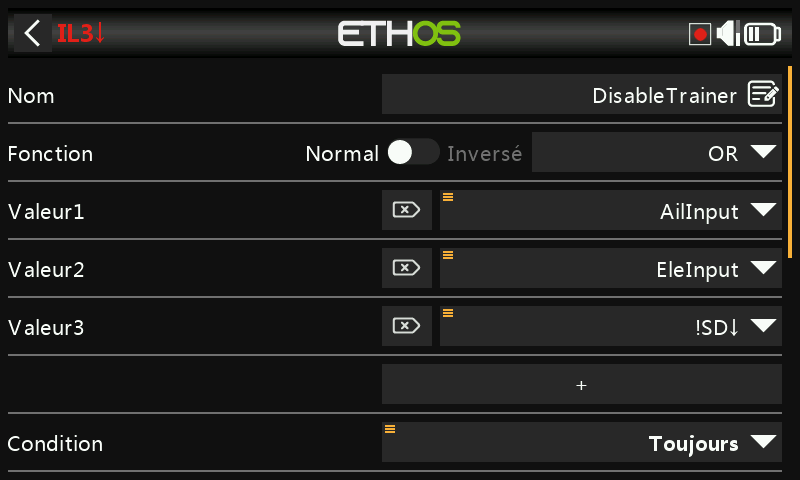

# Reprise instantanée du contrôle pour la fonction Écolage

Une amélioration utile de la fonction [Écolage](../model-setup/trainer.md) :
au lieu de dépendre uniquement d'un interrupteur, l'instructeur peut
reprendre le contrôle instantanément en bougeant simplement le manche
d'ailerons ou de profondeur — inutile de chercher d'abord l'interrupteur
d'écolage en cas de problème.

L'interrupteur d'écolage démarre toujours la session ; c'est un
[interrupteur logique Sticky](../model-setup/logical-switches.md#sticky)
qui pilote la fonction Écolage elle-même, annulé soit par le passage de
l'interrupteur à l'état inactif, **soit** par la détection d'un mouvement
des manches de l'instructeur.

## 1. Interrupteur logique de détection des ailerons

Un interrupteur logique utilisant **|A| > X** sur le manche d'ailerons,
vrai lorsque celui-ci s'écarte de plus de 10 % du neutre dans un sens ou
dans l'autre. Effectuez un appui long sur la source ailerons et
sélectionnez **Ignore trainer input**, afin que le mouvement d'ailerons de
l'*élève* (transmis par la liaison d'écolage) ne le déclenche pas
également :

## 2. Interrupteur logique de détection de la profondeur

Le même principe, appliqué au manche de profondeur.

## 3. Interrupteur logique d'annulation

Un interrupteur logique **OR**, vrai lorsque l'interrupteur de détection
des ailerons ou celui de la profondeur est vrai, **ou** lorsque
l'interrupteur d'écolage (par ex. SD) n'est pas en position basse —
autrement dit, « l'instructeur a bougé un manche » ou « l'interrupteur
d'écolage a été coupé » met fin à la session.

## 4. Interrupteur logique Sticky d'activation de l'écolage

Un interrupteur logique de type **Sticky** : **Trigger ON** correspond à
l'interrupteur d'écolage (SD en position basse), **Trigger OFF** à
l'interrupteur d'annulation de l'étape 3. Utilisez cet interrupteur Sticky
— appelons-le `TrainerActive` — comme condition d'activation de la
fonction Écolage, à la place de l'interrupteur brut.

## 5. Retour sonore

Ajoutez des [fonctions spéciales Play Audio](../model-setup/special-functions.md)
annonçant le passage à l'état vrai de `TrainerActive` puis son
effacement, afin que les deux pilotes disposent d'une indication sonore
claire du moment exact où le contrôle change de mains.
