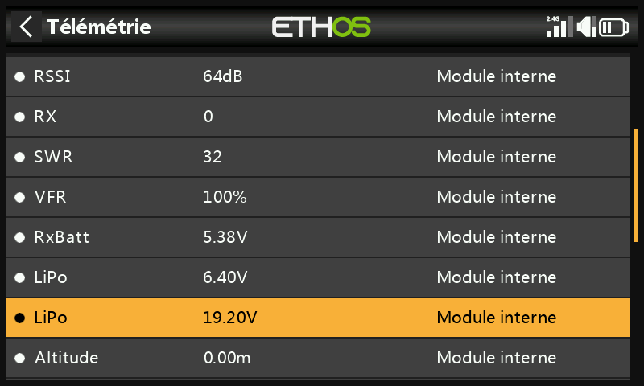
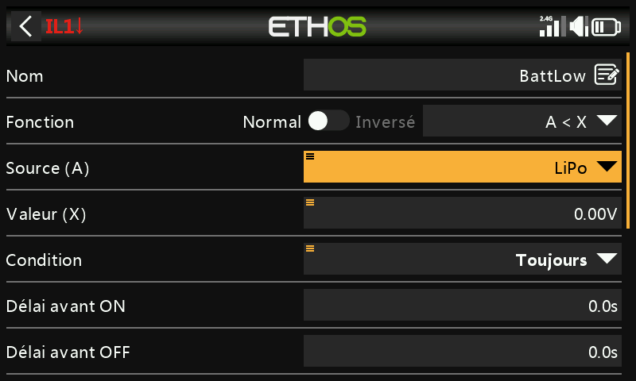
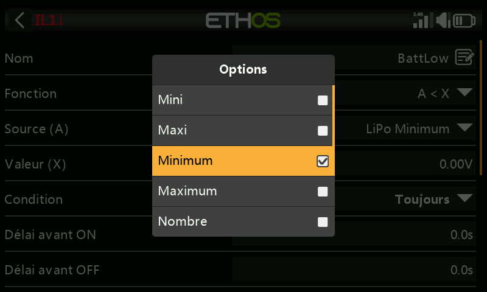
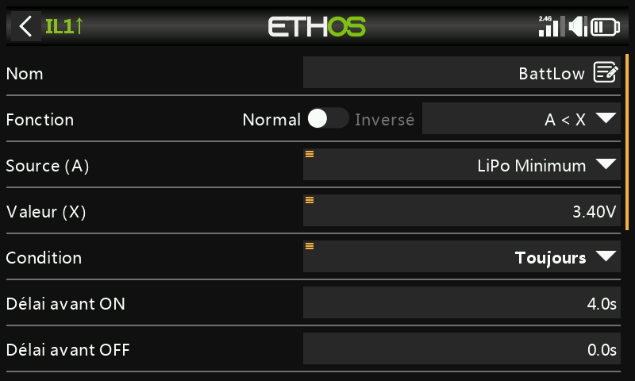
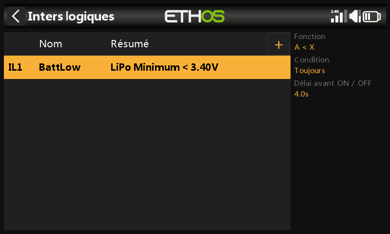
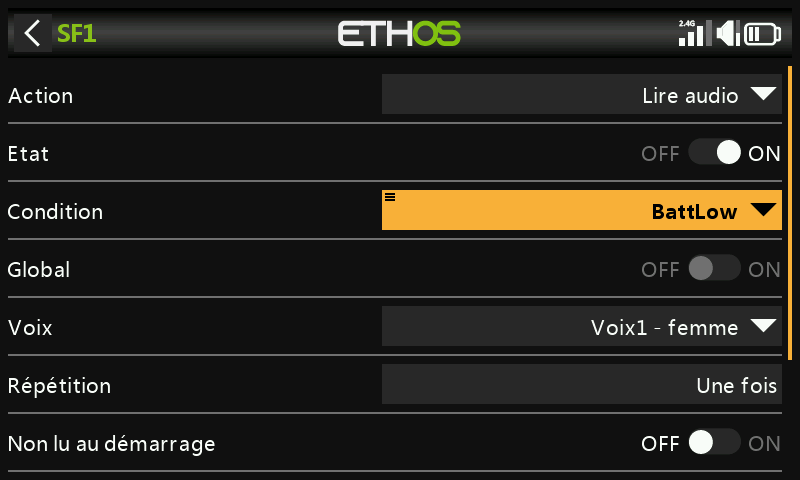
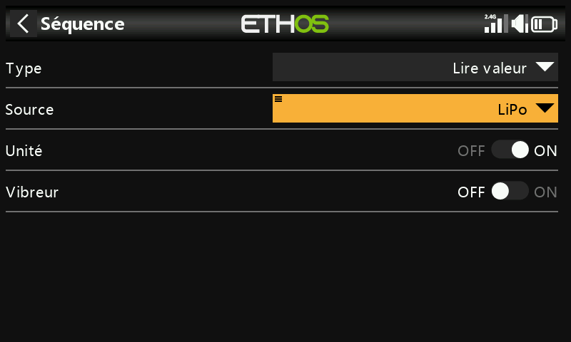
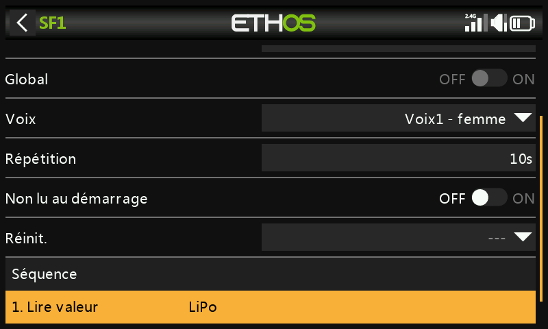

# Alerte de tension batterie basse

La surveillance de la tension du pack de propulsion **en charge**, avec une alerte lorsque la tension descend sous un seuil, est une approche plus fiable que de se fier à un chronomètre fixe — un capteur tel qu'un FrSky FLVSS rend cela très simple.

## 1. Connecter et détecter le capteur

Réglez [Options du récepteur → Port de télémétrie](../system-setup/devices.md) sur **S.Port**, connectez le FLVSS au récepteur à l'aide d'un câble S.Port, puis activez **Découvrir de nouveaux capteurs** dans [Télémétrie](../model-setup/telemetry.md) — le capteur LiPo apparaît aux côtés des autres capteurs déjà détectés.

## 2. Ajouter un interrupteur logique

Ajoutez un nouvel [interrupteur logique](../model-setup/logical-switches.md) en prenant le capteur LiPo comme source. Effectuez un appui long sur `ENT` sur le capteur mis en surbrillance pour choisir laquelle de ses valeurs utiliser :

- Tension mini du pack / Tension maxi du pack
- **Tension de la cellule la plus basse** / Tension de la cellule la plus haute
- Nombre de cellules
- Tensions individuelles des cellules (sélectionnables uniquement lorsque le capteur est effectivement connecté à un récepteur appairé, avec une LiPo raccordée)

Sélectionnez **Lowest** (tension de cellule) — la valeur qui compte pour une protection de type LVC.

Réglez la valeur de comparaison sur environ **3,4 V** et le **Délai avant activation** sur **4 secondes** — l'interrupteur passe à l'état vrai dès que la cellule la plus basse est mesurée en dessous de 3,4 V par cellule de façon continue pendant 4 s ou plus. (3,4 V *en charge* remonte généralement autour de 3,7 V une fois la charge supprimée ; ce seuil traduit donc une véritable chute de tension, et non un simple parasite momentané.)

## 3. Ajouter une fonction spéciale

Ajoutez une [fonction spéciale Jouer un son](../model-setup/special-functions.md), avec la **Condition d'activation** réglée sur l'interrupteur logique `BattLow`, choisissez une voix, puis, sous **Séquence**, ajoutez une étape **Annoncer une valeur** pour la tension totale de la LiPo :

Avec **Répétition** réglée sur 10 secondes, la tension de la LiPo est annoncée toutes les 10 s tant que la cellule la plus basse reste sous le seuil de 3,4 V pendant 4 s.
