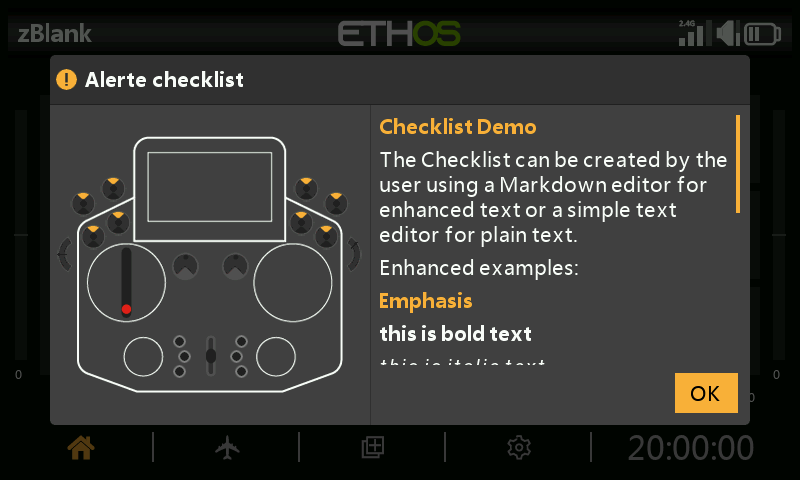

---
translated_from: 827e532e2b0324591f0fdbb61a39e61180642b24
---

# Liste de contrôle de texte définie par l'utilisateur



La fonction [Liste de contrôle](../model-setup/checklist.md) peut afficher du
texte défini par l'utilisateur au démarrage — texte brut ou texte amélioré au
format Markdown — automatiquement, à chaque fois que ce modèle est chargé.

## 1. Créez le texte de la liste de contrôle

**Texte brut** — rédigez-le à l'aide de n'importe quel éditeur de texte
(Notepad++, ou même MS Word enregistré en texte brut) et enregistrez-le sous
`<model name>.txt`.

**Texte amélioré (Markdown)** — Ethos prend en charge la syntaxe Markdown, par
exemple `##` pour désigner un titre, `**bold**` pour mettre du texte en gras.
Utilisez n'importe quel éditeur de texte (en incorporant vous-même les
caractères de mise en forme Markdown) ou un éditeur Markdown dédié (Nextpad,
MarkText, etc.), et enregistrez le fichier sous `<model name>.md`.

```markdown
## Emphasis
**this is bold text**
*this is italic text*
```

## 2. Copiez-le sur la radio

Copiez le fichier dans le dossier `models/` où se trouve le fichier `.bin` du
modèle (voir [Gestionnaire de fichiers](../system-setup/file-manager.md#top-level-folders)),
puis éjectez les lecteurs de la radio en toute sécurité avant de la déconnecter.

## 3. Passez-le en revue

Chargez votre modèle — le texte de la liste de contrôle s'affiche désormais
automatiquement dans le cadre des vérifications de démarrage, et vous pouvez le
faire défiler s'il occupe plus d'un écran.
