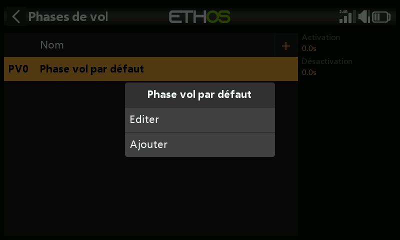
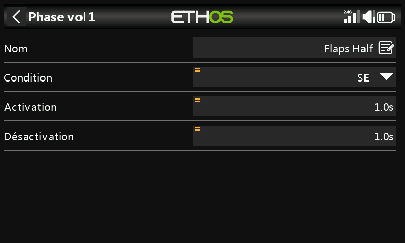
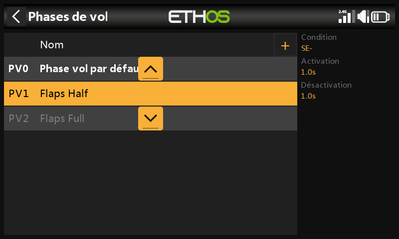
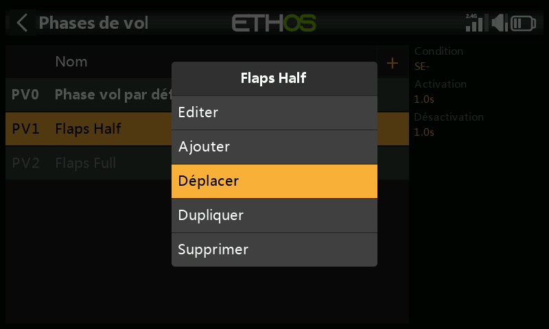
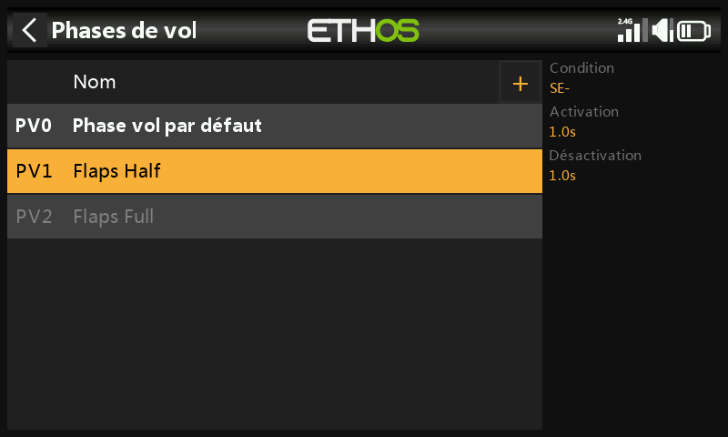

# Phases de vol

Les phases de vol permettent à un inter de sélectionner différents
comportements pour un même modèle — les planeurs peuvent utiliser
Lancement/Croisière/Vitesse/Thermique, les avions à moteur
Normal/Décollage/Atterrissage, les hélicoptères Normal (mise en régime,
décollage/atterrissage) / Idle Up 1 (vol acrobatique) / Idle Up 2 (3D).
Elles éliminent une grande partie de la charge de commutation et de trim
du pilote : une phase de vol peut prendre en charge ses propres trims
indépendants et peut également conditionner les [Vars](variables.md) et
les [Mixages](mixes.md) — ensemble, ces caractéristiques permettent de
gérer une réelle complexité. Reportez-vous à l'[Exemple de base pour aile
fixe](../tutorials/basic-fixed-wing.md) pour voir les phases de vol
appliquées à un modèle réel.

Aucune phase de vol n'est définie par défaut. Appuyez sur la phase de vol
par défaut et sélectionnez **Modifier** si vous souhaitez la renommer,
sinon sélectionnez **Ajouter** pour définir une nouvelle phase de vol —
jusqu'à 20 au total.

## Nom

Un nom descriptif — Croisière, Vitesse, Thermique, Décollage,
Atterrissage, ce qui convient.

## Condition d'activation

Lors de l'ajout d'une phase de vol, la condition d'activation est inactive
par défaut, c'est-à-dire `---`. Une fois définie, la phase de vol peut
être contrôlée par la position d'un inter ou d'un bouton, un inter de
fonction, un inter logique, un événement système tel que la coupure ou le
maintien de l'accélérateur, ou une position de trim.

La phase de vol **par défaut** n'a aucun paramètre « Condition
activation », car il s'agit de la phase active si aucune autre phase n'est
active. Une seule phase de vol peut être activée à la fois : la première
(dans l'ordre de priorité) dont la condition est vraie. La phase de vol
active est indiquée en gras.

!!! warning "Ajout d'une phase de vol à un modèle existant"
    Une phase de vol nouvellement ajoutée est, par défaut, active dans
    chaque mixage déjà dépendant des phases de vol — vérifiez que chacun
    de ces mixages fonctionne toujours correctement, en particulier un
    mixage **Lock** verrouillant une voie sur une phase de vol donnée.

## Activation progressive, désactivation progressive

Les temps attribués aux transitions progressives entre les phases de vol
(par exemple une seconde dans chaque sens) — cela n'a d'effet que sur les
mixages eux-mêmes dépendants des phases de vol.

## Gestion des phases de vol

Appuyez sur une phase de vol pour **Modifier**, **Ajouter**,
**Dupliquer** ou **Supprimer**. Une phase de vol **dupliquée** hérite des
paramètres de la phase de vol originale dans chaque mixage utilisant les
phases de vol — les mixages se comporteront de la même manière et seront
également actifs (ou non) — c'est pourquoi la phase dupliquée est ajoutée
par défaut en dernière position, afin de ne pas interférer avec les phases
existantes. L'option **Déplacer** modifie la priorité d'une phase de vol :
la priorité des phases de vol est dans l'ordre croissant et (comme indiqué
ci-dessus) la première dont la condition est vraie sera la phase active.
