# Interrupteurs logiques

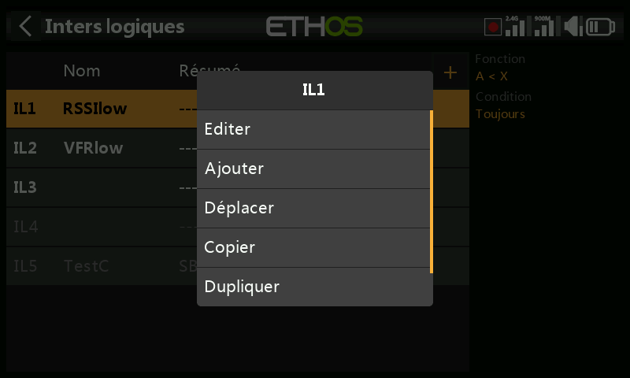

Les interrupteurs logiques sont des interrupteurs *virtuels* programmés par
l'utilisateur — ce ne sont pas des commandes physiques, mais ils s'utilisent
partout où un interrupteur physique peut l'être, comme déclencheur de
programme. Chacun évalue la condition configurée par rapport à ses entrées
(autres interrupteurs, valeurs de télémétrie, valeurs de mixage, valeurs de
chronomètre, voies gyro/écolage, etc.) pour devenir Vrai ou Faux. Jusqu'à 100
sont pris en charge ; aucun n'existe par défaut. Ajoutez-en un avec **+** ; le
libellé de menu d'un interrupteur défini s'affiche en vert lorsqu'il est Vrai,
en rouge lorsqu'il est Faux. Appuyez sur un interrupteur existant pour
**Modifier**/**Déplacer**/**Copier-coller**/**Dupliquer**/**Supprimer**.

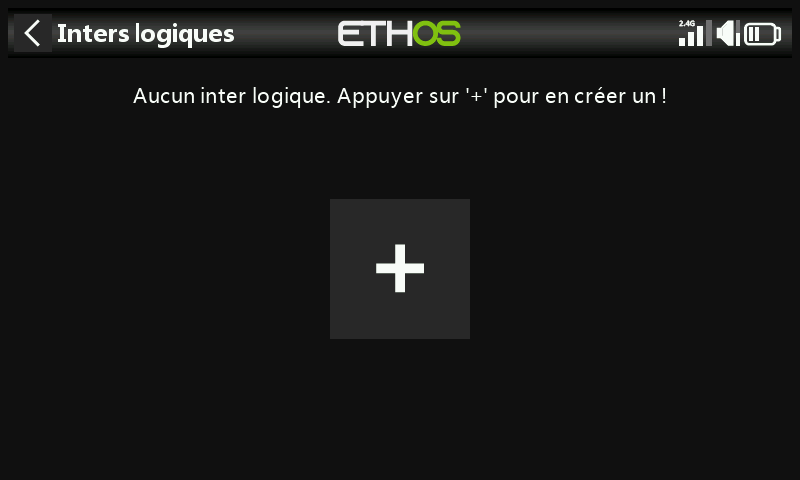

## Fonction

Chaque fonction accepte une sortie normale ou inversée.

- **A ~ X** — vrai lorsque la source `A` est *approximativement* égale (à
  ~10 % près) à une valeur fixe `X`. Généralement préférable à l'égalité
  stricte —

  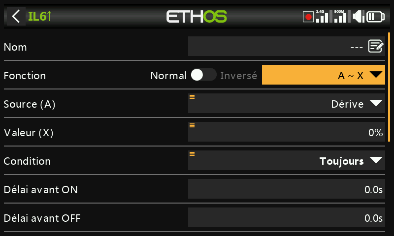

  — car avec `A = X`, une valeur de télémétrie qui fluctue par exemple entre
  8,5 V et 8,35 V autour d'une cible de 8,4 V risque de ne jamais atteindre
  exactement 8,4 V, et l'interrupteur ne se déclencherait donc jamais.
- **A = X** — vrai uniquement lorsque `A` est exactement égal à `X`.
- **A > X** / **A < X** — vrai lorsque `A` est supérieur/inférieur à `X`.
- **|A| > X** / **|A| < X** — comme ci-dessus, mais en comparant la valeur
  absolue de `A` (signe ignoré).
- **Δ > X** — vrai lorsque la variation de `A` (delta) sur l'**intervalle de
  vérification** atteint au moins `X`. Un intervalle réglé sur `---` signifie
  une fenêtre infinie.

  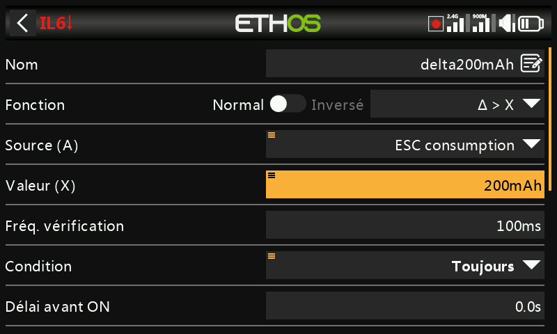
  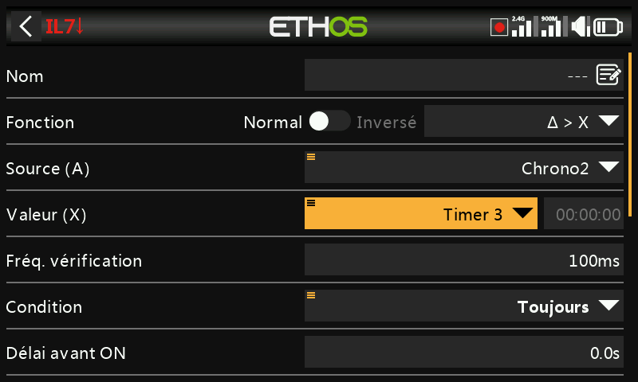

- **|Δ| > X** — comme ci-dessus, en utilisant la valeur absolue de la
  variation.
- **Range** (plage) — vrai lorsque `A` se situe dans une plage spécifiée.

  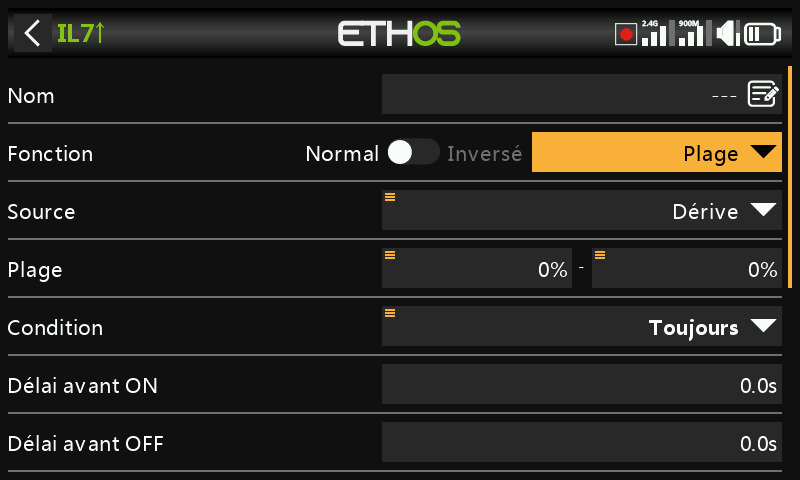

- **AND** (ET) — vrai uniquement si toutes les sources listées (Valeur 1…N)
  sont vraies.

  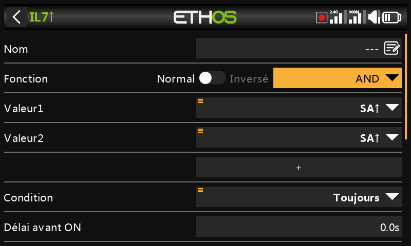

- **OR** (OU) — vrai si au moins une des sources listées est vraie.

  

- **XOR** (OU exclusif) — vrai si *exactement une* des sources listées est
  vraie.

  

- **Timer generator** (générateur périodique) — oscille librement en continu :
  actif pendant **Durée active**, inactif pendant **Durée inactive**.

  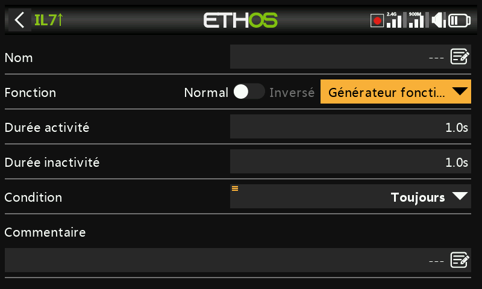

- **Sticky** — un verrou (bascule SR) ; voir [ci-dessous](#sticky).
- **Edge** — une impulsion momentanée ; voir [ci-dessous](#edge).

### Sticky

Se verrouille sur **Vrai** dès que sa condition **Trigger ON** est remplie, et
reste Vrai jusqu'à ce que **Trigger OFF** soit remplie — le tout conditionné,
en option, par la **Condition d'activation** (tant que celle-ci est Fausse, la
sortie est maintenue à Faux quoi qu'il arrive ; le verrou interne de Sticky
continue d'être évalué en arrière-plan et est de nouveau transmis à la sortie
dès que la Condition d'activation redevient Vraie, sous réserve des délais).

Depuis Ethos 1.6.2, les deux déclencheurs acceptent un modificateur **Edge**
(appui long sur `ENT` sur la condition de déclenchement, puis sélection de
Edge — signalé par le préfixe `†`) pour un contrôle beaucoup plus fin :

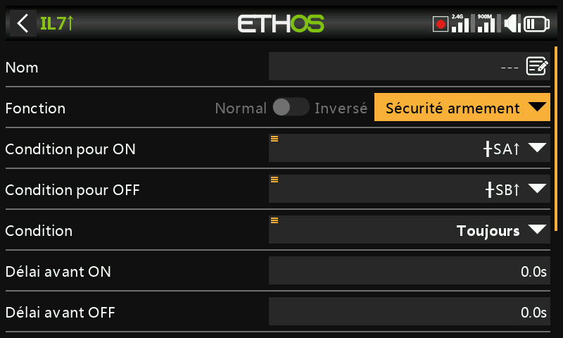
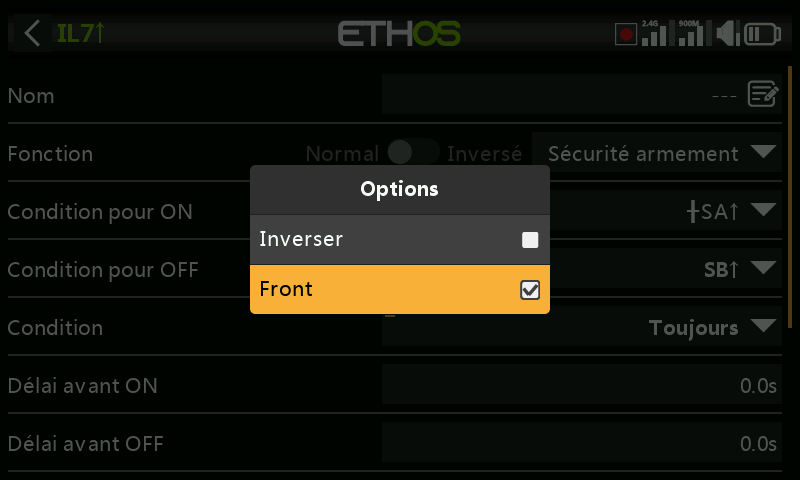

- **Trigger ON `SA` (aucun délai)** — se verrouille sur Vrai à l'instant où SA
  passe à l'état haut.
- **Trigger ON `SA` (délai = 1 s)** — se verrouille sur Vrai 1 s après que SA
  est passé à l'état haut, *à condition* que SA soit toujours à l'état haut à
  la fin de cette seconde.
- **Trigger ON `†SA` (délai = 1 s)** — se verrouille Vrai→Faux 1 s après que SA
  est passé à l'état haut, **indépendamment** du fait que SA soit encore à
  l'état haut à ce moment-là (le front a déjà eu lieu ; le délai ne fait que
  temporiser le résultat).

Trigger OFF se comporte de la même manière, en sens inverse. Les délais
s'appliquent **après** la Condition d'activation — un changement de la
Condition d'activation relance donc la temporisation avant que la valeur
verrouillée n'atteigne à nouveau la sortie. Faire basculer simultanément les
deux déclencheurs de Faux→Vrai **inverse** une fois la sortie du Sticky. Voir
également [Paramètres communs](#shared-parameters) ci-dessous.

### Edge

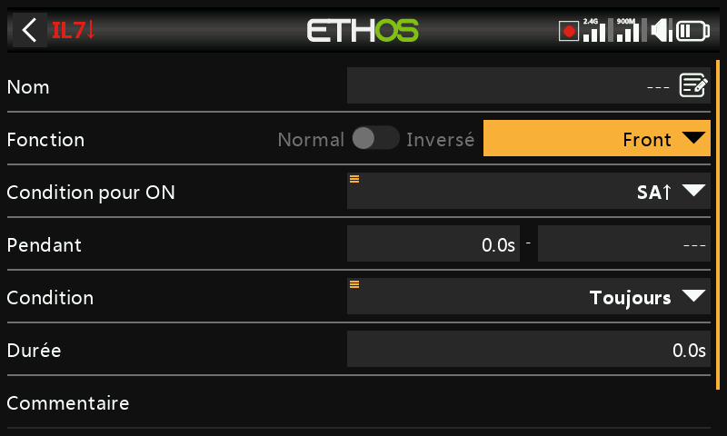

Une impulsion momentanée : Vrai pendant la **Durée** définie, dès que sa
condition de déclenchement est satisfaite. **Pendant** est un couple `[t1:t2]`
qui contrôle précisément le moment :

- **Front montant, Pendant = 0,0 s** — se déclenche à l'instant où Trigger ON
  passe de Faux à Vrai.

  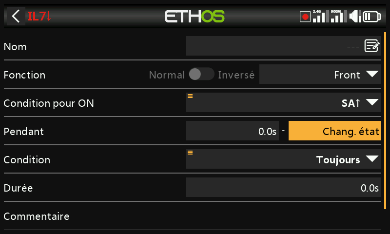
  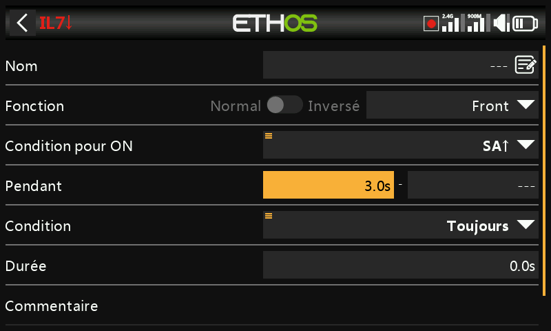

- **Front montant, Pendant ≥ 0,0 s (p. ex. 5,0 s)** — se déclenche 5 s après
  que Trigger ON est passé à Vrai, en ignorant les « pics » plus courts
  survenant durant cette fenêtre de 5 s.

  
  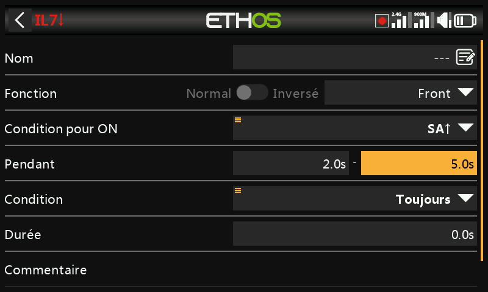

- **Front descendant, Pendant = 0,0 s** — se déclenche à l'instant où
  Trigger ON passe de Vrai à Faux.
- **Front descendant, Pendant ≥ 0,0 s (p. ex. 3,0 s)** — se déclenche lors de
  la transition Vrai→Faux, mais uniquement si l'état Vrai a d'abord duré au
  moins 3 s.
- **Impulsion (t1 et t2 tous deux définis)** — se déclenche uniquement si
  Trigger ON effectue la séquence Faux→Vrai→Faux à l'intérieur de cette
  fenêtre (p. ex. entre 2 s et 5 s plus tard).

## Paramètres communs {: #shared-parameters }

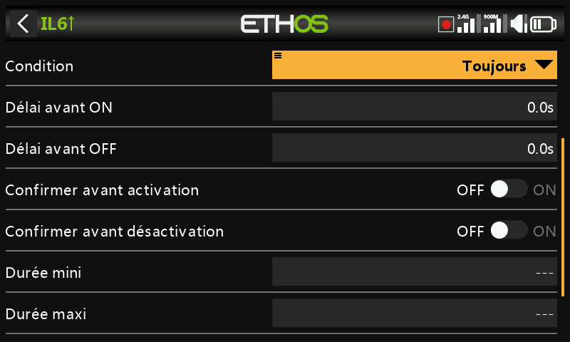

- **Condition d'activation** — conditionne la sortie de l'interrupteur de la
  même manière que pour Sticky, ci-dessus. Options : Toujours actif, positions
  d'interrupteur/d'interrupteur de fonction/d'interrupteur logique/de trim,
  Télémétrie, Phases de vol, ou un événement système (Maintien gaz, Coupure
  gaz, Gaz actifs, Télémétrie active, RSSI faible, Écolage actif,
  Réinitialisation de vol).
- **Délai avant activation** / **Délai avant désactivation** — durée pendant
  laquelle la condition doit rester Vraie (ou Fausse) avant que la sortie ne
  suive, jusqu'à 60 s. Sans objet pour Timer generator ou Edge. (Voir
  [Guide pratique : alerte de capacité
  batterie](../how-to/battery-capacity-warning.md) pour un délai utilisé afin
  d'antiparasiter une chute de tension.)
- **Confirmation avant activation** / **désactivation** — demande une
  confirmation de l'utilisateur avant que l'état ne change réellement (avec une
  option Annuler, pour les cas où le déclenchement est trop fréquent pour être
  utile) — pratique pour conditionner une action risquée, par exemple confirmer
  avant de couper l'alimentation d'un véhicule terrestre à distance.

  
  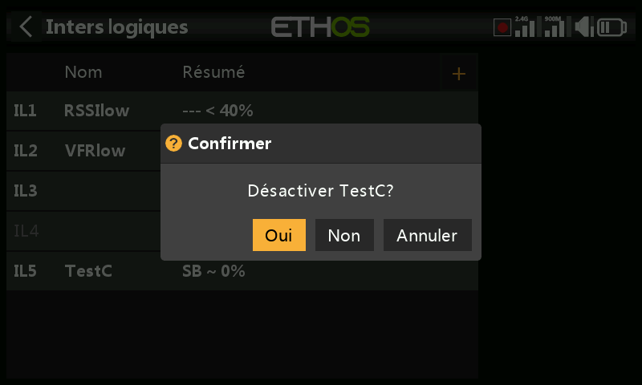

- **Durée min.** — une fois Vrai, reste Vrai au moins pendant cette durée.
  Laissée sur `---`, la sortie peut n'être Vraie que pendant un seul cycle du
  mixeur — trop bref même pour voir la ligne passer en gras dans l'interface.
- **Durée max.** — une fois Vrai, repasse automatiquement à Faux au bout de
  cette durée, si l'état est toujours actif. Les deux durées vont jusqu'à 60 s.
- **Commentaire** — texte libre, affiché partout où cet interrupteur est ajouté
  à un widget de valeur, afin de documenter son rôle.

## Utilisation avec la télémétrie

Un événement système **Télémétrie active** (ou un interrupteur dont la source
est un capteur de télémétrie, actif uniquement lorsque ce capteur transmet des
données) couvre les conditions du type « la télémétrie est-elle actuellement
reçue ».

!!! warning
    Un [mixage](mixes.md) conditionné par un interrupteur logique basé sur la
    télémétrie nécessite une **seconde** action de mixage utilisant le même
    interrupteur **inversé**, afin que le mixage conserve une valeur valide en
    cas de perte de la télémétrie — rappelez-vous qu'un mixage inactif sort au
    neutre (0 % / 1500 µs, soit **mi-gaz** sur une voie de gaz).
    Alternativement, utilisez une action **Offset**, qui dispose déjà de
    valeurs actives/inactives distinctes — par exemple la source **0** (la
    valeur spéciale) avec l'offset réglé de sorte que le mixage donne +100 %
    lorsque `LS3` est actif et −100 % lorsqu'il est inactif couvre les deux cas
    en une seule action.

## Comparaison de sources

Une source est normalement comparée à une valeur fixe, mais deux sources du
*même* type peuvent aussi être comparées directement — par exemple deux
chronomètres, deux tensions ou deux capteurs de régime.

## Ignorer l'entrée écolage de l'élève

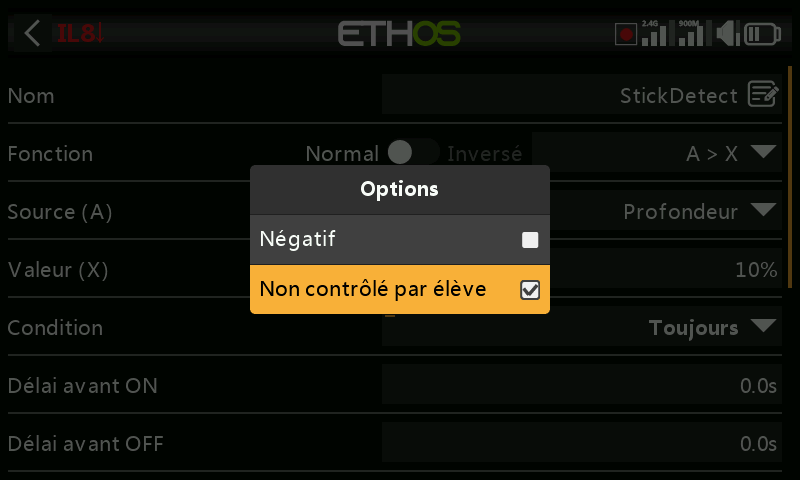

Les [options](../getting-started/user-interface-and-navigation.md#choosing-a-source)
d'une source permettent d'exclure l'entrée écolage provenant d'une radio élève
(esclave) connectée — cela s'utilise typiquement sur un interrupteur logique
qui surveille le mouvement des manches du **moniteur** lui-même (par exemple
pour intervenir instantanément en cas de problème), sans que les entrées de
l'élève le déclenchent également. Souvent associé à un interrupteur d'écolage
qui conditionne la Condition d'activation du moniteur.
