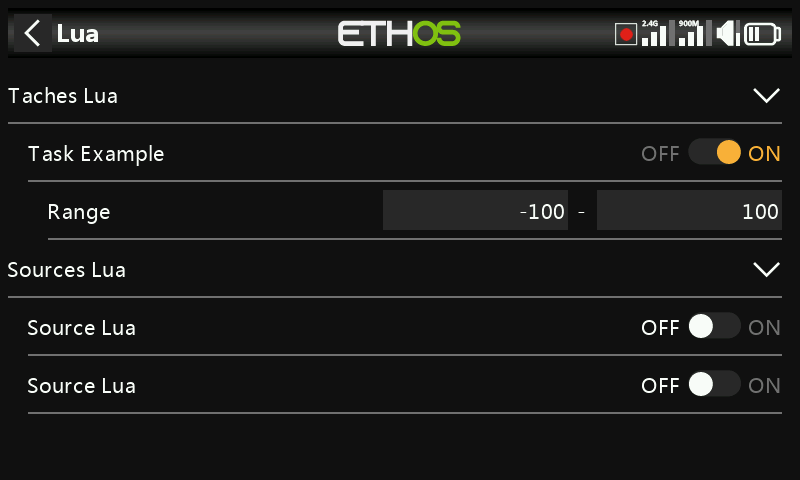

# Scripts Lua (modèle)

Ce menu n'apparaît que lorsqu'un script Lua de type **source** ou **tâche** a
été installé dans le dossier `scripts/` de la carte SD/eMMC (voir
[Gestionnaire de fichiers](../system-setup/file-manager.md#top-level-folders)) —
il sert à activer et à configurer ces scripts **pour chaque modèle**, et non à
les installer. Une fois installée, une source ou une tâche est disponible
globalement pour tous les modèles ; cette page est l'endroit où chaque modèle
choisit de l'activer et définit sa propre configuration. Des exemples de
scripts de sources et de tâches sont publiés sur le site
Ethos-Feedback-Community (`/lua/examples/task`, `/lua/examples/source`).

## Tâches Lua

Chaque tâche installée est répertoriée avec un interrupteur d'activation propre
à chaque modèle. L'activation d'une tâche fait apparaître son formulaire de
configuration (si elle en possède un) — le script de la tâche fournit ses
propres fonctions de lecture/écriture, ce qui permet à chaque modèle
d'enregistrer ses propres réglages. Par exemple, une tâche peut exposer une
plage numérique configurable, définie indépendamment pour chaque modèle.

## Sources Lua

Le même principe s'applique aux sources : activation par modèle, puis
configuration via le formulaire fourni par le script de la source. Une source
enregistrée de cette manière devient utilisable comme une
[source](../getting-started/user-interface-and-navigation.md#choosing-a-source)
ordinaire partout ailleurs dans Ethos, exactement comme une source intégrée.

## Pour les auteurs de scripts

Les sources et les tâches sont enregistrées depuis Lua au moyen de
`system.registerSource()` et `system.registerTask()` — voir le Ethos Lua
Reference Guide, ainsi que la section [Scripts Lua](../lua-scripts/index.md) de
ce manuel pour l'environnement de script général (les widgets constituent un
mécanisme distinct mais apparenté — voir
[Widgets personnalisés](../displays/custom-widgets.md)).
