# Mixages

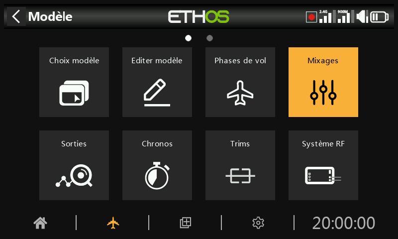

Les mixages sont le cœur de la programmation d'un modèle dans Ethos — c'est
ici que les entrées (manches, interrupteurs, capteurs, tout ce qu'une
[source](../getting-started/user-interface-and-navigation.md#choosing-a-source)
peut atteindre) sont acheminées, mises en forme et combinées vers les voies
de sortie. Jusqu'à 120 mixages peuvent être définis par modèle.

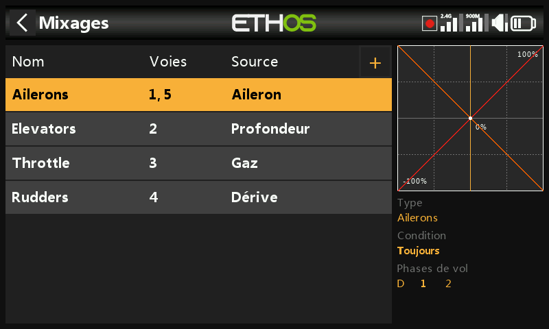

Si un modèle a été créé avec l'assistant **Choix du modèle**, ses mixages de
base (ailerons, profondeur, gaz, dérive et tout ce que la cellule requiert)
sont déjà présents ici. Sélectionner un mixage et appuyer sur `ENT` ouvre un
menu contextuel permettant de le modifier, d'ajouter un nouveau mixage, de
passer à la [vue par voie](#per-channel-view), de le réordonner, de le
dupliquer ou de le supprimer. Les mixages inactifs sont grisés, et toute
suppression demande d'abord une confirmation.

## Anatomie d'un mixage {: #anatomy-of-a-mix }

Chaque mixage partage le même ensemble de champs, quelle que soit la
catégorie dont il provient. Le mixage **ailerons** en est un exemple
représentatif — les mixages de profondeur et de dérive sont organisés de
façon identique.

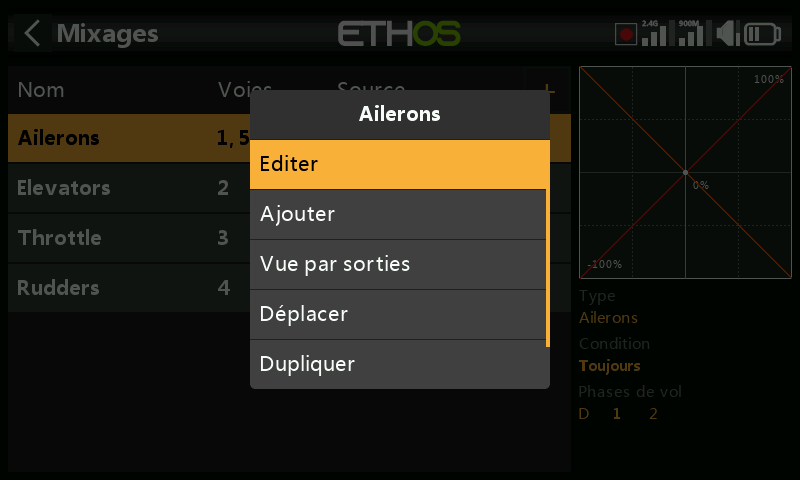

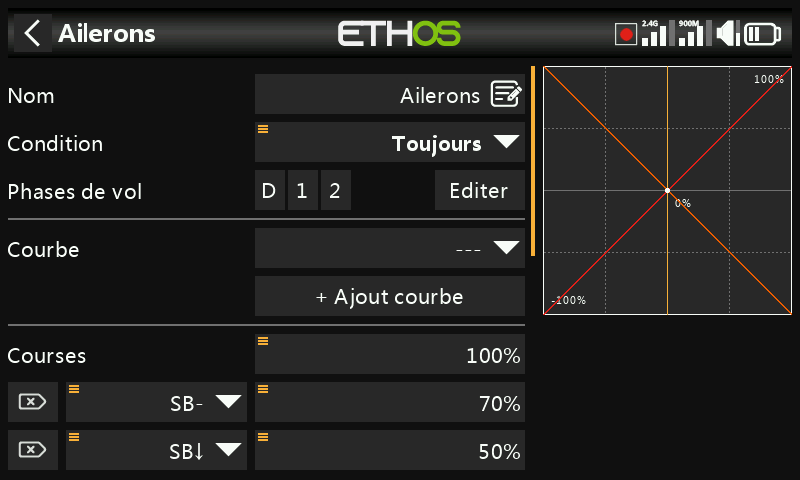

**Nom** — reprend par défaut le type de mixage, modifiable.

**Condition** — *Toujours* par défaut. Peut être limitée à une position
d'interrupteur, un interrupteur de fonction, un interrupteur logique, une
phase de vol, un événement système (coupure gaz/maintien gaz) ou une
position de trim, auquel cas le mixage ne s'applique que lorsque la
condition est vraie.

**Phases de vol** — si des phases de vol sont définies, le mixage peut en
outre être limité à une ou plusieurs d'entre elles.

**Courbe** — une courbe **Expo** est disponible par défaut (0 = linéaire ;
une valeur positive adoucit la réponse autour du neutre, une valeur négative
la rend plus vive) :

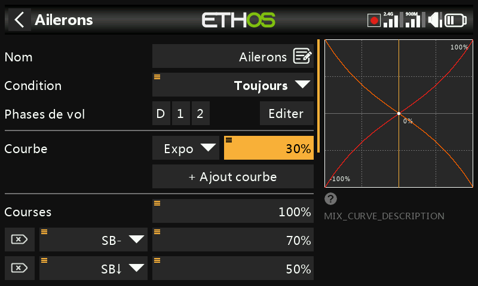

Toute courbe préalablement définie dans [Courbes](curves.md) peut être
choisie à la place. Jusqu'à 6 courbes peuvent être empilées sur un même
mixage, chacune avec sa propre condition — si plusieurs conditions sont
vraies simultanément, la courbe la plus haute dans la liste l'emporte. Les
courbes sont appliquées **avant** les débattements.

**Débattements** — une ou plusieurs lignes de pondération, chacune pouvant
être conditionnée par un interrupteur, un interrupteur de fonction, un
interrupteur logique, une position de trim ou une phase de vol. La première
ligne est la valeur par défaut, active dès lors qu'aucune autre condition
n'est remplie :

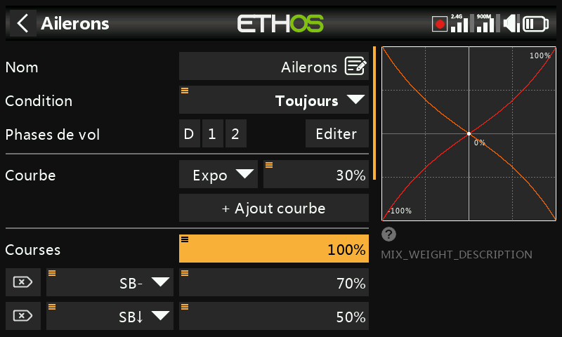

Plutôt qu'un pourcentage fixe, un débattement peut être piloté par une
[source](../getting-started/user-interface-and-navigation.md#choosing-a-source)
— par exemple un potentiomètre, afin de l'ajuster en vol :

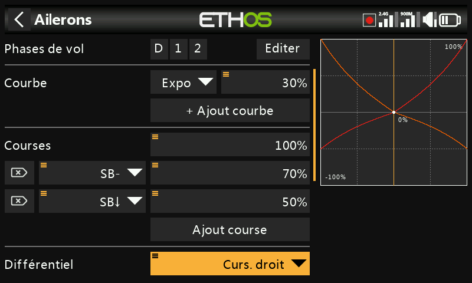

**Différentiel** (-100 à 100, 0 par défaut) — donne plus de débattement dans
un sens que dans l'autre. Pour les ailerons, c'est l'astuce classique
consistant à débattre davantage vers le haut que vers le bas afin de réduire
le lacet inverse. Affiché uniquement lorsque le mixage comporte plus d'une
voie de sortie ; le différentiel n'a de sens qu'avec une configuration de
sortie de type empennage en V ou double aileron.

**Nombre de voies / sorties** — combien de voies de sortie ce mixage pilote
et à quelles sorties physiques elles correspondent :

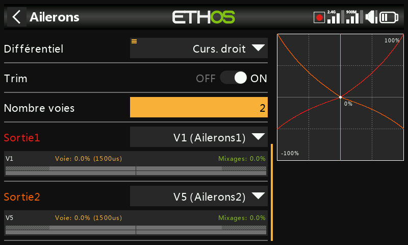

Un appui long sur `ENT` sur une voie de sortie ailleurs dans l'interface
(par exemple dans [Sorties](outputs.md)) ramène directement à cette page.

## Le mixage des gaz

Le mixage des gaz est un mixage de type ailerons/profondeur/dérive auquel
s'ajoutent des options de sécurité propres au moteur.

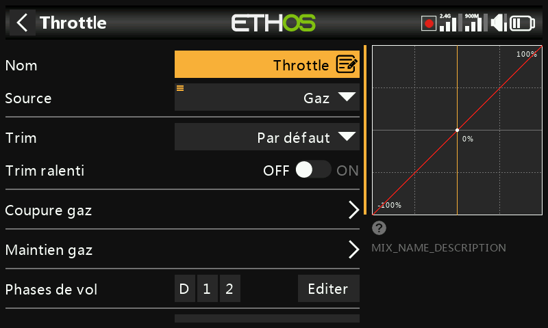

**Entrée** — la source des gaz, normalement le manche des gaz, mais
remplaçable par un potentiomètre, un curseur, un interrupteur, un trim, une
voie, un axe de gyroscope, une voie d'écolage, un chronomètre ou toute autre
source.

**Trim de ralenti** — pour les moteurs thermiques, permet à un trim dédié
d'ajuster le régime de ralenti sans modifier la position plein gaz. Avec le
trim de ralenti activé, la voie des gaz se situe à -75 % lorsque le manche
est au ralenti bas, et le trim des gaz ajuste alors le ralenti entre -100 %
et -50 % :

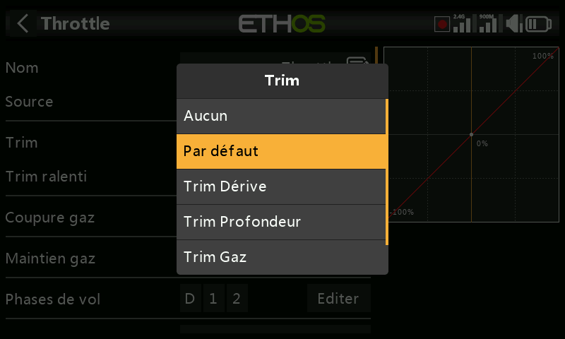

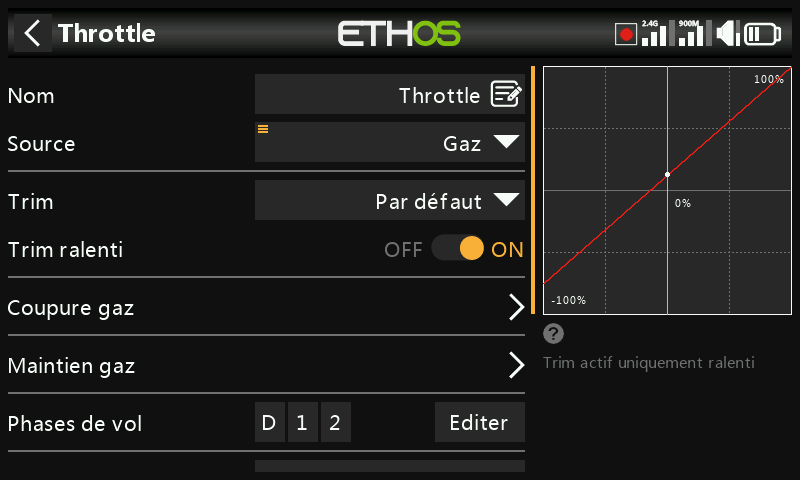

**Coupure gaz** — un verrouillage de sécurité strict : la voie n'est active
qu'une fois que le manche des gaz est passé par le ralenti, de sorte qu'une
manipulation accidentelle d'un interrupteur ne puisse pas lancer le moteur
depuis une position plein gaz :

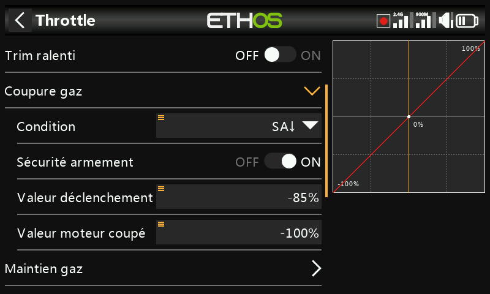

**Maintien gaz** — maintient la voie à une valeur fixe indépendamment de la
position du manche, sans le verrouillage de sécurité offert par la coupure
gaz :

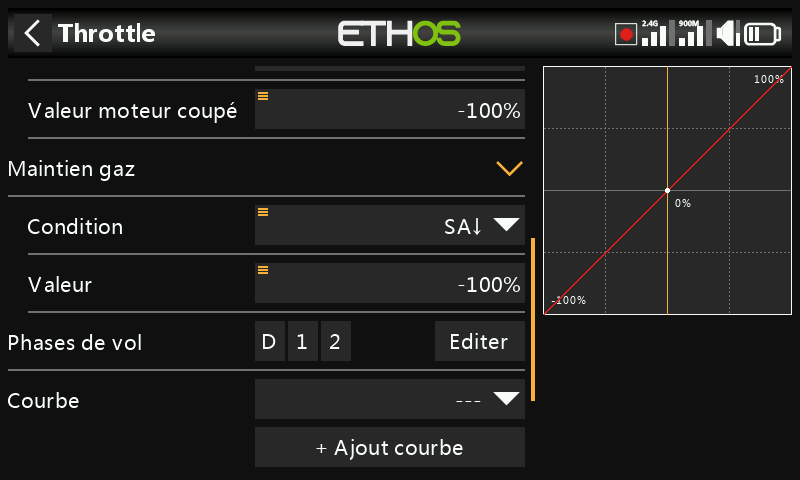

Le mixage des gaz expose également son propre nombre de voies de sortie,
comme n'importe quel autre mixage :

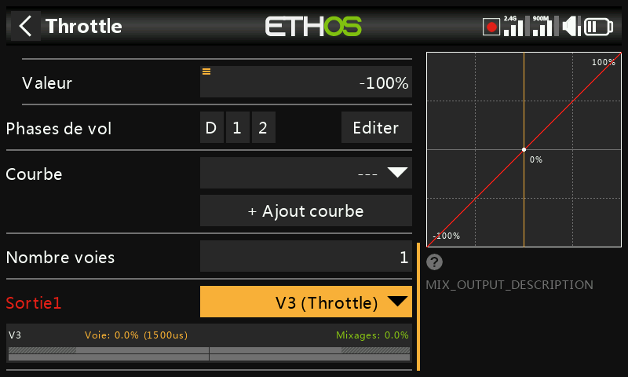

!!! note "Verrouillage des gaz"
    Ethos exige que l'entrée du mixage des gaz passe par -100 % avant
    d'autoriser l'armement, quels que soient les réglages de coupure
    gaz/maintien gaz — un modèle créé par l'assistant de choix du modèle en
    tient déjà compte, mais un mixage des gaz construit manuellement devrait
    également le faire.

## Bibliothèques de mixages {: #mix-libraries }

La bibliothèque de mixages prédéfinis de la boîte de dialogue **Ajouter un
mixage** est adaptée à la catégorie de modèle choisie lors de la création du
modèle — avion, planeur, hélicoptère et multirotor exposent chacun un
ensemble différent :

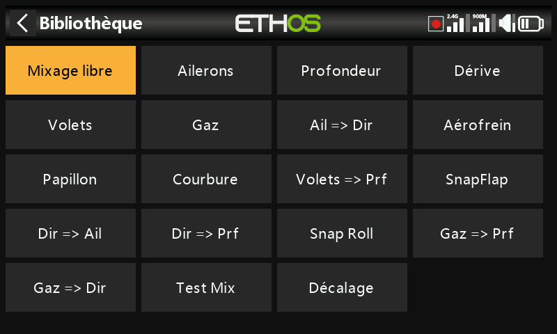

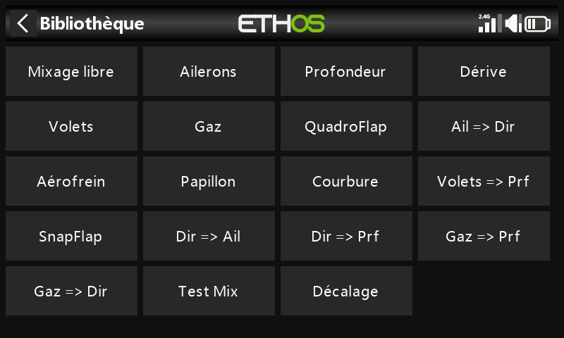

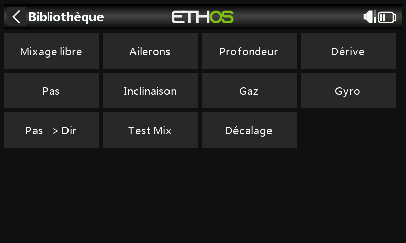

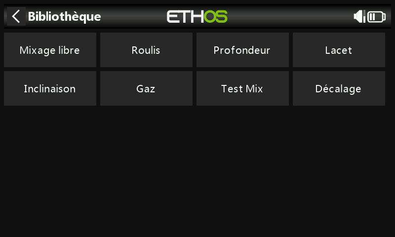

Chaque bibliothèque inclut également le **Mixage libre** — un type de mixage
polyvalent sans entrée/sortie prédéfinie, plus souple que les entrées
spécialisées mais nécessitant davantage de réglages pour parvenir au même
résultat.

## Vue par voie {: #per-channel-view }

Lorsque de nombreux mixages sont empilés sur une même sortie, il peut être
difficile d'appréhender leur effet combiné depuis le tableau à plat
ci-dessus. Sélectionner un mixage et choisir **Vue par voie** regroupe au
contraire tous les mixages agissant sur une même sortie :

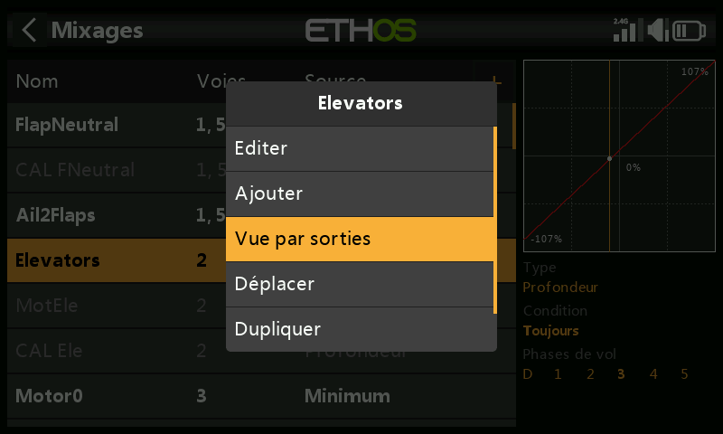

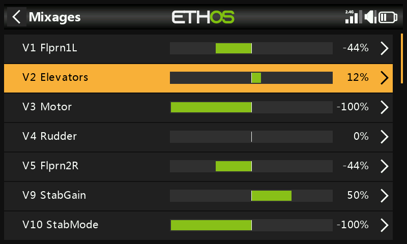

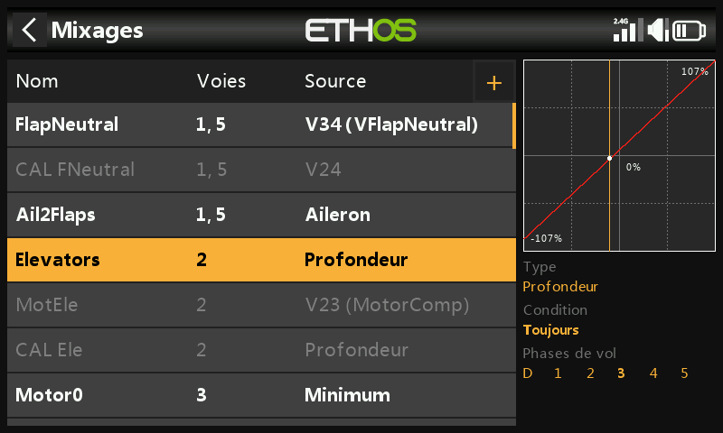

Développer la ligne de résumé d'une voie affiche chaque mixage y
contribuant, avec sa sortie numérique et graphique en temps réel — utile
pour vérifier précisément ce qu'un mixage secondaire (par exemple une
compensation volets vers profondeur) ajoute par-dessus l'action principale
du manche :

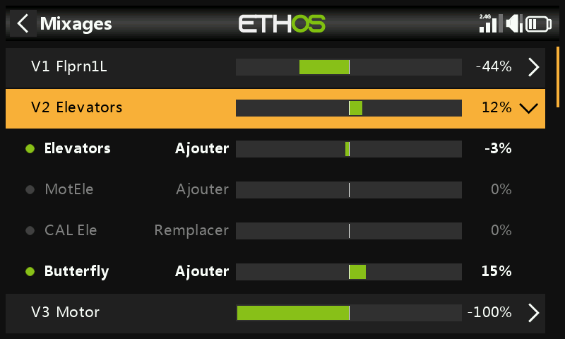

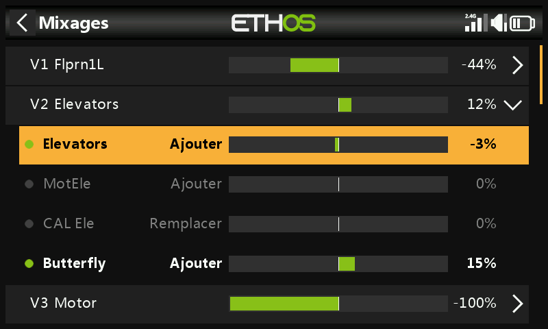

Sélectionner un sous-mixage au lieu de la ligne de résumé ouvre le même menu
contextuel que dans le tableau à plat (modifier, revenir à la vue tableau,
supprimer) :

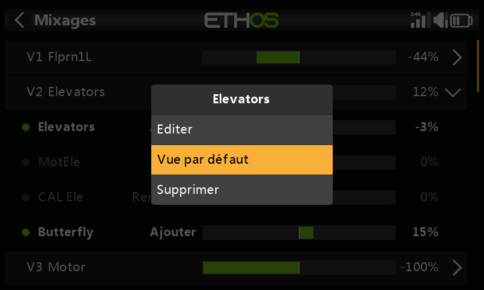

