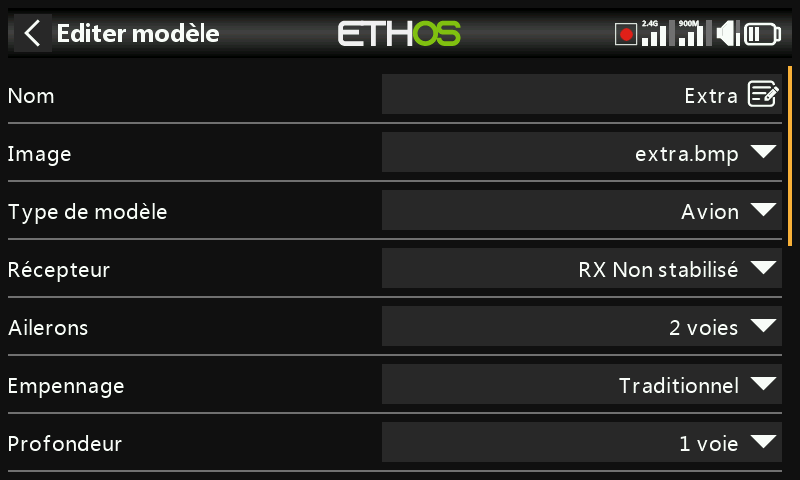
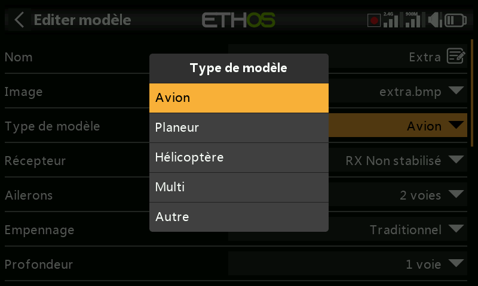
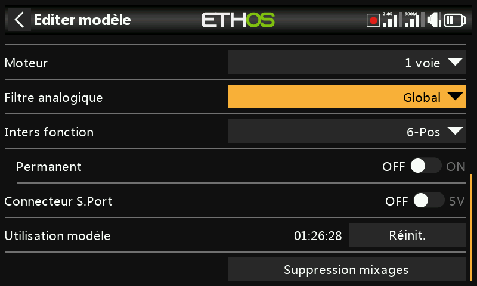
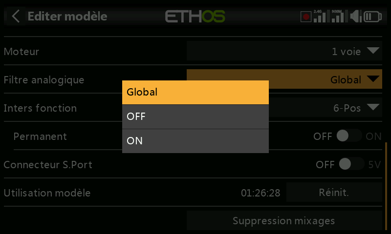
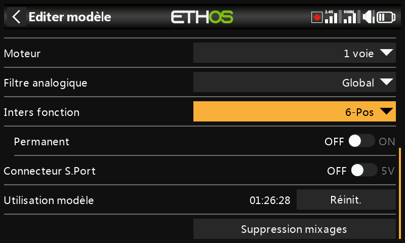
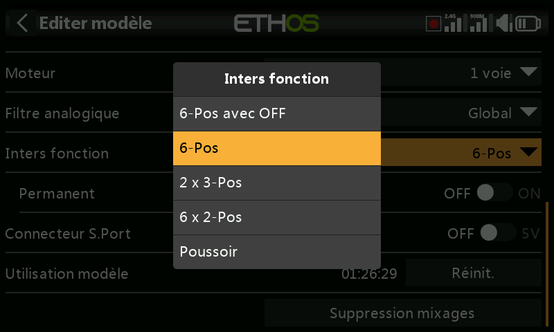
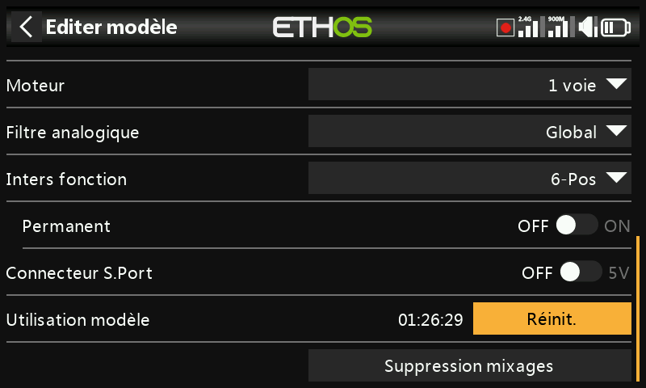
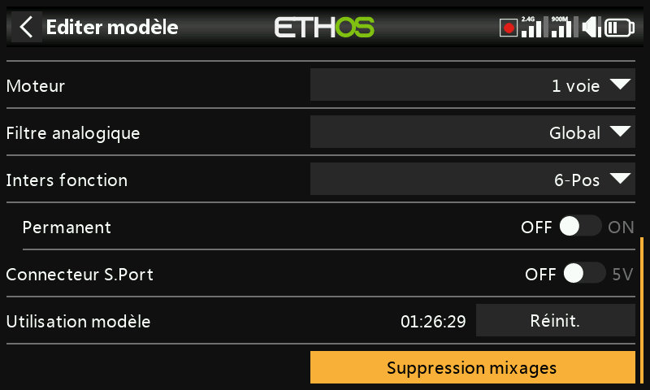

---
translated_from: 827e532e2b0324591f0fdbb61a39e61180642b24
---

# Edition modèle

Permet de modifier les paramètres de base du modèle tels qu'ils ont été
configurés par l'assistant — principalement l'identité, mais aussi quelques
réglages propres au modèle et divers utilitaires.

## Nom, Image

Le modèle peut être renommé, son image peut être attribuée ou modifiée ; lors
de la recherche d'une image, une vignette d'aperçu s'affiche.

## Type de modèle

!!! warning
    La modification du type de modèle entraîne la réinitialisation de
    **tous** les mixages.

## Affectations de voies

La modification du type d'empennage ou du plateau oscillant de l'hélicoptère
entraîne également la réinitialisation de tous les mixages. Sur les autres
voies, le nombre de voies attribuées peut être modifié ou annulé.

## Filtre analogique

Il existe un paramètre global de filtre de convertisseur analogique-numérique
sur la page [Configuration du système → Matériel](../system-setup/hardware.md),
ce qui peut améliorer la détection autour du centre du manche ; ce paramètre
spécifique au modèle peut être utilisé pour remplacer le paramètre global
uniquement pour ce modèle.

## Inters de fonction {: #function-switches }

Les six inters de fonction sont disponibles partout où se trouve un paramètre
**Condition active**, mais — contrairement aux inters standards — ils ne
peuvent pas être utilisés comme source. Ils peuvent être configurés comme
suit :

- **6-Pos avec OFF** — appuyez sur n'importe quel inter de fonction pour le
  verrouiller sur ON ; appuyer une deuxième fois sur le *même* inter éteint
  les six inters de fonction.
- **6-Pos** — appuyez sur n'importe quel inter de fonction pour le verrouiller
  sur ON jusqu'à ce qu'un *autre* inter de fonction soit enfoncé, qui prend
  alors le relais.
- **2 × 3 Pos** — divise les 6 inters de fonction en deux groupes de 3, avec
  un inter allumé par groupe.
- **6 × 2 Pos** — chacun des 6 inters peut être activé ou désactivé
  indépendamment.
- **Poussoir** — les 6 inters de fonction sont considérés comme momentanés :
  chacun n'est activé que lorsqu'il est maintenu enfoncé.
- **Permanent** — si cette option est activée, l'inter de fonction conserve
  son état lors de la mise en marche de la radio ou de la sélection du même
  modèle, au lieu d'être réinitialisé.

## Connecteur SPort

La broche 5V du connecteur S.Port de l'émetteur peut être contrôlée modèle par
modèle — pour alimenter par exemple un récepteur externe pour une fonction
d'écolage.

## Temps d'utilisation du modèle

Comptabilise le temps total de vol / d'utilisation de ce modèle.

## Supprimer tous les mixages

Réinitialise tous les mixages du modèle à leur état par défaut.
