---
translated_from: 827e532e2b0324591f0fdbb61a39e61180642b24
---

# Choix modèle

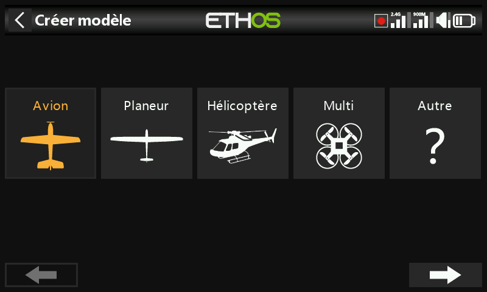

Permet de créer, sélectionner, dupliquer et supprimer des modèles, et de gérer
les dossiers de catégories définis par l'utilisateur dans lesquels ils sont
triés.

## Gestion des dossiers de modèles

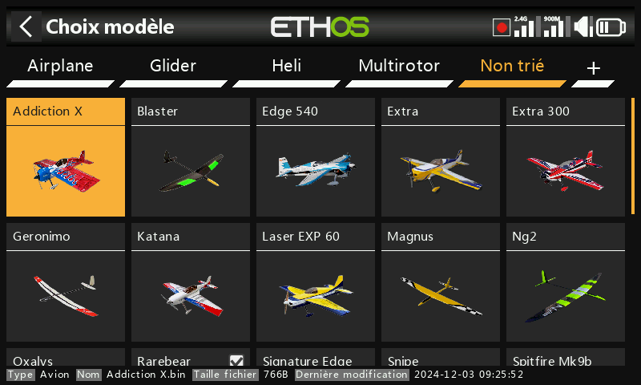

Ethos vous permet de créer vos propres dossiers pour trier et regrouper vos
modèles — typiquement Avion, Planeur, Héli, Quad, Warbird, Bateau, Voiture,
Modèle type ou Archive. Tant que vous n'en avez créé aucun, les modèles sont
stockés dans un dossier automatique **Non trié** (créé lors de la mise à jour
vers Ethos 1.1.0 alpha 17 ou ultérieur, ou lorsqu'un fichier de modèle est copié
dans `\Models` depuis un autre emplacement) ; Ethos supprime automatiquement ce
dernier quand il est vide.

Pour créer un dossier, appuyez sur **+** à côté de « Non trié » (ou faites un
appui long sur `PAGE` haut/bas), entrez son nom (jusqu'à 15 caractères) et
validez. Les dossiers sont triés par ordre alphabétique, hormis **Non trié**,
toujours en dernier dans la liste, et apparaissent sous forme de sous-répertoires
du répertoire `\Models` sur la carte SD ou eMMC. Un appui sur le nom d'un dossier
fait apparaître les options de renommage et de suppression — si des modèles sont
toujours présents dans le dossier supprimé, Ethos les déplace automatiquement
dans Non trié.

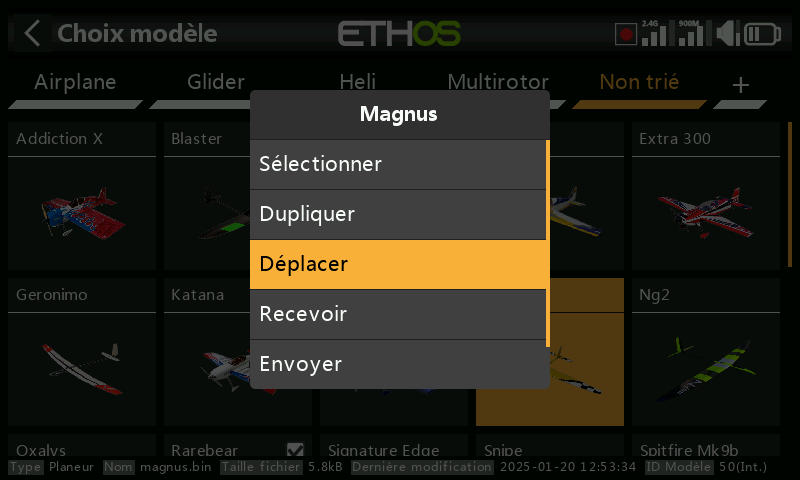

Pour déplacer un modèle vers un autre dossier, appuyez sur l'icône du modèle,
sélectionnez **Changer de dossier**, puis appuyez sur le dossier cible :

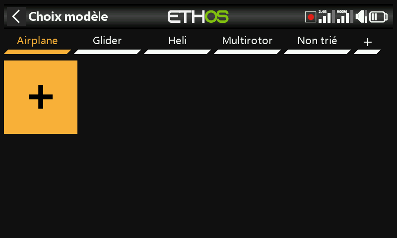

## Ajout d'un nouveau modèle

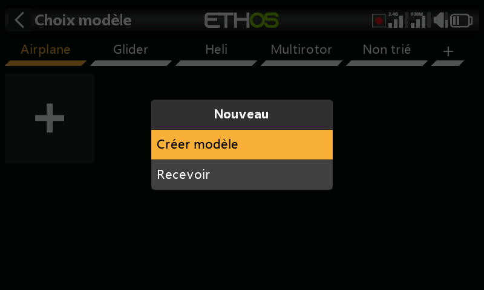

Sélectionnez la catégorie sous laquelle vous souhaitez créer le modèle, appuyez
sur l'icône **+**, puis sur **Créer modèle** pour lancer l'assistant (vous
devrez peut-être d'abord créer la catégorie si elle n'existe pas encore). Il
existe des assistants pour **Avion**, **Planeur**, **Hélicoptère**,
**Multirotor** et **Autre** ; chacun vous guide dans la configuration de base
pour ce type de modèle, y compris des mixages prédéfinis optionnels pour les
récepteurs stabilisés FrSky (gain, mode de stabilisation). Un nom de modèle peut
comporter jusqu'à 15 caractères.

### Récepteurs stabilisés et ordre des voies

Les récepteurs stabilisés FrSky exigent spécifiquement l'ordre des voies
**AETR** — laissez [Manches → Ordre des voies](../system-setup/controls.md) sur
sa valeur par défaut AETR avec l'option **Quatre premières voies fixes**
activée, afin que le résultat de l'assistant corresponde à ce qu'attend le
récepteur.

L'assistant attribue les voies de droite à gauche. Pour 2 ailerons + 1
profondeur + 1 dérive + 1 moteur, cela donne :

| Voie | Fonction |
|---|---|
| 1 | Aileron 1 (aileron droit) |
| 2 | Profondeur |
| 3 | Gaz |
| 4 | Dérive |
| 5 | Aileron 2 (aileron gauche) |

Avec cette affectation, le différentiel d'ailerons est **positif** dans le cas
normal (débattement vers le haut supérieur au débattement vers le bas). Les
manuels des récepteurs FrSky documentent actuellement la convention *inverse*
(de gauche à droite, donc voie 1 = aileron gauche, voie 5 = aileron droit) —
dans ce cas, le différentiel devrait être **négatif** pour obtenir le même effet
physique.

!!! tip
    Il est conseillé d'utiliser la convention Ethos de manière cohérente —
    toutes les fonctions de stabilisation fonctionnent correctement dans les
    deux cas, puisque le sens de compensation est défini lors de la
    configuration de la stabilisation. Si vous devez néanmoins respecter la
    convention des manuels de récepteurs, la solution la plus simple consiste à
    créer le modèle normalement avec l'assistant, puis à utiliser **Échanger
    les voies** dans [Sorties](outputs.md) pour permuter ensuite les deux voies
    d'ailerons — cela conserve un signe positif pour le différentiel du mixage
    d'ailerons.

### Étapes de l'assistant

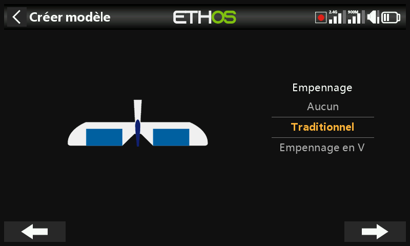
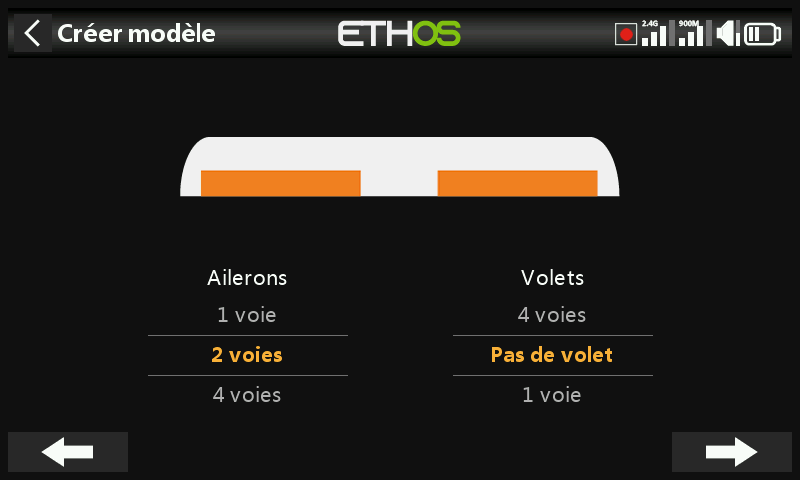
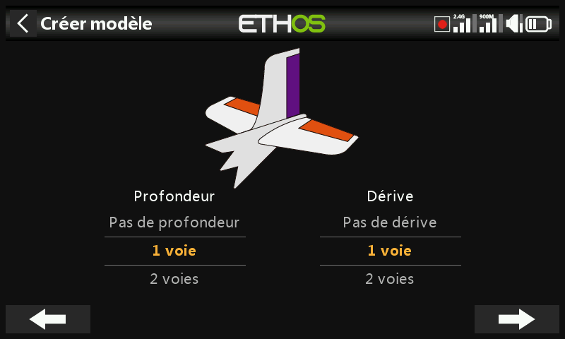
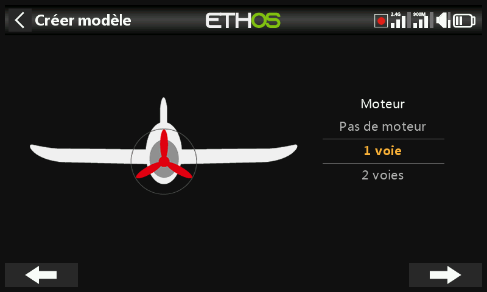
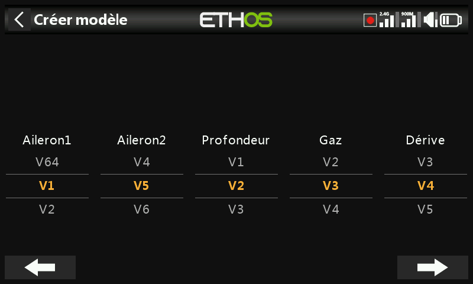
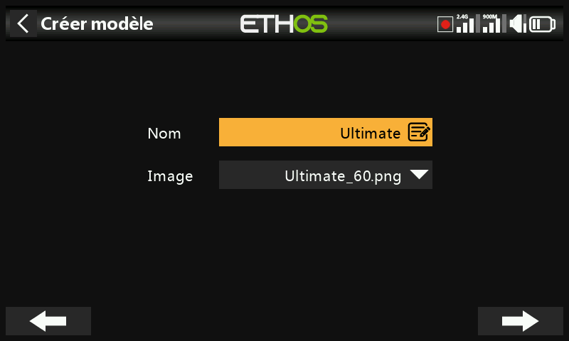
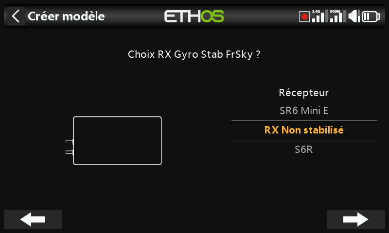

Pour un **Avion**, après le type d'empennage et le nombre de surfaces,
l'assistant traite le nombre de voies moteur, puis le nombre de voies
d'ailerons/volets.

La **configuration de l'empennage** propose un empennage classique en croix, un
empennage en V, ou aucun empennage (aile delta/aile volante) :

- **Aile delta/aile volante** — la création d'un modèle Avion avec 2 ailerons et
  aucune surface d'empennage génère automatiquement le mixage Elevon, avec des
  courses par défaut de 50 % afin que des ordres simultanés d'ailerons et de
  profondeur à fond totalisent toujours 100 %.
- **Aile delta avec un récepteur stabilisé assurant le mixage** — sélectionnez
  plutôt 1 aileron et 1 profondeur ; le mixage Elevon est réalisé dans le
  récepteur, conformément à son propre manuel.
- **Aile delta avec des surfaces d'ailerons et de profondeur dédiées** —
  laissez l'assistant se dérouler comme si le modèle avait un empennage ; il
  configure les voies d'ailerons et de profondeur nécessaires (avec ou sans
  dérive), et aucun mixage Elevon n'est créé.

L'étape de **réaffectation des voies** permet de modifier l'affectation par
défaut de l'assistant, en gardant à l'esprit que les récepteurs stabilisés
exigent leurs voies dans un ordre précis (consultez les instructions du
récepteur). La dernière étape définit le nom du modèle et y associe une image.

Le modèle créé apparaîtra dans le dossier de catégorie qui était actif au
démarrage de l'assistant et sera trié par ordre alphabétique. Voir [Exemple de
base pour aile fixe](../tutorials/basic-fixed-wing.md) pour un déroulé complet.

## Réception d'un modèle depuis une autre radio Ethos

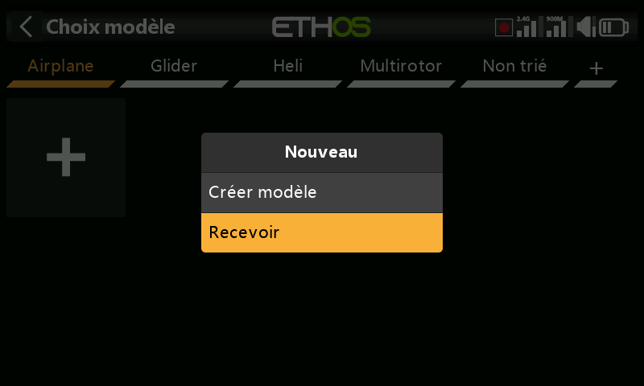

Sélectionnez la catégorie de destination, appuyez sur l'icône **+**, puis sur
**Recevoir modèle** — votre radio passera en mode d'attente et affichera son
adresse Bluetooth locale pour permettre son identification sur la radio
émettrice. Sur la radio émettrice, appuyez sur l'icône du modèle et sélectionnez
**Envoyer modèle** ; la radio réceptrice annonce le fichier modèle sur le point
d'être reçu pour confirmation avant de l'accepter.

## Sélection d'un modèle

Appuyez sur **Choix modèle** pour afficher la liste de vos modèles.

!!! note "Conversion des modèles après une mise à jour d'Ethos"
    Après une mise à niveau de la version d'Ethos, Ethos convertit les modèles
    individuellement lorsqu'ils sont *sélectionnés*, et non tous en même temps
    lors de la mise à jour — il n'y a pas de retard notable dans le processus,
    et la conversion peut avoir lieu à une date ultérieure en toute sécurité,
    même avec une version d'Ethos encore plus récente. La date de **Dernière
    modification** en bas de l'écran de sélection du modèle change lorsqu'une
    conversion a lieu (ou lorsque vous apportez une modification au modèle —
    sinon elle reste inchangée).

**Sélection rapide** — un appui long tactile ou un appui long sur `ENT` sur
l'icône d'un modèle basculera immédiatement vers ce modèle.

**Menu de gestion des modèles** — appuyez sur un modèle pour le mettre en
surbrillance, puis appuyez à nouveau dessus pour afficher le menu :

- **Sélectionner** (faire du modèle en surbrillance le modèle actuel)
- **Dupliquer** — duplique le modèle. Le modèle dupliqué reçoit automatiquement
  un nouveau numéro de récepteur ; si vous lui réaffectez le numéro de récepteur
  de l'original, il fonctionne sans nouvel appairage.
- **Changer de dossier**
- **Envoyer**/**Recevoir** — vers ou depuis une autre radio, comme ci-dessus.
- **Supprimer** — cette option n'apparaît que si le modèle sélectionné n'est pas
  le modèle actuel.
