# Sorties

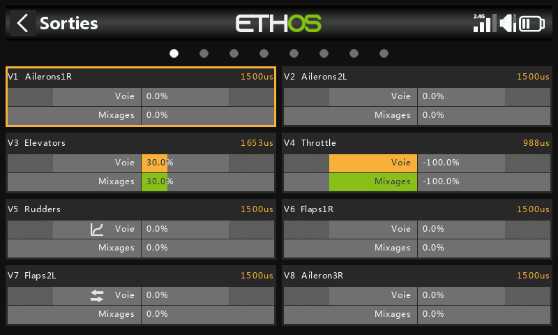

La section Sorties est l'interface entre la « logique » pure des [Mixages](mixes.md) et
le monde physique — servos, tringleries, gouvernes, actionneurs,
transducteurs. C'est là que les butées, l'inversion, le centrage et les
courbes de correction sont adaptés aux caractéristiques mécaniques réelles du
modèle. Chaque voie de sortie correspond à une sortie servo du récepteur
(CH1 correspond à la prise servo n° 1, avec les paramètres de protocole par défaut).

Bien que la radio soit configurée en pourcentages, les servos sont en définitive pilotés par
un signal PWM dont la largeur d'impulsion est exprimée en µs (microsecondes) :

| % | µs |
|---|---|
| −150 % | 732 |
| −100 % | 988 |
| 0 % | 1500 |
| 100 % | 2012 |
| 150 % | 2268 |

!!! warning
    Une voie **sans mixage actif** délivre le neutre (0 % / 1500 µs) — cela
    inclut une voie dont le ou les seuls mixages sont momentanément inactifs.
    Assurez-vous que chaque voie réellement utilisée dispose toujours d'un
    mixage actif. Sur une voie de gaz en particulier, le neutre correspond à
    **mi-gaz**.

L'écran Sorties affiche deux graphiques à barres par voie : la barre inférieure (verte) indique
la valeur des mixages pour la voie, tandis que la barre supérieure (orange) indique la valeur
réelle envoyée au récepteur après le traitement des sorties (en % et en µs).
Les limites Min/Max apparaissent comme des sections grisées de la barre orange. Les voies
qui ne sont pas transmises au module RF sont affichées avec un arrière-plan plus sombre.
De petites icônes apparaissent sur une voie lorsque ses réglages Direction, Courbe, Ralentissement ou
Équilibrage ont été modifiés par rapport aux valeurs par défaut, afin de repérer d'un coup d'œil les voies
non standard.

!!! tip
    Pour un accès rapide à cet écran, un appui long sur `ENT` depuis l'écran
    Mixages ou Phases de vol permet d'accéder directement aux sorties.

## Modification d'une voie {: #editing-a-channel }

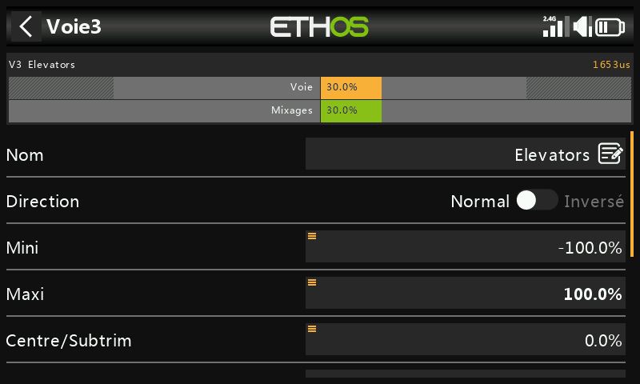
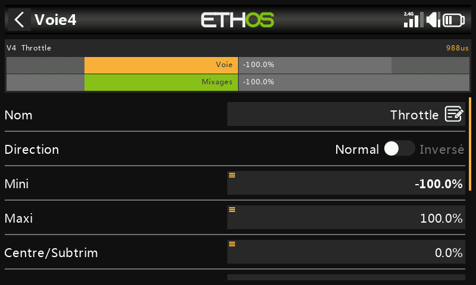

Appuyez sur la voie à modifier. Un aperçu en haut de l'écran affiche la valeur des mixages
(en vert) face à la valeur de sortie (en orange), avec un petit marqueur blanc pour
les points Min/Max.

- **Nom** — le nom peut être modifié.
- **Direction** — change la direction de la sortie de la voie, généralement pour inverser
  la direction du servo. Signalée par une icône à double flèche sur la voie.
  Notez que cela n'affecte **pas** les mixages qui pilotent la sortie et
  n'intervertit **pas** non plus les limites Min/Max.
- **Min/Max** — limites « strictes », c'est-à-dire qu'elles ne seront jamais remplacées — elles
  doivent être réglées de manière à éviter le grippage mécanique. Elles servent de paramètres
  de gain ou de « point final » : les réduire réduira le débattement plutôt que d'induire un
  écrêtage. Les limites par défaut sont de ±100 %, mais peuvent être augmentées
  jusqu'à ±150 %. Lors du réglage, l'extrémité à ajuster est mise en surbrillance
  en gras (par exemple, poussez légèrement le manche de profondeur vers l'avant et la
  valeur Max s'affiche en gras pour indiquer qu'il s'agit bien de l'extrémité en cours de réglage).

  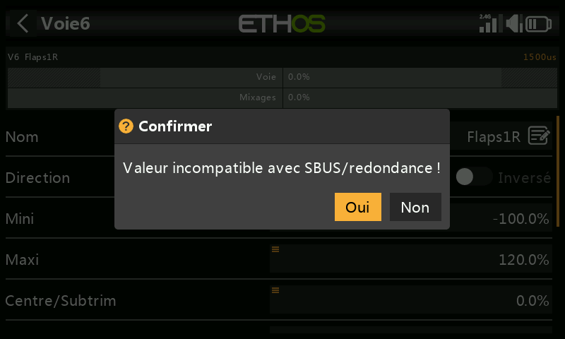

  !!! warning "Redondance SBUS"
      Lors de l'utilisation d'un système de redondance impliquant SBUS, les mouvements de servo
      au-delà d'environ ±125 % ne sont pas possibles. Les paramètres Min/Max ont eux-mêmes
      des plages asymétriques (−150 % à 0 % et 0 % à +150 %) — lorsque vous les pilotez
      depuis une [Var](variables.md), à moins que la Var n'ait une plage identique, il sera
      nécessaire de définir **Ignorer la plage** (voir [options de
      source](../getting-started/user-interface-and-navigation.md#choosing-a-source)),
      afin d'éviter les valeurs inattendues dues à la conversion de plage. Si
      la sortie du récepteur principal dépasse 125 % et que celui-ci entre en sécurité
      intégrée, le récepteur redondant qui prend le relais via SBUS la limite à 125 %.

- **Centre/Subtrim** — introduit un décalage sur la sortie, généralement utilisé pour centrer
  un bras de servo ; les points de terminaison ne sont pas affectés.

  !!! warning
      Ne soyez pas tenté d'utiliser le subtrim pour ajouter de grands décalages — il
      construira une grande quantité de différentiel dans la réponse du servo. La bonne
      méthode consiste à ajouter un **mixage décalé** pour tout ce qui va au-delà d'un
      centrage fin.

- **Centre PWM** — similaire au subtrim, à la différence qu'un réglage effectué ici décale
  *toute* la bande de mouvement du servo, limites strictes incluses ; il est effectivement
  effectué dans le servo lui-même et n'est donc pas visible sur le moniteur de voies.
  Cela sépare la fonction de centrage mécanique de la fonction de trim.
- **Courbe** — permet de sélectionner une courbe Expo ou personnalisée (existante ou nouvelle,
  avec un raccourci **Modifier** une fois la courbe configurée) pour corriger les problèmes de
  réponse du monde réel — par exemple s'assurer que les volets gauche et droit suivent avec
  précision. Signalée par une icône de courbe sur la voie.
- **Ralentir haut/bas** — ralentit la réponse de la sortie par rapport au changement d'entrée ;
  la valeur est le temps en secondes qu'il faudra à la sortie pour couvrir la plage 0→100 % —
  par exemple pour ralentir des trains rentrants actionnés par un servo proportionnel normal.
  Signalé par une icône d'horloge sur la voie. (Une fonction de **retard**,
  à distinguer du ralentissement, est disponible sous les [interrupteurs
  logiques](logical-switches.md).)

## Échanger voies {: #swap-channels }

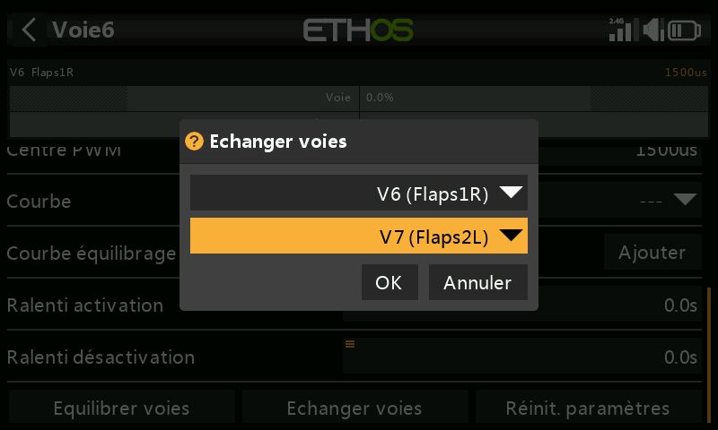
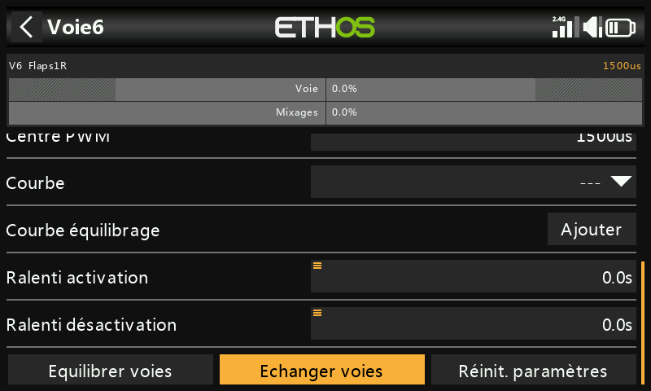

Cette fonction permet d'échanger deux voies de sortie. La boîte de dialogue s'ouvre avec la
voie courante déjà remplie ; sélectionnez l'autre voie puis validez — l'échange a lieu
immédiatement, et chaque mixage faisant référence à l'une des deux voies est mis à jour en
conséquence.

## Réinitialiser les paramètres

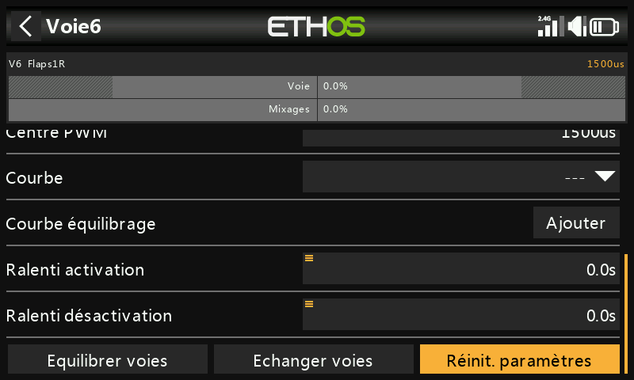

Efface tous les paramètres d'une voie pour les ramener à leurs valeurs par défaut — utile
avant de réutiliser une voie pour autre chose, avec une boîte de dialogue de confirmation
permettant d'éviter toute réinitialisation accidentelle.

## Équilibrer les voies {: #balance-channels }

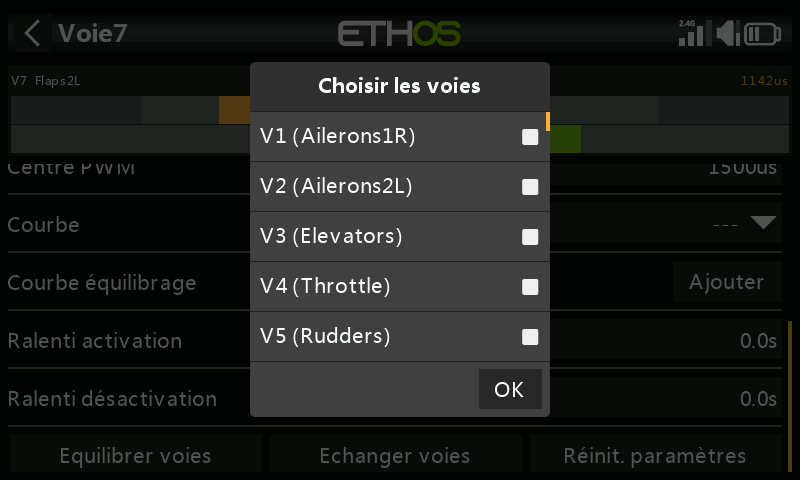
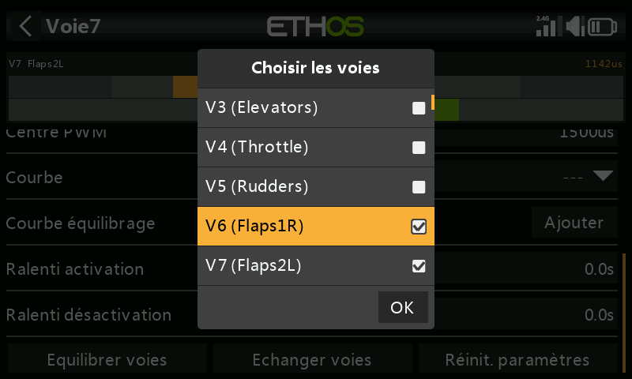

Équilibre une paire (ou jusqu'à 4) de voies afin qu'elles se déplacent de façon synchrone — par
exemple des volets qui ne bougent pas ensemble peuvent induire un roulis indésirable ; des gaz
déséquilibrés sur un modèle multimoteur peuvent induire un lacet indésirable. Ethos crée une
courbe d'équilibrage différentielle pour chaque voie sélectionnée ; en comparant la position
physique des gouvernes à chaque point de la courbe, vous pouvez les ajuster pour les faire
correspondre, jusqu'à obtenir des gouvernes parfaitement synchrones.

**Avant l'équilibrage**, dans l'ordre :

1. Réglez la direction des servos pour un débattement correct.
2. Avec les mixages au neutre, utilisez éventuellement le **Centre PWM** pour aligner les
   palonniers de servo.
3. Réglez Min/Max et le Subtrim.
4. Configurez toutes les autres courbes.
5. Configurez le Ralentissement.
6. *Ensuite* seulement, équilibrez et harmonisez sur toute la plage de débattement.

**Utilisation** : choisissez les voies à équilibrer et l'ordre dans lequel les
afficher —

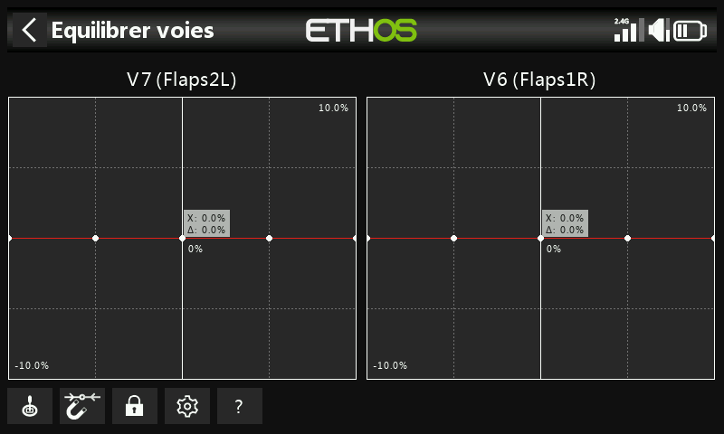

— la sortie du mixage sur l'axe X, le différentiel d'ajustement d'équilibrage sur l'axe
Y. Appuyez sur le graphique d'une voie (ou sélectionnez-la et appuyez sur `ENT`) pour modifier sa
courbe d'équilibrage ; `PAGE` permet de passer d'une voie à l'autre en cours d'édition :

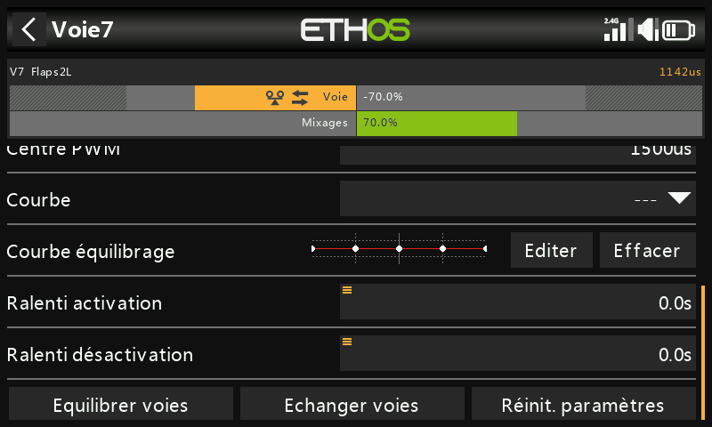

Commandes de l'éditeur :

- **Source** — normalement la ou les sources propres du mixage, ou toute autre entrée
  analogique commode ; **Entrée analogique auto** retient comme axe X le premier manche/curseur/potentiomètre
  que vous déplacez, à la fois dans le graphique et dans le modèle lui-même.
- **Aimant** — aligne automatiquement le réglage de l'encodeur rotatif sur le point de courbe
  le plus proche sur l'axe X :

  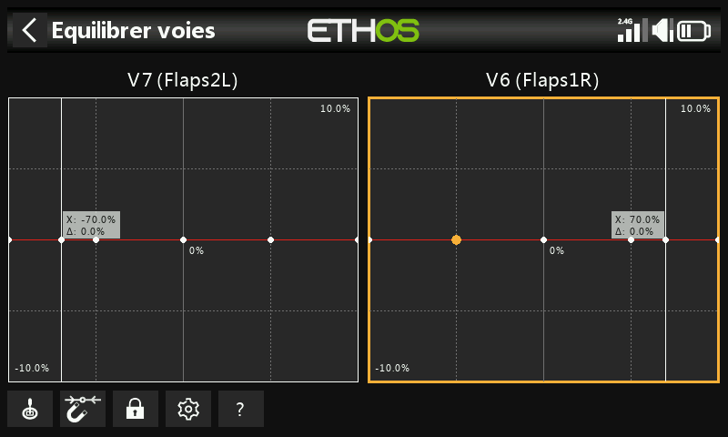
  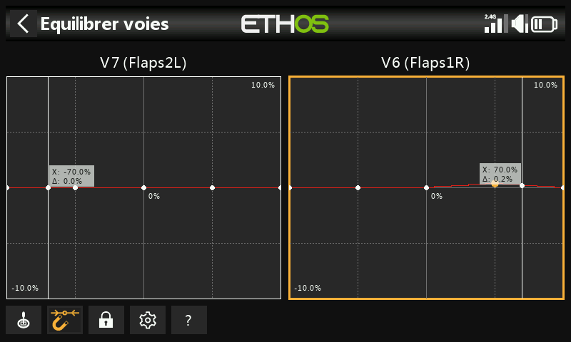

  L'entrée doit malgré tout être déplacée pour aligner X sur un point de courbe avant
  de pouvoir l'ajuster.
- **Verrou** — activé en appuyant sur son icône ou sur `ENT` en mode d'édition du graphique ;
  verrouille toutes les entrées afin de pouvoir relâcher le manche et observer les
  gouvernes pendant l'ajustement de la courbe.
- **Configuration** — modifie le nombre de points par voie (toutes ensemble ou individuellement)
  et le lissage éventuel de chaque courbe.
- **Aide** (`?`, également la touche `MDL`) — ouvre l'aide intégrée.

**Multivoies** : jusqu'à 4 voies peuvent être équilibrées ensemble —

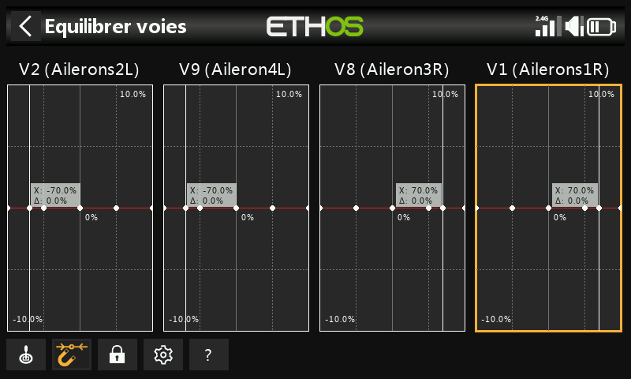

Une fois définie, une courbe d'équilibrage peut être consultée, modifiée ou effacée depuis la
page de configuration de la voie elle-même — une icône d'équilibrage la signale sur le graphique de la voie
(aux côtés d'une icône Direction également, si celle-ci n'est pas non plus à sa valeur par défaut).
