# Fonctions spéciales

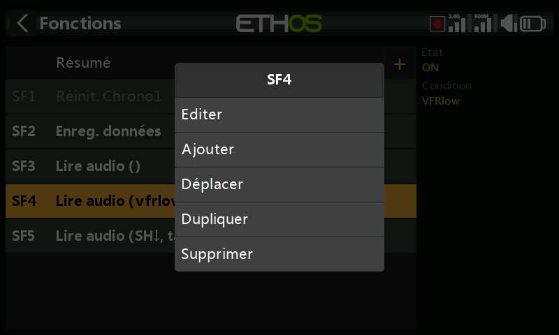

Les fonctions spéciales déclenchent une action — lecture audio, capture
d'écran, écriture de journaux, retour haptique, et bien d'autres — lorsqu'une
condition devient vraie. Jusqu'à 100 fonctions sont prises en charge ; aucune
n'existe par défaut. Ajoutez-en une avec **+** ; appuyez sur une fonction
existante pour **Modifier**/**Déplacer**/**Copier-coller**/**Cloner**/
**Supprimer**.

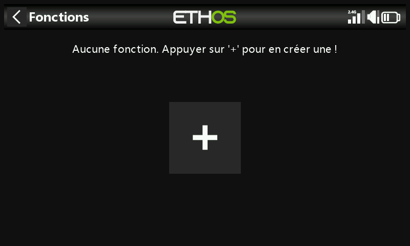
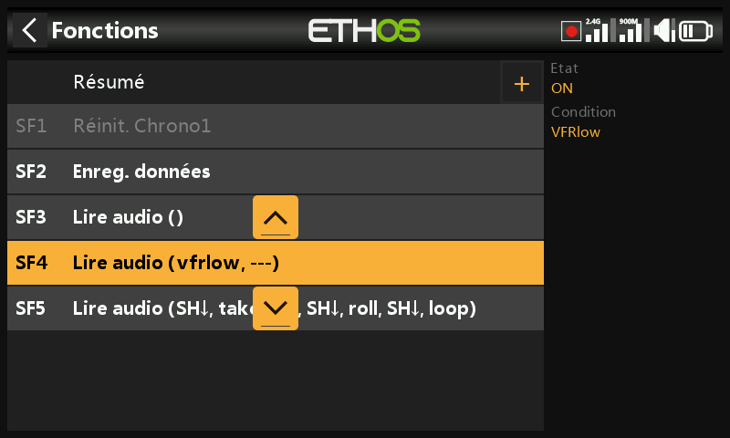

## Champs communs à toutes les actions

- **État** — active/désactive cette fonction sans la supprimer.
- **Condition d'activation** — **Toujours actif**, ou conditionnée par la
  position d'un interrupteur/interrupteur de fonction/interrupteur
  logique/trim, ou par une phase de vol. Effectuez un appui long sur `ENT`
  sur un interrupteur et cochez **Négatif** pour l'inverser (par exemple
  `SG-up` devient `!SG-up`, actif dès que SG n'est *pas* en haut).
- **Global** — ajoute cette fonction à **tous** les modèles, existants et
  futurs. Si un modèle possède déjà une fonction locale configurée à
  l'identique, l'option Global l'ajoute comme entrée supplémentaire ;
  désactiver Global la supprime de tous les modèles sauf celui actuellement
  sélectionné. Les fonctions globales sont enregistrées dans `radio.bin`,
  les fonctions locales dans le fichier du modèle.

## Actions

**Réinitialisation** — réinitialise les **Données de vol** (télémétrie +
chronos), **Tous les chronos**, ou **Toute la télémétrie**.

**Capture d'écran** — enregistre une capture d'écran dans `screenshots/` sur
la SD card/eMMC.

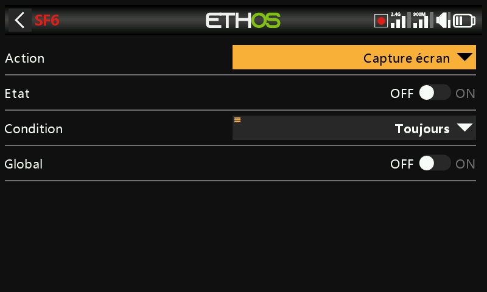

**Définir le failsafe** — enregistre les positions actuelles des voies comme
failsafe, via le **Module** RF interne ou externe.

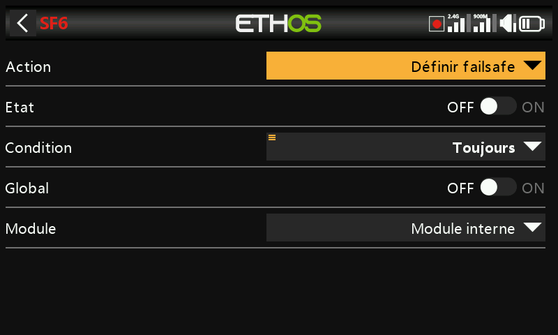

**Lecture audio** — l'action la plus riche, prenant en charge une séquence
complète :

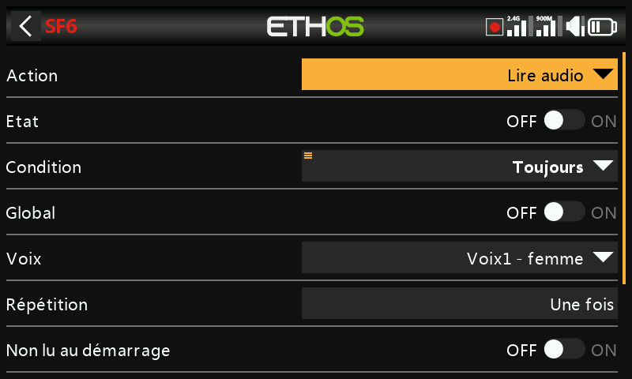

- **Voix** — laquelle des 3 voix configurables utiliser (voir
  [Général](../system-setup/general.md#audio-settings)).
- **Répétition** — lecture unique, ou répétition à un intervalle
  configurable (jusqu'à 10 minutes).
- **Ignorer au démarrage** — empêche le déclenchement de cette fonction
  pendant le démarrage.
- **Séquence** — jusqu'à 100 étapes, chacune étant :

  - **Lire un fichier** — lit un fichier audio sélectionné.

    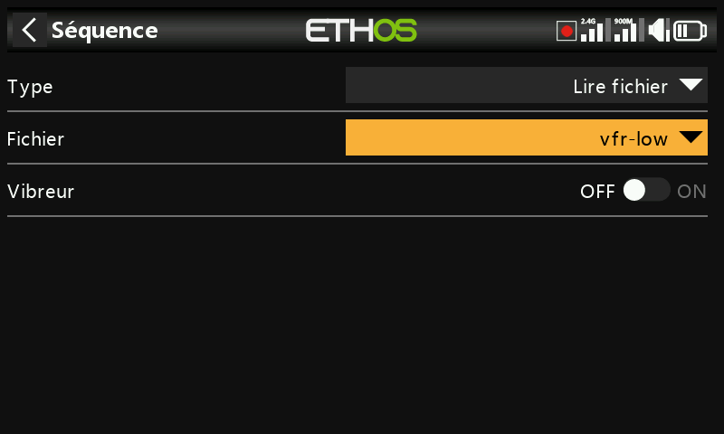

  - **Annoncer une valeur** — énonce la valeur d'une source : analogiques,
    interrupteurs, interrupteurs logiques, trims, voies, gyro, horloge
    système, écolage, chronos ou télémétrie.

    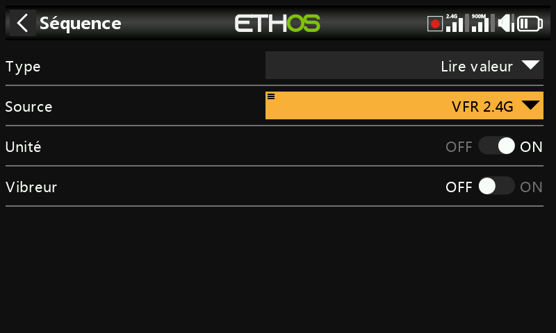

  - **Attendre une durée** — une pause fixe, jusqu'à 10 minutes.
  - **Attendre une condition** — met la séquence en pause jusqu'à ce qu'une
    condition soit remplie.

  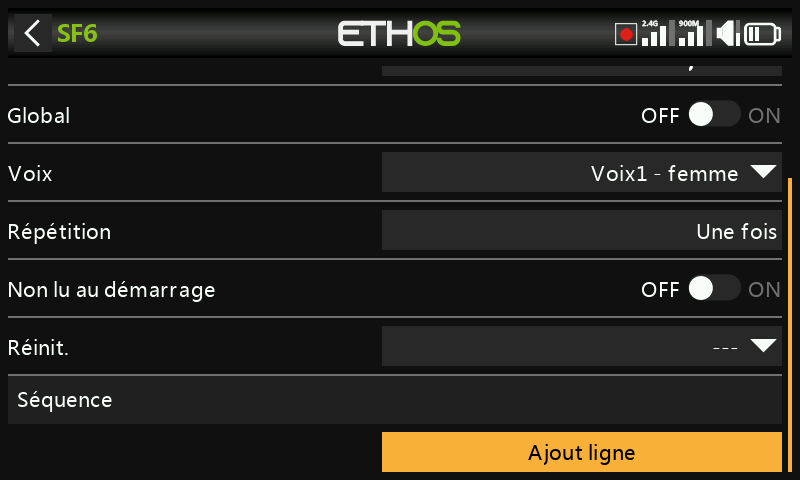
  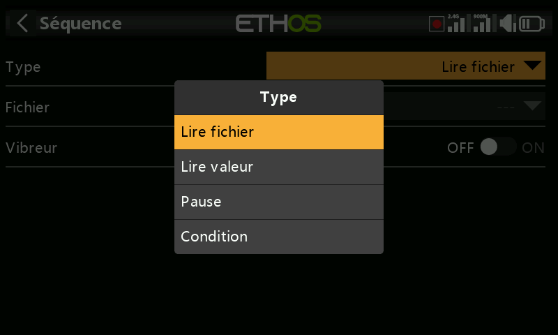

  Par exemple : lire `vfrlow.wav` lorsque l'interrupteur logique `VFRlow`
  devient actif, puis énoncer la valeur VFR minimale enregistrée —

  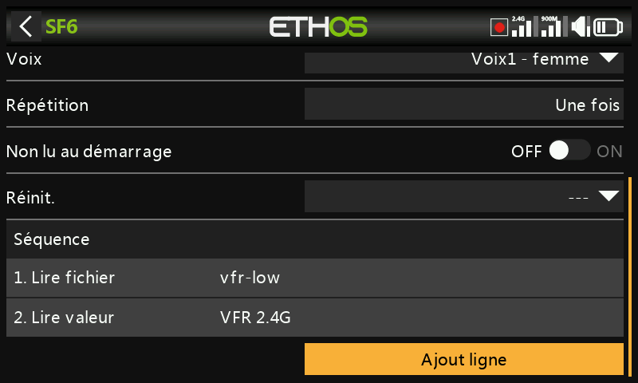

  — ou mettre une séquence en pause jusqu'à ce que l'interrupteur SH soit
  placé vers le bas avant de continuer :

  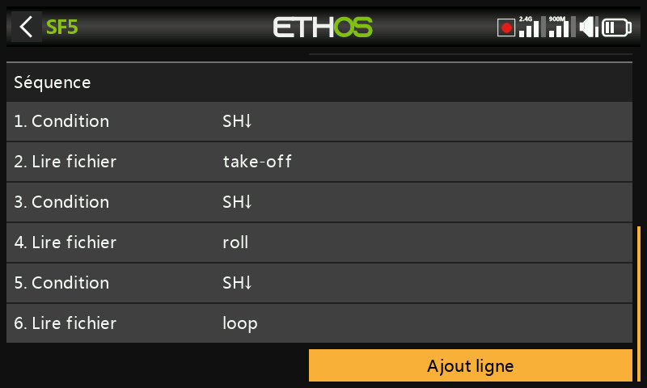

  Appuyez sur une ligne de la séquence pour la modifier, en ajouter une, les
  réorganiser ou les supprimer :

  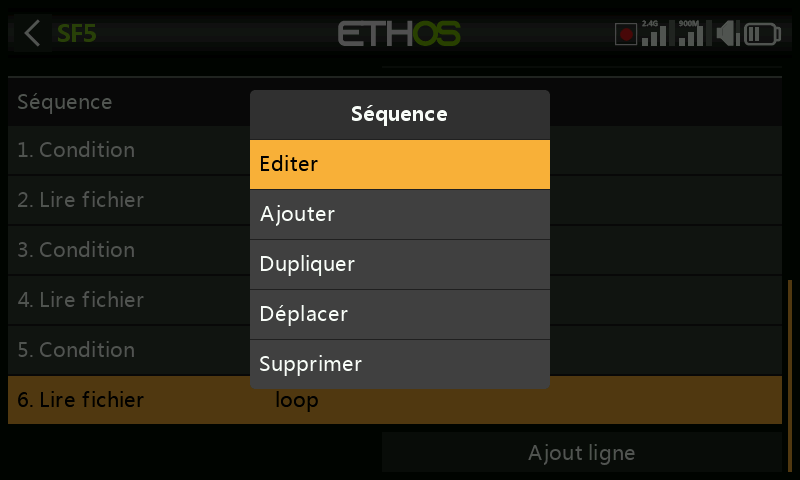

**Haptique** — retour vibratoire :

- **Motif** — simple, double, triple, quintuple, ou très bref.

  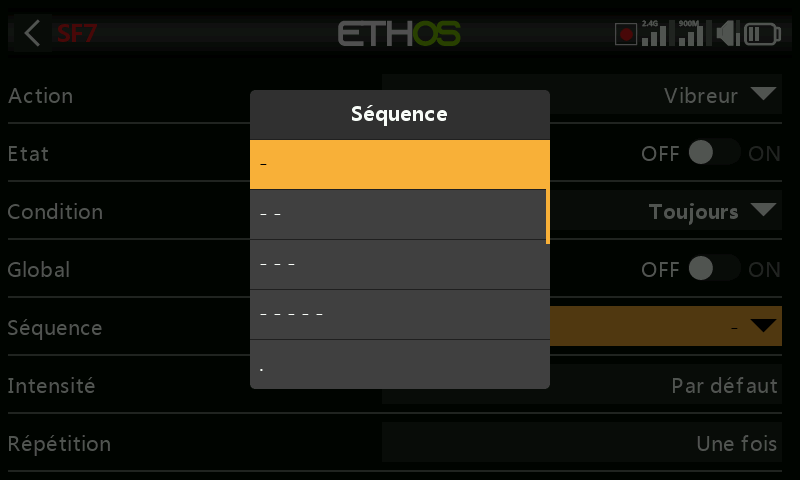

- **Intensité** — 1 à 10 (5 par défaut).
- **Répétition** — une fois, ou à un intervalle défini.
- **Sélection des moteurs haptiques** — sur les radios équipées de moteurs
  haptiques dans les manches (X20 Pro AW, X20RS, ou une X20 Pro/X20R équipée
  de manches MC20R — voir
  [Matériel](../system-setup/hardware.md#radio-specific-hardware-options)) :
  **Par défaut** (haptique interne), **Tous les moteurs**, **Manche gauche**,
  ou **Manche droit**.

  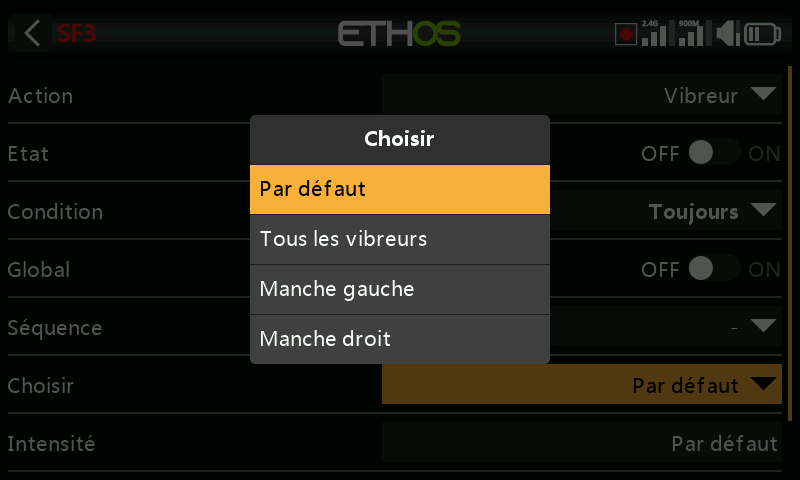

**Écriture des logs** — écrit des journaux `.csv` dans `Logs/` sur la SD
card/eMMC, horodatés depuis le RTC (indispensable pour distinguer ensuite les
sessions de vol) :

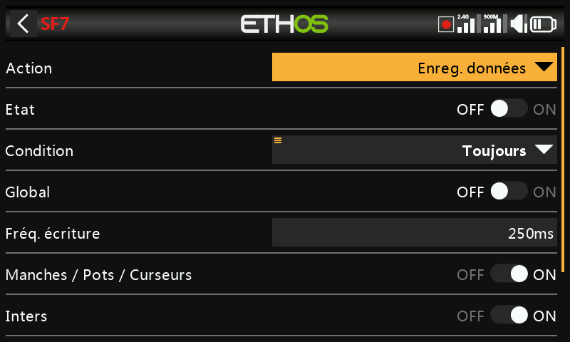

- **Intervalle d'écriture** — 100 à 500 ms.
- **Manches/Potentiomètres/Curseurs**, **Interrupteurs**, **Interrupteurs
  logiques**, **Voies** — catégories d'enregistrement activables
  indépendamment.

  **Consultation des logs** : ouvrez un fichier de log depuis `/Logs` dans le
  Gestionnaire de fichiers. Choisissez les voies à tracer (RSSI est
  sélectionné par défaut) ; déplacez-vous avec l'encodeur rotatif ou par
  balayage, et zoomez en tournant l'encodeur tout en maintenant `PAGE`.
  `DISP` place le focus sur le premier bouton de la colonne de droite.

**Lecture de texte** (X20 PRO uniquement) — synthèse vocale intégrée à la
radio au lieu d'un fichier pré-enregistré :

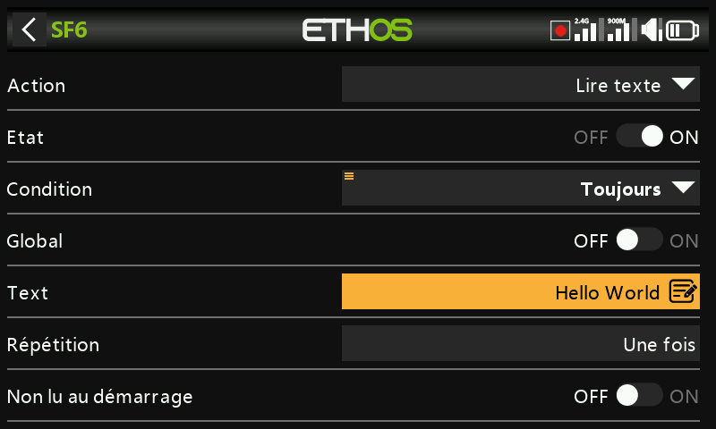

- **Texte** — la chaîne à énoncer. Les MAJUSCULES sont épelées lettre par
  lettre (par exemple « OFF » → « O-F-F ») ; les minuscules sont prononcées
  comme un mot (« off »).
- **Répétition**, **Ignorer au démarrage** — comme ci-dessus.

**Aller à l'écran** — bascule l'affichage vers un écran choisi, par exemple
pour afficher l'enregistrement des données de vol d'un récepteur lors de
l'appui sur un bouton :

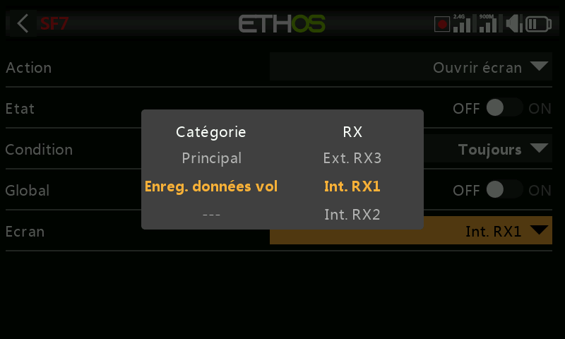

**Verrouiller l'écran tactile** — verrouille l'écran tactile contre les
appuis involontaires (également accessible directement en maintenant `ENT` +
`PAGE` ensemble pendant 1 s depuis l'écran d'accueil) :

**Charger un modèle** — charge le **Modèle** spécifié lors du déclenchement,
avec une **Confirmation** facultative avant le changement effectif :

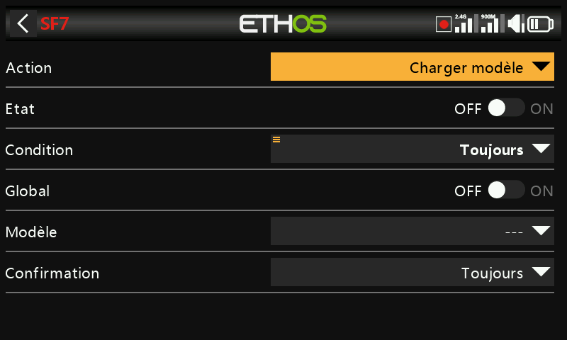

**Lecture vario** — pilote l'audio du vario à partir d'une source choisie
(normalement le capteur VSpeed d'un vario FrSky, mais tout capteur en unité
m/s convient) :

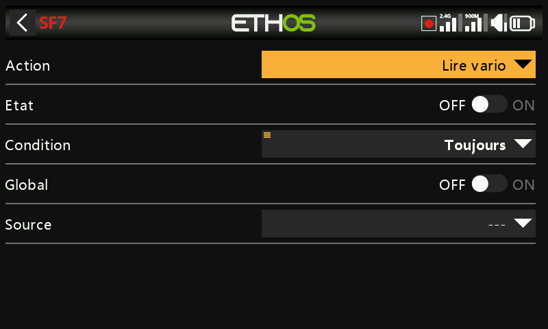
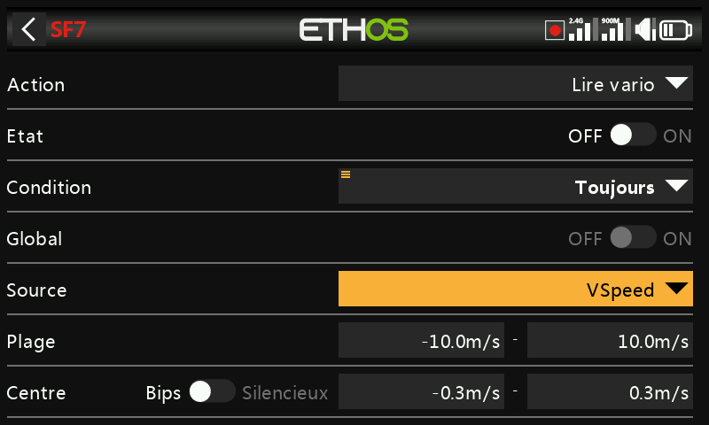

- **Plage** — taux de montée/descente associé à la hauteur du son, ±10 m/s
  par défaut (jusqu'à ±100 m/s). Au-dessus du **Centre**, la hauteur du son
  augmente linéairement avec le taux de montée jusqu'à la valeur maximale de
  la Plage (la hauteur du son au taux maximal se règle dans [Général →
  Vario](../system-setup/general.md#vario)) ; en descente, un son continu
  descend en hauteur jusqu'à la valeur minimale de la Plage.
- **Centre** — la bande de « montée nulle », ±0,3 m/s par défaut (jusqu'à
  ±2 m/s) ; la hauteur du son y reste constante (la hauteur au taux nul se
  règle également dans Général → Vario). Passez **Bip**→**Silencieux** pour
  couper entièrement le son.

  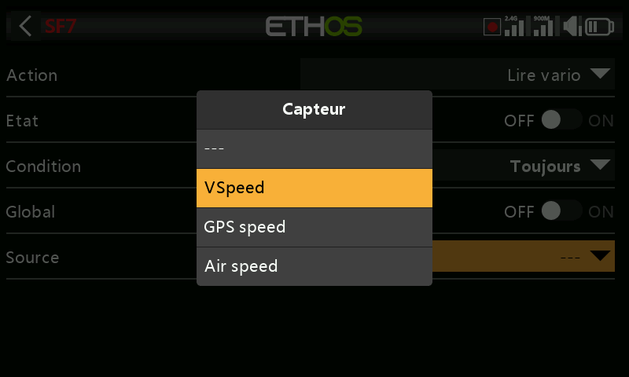
