# Télémétrie

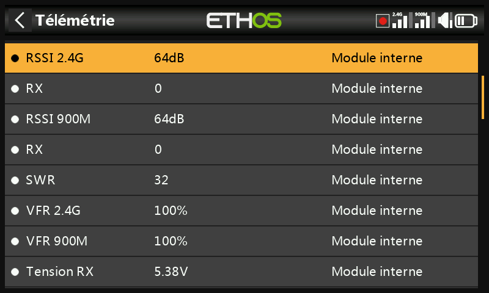

La télémétrie renvoie des informations du modèle vers le pilote — qualité
de liaison (RSSI, VFR), tensions et courants, ainsi que toute autre donnée
transmise par un capteur connecté (position GPS, altitude, etc.). Jusqu'à
100 capteurs sont pris en charge par modèle ; la détection et la
configuration se font ici, mais la télémétrie est en réalité *affichée*
sous forme de [widgets sur les écrans d'affichage](../displays/index.md),
configurés séparément dans Configurer les écrans.

## Fonctionnement de la télémétrie FrSky {: #how-frsky-telemetry-works }

Les capteurs FrSky fonctionnent sans concentrateur : le **Smart Port
(S.Port)** est un bus à 3 fils (Gnd, V+, Signal), chaîné dans n'importe
quel ordre sur la connexion S.Port des récepteurs de série X/S et
ultérieurs, fonctionnant en semi-duplex à 57 600 bps (F.Port et FBUS sont
plus rapides).

- **Physical ID** — jusqu'à 28 nœuds (y compris le récepteur) partagent le
  bus, chacun nécessitant un Physical ID unique (00–1B hexadécimal). Les
  appareils FrSky sont livrés avec des valeurs par défaut cohérentes
  (p. ex. Vario = 00, FLVSS = 01, Current = 02, GPS = 03) — si vous
  connectez deux appareils identiques, le Physical ID du second doit être
  modifié via la [Configuration des
  appareils](../system-setup/devices.md).
- **Application ID** — indépendant du Physical ID : un capteur peut
  transmettre plusieurs valeurs, chacune avec son propre Application ID.
  Un Vario possède un seul Physical ID mais deux Application ID (altitude,
  vitesse verticale) ; un FLVSS possède un Physical ID et un Application
  ID (tension). Surveiller deux packs 6S avec deux capteurs FLVSS implique
  de modifier **les deux** ID sur le second — le Physical ID pour une
  communication exclusive sur le bus, l'Application ID afin que le
  récepteur puisse distinguer Lipo 1 de Lipo 2 (p. ex. `0300` → `0301`).
  C'est le 4ᵉ chiffre hexadécimal que l'on fait normalement varier, de 0 à
  F.

  !!! note
      Des capteurs partageant un même Application ID mais avec des
      Physical ID différents ne sont valides que si la [détection des
      conflits de capteurs](../system-setup/alerts.md) est désactivée —
      il s'agit d'une configuration à usage spécifique, pas du cas par
      défaut.

Chaque valeur reçue est suivie comme un capteur distinct : valeur,
Physical/Application ID, nom modifiable, unité, précision décimale,
indicateur facultatif d'enregistrement sur carte SD, et ses propres min/max
courants. Les capteurs sont détectés automatiquement à chaque mise sous
tension une fois configurés, mais doivent être détectés **manuellement** la
première fois. Une fois détecté, un capteur peut être annoncé vocalement,
alimenter des [capteurs calculés](#calculated-sensors), être utilisé dans
des [interrupteurs logiques](logical-switches.md), des [Vars](variables.md)
ou des [mixages](mixes.md), affiché sur un écran de télémétrie
personnalisé, ou lu directement depuis cette page de configuration sans
créer d'écran du tout.

**FBUS** (anciennement F.Port2) va encore plus loin en regroupant le
contrôle SBUS et la télémétrie S.Port sur une seule ligne à 460 800 bps
(contre 115 200 pour F.Port et 57 600 pour S.Port — les trois débits sont
mutuellement incompatibles), et permet à un hôte de dialoguer avec
plusieurs accessoires esclaves sur cette unique ligne, le tout
configurable sans fil depuis la radio.

### Télémétrie multi-récepteurs (ACCESS Trio)

Avec jusqu'à trois récepteurs enregistrés dans le [système
RF](rf-system.md#registering-and-binding-a-receiver-access), chaque
récepteur appairé peut être configuré individuellement (broches de port,
etc.) via RX1/RX2/RX3. Normalement, il y a une seule voie de télémétrie
entrante par liaison RF — les systèmes Tandem/TD constituent l'exception,
utilisant le 2,4 GHz et le 900 MHz comme deux voies sur un même module. La
source de télémétrie active peut changer en cours de vol selon les
conditions RF ; le capteur **RX** indique en temps réel quel récepteur
transmet actuellement la télémétrie (et l'enregistre).

La configuration courante : chaîner le bus de capteurs S.Port à travers les
trois récepteurs, avec une alimentation commune, puis enregistrer/appairer
chaque récepteur et détecter les capteurs normalement — la source de
télémétrie basculera automatiquement lorsque le RX actif change, et les
données des capteurs S.Port *externes* suivront de façon transparente. (Les
capteurs internes au récepteur — RSSI, VFR, RxBatt, ADC2, RX lui-même — ne
sont pas liés de cette manière ; ils sont toujours rapportés pour le
récepteur qui est actuellement la source. La télémétrie simultanée depuis
les trois récepteurs est prévue mais pas encore disponible.)

## Capteurs de qualité de liaison

- **RSSI** (Receiver Signal Strength Indicator) — la puissance de
  l'émission de la radio telle que reçue par le récepteur. Alarmes par
  défaut : **ACCESS**/**TD**/**TW** 35 (bas) / 32 (critique), perte de
  contrôle autour de 28 ; **ACCST** 45 / 42, perte de contrôle autour de
  38. « Télémétrie perdue » se déclenche lorsque la liaison est totalement
  interrompue — à ce moment, **aucune autre alarme ne peut être émise**,
  puisque la radio n'a plus de télémétrie à évaluer ; considérez cela comme
  un signal pour faire demi-tour immédiatement. (À moins d'environ 1 m de
  séparation, le récepteur peut être saturé et produire des boucles
  d'alarmes Perdue/Rétablie parasites — ce n'est pas un vrai défaut.) Le
  RSSI approxime bien la portée effective, mais le VFR est l'indicateur de
  qualité de liaison le plus fiable.

  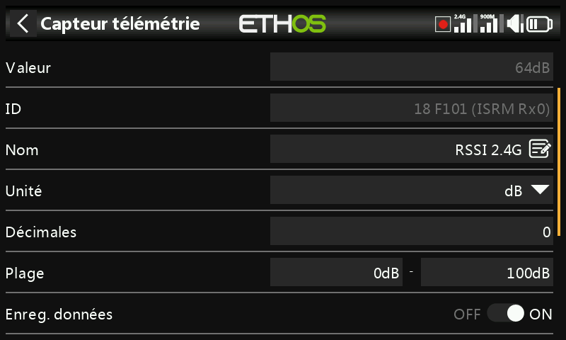

  Les récepteurs TD rapportent un RSSI par bande (2.4G, 900M) ; les
  récepteurs TW en rapportent également un par bande (2.4FSK, 2.4LoRa,
  900M) — activez **Alerte RSSI individuelle par bande** pour obtenir des
  alertes vocales distinctes pour chacune plutôt qu'une alerte combinée :

  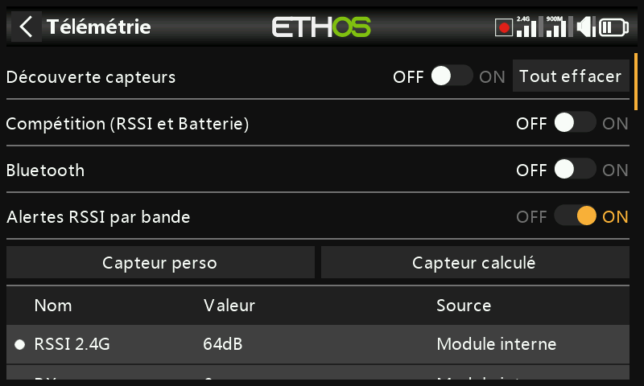

- **VFR** (Valid Frame Rate) — nombre de trames valides sur 100 reçues ;
  remplace, depuis ACCESS 2.1, l'intégration du taux de trames perdues dans
  le RSSI. L'**alerte de valeur basse** par défaut est de 50 %.

  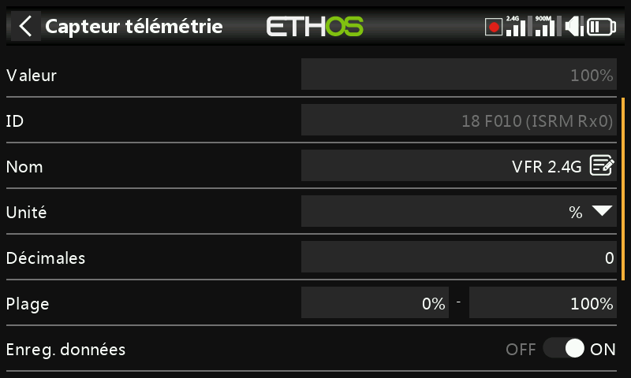

  Les récepteurs TD/TW rapportent deux flux VFR (un par bande) ; **Rx VFR**
  (sur les récepteurs TD/TW/AP/AP Plus) compte à la place chaque trame
  valide indépendamment de la bande de réception — c'est celui à surveiller
  si vous ne suivez qu'une seule valeur VFR.

- **RxBatt** — tension de la batterie de réception.
- **ADC2** — une seconde entrée de tension analogique, sur les récepteurs
  qui la prennent en charge.
- **SWR** — ROS d'antenne, en cas d'utilisation d'une antenne externe.
- Capteurs d'attitude/mouvement, lorsqu'ils sont pris en charge :
  **R.Angle**, **P.Angle**, **AccX/Y/Z**.

Chaque capteur numérique reçoit également des capteurs min/max
automatiques `<name>-`/`<name>+`, même s'ils n'apparaissent pas dans la
liste principale des capteurs.

## Détection des capteurs {: #discovering-sensors }

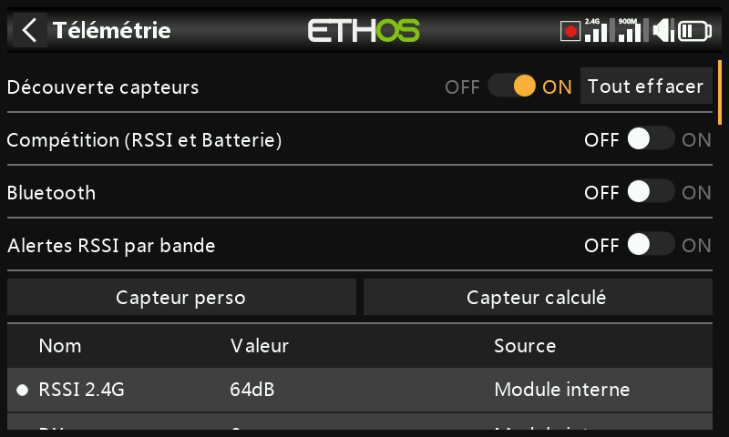

Une fois tout appairé et sous tension, activez **Découvrir de nouveaux
capteurs** — un point clignotant (ou une valeur en rouge, si aucune donnée
n'est encore disponible) marque chaque capteur au fur et à mesure de sa
détection, et l'écran se remplit automatiquement. Cette opération doit être
répétée **pour chaque modèle**, et à nouveau chaque fois qu'un nouveau
capteur est ajouté.

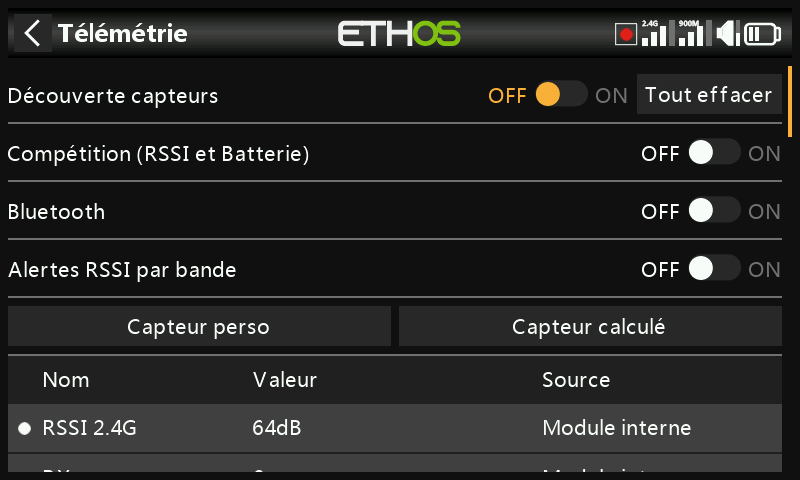

- Remettez la détection sur **Off** une fois terminé.
- **Tout supprimer** effacer tous les capteurs pour recommencer à zéro.

  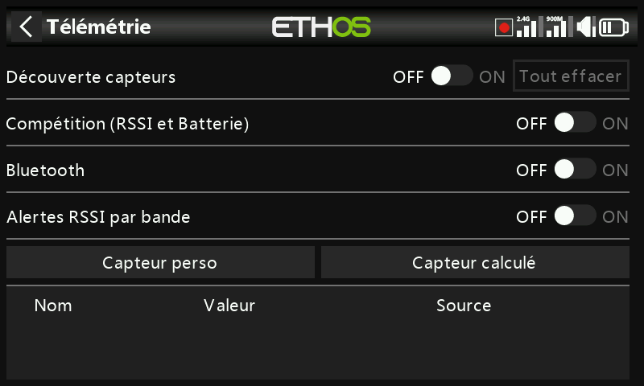

- Le **mode compétition** réduit la télémétrie au seul RSSI et RxBatt —
  pour les concours qui n'autorisent que les capteurs d'état de liaison. Sa
  désactivation nécessite un redémarrage de la radio avant que les capteurs
  puissent être redétectés.

  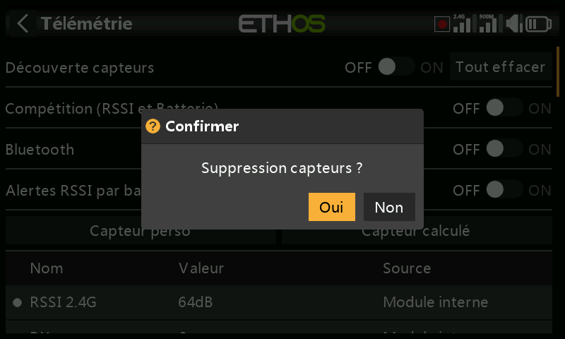

- Le mode de télémétrie **Bluetooth** s'appaire avec l'application
  téléphone FrSky FreeLink, qui peut afficher la télémétrie en direct et
  également configurer des appareils FrSky comme les récepteurs stabilisés.

  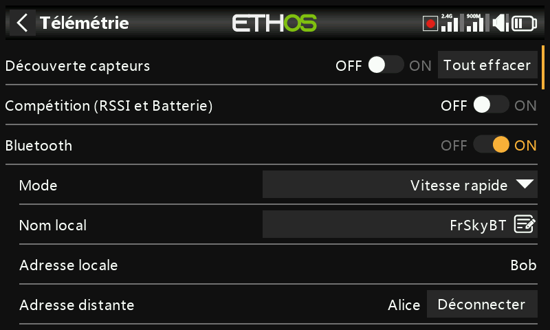

## Modification d'un capteur {: #editing-a-sensor }

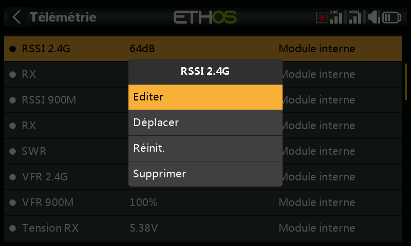

Appuyez sur un capteur pour **Éditer**, **Déplacer**, **Réinitialiser** ou
**Supprimer**. Champs communs : **Valeur** (lecture seule), **ID**
(Physical + Application ID, et récepteur émetteur), **Nom**, **Unité**,
**Décimales**, **Plage** (limites de mise à l'échelle fixes — surtout
pertinent lorsque le capteur est utilisé comme source de voie),
**Enregistrer les logs**, **Réinitialiser** (une source qui réinitialise ce
capteur), et **Délai d'alerte de perte de capteur** (désactivable
entièrement, ou 1–30 s, 10 s par défaut, afin de filtrer les brèves pertes
de signal — mesurez le risque d'une valeur trop élevée ; le message
« capteur perdu » n'est joué qu'une seule fois même si plusieurs capteurs
disparaissent simultanément ; désactivé par défaut pour les capteurs
internes au récepteur, ceux-ci disparaissant rarement).

Certains capteurs ajoutent leurs propres champs :

- **ADC2** — **Ratio** et **Offset**, pour corriger la mise à l'échelle.

  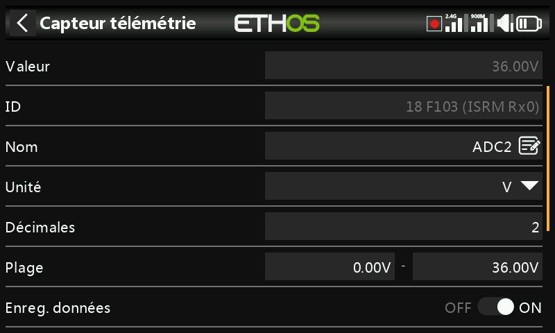

- **RSSI** — seuils **Valeur critique** et **Alerte de valeur basse**.
- **VFR** — **Alerte de valeur basse** (50 % par défaut).
- **VSpeed** (vitesse verticale du vario) — **Plage** jusqu'à ±100 m/s
  (±10 m/s par défaut). Le comportement sonore du vario lui-même se
  configure désormais dans la [fonction spéciale Play
  Vario](special-functions.md), et non ici.

  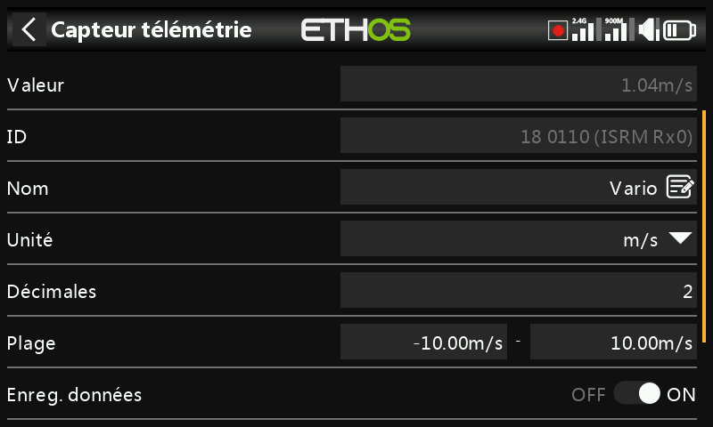

## Capteurs DIY / tiers

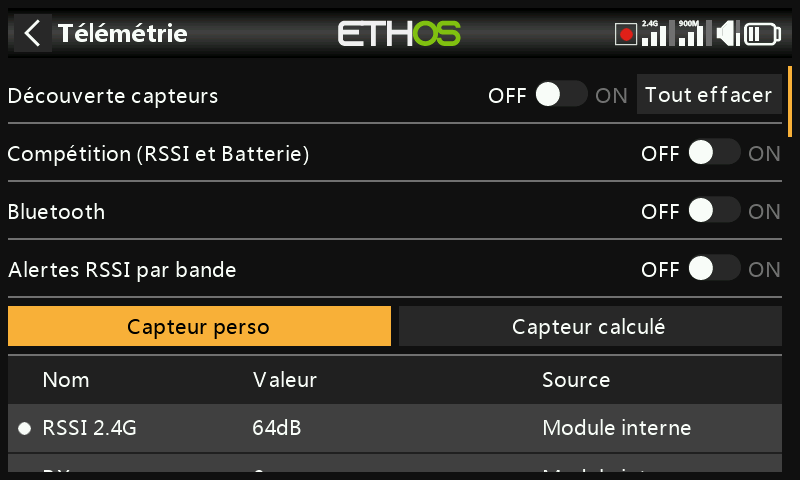

**Créer un capteur DIY** ajoute manuellement un capteur non FrSky :
**Détection automatique** (remplit automatiquement le Physical ID,
l'Application ID et le module, si possible), ou saisie manuelle, avec en
plus **Décimales/unité du protocole** (précision entrante, 0–3 décimales,
et unité native) et **Décimales/unité d'affichage** (indépendantes de
celles du protocole), à côté des mêmes champs **Plage**/**Ratio**/
**Offset**/**Enregistrer les logs**/**Réinitialiser**/**Délai d'alerte de
perte de capteur** que pour tout autre capteur.

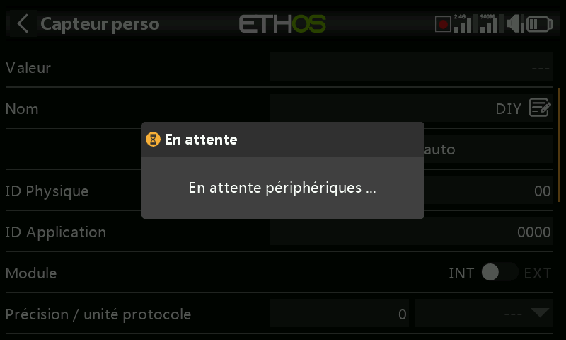

## Capteurs calculés {: #calculated-sensors }

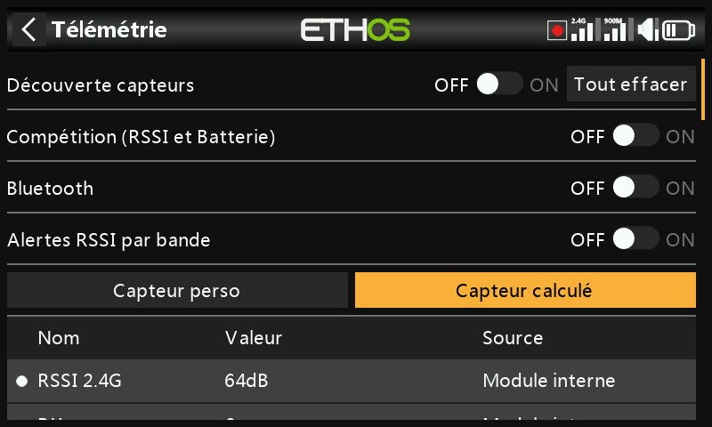

Dérivez un nouveau capteur à partir d'un ou plusieurs capteurs existants :

- **Consommation** — énergie consommée, intégrée à partir d'un capteur de
  courant (p. ex. la série FAS). Unité mAh/Ah, plage jusqu'à 1000 Ah.

  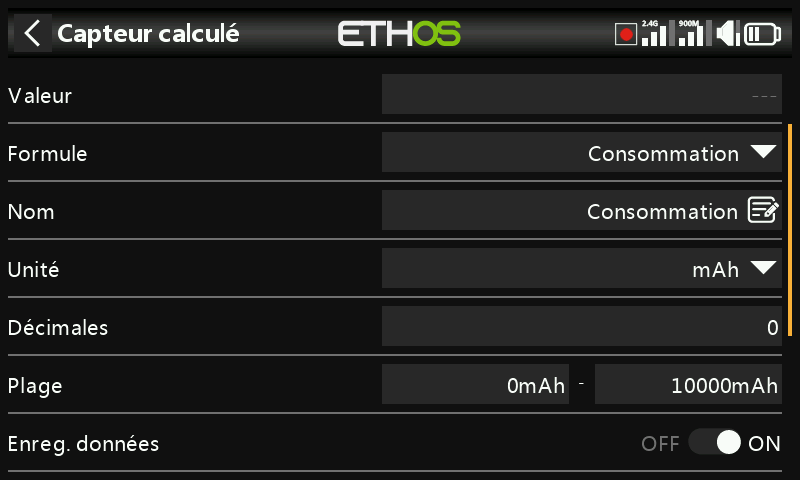

- **Distance** — à partir d'une source GPS (plus une source d'altitude,
  pour la distance 3D). Unités cm/m/km/ft, jusqu'à 20 km.

  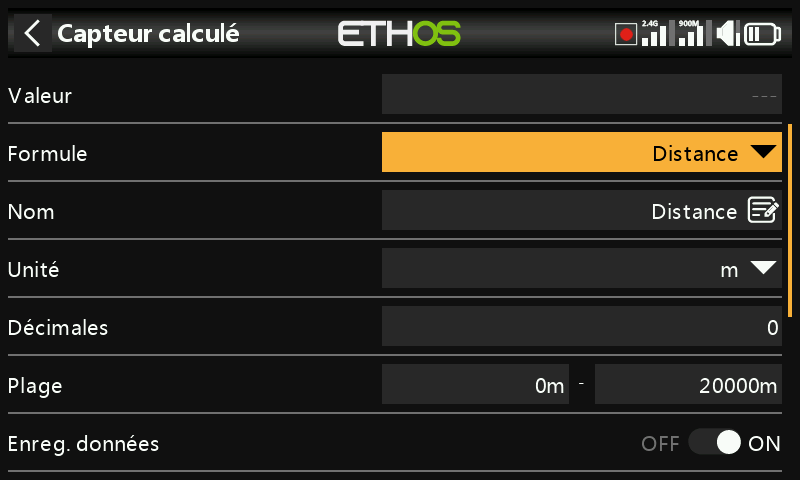

- **Trajet** — distance cumulée entre les positions GPS successives. Mêmes
  unités, jusqu'à 1000 km.

  

- **Multi Lipo** — met en cascade deux capteurs de tension Lipo ou plus
  pour surveiller des packs de plus de 6S (jusqu'à 67,2 V/8S).
  Sélectionnez chaque capteur d'éléments du plus bas au plus haut ; chaque
  capteur Lipo supplémentaire doit d'abord voir ses Physical **et**
  Application ID modifiés dans la [Configuration des
  appareils](../system-setup/devices.md) (l'outil de configuration Lipo
  Voltage y est utile), être détecté un à la fois, puis renommé afin de
  pouvoir les distinguer.

  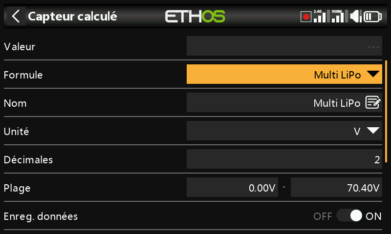

- **Pourcentage** — remet un capteur à l'échelle 0–100 %, avec une option
  **Inverser** (p. ex. pour afficher le pourcentage *restant* au lieu du
  pourcentage consommé).

  

- **Puissance** — puissance en watts à partir d'un couple de sources
  **Courant** et **Tension**, jusqu'à 1 000 000 W.

  

- **Personnalisé** — une formule arbitraire chaînée à partir d'une ou
  plusieurs sources.

Chaque capteur calculé dispose également d'une option **Persistant**
(conservé après extinction ou changement de modèle, rechargé à la
prochaine utilisation) et d'un bouton **Réinitialiser** directement sur
l'écran d'édition.

### Capteurs personnalisés

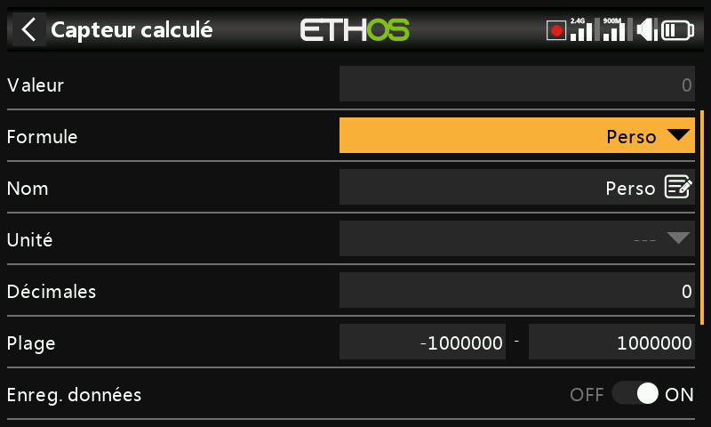

Part d'une source, puis **Ajouter** chaîne d'autres opérations :
**Add(+)**, **Minus(-)**, **Multiply(×)**, **Divide(/)**, **Min**,
**Max**, **Sqrt**. Les unités sont sélectionnables dans une longue liste
couvrant tension, courant, capacité, puissance, distance, vitesse, temps,
température, pourcentage, angles, pression, et plus encore ; plage de
−1 000 000 à 1 000 000, 0–4 décimales.

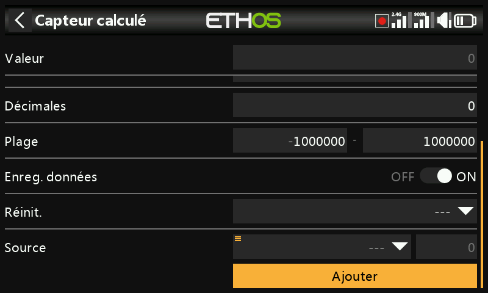

!!! example "Puissance de crête"
    Multipliez un capteur de tension (`VFAS`) par un capteur de courant
    (`Current`), puis ajoutez une étape **Max** référençant la valeur
    actuelle du capteur lui-même (`MaxPower`) afin de suivre la valeur la
    plus élevée observée — 288 W lors de cet exemple :

    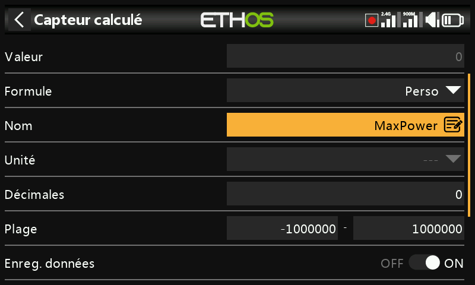

!!! example "Arithmétique avec une constante"
    Source définie sur `RSSI 2.4G` (lecture de 64 dB), puis une action
    **Subtract** dont la propre source reçoit un appui long avec
    **Convertir en valeur** appliqué, la transformant en constante
    modifiable (20) plutôt qu'en source live — le résultat est un 44 dB
    stable (64 − 20) :

    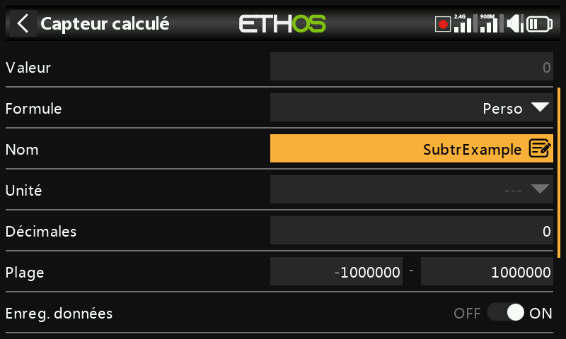
    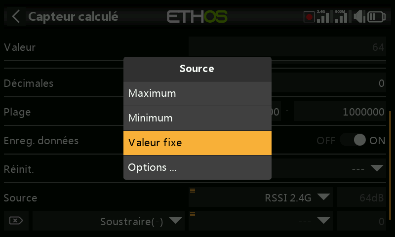

!!! note "Valeur interne d'une source"
    Chaque [source](../getting-started/user-interface-and-navigation.md#choosing-a-source)
    possède une plage entière interne de ±1024 correspondant à sa plage
    affichée de ±100 % — visible directement en pointant un capteur
    personnalisé sur, par exemple, les gaz : plein gaz affiche **+1024** en
    interne, l'inverse total affiche **−1024**.

    
    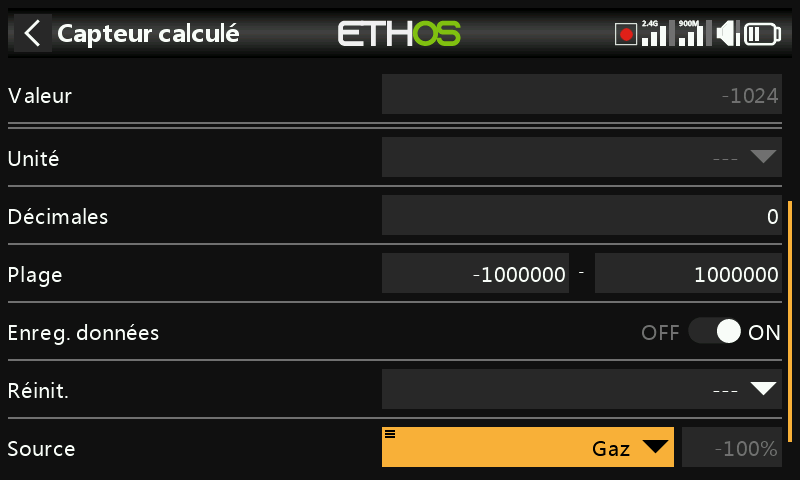
