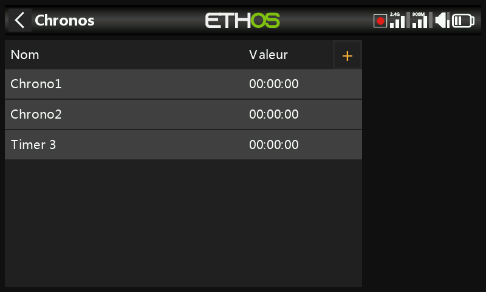
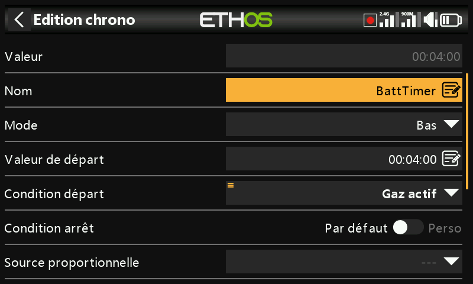
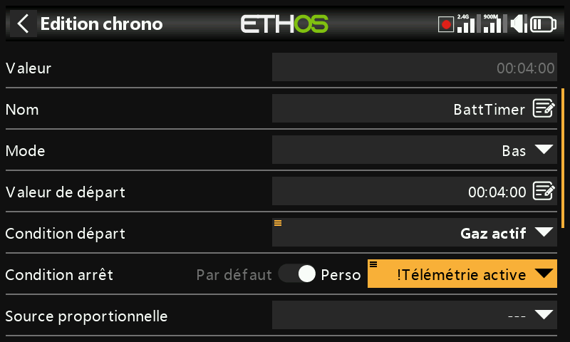
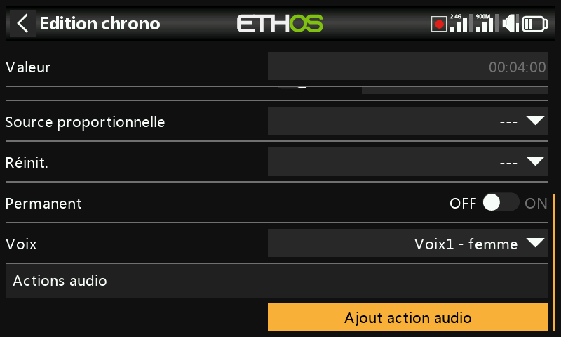
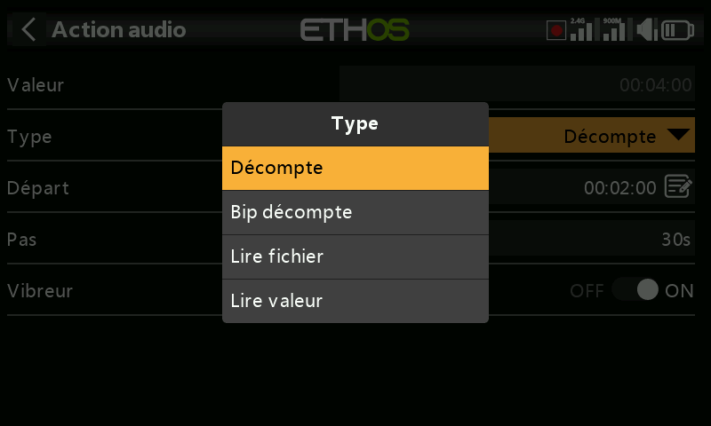
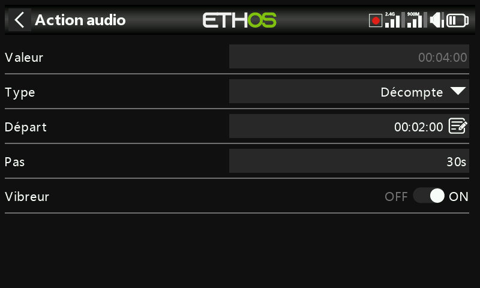
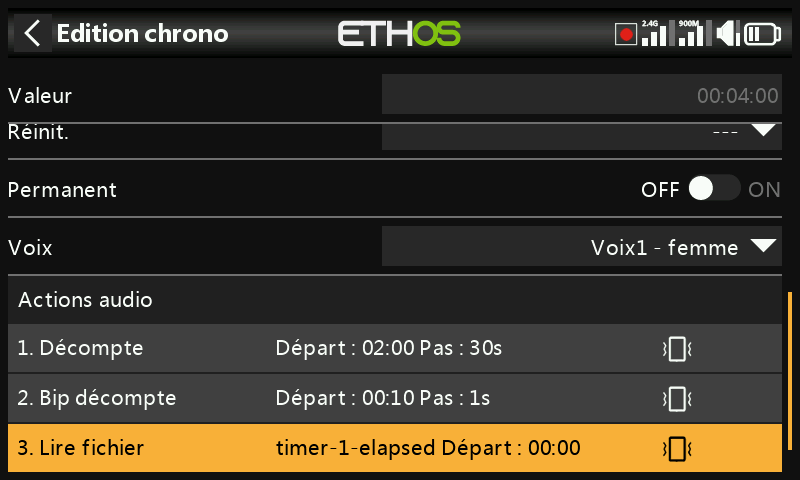
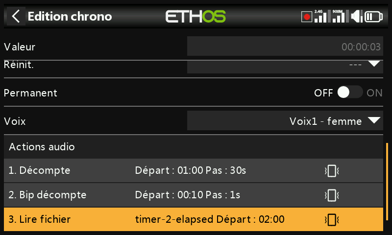

# Chronos

Il y a huit chronos entièrement programmables, qui peuvent chacun compter
(haut) ou décompter (bas). Ajoutez-en un avec le **+** situé à côté des
en-têtes de colonnes, ou via **Ajouter** en dessous. Appuyer sur une ligne
de chrono fait apparaître les options permettant de réinitialiser, de
modifier, d'ajouter, de déplacer ou de copier/coller le chrono.

## Champs communs (décompte et comptage)

- **Valeur** — affiche la valeur actuelle du chrono.
- **Nom** — permet de nommer le chrono.
- **Mode** — **Haut** ou **Bas**.
- **Valeur de départ** (décompte uniquement) — la valeur à partir de
  laquelle le chrono commence le décompte.
- **Valeur de l'alarme** (comptage uniquement) — la valeur à laquelle le
  chrono est considéré comme écoulé ; il continue de compter au-delà, mais
  la valeur devient rouge dans les widgets de chrono.
- **Condition départ** — lance le chrono. Si la **Condition d'arrêt** est
  laissée sur le réglage par défaut, le chrono démarre *et* s'arrête
  uniquement avec la condition de départ. Sinon, le chrono démarre lorsque
  la condition de départ devient « vraie » pour la première fois, puis
  continue de s'exécuter.
- **Condition d'arrêt** — s'il ne s'agit pas de la valeur par défaut, la
  condition d'arrêt contrôle le chrono une fois celui-ci en cours
  d'exécution : le chrono s'arrête tant que la condition d'arrêt est
  « vraie », mais continue de s'exécuter tant qu'elle est « fausse ». Dans
  l'exemple ci-dessous, le chrono est démarré lorsque `ThrottleActive`
  devient « vrai » et s'arrête lorsque la télémétrie n'est plus active :

  

- **Source de synchronisation proportionnelle** — réglée sur `---`, le
  chrono compte en temps réel. Si une autre source est sélectionnée (par
  exemple le manche des gaz ou même la voie des gaz), la vitesse du chrono
  est contrôlée par cette source : à −100 % le chrono est arrêté, à +100 %
  il compte en temps réel, et avec des positions intermédiaires il
  fonctionne proportionnellement.
- **Réinitialisation** — le chrono peut être réinitialisé par les positions
  des inters, les inters de fonction, les inters logiques ou les positions
  des inters de trim. Notez que le chrono sera maintenu en réinitialisation
  tant que la condition de réinitialisation est valide.
- **Persistant** — permet de stocker la valeur du chrono en mémoire lorsque
  la radio est éteinte ou que le modèle est changé. La valeur sera
  rechargée à la prochaine utilisation du modèle.
- **Voix** — sélectionne le [pack vocal](../system-setup/general.md#audio-settings)
  utilisé pour les annonces de ce chrono.

## Actions audio

Les actions audio sont très puissantes et flexibles, ce qui permet de
configurer les alertes de chaque chrono selon les besoins de l'utilisateur.
Chaque action possède un type — **Décompte** (par voix), **Bip décompte**
(avec des bips au lieu de la voix), **Lire fichier** ou **Lire valeur** —
ainsi que :

- **Départ** — la valeur à partir de laquelle le décompte de cette action
  commence.
- **Répétition** — les intervalles auxquels la valeur du chrono sera
  annoncée, jusqu'à 10 minutes (600 secondes).
- **Vibreur** — une vibration accompagne les annonces.

Un ensemble typique de trois actions :

1. Tout d'abord, un décompte vocal commençant quand il reste 2 minutes,
   donné toutes les 30 secondes, avec le vibreur activé.
2. Deuxièmement, un bip décompte commençant à 10 secondes restantes, après
   quoi un bip sera émis toutes les secondes, avec le vibreur activé.
3. Enfin, un fichier audio personnalisé (par exemple `timer-1-elapsed`)
   sera lu lorsque le temps sera écoulé, accompagné d'une vibration.

D'autres actions audio peuvent être ajoutées en appuyant sur le bouton
« Ajouter » ; veuillez noter que la liste doit être classée par ordre de
priorité, la **priorité la plus élevée se trouvant à la fin de la liste**.

Voir également le [widget d'écran Journal des chronos](../displays/index.md#widget-types)
pour un journal des chronométrages passés.

