# Écolage

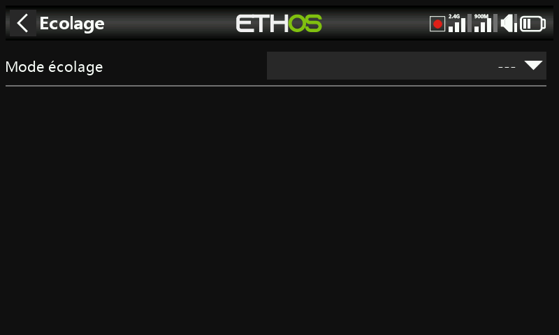

Désactivé par défaut. Définit la radio comme **Maître** (la radio de l'instructeur, qui reçoit jusqu'à 16 commandes de l'élève) ou **Élève** (la radio de l'élève, qui envoie à l'instructeur un nombre de voies configurable).

## Mode maître

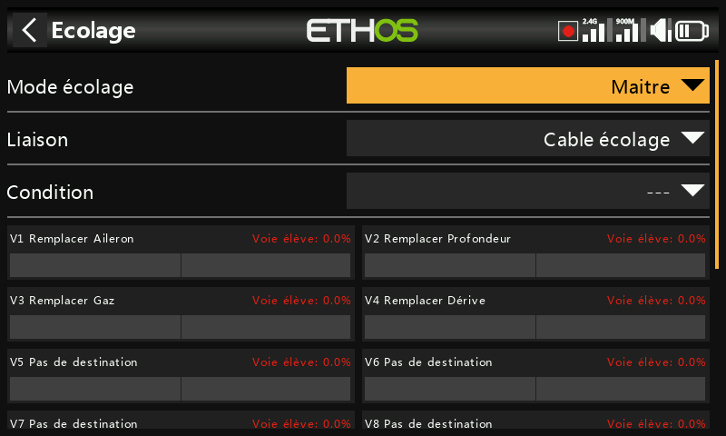
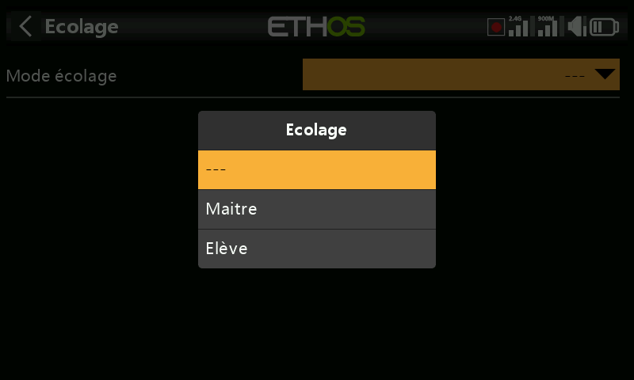

### Mode de liaison

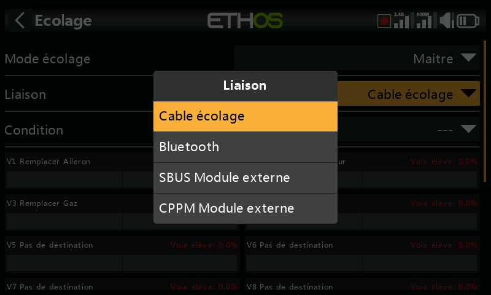

- **Câble d'écolage** — un cordon audio mono de 3,5 mm entre les deux radios.
- **Bluetooth** —

  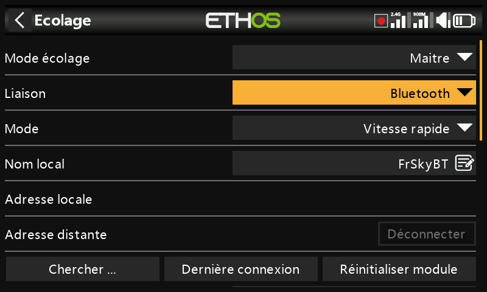

  - **Mode** — normal ou haute vitesse ; utilisez la haute vitesse pour réduire la latence si les deux radios la prennent en charge.

    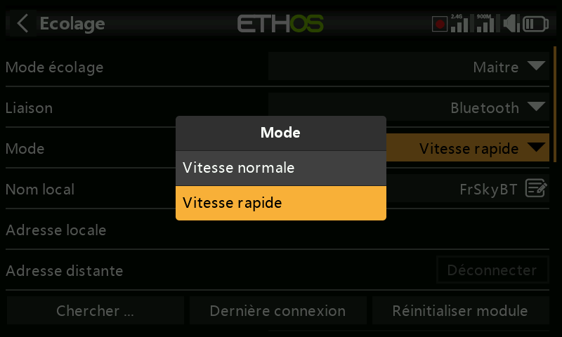

  - **Nom local** — le nom BT affiché aux autres appareils (par défaut `FrSkyBT`, modifiable).
  - **Adresse locale** — l'adresse Bluetooth de cette radio.
  - **Adresse distante** — l'adresse de la radio appairée, une fois la liaison établie.
  - **Rechercher des appareils** (mode Maître uniquement) — recherche les appareils à proximité :

    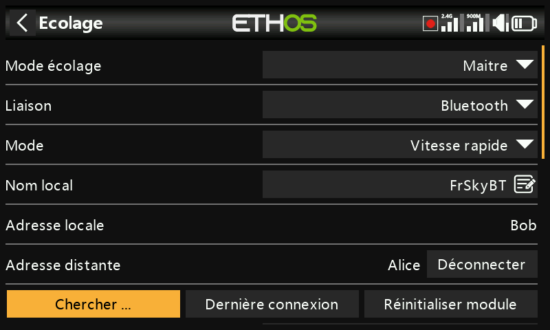
    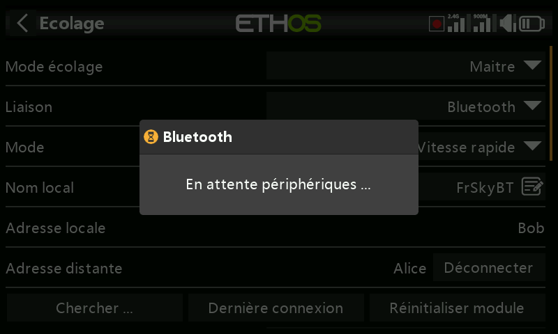
    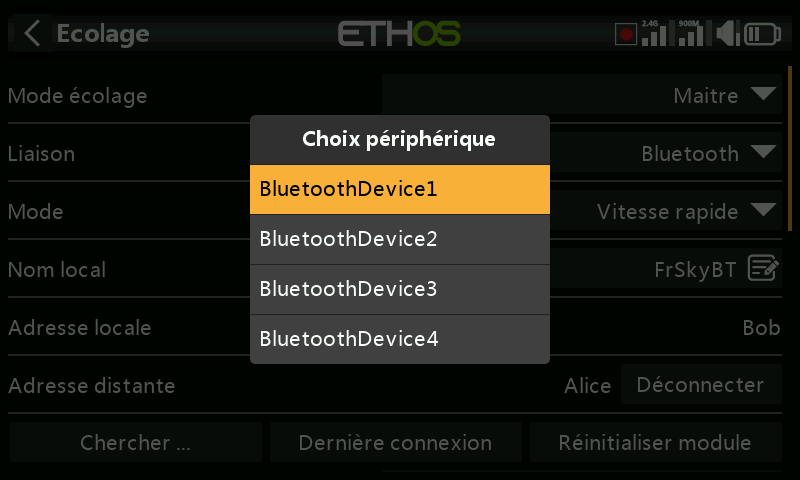
    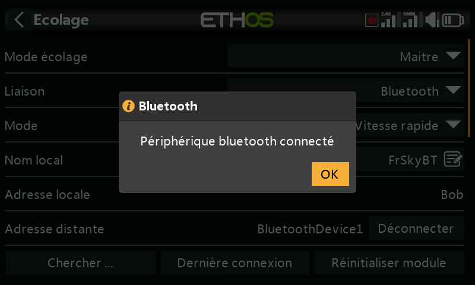

  - **Connect Last Device** / **Reset Module** — reconnecte l'appairage précédent, ou effface entièrement la configuration du module Bluetooth.

- **Module externe SBUS** — une entrée SBUS sur la broche PXX-IN de la baie du module externe, permettant d'installer un récepteur FrSky à sortie SBUS (par ex. Archer RS) comme extrémité réceptrice d'une liaison sans fil — ce qui permet à **n'importe quelle** radio FrSky de jouer le rôle de l'élève (buddy box), appairée à ce récepteur.
- **Module externe CPPM** — le même principe via une entrée CPPM, pour un récepteur ancien à sortie CPPM.

### Condition d'activation

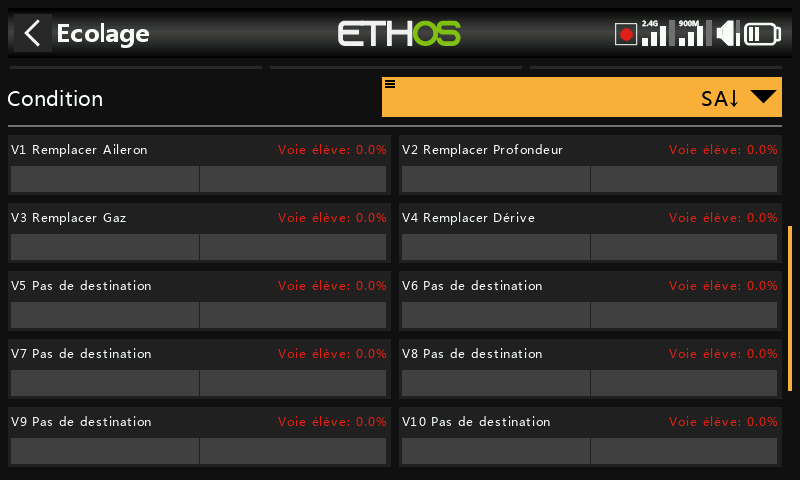

Un interrupteur/bouton, un interrupteur de fonction, un interrupteur logique, une position de trim ou une phase de vol qui confie les commandes à l'élève lorsqu'il est actif.

### Voies d'écolage

Jusqu'à 16 voies peuvent être transférées de l'élève vers le maître tant que la condition d'activation est vraie. Appuyez sur une voie pour la configurer individuellement :

- **Condition d'activation** — une dérogation propre à la voie, par exemple pour désactiver uniquement l'entrée de profondeur de l'élève pendant une partie de la séance.
- **Mode** — **OFF** (désactivé pour l'écolage), **Add** (les signaux du maître et de l'élève s'additionnent, de sorte que les deux peuvent agir simultanément sur la commande) ou **Replace** (le mode normal — l'élève a le contrôle total de cette voie lorsqu'elle est active).
- **Pourcentage** — met à l'échelle l'entrée de l'élève, normalement 100 %.
- **Destination** — la fonction à laquelle la voie de l'élève est affectée.

Voir [Guide pratique : reprise instantanée des commandes](../how-to/instant-takeback.md) pour un exemple concret d'instructeur reprenant instantanément le contrôle au moyen d'un interrupteur, et [Ignorer l'entrée d'écolage](../getting-started/user-interface-and-navigation.md#choosing-a-source) pour exclure le mouvement du manche de l'élève d'un interrupteur logique qui surveille les manches de l'instructeur.

## Mode élève

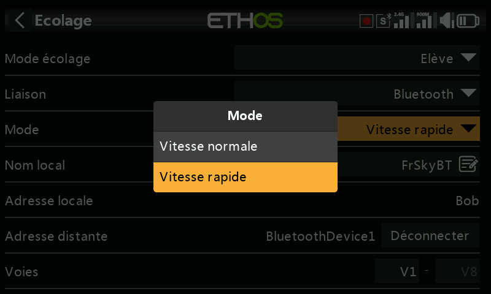

- **Mode de liaison** — le même choix entre câble d'écolage, Bluetooth ou module externe SBUS/CPPM qu'en mode Maître (mêmes champs Bluetooth **Mode**/**Nom local**/**Adresse locale**/**Adresse distante**).

  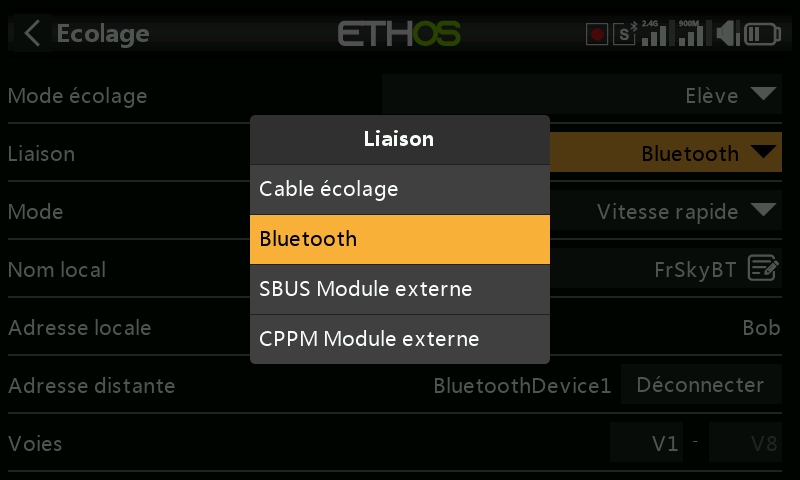

- **Plage de voies** — la plage de voies de cette radio qui est envoyée au maître.

  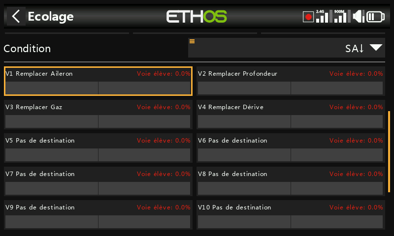
  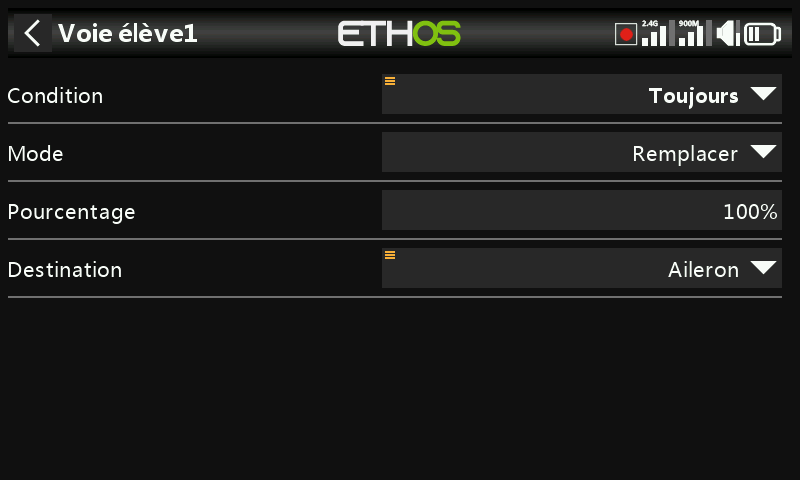
