# Trims

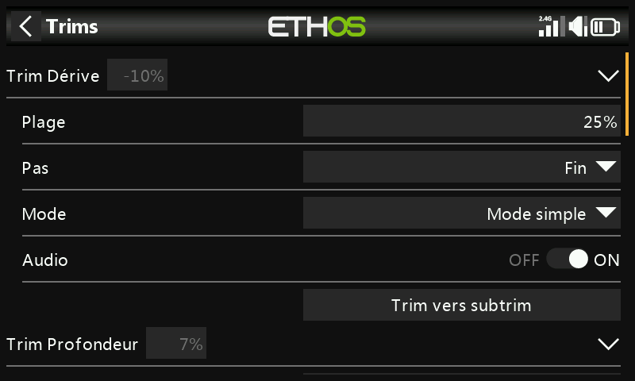

Configure pour chaque manche la plage de trim, le pas et le comportement,
ainsi que les trims croisés et le trim instantané. Les **X20 Pro/R/RS** et
**X18** ajoutent deux commandes de trim supplémentaires, **T5**/**T6**,
utiles pour des ajustements en vol au-delà des quatre manches principaux :

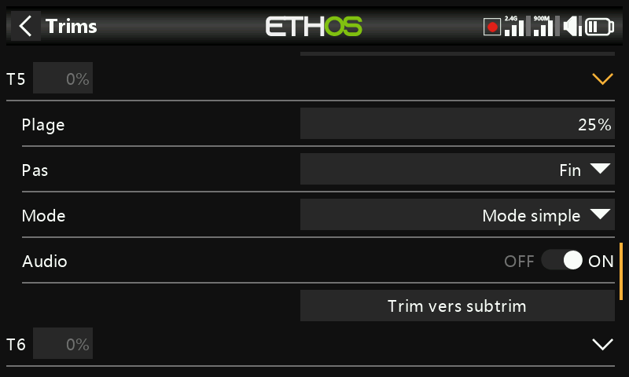

Chaque manche possède son propre jeu de réglages de trim indépendant.

## Réglages de trim {: #trim-settings }

- **Plage** — ±25 % par défaut, réglable jusqu'à la course complète du
  manche, soit ±100 %. Sur l'écran principal, un trim à plage par défaut
  affiche de −100 à 100 ; un trim à plage complète (100 %) affiche de
  −400 à 400 (4× la plage normale).

  !!! warning
      Élargir la plage signifie qu'en maintenant une palette de trim trop
      longtemps, on peut ajouter suffisamment de trim pour rendre le modèle
      impilotable.

- **Pas** — granularité de la commande de trim : **Très fin**, **Fin**,
  **Moyen**, **Grossier**, **Exponentiel** (fin près du centre, grossier
  en s'éloignant) ou **Personnalisé** (un pourcentage précis par cran).

  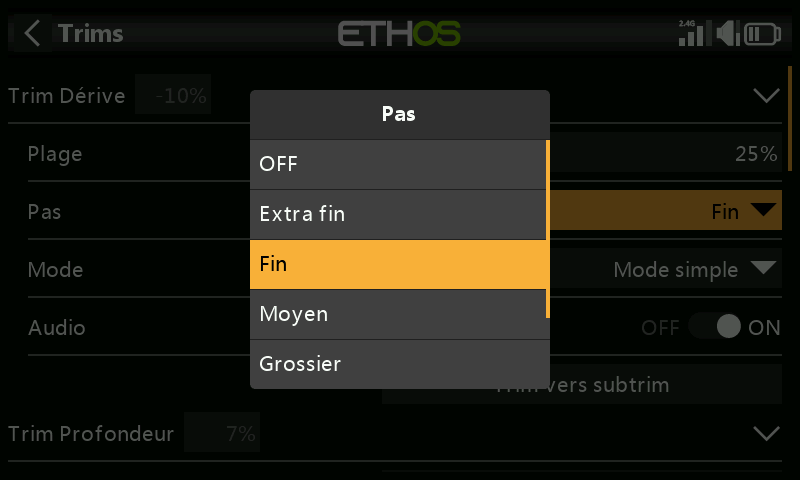

  | Pas | µs par cran (plage 25 %) |
  |---|---|
  | Très fin | 0,5 |
  | Fin | 1 |
  | Moyen | 2 |
  | Grossier | 4 |
  | Exponentiel | 0,3–16 |

  En personnalisé, avec une plage de 25 % : pas de 1 % = 1 µs/cran, pas de
  100 % = 128 µs/cran. Avec une plage de 100 % : pas de 1 % = 5 µs/cran,
  pas de 100 % = 512 µs/cran.

## Mode

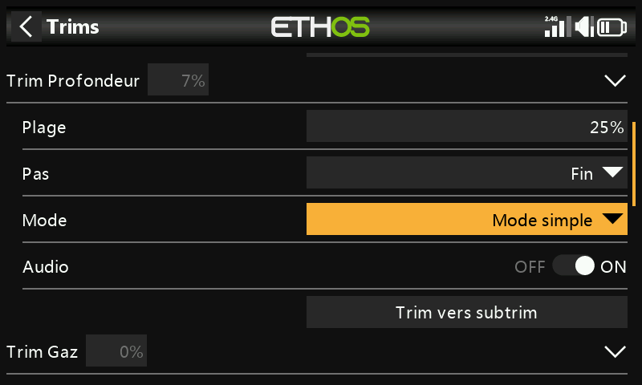

Par défaut, un trim est toujours actif, mais **Mode** modifie ce
comportement. Changer de mode remet le trim à 0.

- **OFF** — désactive complètement le trim.

  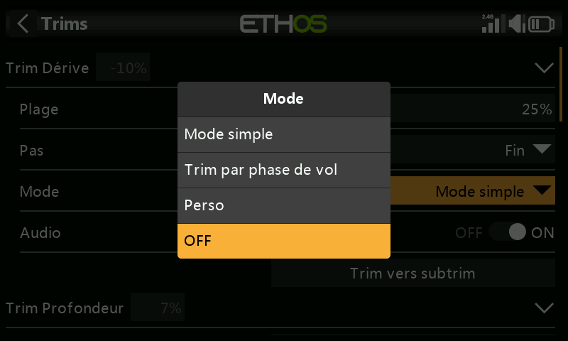

  Utile, par exemple, sur un modèle électrique n'ayant pas besoin de trim
  de gaz — la commande de trim ainsi libérée peut alors être
  [réaffectée au réglage d'une variable](variables.md).

- **Easy** — une seule valeur de trim partagée par toutes les phases de
  vol. C'est le choix habituel pour les ailerons et la dérive, puisque
  ceux-ci ont rarement besoin de varier selon la phase de vol.

  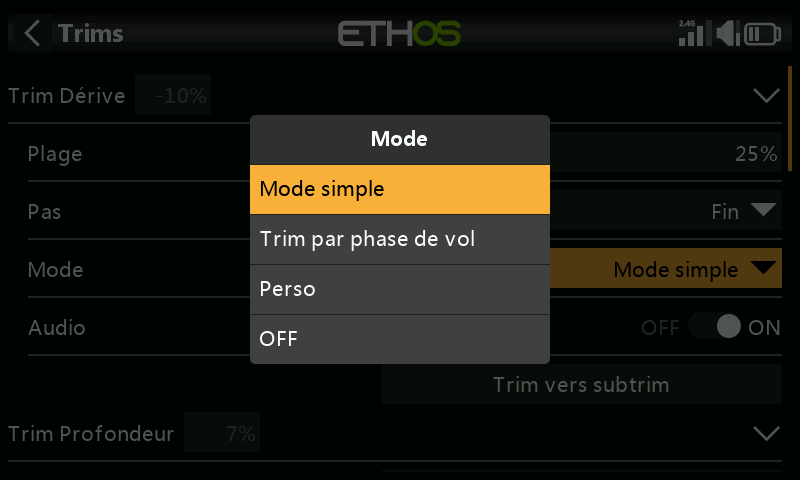

- **Indépendant par phase de vol** — le trim n'affecte que la phase de vol
  active. C'est le choix habituel pour le trim de profondeur, car celui-ci
  doit couramment différer selon la phase de vol (par ex. lors de
  changements de courbure de l'aile) — c'est même souvent la raison
  principale de mettre en place des phases de vol.

  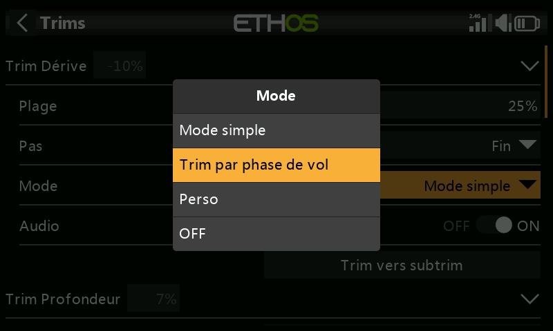

- **Personnalisé** — comportement entièrement personnalisé, construit à
  partir de **comportements** que vous ajoutez vous-même.

### Comportements de trim personnalisés

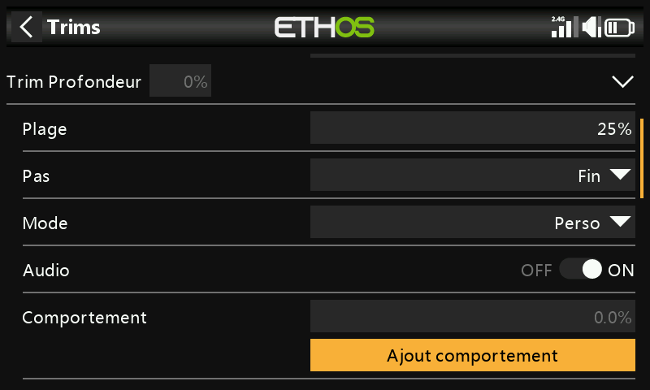
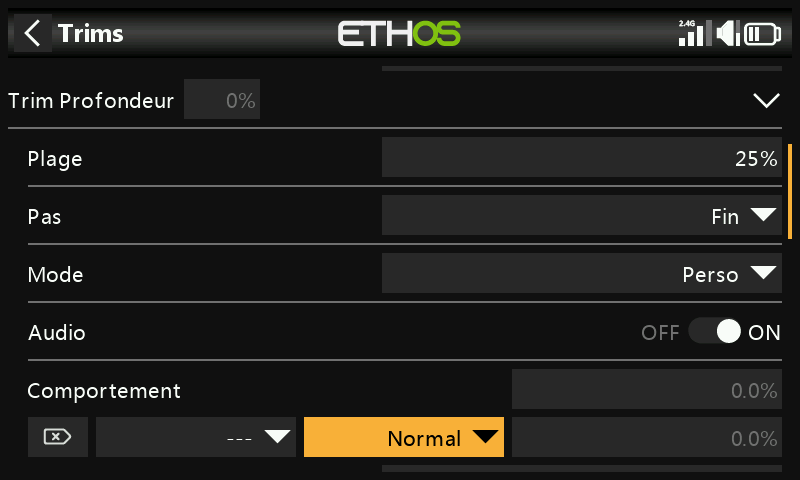

Chaque ligne de comportement comporte une condition et l'une des options
suivantes :

- **Débranché** — désactive le trim de manière sélective sous cette
  condition (plutôt que de le désactiver totalement avec Mode = OFF).

  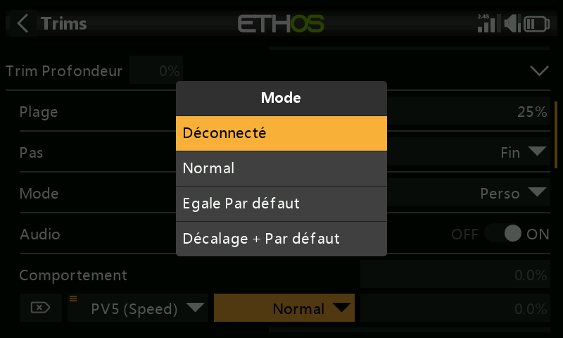
  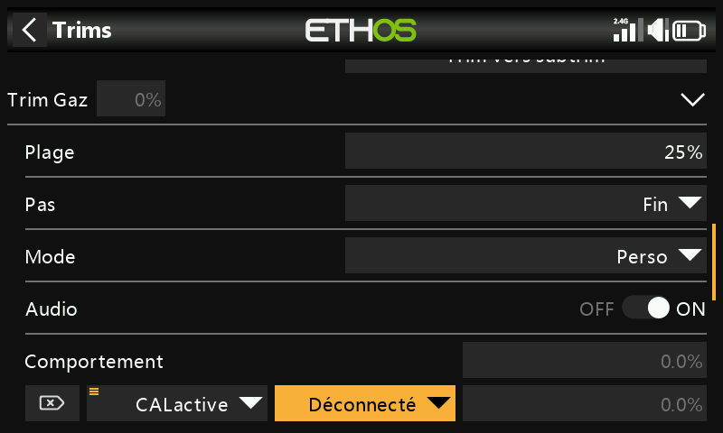

- **Normal** (par défaut) — comportement de trim ordinaire.
- **Égal (à un autre trim)** — ce trim suit exactement la valeur de trim
  d'une autre condition.

  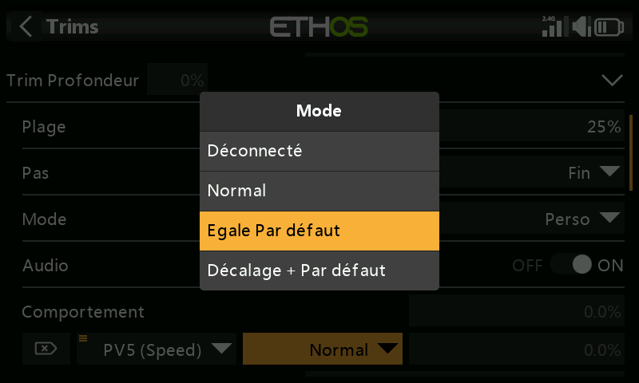

- **Offset + (un autre trim)** — ce trim s'ajoute à la valeur de trim
  d'une autre condition.

  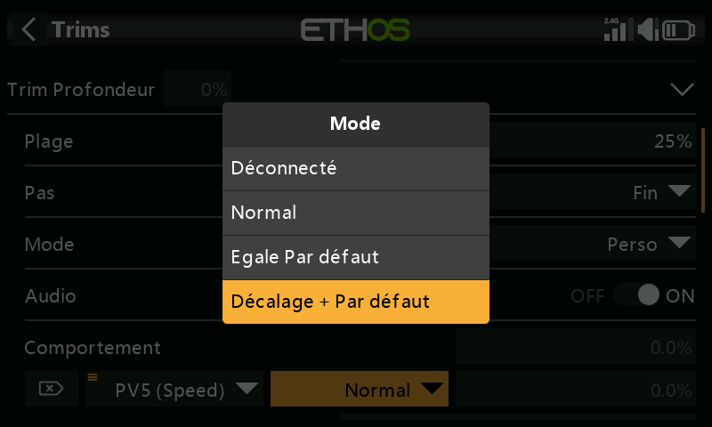

**Exemple détaillé** — un planeur avec un trim de profondeur de base
**Cruise**, et des trims dépendants pour **Speed** et **Thermal** :

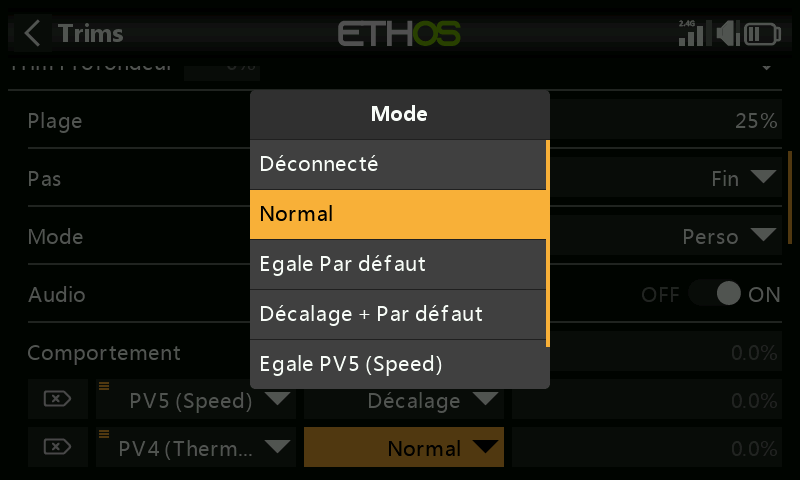
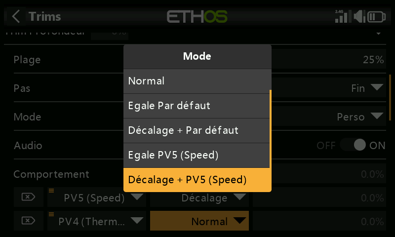

1. Trimmez pour un vol en palier dans la phase de vol par défaut (Cruise).
2. Ajoutez un comportement : **Offset + Default**, condition `FM5(Speed)`.
   Désormais, tout réglage de trim effectué en mode Speed est enregistré
   comme un décalage venant s'ajouter à la valeur de base Cruise —
   distinct, mais toujours dépendant de celle-ci.

   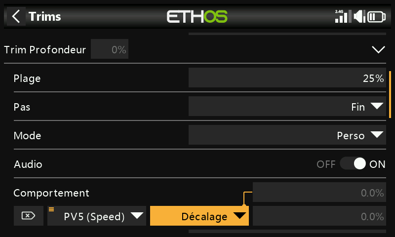

3. Ajoutez un deuxième comportement : **Offset + Default**, condition
   `FM4(Thermal)`, de la même manière. (Une fois le premier comportement
   créé, la boîte de dialogue propose également `Equal FM5(Speed)` et
   `Offset + FM5(Thermal)` comme options, puisqu'elle peut maintenant faire
   référence à ce comportement aussi.)

   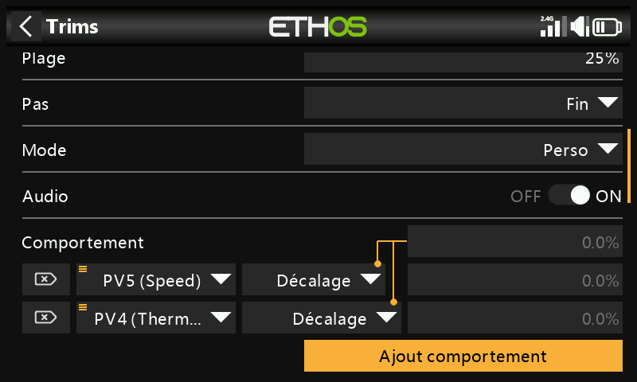

Avec cette configuration, un réglage ultérieur du trim de base Cruise
(par exemple après un changement de centre de gravité) décale
automatiquement les trims de Speed et de Thermal de la même valeur,
puisqu'il s'agit de décalages venant s'y ajouter et non de valeurs
indépendantes.

- **Audio** — permet de désactiver l'annonce de trim standard pour un trim
  réaffecté lorsqu'il n'est plus pertinent de l'entendre.

## Trims supplémentaires

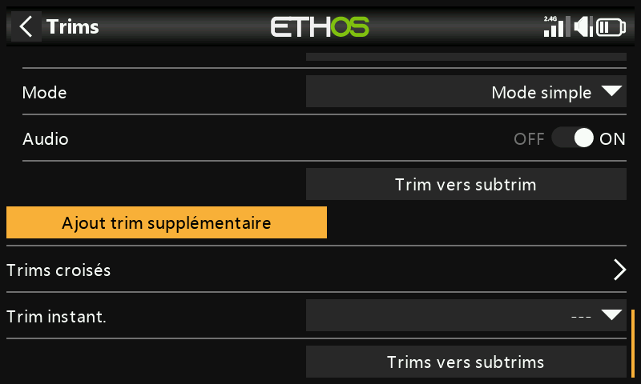
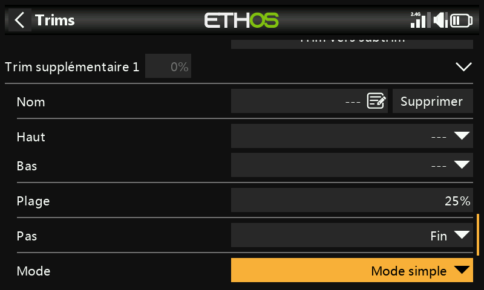

**Ajouter un trim supplémentaire** crée un trim au-delà des quatre manches
standard (et de T5/T6) : **Nom**, sources **Haut**/**Bas** pour le piloter,
plus les mêmes options **Plage**, **Pas**, **Mode** et **Audio** que
ci-dessus.

## Trims croisés

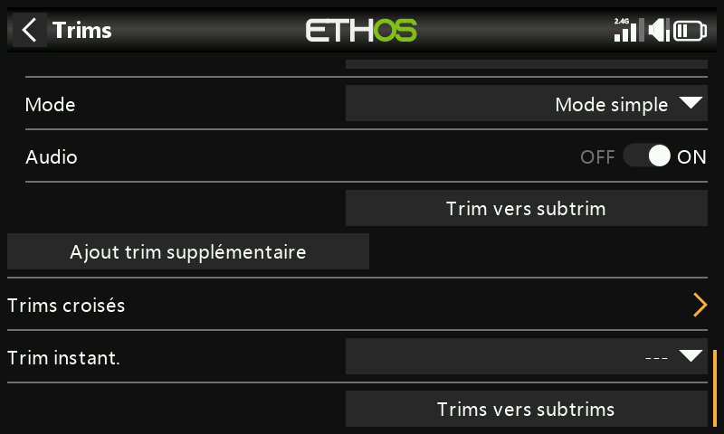
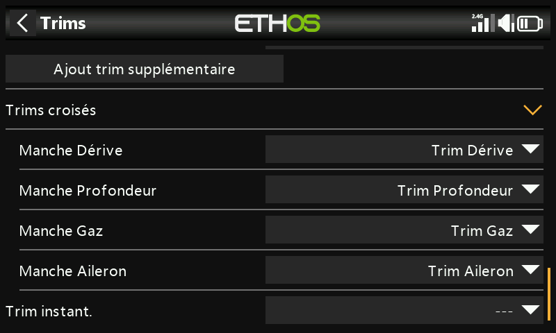

Désigne quelle commande de trim ajuste réellement chaque manche — autrement
dit, permet que le trim d'un manche soit piloté par une commande de trim
physique différente de celle habituelle. (T5/T6 ne sont disponibles que sur
les X20 Pro et X18.)

## Trim instantané {: #instant-trim }

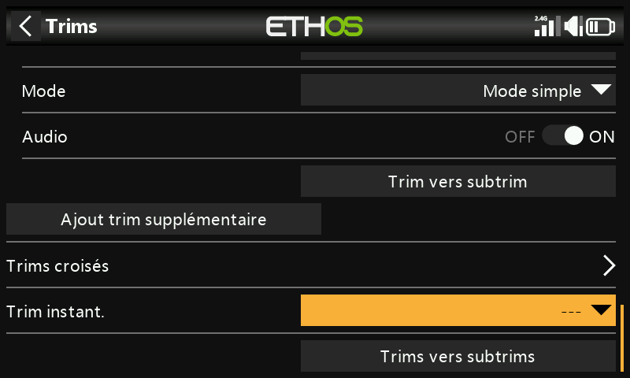

Tant qu'il est actif, il ajoute les positions actuelles des manches aux
trims par défaut correspondants (et aux trims croisés). À affecter de
préférence à un interrupteur accessible sans lâcher les manches —
déclenchez-le en vol rectiligne et en palier pour régler les trims
instantanément, au lieu de cliquer de façon répétée sur une palette de trim
lorsque les trims sont très éloignés du bon réglage. Désactivez-le après le
vol de mise au point pour éviter de perturber accidentellement les trims par
la suite.

!!! note
    Le trim instantané n'est actif que lorsque l'une des vues principales
    est affichée.

## Transférer les trims vers les subtrims

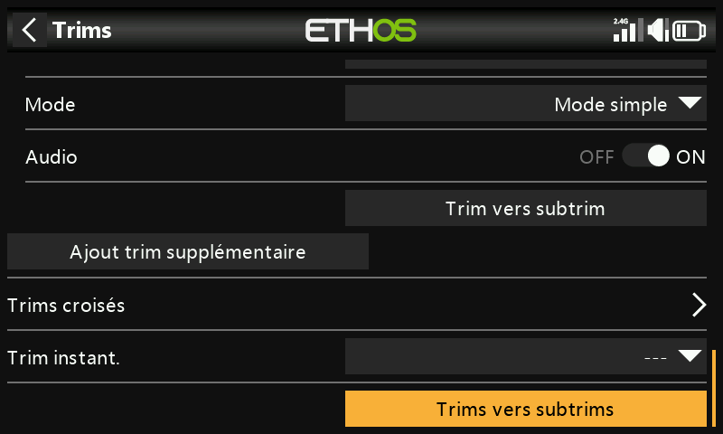

Après avoir trimmé pour un vol en palier, cette fonction transfère la
valeur de trim d'une voie (par ex. la profondeur) dans son réglage
[Subtrim](outputs.md) et remet le trim affiché à zéro — une manière propre
de vérifier ensuite que les trims de vol n'ont pas dérivé.

Lorsque des phases de vol sont utilisées, une voie peut avoir plusieurs
valeurs de trim pertinentes, alors que le Subtrim dans les Sorties est un
réglage global unique s'appliquant à toutes les phases de vol. Cette
fonction en tient compte : elle prend le trim de la phase de vol
**actuellement sélectionnée**, le transfère dans le Subtrim, remet ce trim
à zéro et ajuste le trim de *toutes les autres* phases de vol sur la même
voie pour compenser — de sorte que la position réelle de la gouverne reste
globalement inchangée dans chaque phase de vol.

!!! tip
    Effectuez toujours cette opération depuis la même phase de vol « de
    base » (par ex. Cruise sur un planeur) par souci de cohérence — elle
    peut être répétée sans risque tant que vous procédez ainsi.

Des valeurs de trim ou de subtrim importantes créent des débattements très
asymétriques — il est préférable d'en corriger la cause mécaniquement.
Visez des liaisons à 90° lorsque les gouvernes sont au neutre (les volets
étant l'exception, où l'on sacrifie un peu de course vers le haut pour plus
de course vers le bas), puis utilisez **PWM center** pour affiner
exactement à 90° une fois la liaison bien réglée.
