# Variables

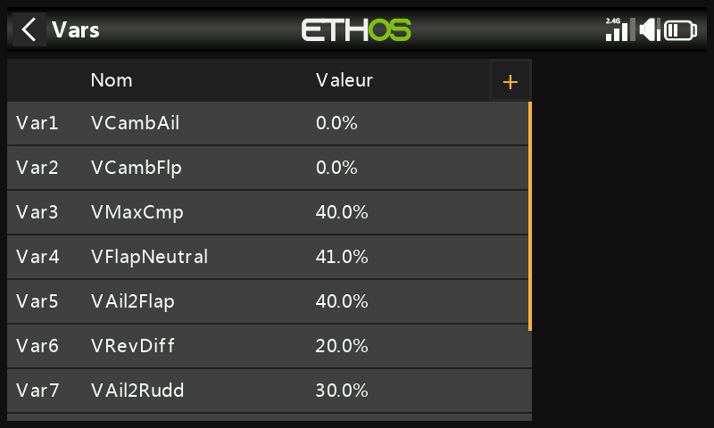

Les variables (« Vars ») sont des conteneurs nommés destinés aux valeurs
de réglage propres à un modèle, référençables partout ailleurs dans la
programmation — y compris dans les [mixages](mixes.md). Le fait de les
regrouper dans leur propre section sépare les *données de configuration*
d'un modèle de sa *logique de programmation* : au lieu de fouiller des
dizaines de mixages pour retrouver et ajuster une valeur, tout se trouve
au même endroit avec un nom explicite. 64 Vars sont disponibles ; aucune
n'existe par défaut. Ajoutez-en une avec **+** ; touchez une Var
existante pour **Éditer**/**Déplacer**/**Copier**/**Cloner**/**Supprimer**.

Une Var peut contenir une constante fixe, ou être réglable dans des
limites définies par l'utilisateur (afin d'éviter que de mauvaises
valeurs ne provoquent un crash), et peut contenir une valeur
*différente* pour chaque condition active (par exemple pour chaque phase
de vol). Les valeurs sont conservées d'une session à l'autre. Une Var se
substitue à n'importe quelle valeur numérique ordinaire partout où la
[fonction
Options](../getting-started/user-interface-and-navigation.md#the-options-feature)
est disponible (les champs à icône hamburger).

!!! example
    Un planeur à ailerons scindés (les sections internes servant aussi
    de volets d'atterrissage) nécessite un réglage unique et partagé de
    différentiel d'ailerons, utilisé partout où les quatre surfaces
    agissent comme ailerons — une Var contenant cette valeur unique,
    référencée depuis chaque mixage concerné, garantit sa cohérence et
    fait qu'il n'y a qu'un seul endroit à ajuster.

## Ajouter une Var

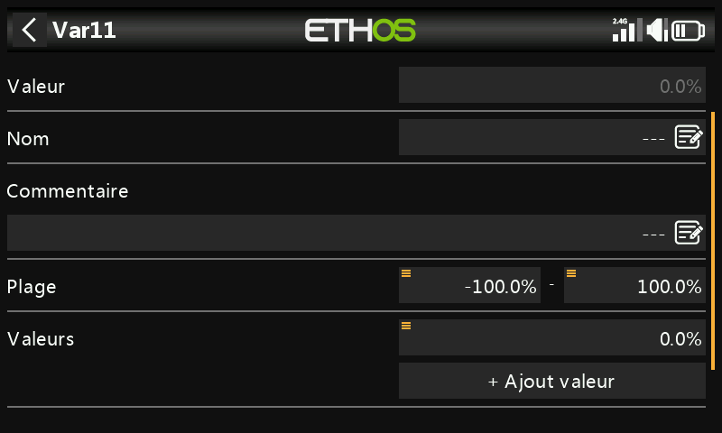

- **Valeur** — valeur actuelle (affichage en lecture seule).
- **Nom** — modifiable.
- **Commentaire** — texte libre expliquant son rôle.
- **Plage** — limites basse/haute (une décimale, dans les ±500 %) que la
  valeur de la Var ne peut jamais dépasser.

### Valeurs

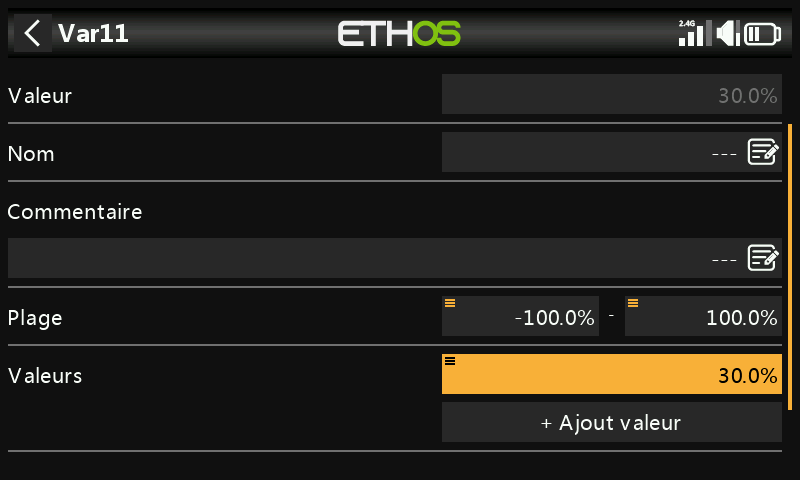

- **Fixe** — une constante unique, avec une décimale.
- **Multiple/variable** — **Ajouter une nouvelle valeur** associe une
  valeur à chaque condition active. Par exemple, `Var12` vaut 9 % lorsque
  la phase de vol Thermique (FM4) est active, et −3 % lorsque Vitesse
  (FM5) est active, sa Plage étant limitée à −10 %…+15 % afin qu'aucune
  des deux ne puisse dépasser des limites raisonnables :

  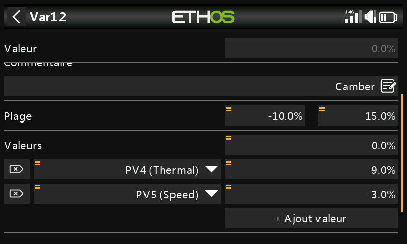
  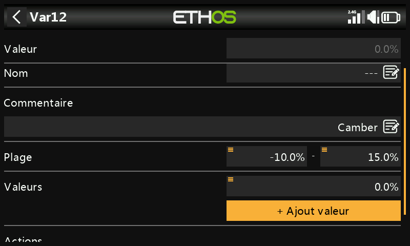

### Actions

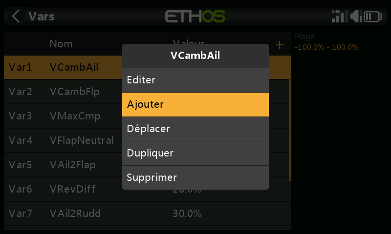
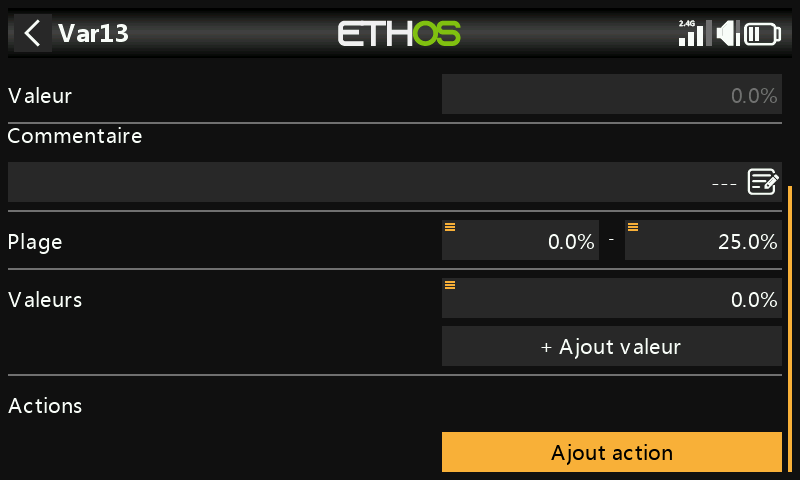

Les actions modifient la valeur d'une Var au fil du temps, pilotées par
une entrée.

**Trim réaffecté** — confie l'un des trims physiques au réglage de cette
Var au lieu de sa fonction normale, généralement conditionné à une seule
condition active :

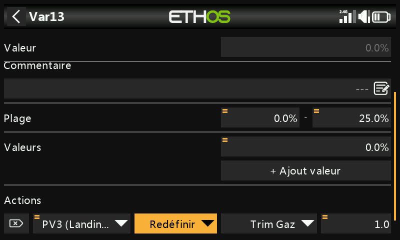
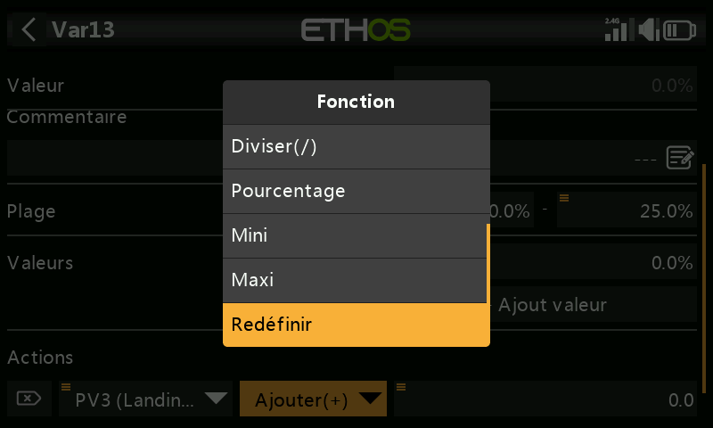

!!! example
    Réaffectez le trim de gaz au réglage d'une Var de compensation de
    cambrure, mais uniquement lorsque la phase de vol Atterrissage (FM3)
    est active, avec une Plage de 0 à 25 % et un pas de 1,0 % par clic.
    En dehors de cette condition active, le trim retrouve
    automatiquement sa fonction ordinaire.

**Actions arithmétiques** — pilotées par n'importe quelle entrée :

- **Assigner** — fixe la Var à une valeur donnée.
- **Ajouter** / **Soustraire** / **Multiplier** / **Diviser** —
  opérations arithmétiques sur la valeur actuelle.
- **Pourcentage** — applique un pourcentage de l'entrée pilote.
- **Min** / **Max** — borne la Var par rapport à l'entrée pilote.

  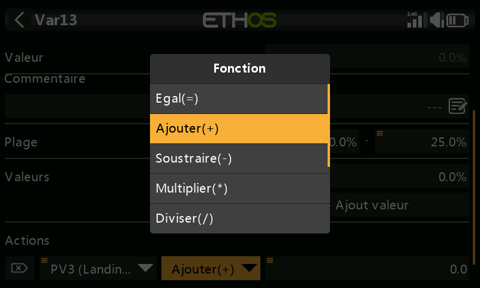

!!! example
    `FS3(edge)` assigne directement 40 % à une Var ; `FS1(edge)` ajoute 2
    à chaque appui (plafonné au maximum de la Plage) ; `FS2(edge)`
    soustrait 2 à chaque appui (limité au minimum de la Plage). L'option
    **Edge** (appui long sur l'interrupteur de fonction) est ici
    importante — sans elle, l'action se répéterait continuellement aussi
    longtemps que l'interrupteur est maintenu, au lieu de ne s'exécuter
    qu'une fois par appui.

  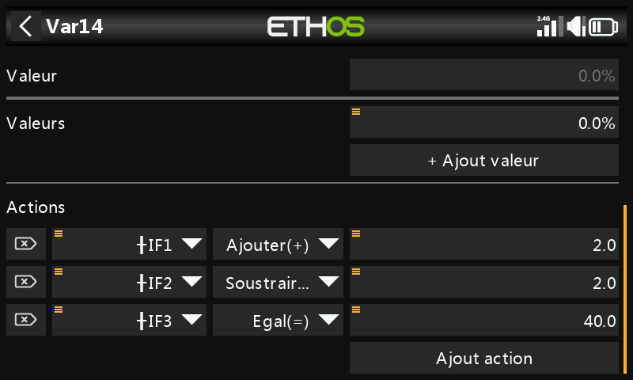
