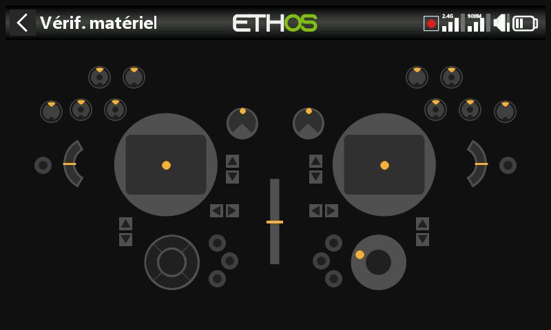

# X20 Pro / X20 Pro AW

Différences par rapport à la X20S, la radio de référence sur laquelle ce
manuel est basé — ces points concernent la **X20 Pro**, et s'appliquent
pour l'essentiel également à la **X20 Pro AW** et à la famille
**X20R/RS**.

- **Stockage** — mémoire interne eMMC de 8 Go par défaut, SD card en
  option — voir [Général → Emplacement de
  stockage](../system-setup/general.md#storage-location-x18-and-x20-prorrs).
- **Trims supplémentaires** — ajout des interrupteurs de trim **T5** et
  **T6** — voir [Trims](../model-setup/trims.md#trim-settings).
- **Interrupteurs supplémentaires** — deux boutons-poussoirs à
  verrouillage, **K** et **L**, sur les épaules arrière, ainsi que les
  positions d'interrupteur **M**/**N** si elles sont câblées
  (typiquement des interrupteurs en bout de manche) — voir [Matériel →
  Interrupteurs](../system-setup/hardware.md#switches-settings).
- **Potentiomètres supplémentaires** — **Ext1**/**Ext2**, généralement
  utilisés avec des manches à 3 axes — voir [Matériel →
  Potentiomètres/Curseurs](../system-setup/hardware.md#potssliders-settings).
  Cela décale l'index de
  [l'inspecteur de valeurs ADC](../system-setup/hardware.md#adc-value-inspector) :
  Ext1/Ext2 se placent entre Pot2 et les curseurs.
- **Retour haptique** — la **X20 Pro AW** et la **X20RS** sont livrées
  avec des manches MC20R intégrant des moteurs vibrants (stick-shaker) ;
  une **X20 Pro** ou une **X20R** peut en bénéficier via une mise à
  niveau des manches MC20R en rétrofit, à activer dans [Matériel →
  Activation des mises à niveau de manches
  haptiques](../system-setup/hardware.md#radio-specific-hardware-options).
  Une fois activée, l'option [Sélection des moteurs
  haptiques](../model-setup/special-functions.md#actions) propose Défaut,
  Tous les moteurs, Manche gauche ou Manche droit.
- **Encodeur rotatif** — la X20 Pro AW et les X20R/RS utilisent un
  encodeur plus sensible ; une option **demi-pas** dans [Matériel →
  Option d'encodeur](../system-setup/hardware.md#radio-specific-hardware-options)
  permet d'en réduire la sensibilité.
- **Module RF interne** — les X20 Pro/R/RS utilisent le module **TD-ISRM
  Pro** (compatible LoRa, avec les modes tandem double bande et TD-Pro en
  plus d'ACCESS/ACCST D16), au lieu du module TD-ISRM des
  X18/X20/X20S/X20HD — voir [Système RF](../model-setup/rf-system.md).
