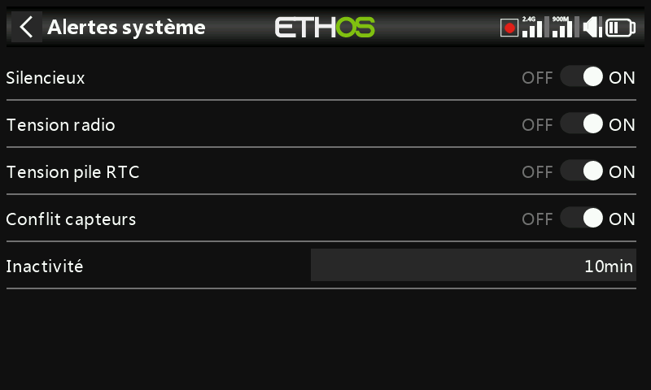

# Alertes

Quatre alertes valables pour l'ensemble de la radio, chacune activable
indépendamment — distinctes des [fonctions spéciales](../model-setup/special-functions.md)
et des [interrupteurs logiques](../model-setup/logical-switches.md)
propres à chaque modèle que vous créez vous-même.

- **Mode silencieux** — une annonce vocale est émise au démarrage lorsque
  cette vérification est activée et que le [Général → Mode audio](general.md)
  est réglé sur Silencieux, pour rappeler que la radio est muette.
- **Tension radio** — « Batterie radio faible » lorsque la batterie
  principale de la radio descend sous le seuil d'**Alerte tension basse**
  défini dans [Batterie](battery.md).
- **Tension pile RTC** — « Batterie RTC faible » lorsque la pile bouton RTC
  descend sous 2,5 V (le seuil par défaut). L'enregistrement des données
  s'appuie sur l'horloge temps réel ; une heure invalide rend l'analyse des
  journaux difficile, notamment pour distinguer les sessions de vol.
  L'alerte peut être désactivée temporairement en attendant de changer la
  pile, mais il ne faut pas la laisser désactivée indéfiniment.
- **Alerte conflit capteurs** — détecte les identifiants de capteurs de
  télémétrie en conflit. Il n'est utile de la désactiver que si vous avez
  des capteurs qui ne répondent pas à la spécification S.Port.
- **Inactivité** — une annonce vocale « Inactivité prolongée » (ainsi
  qu'une vibration, au cas où le volume de la radio serait baissé) est
  émise lorsque la radio n'a pas été utilisée au-delà de la durée
  configurée — 10 minutes par défaut.
