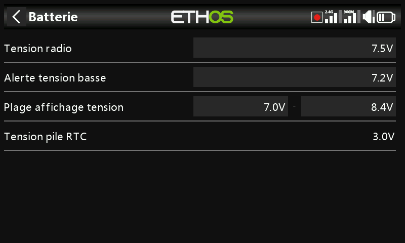

# Batterie

Permet de calibrer la mesure de la batterie interne de la radio et de définir
les seuils d'alarme — indépendamment des réglages du pack de propulsion d'un
modèle (voir [Guide pratique : alerte de tension de batterie basse](../how-to/low-battery-warning.md)).

- **Tension principale** — affiche la valeur mesurée actuelle et sert également
  au réglage de la calibration : saisissez la tension réelle mesurée à l'aide
  d'un multimètre. La valeur par défaut est 8,4 V (pack Li-ion 2S pleinement
  chargé).
- **Tension basse** — le seuil d'alarme, par défaut 7,2 V (7,4 V offre une
  marge supplémentaire). Lorsque l'[alerte de tension principale](alerts.md)
  est activée, une descente sous ce seuil déclenche une fenêtre
  d'avertissement ainsi qu'une annonce vocale « Radio battery is low » toutes
  les minutes, que la fenêtre soit ouverte ou non.

  !!! warning
      Posez le modèle et rechargez la batterie de la radio dès que cette
      alerte se déclenche — elle se répète chaque minute quoi qu'il arrive.
      À 6,0 V, la radio s'éteint inconditionnellement afin de protéger les
      deux cellules Li-ion de 3,0 V.

- **Plage de tension affichée** — les valeurs min/max de l'indicateur
  graphique de batterie situé dans le coin supérieur droit : MIN correspond au
  point où le premier segment s'éteint, MAX au point où le quatrième s'allume.
  Les valeurs par défaut sont 6,4–8,4 V pour le pack Li-ion intégré ; de
  nombreux pilotes relèvent la valeur basse afin d'obtenir un avertissement de
  tension basse plus précoce et d'éviter une décharge excessive. Ajustez ces
  valeurs en fonction du type de batterie réellement installé.
- **Tension RTC** — la tension de la pile bouton de l'horloge temps réel.
  3,0 V à l'état neuf ; remplacez-la en dessous de 2,7 V afin de conserver une
  horloge précise, et attendez-vous à l'[alerte de tension RTC](alerts.md) en
  dessous de 2,5 V.
