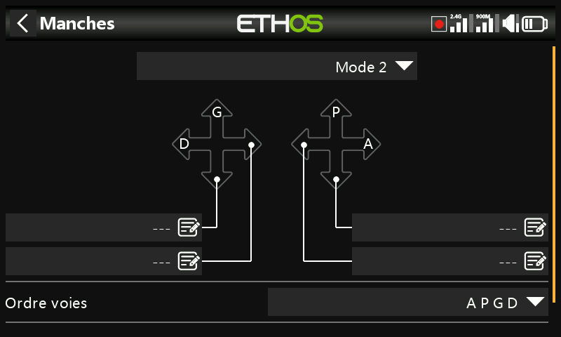
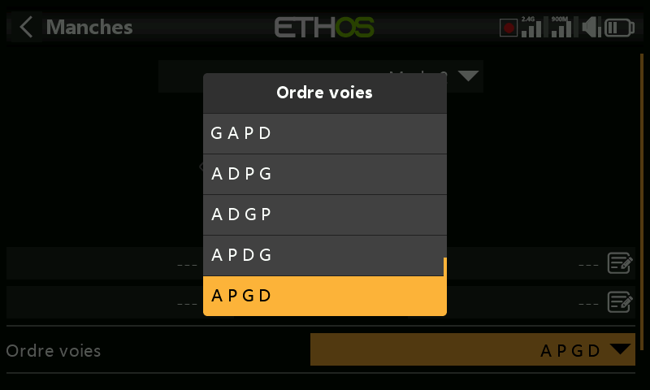
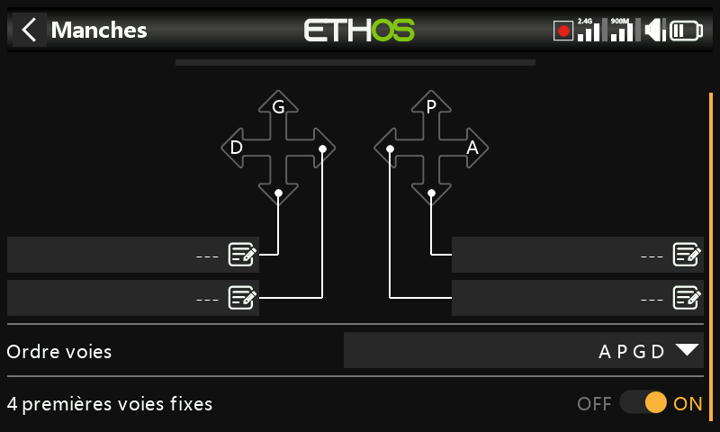

# Commandes

Appelé **Sticks** dans le menu — le mode de manches et l'ordre
d'affectation des voies par défaut.

## Mode de manches

- **Mode 1** — gaz et ailerons sur le manche droit, profondeur et dérive
  sur le manche gauche.
- **Mode 2** — gaz et dérive sur le manche gauche, ailerons et profondeur
  sur le manche droit.

Par défaut, les manches portent le nom des modes standard de l'industrie,
et peuvent être renommés.

## Ordre des voies

Définit l'ordre dans lequel les quatre entrées de manches sont affectées
aux voies lorsqu'un nouveau modèle est créé par les assistants de
[Choix du modèle](../model-setup/model-select.md). La valeur par défaut est
**AETR**. Lorsqu'une cellule comporte plusieurs surfaces d'un même type,
celles-ci sont regroupées, sauf si [Quatre premières voies
fixes](#first-four-channels-fixed) est activé — par exemple, 2 ailerons
donnent **AAETR**.

## Quatre premières voies fixes {: #first-four-channels-fixed }

Lorsque cette option est activée, les quatre premières voies ne sont jamais
regroupées. Avec l'ordre **AETR** et une cellule comportant 2 ailerons,
1 profondeur, 1 moteur, 1 dérive et 2 volets, l'assistant produit
**AETRAFF** (les voies 1 à 4 restent exactement A-E-T-R, le second aileron
et les deux volets étant ajoutés à la suite) au lieu de **AAETRFF**. C'est
ce réglage qui permet à l'assistant de créer des modèles adaptés aux
récepteurs stabilisés SRx, qui attendent cette disposition fixe.

