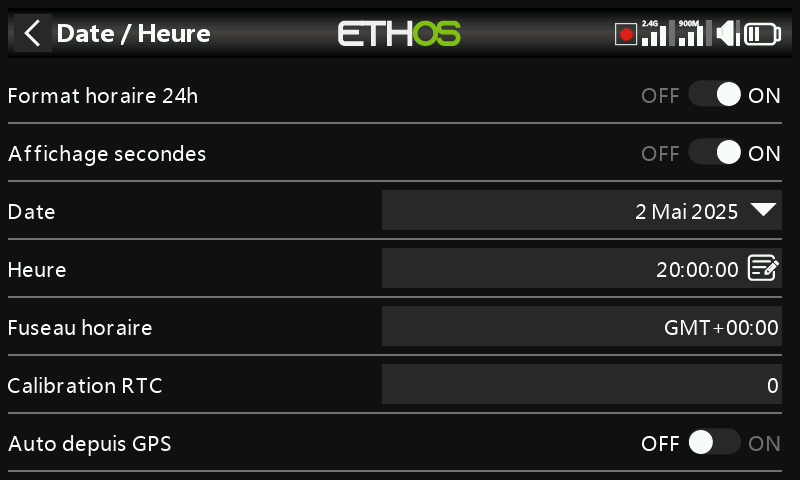

# Date et heure

- **Format 24 heures** — bascule l'horloge entre l'affichage 12 et 24 heures.
- **Afficher les secondes** — ajoute les secondes à l'affichage de l'horloge.
- **Date** / **Heure** — règle la date et l'heure courantes ; les deux sont
  utilisées pour l'enregistrement des données.
- **Fuseau horaire** — votre fuseau horaire local.
- **Ajuster la vitesse RTC** — compense la dérive de l'horloge temps réel,
  jusqu'à 41 secondes/jour. Mesurez le nombre de secondes d'avance ou de
  retard pris par votre horloge sur 24 heures, puis réglez la valeur de
  calibration sur **12 × ce nombre de secondes** — négative si l'horloge
  avance, positive si elle retarde (plage −500 à +500). Vérifiez de nouveau
  après un ou deux jours et affinez le réglage.
- **Ajustement automatique par GPS** — lorsque cette option est activée, la
  date et l'heure sont réglées automatiquement à partir des données d'un
  capteur GPS distant.
