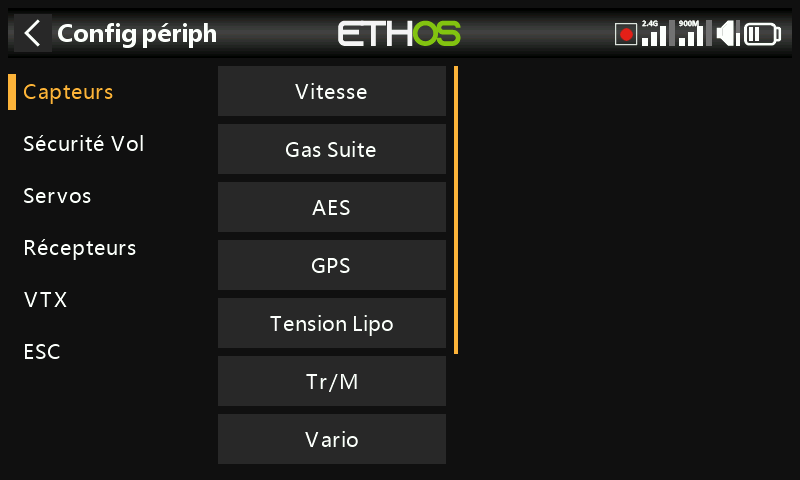
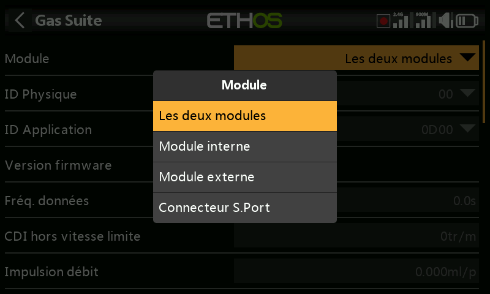
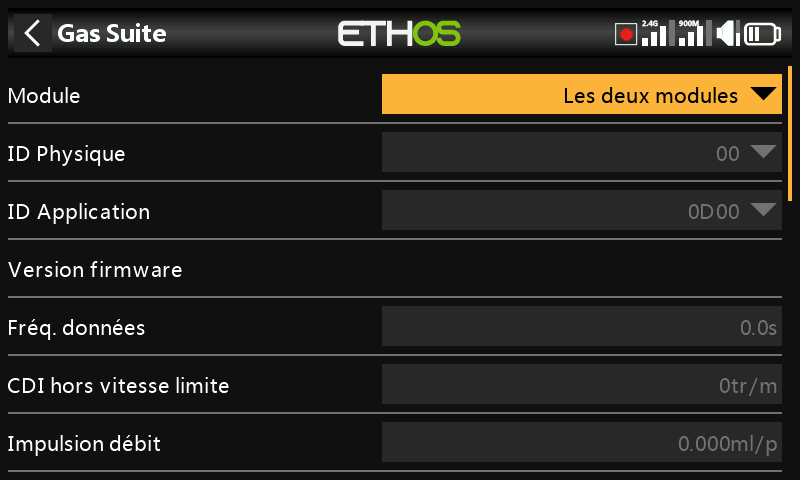

# Périphériques

Appelée **Configuration de l'appareil** dans le menu — ce sont les outils de
configuration des capteurs et périphériques raccordés en S.Port/FBUS :
capteurs, récepteurs, « Gaz suite », servos, VTX et ESC. La rubrique
**Capteurs DIY** apparaît automatiquement dès qu'un capteur DIY est détecté.
Référez-vous au manuel de chaque capteur / périphérique pour le détail des
options disponibles ; cette page traite de ce qui leur est commun.

!!! note
    Cela n'a rien à voir avec le choix du module RF (interne ou externe)
    utilisé par un *modèle* pour émettre — il s'agit d'un réglage propre à
    chaque modèle, décrit dans [RF System](../model-setup/rf-system.md).

La configuration de l'appareil est extensible : les utilisateurs comme FrSky
peuvent y ajouter des pages au moyen de Lua.

## Réattribution des ID de capteurs

L'écran « Configuration de l'appareil » d'Ethos vous permet de modifier
directement l'**ID physique** et l'**ID d'application** S.Port d'un
périphérique. Si vous avez plusieurs appareils qui ont la même fonction, vous
devez les connecter **un par un** : découvrez chacun d'eux dans
[Télémétrie → Découvrir de nouveaux capteurs](../model-setup/telemetry.md),
modifiez ici son ID physique et son ID d'application dans « Configuration de
l'appareil », puis revenez en arrière et redécouvrez-le avec son nouvel ID.

## Exemple des récepteurs

Les récepteurs stabilisés FrSky peuvent être configurés ici dès que leur
script Lua de réglage est installé (en un clic, depuis la bibliothèque Lua
d'Ethos Suite). Il existe deux voies de configuration selon la génération du
récepteur :

- **Stabilizer config** — récepteurs récents dotés de la « stabilisation
  avancée » (contrôle du gain sur la voie 13). Deux groupes de stabilisation
  indépendants sont proposés : le groupe 1 couvre les voies 1 à 6, le groupe
  2 les voies 7 à 11 — désactivez le groupe 2 si vous n'utilisez pas les
  broches 7 à 11 pour la stabilisation. Une calibration 6 axes est intégrée
  et doit être effectuée une fois sur un récepteur neuf, puis à nouveau
  après toute mise à jour du firmware v3.0.x (à la suite d'une
  réinitialisation d'usine). Dans la calibration de chaque groupe, l'ancienne
  étape « self-check » a été remplacée par la calibration indépendante de
  l'horizontalité de l'appareil, du neutre des voies et des courses
  extrêmes des voies, et chaque voie peut être activée/désactivée
  individuellement. Les configurations (mais pas les données de calibration)
  peuvent être sauvegardées sur un PC et restaurées depuis celui-ci.
- **SxR** — récepteurs plus anciens, y compris les modèles historiques et
  les Archer/Archer Pro, ainsi que des récepteurs comme le SR10 Pro qui
  (malgré leur nom en « SRx ») disposent du gain sur la voie 9 et non sur la
  voie 13.

  

!!! warning "Après une mise à jour vers le firmware de récepteur v3.0.x"
    Effectuez une réinitialisation d'usine (disponible dans les Options du
    récepteur, dans la configuration RF), puis réappariez et reconfigurez
    entièrement le récepteur — en particulier les fonctions Stab et la
    calibration 6 axes. Cela est imposé par la nouvelle fonction de
    sauvegarde des données de failsafe de la v3.0.x ; vérifiez ensuite
    soigneusement le fonctionnement du failsafe.

FrSky North America publie un guide détaillé de configuration des récepteurs
stabilisés, et il existe une vidéo explicative du pilote de l'équipe FrSky
Juan Sanchez Garcia qui couvre le même sujet.

## Configuration via le connecteur S.Port de l'émetteur

Les périphériques S.Port et FBUS peuvent également être configurés
directement via le connecteur S.Port situé sur le dessus de l'émetteur, sans
passer par un récepteur apparié.

1. Branchez le périphérique sur le connecteur S.Port de l'émetteur (fil
   blanc/jaune du côté de l'encoche).
2. Allez dans **Système → Configuration de l'appareil**, faites défiler
   jusqu'au périphérique (par exemple un capteur d'intensité FAS40 ADV) et
   appuyez sur `ENT`.
3. Sur la page de configuration, réglez **Module** sur **Connecteur
   S.Port**.
4. Effectuez vos modifications — l'ID physique et l'ID d'application doivent
   chacun être uniques — puis faites défiler vers le bas et appuyez sur
   **Save to flash**.

Ceci s'applique aussi bien aux périphériques FBUS (voir également [Guide
pratique : configurer un système FBUS](../how-to/fbus-setup.md)) qu'aux
périphériques S.Port classiques tels qu'un variomètre.
