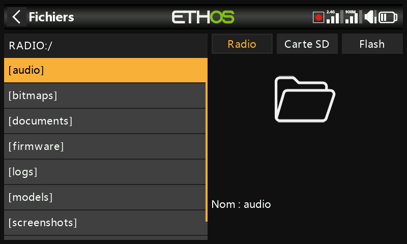
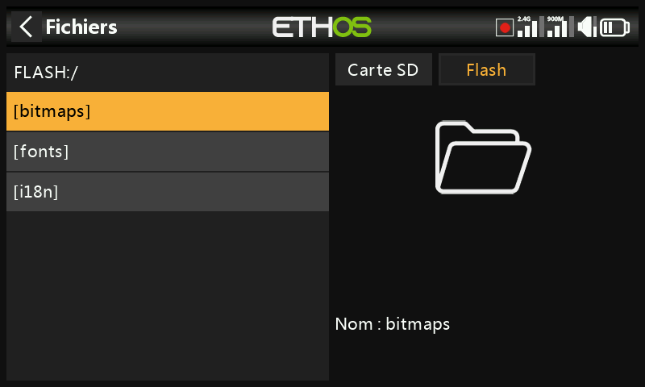
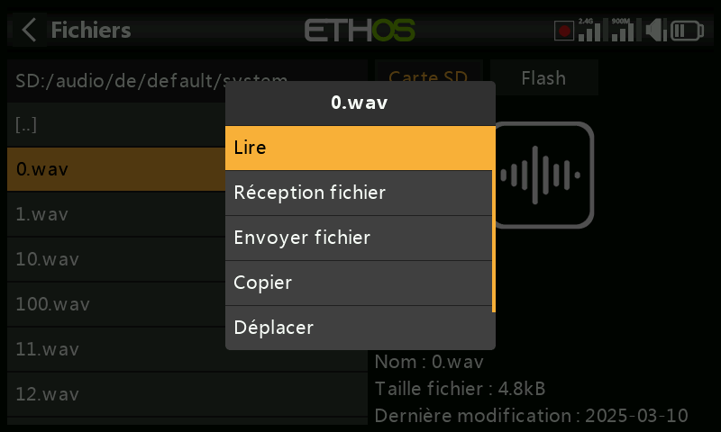
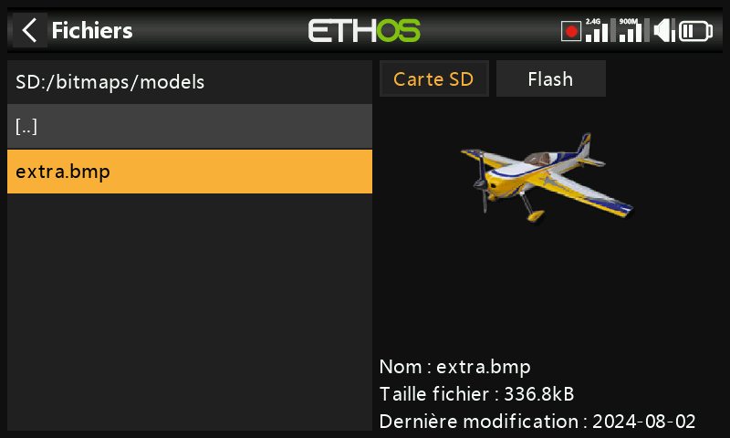
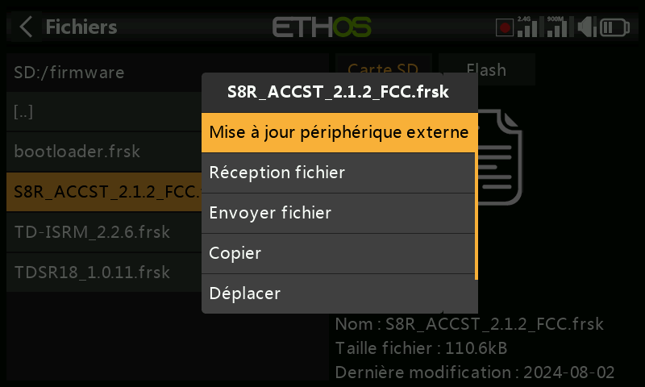
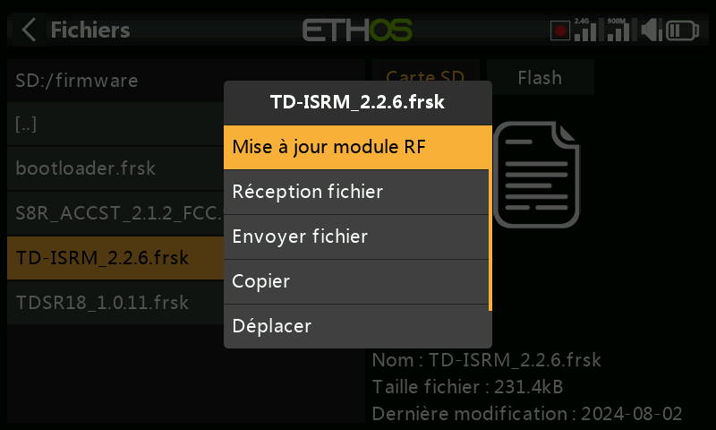
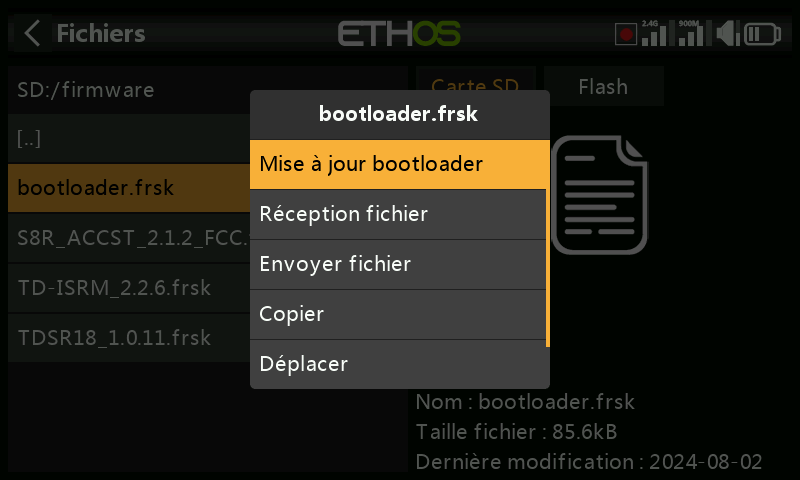
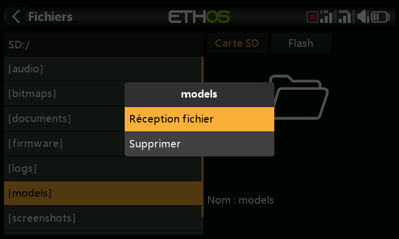
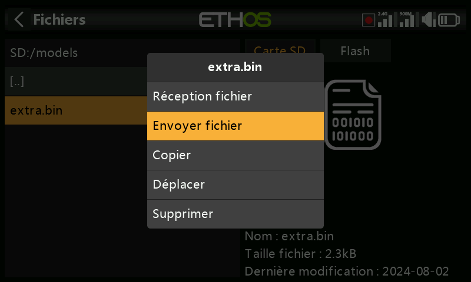

# Gestionnaire de fichiers

Le gestionnaire de fichiers permet de parcourir la mémoire de la radio et de flasher
le firmware du module RF interne, des périphériques connectés en S.Port, des
périphériques OTA (Over-The-Air) et des modules externes.

## Organisation de la mémoire

Appuyez sur **Flash** (ou sur `PAGE` pour changer de lecteur) pour parcourir
le lecteur flash USB virtuel interne de la radio, utilisé pour les images
système et les polices :

- `bitmaps/system` — les images utilisées pour les affichages écran et les icônes
- `fonts/` — les polices correspondant aux différentes langues sélectionnables

Le bootloader et le firmware système lui-même résident tous deux dans cette
mémoire flash interne, sur toutes les radios FrSky depuis la X9D d'origine.

La série **X20/X20S/X20HD** accepte une carte SD formatée en FAT32, de 32 Go
ou moins (une SanDisk Ultra Micro SDHC Classe 10 de 16 Go est un choix sûr).
Les **X18** et **X20 Pro/R/RS** utilisent par défaut une mémoire eMMC interne
(une carte SD externe peut être ajoutée en complément) — appuyez sur **Radio**
pour la parcourir. Ethos crée automatiquement `Logs/`, `models/` et
`screenshots/` s'ils sont absents ; `Firmware/` est une convention manuelle
destinée aux fichiers de firmware des périphériques, tels que les récepteurs.

## Dossiers de premier niveau

- **`audio/`** — fichiers sonores utilisateur et système, répartis par voix
  (`audio/en/gb`, `audio/en/us`, `audio/en/default`). Les fichiers utilisateur
  sont lus par la [fonction spéciale Play Audio](../model-setup/special-functions.md) ;
  les fichiers système comprennent `hello.wav` (le message d'accueil
  « Welcome to Ethos » — un `bye.wav` peut être ajouté mais n'est pas fourni).
  Format : PCM 16 kHz ou 32 kHz, linéaire 16 bits, ou A-law (EU)/µ-law (US)
  8 bits ; noms de fichiers jusqu'à 31 caractères plus l'extension. Les trois
  dossiers de voix sont maintenus synchronisés par Ethos Suite, quel que soit
  celui réellement sélectionné.

  

- **`bitmaps/`** — `bitmaps/models/` contient les images de modèles de
  l'utilisateur (définies dans [Model Edit](../model-setup/model-edit.md) ou
  dans les assistants de création de modèle) ; `bitmaps/user/` contient tout
  le reste. Format recommandé : BMP 32 bits, 8 bits par couleur, avec canal
  alpha, 300×280 px — cela limite le coût du décodage embarqué dans la radio.
  Ethos redimensionne les BMP à la volée, mais pas les PNG/JPEG. Les noms de
  fichiers ne peuvent utiliser que `A-Z a-z 0-9 ()!-_@#;[]+=` et l'espace, et
  doivent comporter 11 caractères ou moins (plus une extension de 4 caractères)
  pour apparaître dans le sélecteur d'image de modèle — les noms plus longs
  restent visibles dans le gestionnaire de fichiers mais ne pourront pas y être
  sélectionnés. Les outils de conversion d'images d'Ethos Suite se chargent de
  la conversion de format pour vous.

  

- **`documents/user/`** — documents texte de l'utilisateur, rappelés depuis le
  widget d'affichage **Text**.

- **`Firmware/`** — fichiers de firmware pour le module RF interne, les modules
  externes et les autres périphériques (récepteurs, etc.), flashés depuis cet
  emplacement via S.Port ou OTA. Copiez le nouveau firmware ici pendant que la
  radio est en [mode bootloader](../getting-started/usb-connection-modes.md) et
  connectée par USB ; appuyer sur un fichier de firmware et choisir **Flash**
  lance la mise à jour :

  
  
  
  

- **`I18n/`** — fichiers de traduction des langues.

- **`Logs/`** — journaux de données.

- **`models/`** — les fichiers de modèles eux-mêmes. Ils ne peuvent pas être
  modifiés directement ici, seulement sauvegardés ou partagés. Depuis Ethos
  v1.2.11, un modèle est nommé d'après son nom de modèle plutôt que
  `model01.bin` et suivants (par exemple, un modèle appelé « Extra » devient
  `Extra.bin` ; un second « Extra » devient `Extra01.bin`). Renommer un modèle
  dans [Model Edit](../model-setup/model-edit.md) renomme également son fichier
  — toujours en minuscules (le nom affiché, en casse mixte, est stocké à
  l'intérieur du fichier), et tous les caractères d'un nom de modèle ne se
  retrouvent pas dans le nom de fichier. Depuis la v1.1.0 Alpha 17, chaque
  catégorie de modèles créée par l'utilisateur reçoit son propre sous-dossier.

- **`screenshots/`** — sortie de la [fonction spéciale
  Screenshot](../model-setup/special-functions.md).

- **`scripts/`** — scripts Lua, éventuellement organisés dans leurs propres
  sous-dossiers avec leurs fichiers annexes. Les types de scripts sont les
  **widgets** (voir [Écrans](../displays/index.md)), les **tâches et sources**
  (capteurs personnalisés ou actions après le vol — installés ici, ils
  apparaissent dans le menu [Lua](../model-setup/lua-scripts.md) du modèle) et
  les **outils** (par exemple les outils de configuration des récepteurs
  stabilisés dans les menus System). Chaque module externe tiers reçoit son
  propre script et son propre dossier, par exemple `scripts/multi`,
  `scripts/elrs`, `scripts/ghost`, `scripts/crossfire`.

  !!! warning
      Les scripts Lua allongent le temps de démarrage de la radio. Le délai
      induit par un script bien écrit est imperceptible — un script mal écrit
      peut retarder le démarrage de façon quasi indéfinie.

- **`radio.bin`** (dossier racine) — le fichier des réglages système, écrit par
  la radio elle-même à l'initialisation. Sauvegardez-le en même temps que
  `models/` avant une mise à jour du firmware, afin de pouvoir revenir à une
  version antérieure si nécessaire.

- **`firmware.bin`** (dossier racine) — déposez ici un nouveau fichier de
  firmware de radio pour qu'il soit flashé automatiquement lors de la prochaine
  déconnexion de la radio du PC. Le contenu de la carte SD/eMMC et celui du
  lecteur flash interne peuvent devoir être mis à jour dans la même opération.

- **`sdcard.version`** (dossier racine) — la version du contenu de la carte SD,
  maintenue par Ethos Suite.

## Partage de fichiers par Bluetooth

Ethos peut transférer des fichiers de radio à radio par Bluetooth. Sur la radio
**réceptrice**, placez-vous dans le dossier de destination du gestionnaire de
fichiers, faites un appui long sur `ENT`, puis choisissez **Receive file here** :

Sur la radio **émettrice**, appuyez sur le fichier, choisissez **Send file**, et
suivez les instructions affichées sur les deux radios :

Si l'une des deux radios possède déjà une connexion Bluetooth active
(télémétrie, liaison écolage ou — sur X20S/Pro — audio), elle demandera s'il
faut d'abord déconnecter ce périphérique.
